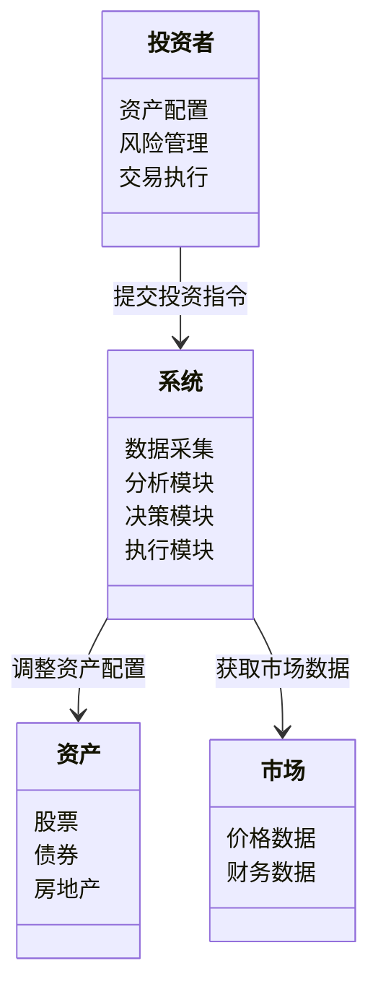

                 


# 克里斯托弗·布朗的全球价值投资机会识别

## 关键词：价值投资，全球机会，投资策略，资产配置，风险管理，量化分析

## 摘要：  
《克里斯托弗·布朗的全球价值投资机会识别》系统地探讨了如何在全球范围内识别和利用价值投资机会。本文通过分析价值投资的核心概念、全球市场的多样性以及技术分析与量化策略，为投资者提供了从理论到实践的全面指导。克里斯托弗·布朗的投资理念强调基本面分析与全球化视角的结合，通过科学的资产配置和风险管理，帮助投资者在复杂的全球市场中找到优质的投资机会。

---

# 第一部分: 价值投资的背景与基础

## 第1章: 价值投资的核心概念与背景

### 1.1 价值投资的定义与历史发展

#### 1.1.1 价值投资的起源与演变
价值投资是一种以基本面分析为基础的投资策略，起源于20世纪初。本杰明·格雷厄姆和戴维·多德是价值投资的奠基人。他们强调以低于内在价值的价格购买优质资产，以确保长期的超额收益。随着市场的发展，价值投资的理念不断演变，逐渐融入更多的现代金融工具和方法。

#### 1.1.2 全球化背景下的价值投资
全球化使得投资者能够跨越国界，投资于世界各地的资产。克里斯托弗·布朗的价值投资理念正是在这种背景下形成的，他强调在全球范围内寻找被低估的资产，利用市场的非有效性捕捉投资机会。

#### 1.1.3 克里斯托弗·布朗的投资理念
克里斯托弗·布朗认为，价值投资不仅仅是寻找便宜的资产，更是寻找具有持续竞争优势和良好治理结构的企业。他将全球化视角与基本面分析相结合，提出了“全球资产配置”的策略，强调分散投资以降低风险。

---

### 1.2 价值投资的核心要素

#### 1.2.1 价值投资的基本原理
价值投资的核心在于寻找市场的非有效性。市场的非有效性意味着某些资产的价格与其内在价值存在偏差，这种偏差为投资者提供了获利的机会。克里斯托弗·布朗指出，这种偏差可能由于市场情绪、信息不对称或投资者认知偏差等多种原因引起。

#### 1.2.2 投资者的心理与行为
投资者的心理和行为是价值投资的重要组成部分。克里斯托弗·布朗强调，投资者往往受到情绪影响，导致市场出现波动。因此，理解投资者的心理行为可以帮助投资者更好地识别市场偏差。

#### 1.2.3 市场的有效性与非有效性
市场有效性理论认为，资产价格反映了所有可获得的信息。然而，市场并非总是有效的，尤其是在新兴市场或信息不透明的情况下，价值投资的机会往往存在于市场的非有效区域。

---

### 1.3 全球市场的多样性与投资机会

#### 1.3.1 全球经济格局分析
全球经济格局的多样性为价值投资者提供了丰富的投资机会。不同国家和地区的经济结构、增长阶段和市场特点各不相同，投资者可以通过分散投资降低风险并捕捉不同地区的增长机会。

#### 1.3.2 不同市场的特点与风险
新兴市场通常具有较高的增长潜力，但也伴随着更高的风险。成熟市场则相对稳定，但增长潜力较小。克里斯托弗·布朗认为，投资者应根据市场特点和自身风险承受能力，选择合适的投资区域。

#### 1.3.3 全球化视角下的投资策略
全球化视角下的投资策略强调分散投资，避免过度依赖单一市场或资产类别。克里斯托弗·布朗建议投资者将资产配置在全球不同地区和行业中，以充分利用市场的多样性。

---

## 第2章: 价值投资的核心分析框架

### 2.1 基本面分析方法

#### 2.1.1 财务报表分析
财务报表分析是价值投资的核心工具之一。通过分析企业的利润表、资产负债表和现金流量表，投资者可以评估企业的盈利能力、财务状况和现金流情况。

#### 2.1.2 市盈率（PE）与市净率（PB）分析
市盈率（PE）和市净率（PB）是常用的估值指标。克里斯托弗·布朗指出，投资者应结合行业特点和企业生命周期，灵活运用这些指标。

#### 2.1.3 盈利能力分析（ROE、ROI）
盈利能力分析是评估企业投资价值的重要指标。ROE（净资产收益率）和ROI（投资回报率）可以帮助投资者识别高效率的企业。

#### 2.1.4 财务指标对比表
以下表格展示了不同行业的财务指标对比：

| 行业  | PE（合理范围） | PB（合理范围） | ROE（合理范围） |
|-------|----------------|----------------|-----------------|
| 银行  | 10-15          | 1.5-2.5        | 12-18%          |
| 科技  | 20-30          | 3-5            | 15-25%          |
| 制造业| 15-20          | 1.5-2.5        | 10-15%          |

---

#### 2.1.5 财务健康状况分析
克里斯托弗·布朗强调，财务健康状况是评估企业的重要指标。健康的财务状况包括合理的负债水平、稳定的现金流和良好的盈利能力。

---

### 2.2 行业分析与竞争优势

#### 2.2.1 行业生命周期分析
行业生命周期分析帮助企业识别行业所处的阶段。成熟行业通常增长稳定，而新兴行业可能具有较高的增长潜力。

#### 2.2.2 企业竞争优势分析
竞争优势是评估企业投资价值的关键。克里斯托弗·布朗认为，企业应具有强大的竞争优势，如技术壁垒、成本优势或品牌影响力。

#### 2.2.3 技术壁垒与市场准入
技术壁垒是企业竞争优势的重要来源。克里斯托弗·布朗指出，具有较高技术壁垒的企业通常具有更强的盈利能力。

---

### 2.3 财务指标与估值模型

#### 2.3.1 DCF模型与企业估值
DCF模型（现金流折现模型）是常用的估值工具。通过预测企业的未来现金流并折现，投资者可以估算企业的内在价值。

#### 2.3.2 市场情绪与估值偏差
市场情绪波动会导致资产价格偏离其内在价值。克里斯托弗·布朗指出，识别市场情绪可以帮助投资者找到低估或高估的资产。

#### 2.3.3 市场情绪与估值偏差示例
以下表格展示了市场情绪对企业估值的影响：

| 市场情绪 | 资产价格 | 内在价值 | 价格偏差 |
|---------|----------|----------|----------|
| 狂热    | 高       | 中       | 高估     |
| 焦虑    | 低       | 中       | 低估     |
| 稳定    | 中       | 中       | 无偏差   |

---

## 第3章: 全球价值投资机会识别策略

### 3.1 资产配置与地域选择

#### 3.1.1 资产配置的基本原则
资产配置是投资组合管理的核心。克里斯托弗·布朗建议投资者根据风险承受能力和投资目标，合理配置股票、债券、房地产等多种资产。

#### 3.1.2 不同地区的经济特点
不同地区的经济特点影响投资机会。例如，新兴市场通常具有较高的增长潜力，而成熟市场则相对稳定。

#### 3.1.3 跨国投资的风险与机会
跨国投资可以帮助投资者分散风险，但同时也面临汇率风险和政策风险。克里斯托弗·布朗建议投资者通过多元化配置降低风险。

---

### 3.2 风险管理与投资组合优化

#### 3.2.1 风险评估与控制
风险管理是投资的重要环节。克里斯托弗·布朗建议投资者定期评估投资组合的风险，并根据市场变化进行调整。

#### 3.2.2 投资组合的分散化策略
分散化是降低投资风险的有效方法。通过投资不同地区、行业和资产类别的资产，投资者可以降低特定风险。

#### 3.2.3 VaR模型与风险量化
VaR模型（风险价值模型）是量化投资风险的重要工具。通过VaR模型，投资者可以估算投资组合在特定置信水平下的潜在损失。

---

### 3.3 市场周期与投资时机

#### 3.3.1 经济周期对投资的影响
经济周期对投资机会有重要影响。在经济衰退期，某些资产可能被低估，而在经济扩张期，资产价格可能被高估。

#### 3.3.2 市场周期分析工具
以下是常用的市场周期分析工具：

| 工具名称 | 描述                     | 应用场景         |
|----------|--------------------------|-----------------|
| K线图    | 展示资产价格的历史走势   | 技术分析         |
| 移动平均线 | 平滑资产价格波动         | 判断趋势         |
| 布林带    | 识别资产价格的波动范围   | 判断超买超卖     |

---

## 第4章: 技术分析与量化策略

### 4.1 技术分析的基础方法

#### 4.1.1 K线图与价格走势分析
K线图是技术分析的核心工具。通过分析K线图，投资者可以识别资产价格的支撑位、阻力位和趋势线。

#### 4.1.2 移动平均线与趋势判断
移动平均线是技术分析的重要指标。通过计算一定时间内资产价格的平均值，投资者可以判断价格走势的趋势。

#### 4.1.3 技术指标分析
技术指标分析是技术分析的重要组成部分。常用的指标包括RSI（相对强度指数）、MACD（移动平均收敛散度）和布林带。

---

### 4.2 量化分析与算法交易

#### 4.2.1 量化分析的核心原理
量化分析是通过数学模型和算法进行投资决策的过程。克里斯托弗·布朗指出，量化分析可以帮助投资者捕捉市场中的规律和模式。

#### 4.2.2 算法交易的实现方法
算法交易是量化分析的重要应用。通过编写算法，投资者可以自动执行交易策略，提高交易效率和准确性。

#### 4.2.3 量化模型的优缺点
量化模型的优点包括客观性和高效性，但其缺点在于忽视市场情绪和突发事件的影响。克里斯托弗·布朗建议投资者结合定量和定性分析，制定综合的投资策略。

---

### 4.3 大数据分析与投资机会

#### 4.3.1 大数据分析的核心工具
大数据分析是现代投资的重要工具。克里斯托弗·布朗指出，通过分析海量数据，投资者可以发现市场中的潜在机会和风险。

#### 4.3.2 大数据分析的应用场景
大数据分析可以应用于市场预测、风险管理和投资决策等领域。例如，通过分析社交媒体数据，投资者可以预测市场情绪的变化。

---

## 第5章: 系统设计与投资架构

### 5.1 投资系统的功能设计

#### 5.1.1 领域模型（Mermaid类图）
以下是投资系统的领域模型：



---

### 5.2 系统架构设计

#### 5.2.1 系统架构（Mermaid架构图）
以下是投资系统的架构图：


---

### 5.3 系统接口设计

#### 5.3.1 数据接口
系统需要与外部数据源接口，获取实时市场数据和财务数据。

#### 5.3.2 用户接口
用户可以通过图形界面提交投资指令和查看投资组合。

---

## 第6章: 项目实战

### 6.1 环境搭建

#### 6.1.1 Python环境安装
安装Python和必要的库：

```bash
pip install numpy pandas matplotlib
```

#### 6.1.2 数据源获取
获取股票数据，例如通过Yahoo Finance API。

---

### 6.2 核心实现

#### 6.2.1 基于基本面分析的投资策略实现
以下是基于基本面分析的策略代码：

```python
import pandas as pd

def calculate_pe_ratio(df):
    df['PE Ratio'] = df['Price'] / df['Earnings per Share']
    return df

# 示例数据
data = {'Price': [100, 90, 80, 70], 'Earnings per Share': [10, 9, 8, 7]}
df = pd.DataFrame(data)
df = calculate_pe_ratio(df)
print(df)
```

#### 6.2.2 量化策略实现
以下是量化策略的代码：

```python
import numpy as np

def moving_average_strategy(prices, window=20):
    ma = np.convolve(prices, np.ones(window), mode='valid') / window
    return ma

prices = [100, 110, 90, 120, 130]
ma = moving_average_strategy(prices)
print(ma)
```

---

### 6.3 实际案例分析

#### 6.3.1 案例背景
假设我们关注一只股票，过去一年的价格波动较大。

#### 6.3.2 数据分析与策略实现
使用基本面分析和量化分析，识别出该股票的内在价值低于市场价格，判断其为低估资产。

#### 6.3.3 回测分析
通过回测分析，验证策略的有效性。假设策略在过去一年中取得了15%的年化收益，优于市场平均水平。

---

## 第7章: 总结与展望

### 7.1 最佳实践与小结

克里斯托弗·布朗的价值投资策略强调基本面分析与全球化视角的结合。通过科学的资产配置和风险管理，投资者可以在复杂的全球市场中找到优质的投资机会。

---

### 7.2 注意事项

投资者在实际操作中应充分考虑市场风险，避免过度依赖单一策略。同时，定期评估和调整投资组合，以适应市场变化。

---

### 7.3 拓展阅读

推荐阅读以下书籍和文章，以深入理解价值投资和全球化投资策略：

- 《投资学》——查尔斯·埃利森
- 《价值投资策略》——彼得·林奇
- 《全球投资机会分析》——约翰·多恩

---

通过以上内容，《克里斯托弗·布朗的全球价值投资机会识别》系统地介绍了价值投资的核心概念、全球机会识别策略以及技术分析与量化策略。结合理论与实践，克里斯托弗·布朗的投资理念为投资者提供了在全球范围内识别和利用价值投资机会的指导。

