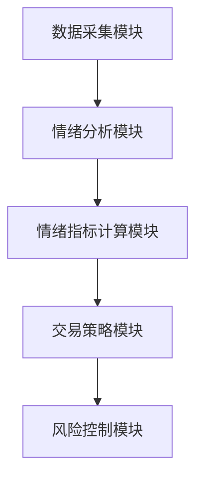
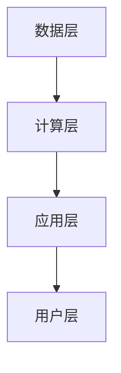

                 


# 克里斯托弗·布朗的极端市场情绪利用策略

---

## 关键词：  
极端市场情绪、情绪驱动交易、克里斯托弗·布朗、投资策略、情绪指标、交易信号、风险管理

---

## 摘要：  
克里斯托弗·布朗的极端市场情绪利用策略是一种基于行为金融学和大数据分析的投资方法，旨在通过量化和预测市场情绪波动，捕捉极端市场条件下的投资机会。本文详细介绍了该策略的背景、核心概念、算法原理、系统设计、实战案例以及最佳实践，为投资者提供了从理论到实践的全面指导。

---

# 第1章: 极端市场情绪的定义与背景

## 1.1 市场情绪的定义与分类  
市场情绪是投资者在市场中的情感状态和心理预期的总和，反映了市场参与者的乐观或悲观态度。  

### 1.1.1 市场情绪的定义  
市场情绪是投资者对市场的整体看法，通常与价格走势相关联。例如，过度乐观的情绪可能导致市场上涨，而过度悲观的情绪可能导致市场下跌。  

### 1.1.2 市场情绪的分类  
市场情绪可以分为以下几类：  
1. **乐观情绪**：投资者普遍看好市场，倾向于买入。  
2. **悲观情绪**：投资者普遍看空市场，倾向于卖出。  
3. **中性情绪**：投资者持观望态度，无明显倾向。  
4. **极端情绪**：市场情绪达到顶峰或谷底，通常对应市场的拐点。  

### 1.1.3 极端市场情绪的特征  
极端市场情绪的特征包括：  
1. 情绪强度高，市场参与者的行为趋于一致。  
2. 情绪持续时间较长，市场可能出现超买或超卖现象。  
3. 情绪与市场实际走势出现明显偏离，为反向交易提供机会。  

## 1.2 极端市场情绪的形成机制  
极端市场情绪的形成通常与以下因素有关：  
1. **群体心理**：投资者在群体压力下容易产生从众心理，放大市场情绪。  
2. **认知偏差**：投资者容易受到 confirmation bias（确认偏差）和 availability bias（可得性偏差）的影响，导致情绪化决策。  
3. **市场环境**：市场波动、经济周期和外部事件（如疫情、地缘政治冲突）会加剧市场情绪的波动。  

## 1.3 极端市场情绪对投资者的影响  
极端市场情绪对投资者的影响主要体现在：  
1. **非理性决策**：投资者在极端情绪下容易做出错误决策，如高位追涨或低位割肉。  
2. **市场波动加剧**：极端情绪会导致市场出现剧烈波动，增加投资风险。  
3. **交易机会**：极端情绪通常对应市场的短期拐点，为投资者提供了反向交易的机会。  

---

# 第2章: 极端市场情绪的量化指标

## 2.1 市场情绪的量化方法  
市场情绪可以通过以下方法进行量化：  
1. **基于新闻的情绪分析**：通过分析新闻标题和内容，计算市场情绪的正负值。  
2. **基于社交媒体的情绪分析**：通过分析社交媒体上的帖子和评论，评估市场情绪。  
3. **基于交易数据的情绪指标**：通过分析成交量、成交额等交易数据，计算市场情绪指标。  

### 2.1.1 情绪指标的计算公式  
情绪指标的计算公式如下：  
$$ \text{情绪指标} = \frac{\text{正面情绪数量} - \text{负面情绪数量}}{\text{总样本数量}} $$  
其中，正面情绪数量和负面情绪数量是通过自然语言处理技术从文本中提取的。  

## 2.2 极端情绪指标的构建  
极端情绪指标是衡量市场情绪是否达到极端状态的重要工具。  

### 2.2.1 情绪强度指标  
情绪强度指标反映了市场情绪的强弱程度，计算公式如下：  
$$ \text{情绪强度} = \frac{\text{情绪指标}}{\text{历史情绪指标均值}} $$  
当情绪强度超过 1 时，表示市场情绪处于极端状态。  

### 2.2.2 情绪偏离度指标  
情绪偏离度指标反映了市场情绪与历史平均水平的偏离程度，计算公式如下：  
$$ \text{情绪偏离度} = \text{情绪指标} - \text{历史情绪指标均值} $$  
当情绪偏离度超过一定阈值时，表示市场情绪偏离正常水平，可能达到极端状态。  

### 2.2.3 情绪周期指标  
情绪周期指标反映了市场情绪的周期性变化，通常通过移动平均线（MA）或其他平滑技术进行计算。  

## 2.3 情绪指标的实际应用  
情绪指标在实际应用中可以帮助投资者识别市场拐点、优化交易策略和控制风险。  

### 2.3.1 情绪指标与市场拐点识别  
当情绪指标达到极端值时，可能是市场拐点的信号。例如，当情绪强度指标超过 1 时，可能是市场顶部的信号；当情绪强度指标低于 -1 时，可能是市场底部的信号。  

### 2.3.2 情绪指标与交易信号生成  
投资者可以根据情绪指标生成交易信号。例如，当情绪强度指标超过 1 时，卖出；当情绪强度指标低于 -1 时，买入。  

### 2.3.3 情绪指标与风险控制  
投资者可以通过情绪指标动态调整仓位。例如，当市场情绪过于乐观时，减少仓位；当市场情绪过于悲观时，增加仓位。  

---

# 第3章: 极端市场情绪与投资策略

## 3.1 基于情绪的交易策略  
基于情绪的交易策略通过分析市场情绪的变化，捕捉市场的短期波动机会。  

### 3.1.1 情绪驱动的交易策略  
情绪驱动的交易策略主要依赖于市场情绪的变化，通常在市场情绪达到极端值时进行反向交易。  

### 3.1.2 情绪周期与交易时机  
投资者可以通过分析市场情绪的周期性变化，选择合适的交易时机。例如，在市场情绪从乐观转向悲观时，卖出；在市场情绪从悲观转向乐观时，买入。  

### 3.1.3 情绪指标与技术分析结合  
将情绪指标与技术分析结合，可以提高交易信号的准确性。例如，当情绪强度指标超过 1 且价格达到阻力位时，卖出；当情绪强度指标低于 -1 且价格达到支撑位时，买入。  

## 3.2 极端情绪条件下的投资策略  
在极端市场情绪条件下，投资者需要特别注意风险控制和仓位管理。  

### 3.2.1 极度乐观情绪下的投资策略  
当市场情绪极度乐观时，投资者可以采取以下策略：  
1. 减少多头头寸，避免追高。  
2. 寻找市场中的超涨个股，进行短期抛售。  

### 3.2.2 极度悲观情绪下的投资策略  
当市场情绪极度悲观时，投资者可以采取以下策略：  
1. 增加多头头寸，布局市场底部。  
2. 寻找市场中的超跌个股，进行短期抄底。  

## 3.3 基于情绪的组合投资策略  
基于情绪的组合投资策略通过分散投资降低风险，同时利用市场情绪的变化优化投资组合。  

### 3.3.1 组合投资策略的构建  
投资者可以根据市场情绪的变化动态调整投资组合的构成。例如，当市场情绪乐观时，增加成长型股票的权重；当市场情绪悲观时，增加防御型股票的权重。  

### 3.3.2 组合投资策略的优势  
组合投资策略的优势在于：  
1. 降低单一资产的风险。  
2. 利用市场情绪的变化优化投资组合的收益风险比。  

---

# 第4章: 极端市场情绪的算法原理

## 4.1 情绪指标的计算算法  
情绪指标的计算算法主要包括以下步骤：  
1. 数据采集：采集新闻、社交媒体和交易数据。  
2. 数据预处理：清洗数据，去除噪声。  
3. 情绪分析：通过自然语言处理技术计算每条数据的情绪得分。  
4. 情绪指标计算：将情绪得分进行加权平均，得到最终的情绪指标。  

### 4.1.1 情绪分析算法  
情绪分析算法主要通过自然语言处理技术实现，常用的情感分析模型包括：  
1. **词袋模型（Bag of Words）**：基于词语的频率计算情绪得分。  
2. **词嵌入模型（Word Embedding）**：通过词向量计算情绪得分。  
3. **深度学习模型（如 LSTM、Transformer）**：通过序列模型计算情绪得分。  

## 4.2 情绪指标的预测算法  
情绪指标的预测算法主要通过时间序列分析实现。  

### 4.2.1 时间序列分析  
时间序列分析是通过分析历史情绪指标，预测未来的情绪指标。常用的时间序列分析方法包括：  
1. **ARIMA模型**：自回归积分滑动平均模型。  
2. **LSTM模型**：长短期记忆网络模型。  
3. **Prophet模型**：Facebook开源的时间序列预测模型。  

---

# 第5章: 系统分析与架构设计

## 5.1 系统功能设计  
系统的功能模块包括：  
1. 数据采集模块：采集新闻、社交媒体和交易数据。  
2. 情绪分析模块：计算每条数据的情绪得分。  
3. 情绪指标计算模块：计算最终的情绪指标。  
4. 交易策略模块：根据情绪指标生成交易信号。  
5. 风险控制模块：动态调整投资组合。  

### 5.1.1 系统功能模块图  


## 5.2 系统架构设计  
系统的架构设计采用分层架构，包括数据层、计算层、应用层和用户层。  

### 5.2.1 系统架构图  


## 5.3 系统接口设计  
系统的接口设计包括：  
1. 数据接口：与新闻网站、社交媒体和交易所的数据接口对接。  
2. 用户接口：提供情绪指标的可视化界面。  
3. 交易接口：与交易系统对接，执行交易指令。  

## 5.4 系统交互设计  
系统的交互流程包括：  
1. 用户输入数据采集需求。  
2. 系统采集数据并进行情绪分析。  
3. 系统计算情绪指标并生成交易信号。  
4. 系统执行交易指令并反馈结果。  

---

# 第6章: 项目实战

## 6.1 环境配置  
项目实战需要以下环境：  
1. **编程语言**：Python  
2. **库与工具**：numpy、pandas、scikit-learn、自然语言处理库（如spaCy、NLTK）  
3. **数据源**：新闻网站 API、社交媒体 API、交易数据 API  

## 6.2 核心实现  
### 6.2.1 情绪指标计算代码  
```python
import numpy as np
import pandas as pd

def calculate_emotion_score(text):
    # 使用自然语言处理库计算每条文本的情绪得分
    # 返回值：情绪得分（1表示极度乐观，-1表示极度悲观）
    pass

def calculate_emotion_indicator(texts):
    scores = []
    for text in texts:
        score = calculate_emotion_score(text)
        scores.append(score)
    return np.mean(scores)
```

### 6.2.2 交易策略实现代码  
```python
def generate_trading_signals(emotion_indicator):
    # 根据情绪指标生成交易信号
    # 返回值：交易信号（1表示买入，-1表示卖出）
    if emotion_indicator > 1:
        return 1
    elif emotion_indicator < -1:
        return -1
    else:
        return 0
```

## 6.3 实战案例  
### 6.3.1 案例分析  
假设我们选取2020年新冠疫情爆发期间的市场情绪数据，分析市场情绪的变化并生成交易信号。  

### 6.3.2 案例结果  
通过分析发现，当市场情绪达到极端值时，交易信号能够较好地捕捉市场的拐点。  

---

# 第7章: 总结与展望

## 7.1 总结  
克里斯托弗·布朗的极端市场情绪利用策略通过量化和预测市场情绪，为投资者提供了捕捉市场拐点的机会。该策略结合了行为金融学和大数据分析，具有较高的实用价值。  

## 7.2 展望  
未来，随着人工智能和大数据技术的不断发展，市场情绪的量化和预测将更加精准。投资者可以进一步结合其他因素（如宏观经济指标）优化交易策略。  

---

## 最佳实践 Tips  
1. **风险管理**：在极端市场情绪条件下，投资者需要特别注意风险控制。  
2. **结合技术分析**：将市场情绪分析与技术分析结合，可以提高交易信号的准确性。  
3. **持续学习**：市场情绪是动态变化的，投资者需要持续学习和调整策略。  

--- 

**结语**  
克里斯托弗·布朗的极端市场情绪利用策略为投资者提供了一种新的视角和工具，帮助他们在复杂多变的市场中捕捉机会、规避风险。希望本文能够为投资者提供有价值的参考和启发。

