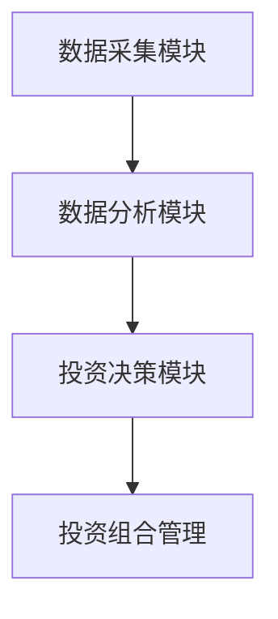

                 

# 克里斯托弗·布朗的深度价值投资方法

> **关键词**：深度价值投资、内在价值、安全边际、财务指标分析、竞争优势分析、投资组合管理  
> **摘要**：本文系统地介绍克里斯托弗·布朗的深度价值投资方法，涵盖其核心理念、理论基础、系统架构及实际案例分析。通过数学公式、图表和代码示例，详细讲解如何通过内在价值评估和安全边际选择低估股票，构建稳健的投资组合。

---

## 引言：深度价值投资的背景与核心理念

深度价值投资是一种通过分析企业的内在价值，寻找市场价格低于其真实价值的股票的投资方法。这种方法以基本面分析为核心，强调长期持有的理念。本文将介绍克里斯托弗·布朗的深度价值投资方法，探讨其理论基础、分析方法和系统架构。

### 1.1 深度价值投资的起源与发展

深度价值投资起源于20世纪30年代，由本杰明·格雷厄姆和戴维·多德提出。克里斯托弗·布朗继承并发展了这一理论，提出了更具系统性和操作性的方法。

#### 1.1.1 价值投资的定义与核心理念

价值投资的核心理念是寻找市场价格低于其内在价值的股票。内在价值是基于企业未来现金流的现值计算得出的。

#### 1.1.2 克里斯托弗·布朗的贡献与风格

布朗强调系统化分析和长期持有，提出通过财务指标和竞争优势分析来识别低估股票。

#### 1.1.3 深度价值投资的演进历程

深度价值投资从最初的格雷厄姆-多德理论发展到现代的系统化方法，结合了定量分析和定性分析。

### 1.2 深度价值投资的核心概念

深度价值投资的核心概念包括内在价值、安全边际和竞争优势分析。

#### 1.2.1 内在价值的定义与计算

内在价值是基于企业未来现金流的现值计算得出的。公式如下：

$$
\text{内在价值} = \sum_{t=1}^{n} \frac{\text{现金流}_t}{(1+r)^t}
$$

其中，$r$是折现率，$n$是预测期数。

#### 1.2.2 安全边际的原理与应用

安全边际是市场价格与内在价值之间的差额，用于降低投资风险。

$$
\text{安全边际} = \text{内在价值} - \text{市场价格}
$$

#### 1.2.3 深度价值投资与传统投资的区别

深度价值投资注重长期价值，而传统投资更关注短期市场波动。

---

## 第二部分：深度价值投资的理论基础

### 2.1 资本资产定价模型（CAPM）

CAPM用于评估资产的预期收益，公式如下：

$$
R_i = R_f + \beta_i (R_m - R_f)
$$

其中，$R_i$是资产的预期收益，$R_f$是无风险利率，$\beta_i$是资产的系统性风险系数，$R_m$是市场预期收益。

### 2.2 现金流折现模型（DCF）

DCF用于评估企业的内在价值，公式如下：

$$
\text{内在价值} = \sum_{t=1}^{n} \frac{\text{现金流}_t}{(1+r)^t} + \frac{\text{终值}}{(1+r)^n}
$$

### 2.3 股票估值的关键指标

常用股票估值指标包括市盈率（P/E）、市净率（P/B）和股息率（D/P）。

---

## 第三部分：深度价值投资的系统分析与架构设计

### 3.1 系统架构设计

系统架构包括数据采集、数据分析和投资决策三个模块。

#### 3.1.1 数据采集模块

负责收集企业的财务数据和市场数据。

#### 3.1.2 数据分析模块

包括财务指标分析和竞争优势分析。

#### 3.1.3 投资决策模块

基于分析结果生成投资建议。

### 3.2 系统架构图

---

## 第四部分：深度价值投资的项目实战

### 4.1 选择低估股票的步骤

1. 计算股票的PEG（市盈率相对盈利增长比率）。
2. 筛选PEG小于1的股票。
3. 进行竞争优势分析。

### 4.2 投资组合管理策略

1. 分散投资以降低风险。
2. 定期再平衡投资组合。

### 4.3 风险控制策略

1. 设置止损点。
2. 定期审查投资组合。

---

## 第五部分：案例分析

### 5.1 案例一：苹果公司

分析苹果的财务状况和竞争优势，计算其内在价值。

### 5.2 案例二：亚马逊公司

评估亚马逊的市场地位和未来增长潜力。

---

## 总结与展望

深度价值投资是一种系统化、长期导向的投资方法。通过内在价值评估和竞争优势分析，投资者可以识别低估股票，构建稳健的投资组合。未来，深度价值投资将结合更多新技术，如人工智能，进一步提升分析的准确性和效率。

---

通过以上步骤，我们可以系统地介绍克里斯托弗·布朗的深度价值投资方法，涵盖理论、方法和实践。希望本文能为投资者提供有价值的参考和启发。

