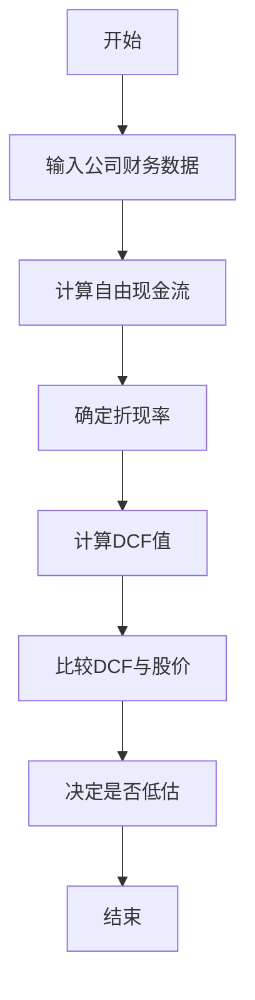
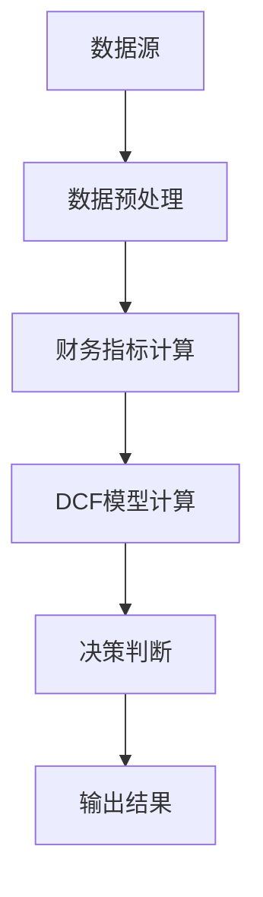

                 


# 克里斯托弗·布朗的深度价值投资：寻找严重低估的股票

## 关键词：深度价值投资，股票估值，DCF模型，低估股票，投资策略

## 摘要：本文详细探讨了深度价值投资的核心理念，结合数学模型和实际案例，分析如何识别严重低估的股票。通过介绍DCF模型和财务指标，指导读者在投资决策中应用这些方法，帮助实现长期稳定的收益。

---

## 第一部分：深度价值投资概述

### 第1章：深度价值投资的定义与背景

#### 1.1 深度价值投资的定义

深度价值投资是一种以低于内在价值的价格买入优质股票的投资策略，强调对公司基本面的深入分析。其核心理念在于识别市场低估的股票，长期持有，等待其价值回归。

#### 1.2 投资理念的发展历程

- **起源与发展**：起源于20世纪初，以本杰明·格雷厄姆为代表，后由巴菲特发扬光大。
- **现代演变**：结合现代金融理论，发展出更复杂的估值模型和策略。

#### 1.3 与其他投资策略的对比

- **与成长型投资的区别**：成长型投资侧重未来增长潜力，而深度价值投资侧重当前估值。
- **与趋势投资的差异**：趋势投资关注价格走势，而深度价值投资关注价格与价值的偏离。

---

## 第二部分：价值评估的核心概念

### 第2章：价值评估的基本原理

#### 2.1 财务指标分析

- **关键指标**：市盈率（P/E）、市净率（P/B）、股息率等。
- **指标分析**：通过比较指标与行业平均水平或历史平均水平，判断股票是否低估。

#### 2.2 DCF模型的介绍

- **模型原理**：DCF（Discounted Cash Flow）模型通过预测未来现金流并折现，评估公司内在价值。
- **公式展示**：$$DCF = \sum_{t=1}^{n} \frac{CF_t}{(1 + r)^t} + \frac{TV}{(1 + r)^n}$$

#### 2.3 低估股票的识别标准

- **识别方法**：比较DCF模型计算出的内在价值与市场价格，若市场价格显著低于内在价值，则视为低估。

---

## 第三部分：数学模型与算法

### 第3章：价值评估的数学模型

#### 3.1 DCF模型的数学公式

- **自由现金流（FCF）计算**：$$FCF = EBIT(1 - 税率) + 折旧 - 资本支出$$
- **折现率（r）的选择**：通常采用WACC（加权平均资本成本）。

#### 3.2 算法流程图



---

## 第四部分：系统架构与实现

### 第4章：投资分析系统的架构设计

#### 4.1 系统功能模块

- 数据收集模块：收集财务报表、市场数据等。
- 分析模块：包括DCF计算、指标分析等。
- 决策模块：判断股票是否低估。

#### 4.2 数据流图



---

## 第五部分：项目实战

### 第5章：实际案例分析与代码实现

#### 5.1 案例分析

以苹果公司为例，使用DCF模型计算其内在价值。

#### 5.2 代码实现步骤

1. 导入必要的库。
2. 读取财务数据。
3. 计算DCF值。
4. 比较DCF与股价。

#### 5.3 代码解读

```python
import pandas as pd
import numpy as np

def calculate_dcf(revenue_growth, operating_margin, roic, wacc,永续增长率=2%):
    # 计算永续价值
   永续价值 = (永续增长率 / (wacc - 永续增长率)) * 最终年份现金流
    # 计算DCF
    DCF = 永续价值 / (1 + wacc)**n
    return DCF

# 示例数据
revenue_growth = 0.1
operating_margin = 0.2
roic = 0.15
wacc = 0.1
永续增长率 = 0.02

DCF = calculate_dcf(revenue_growth, operating_margin, roic, wacc, 永续增长率)
print(f"DCF值为：{DCF}")
```

---

## 第六部分：最佳实践与总结

### 第6章：深度价值投资的实践指南

#### 6.1 投资策略总结

- 选择基本面良好、估值合理的股票。
- 长期持有，避免频繁交易。

#### 6.2 注意事项

- 风险提示：市场波动可能导致短期亏损。
- 数据质量：确保数据准确，避免错误分析。

#### 6.3 拓展阅读建议

- 建议阅读格雷厄姆的《证券分析》和巴菲特的股东大会演讲。

---

## 结语

深度价值投资是一种需要耐心和纪律的投资策略，通过系统化的分析和模型的应用，投资者可以识别低估的股票，实现长期稳定的收益。希望本文能为您提供有价值的见解和指导。

