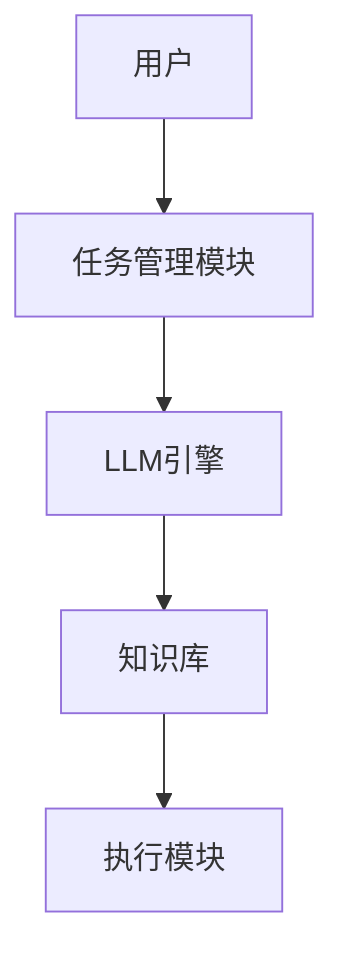
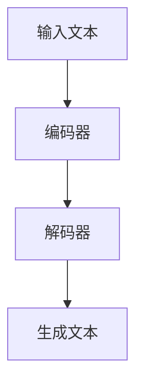
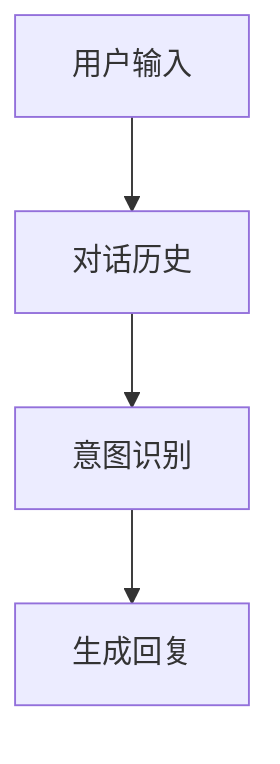
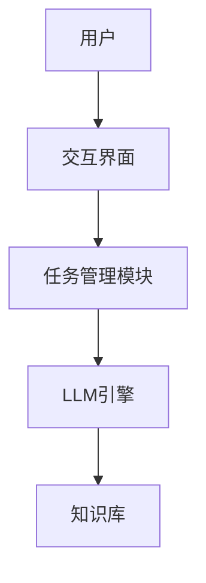
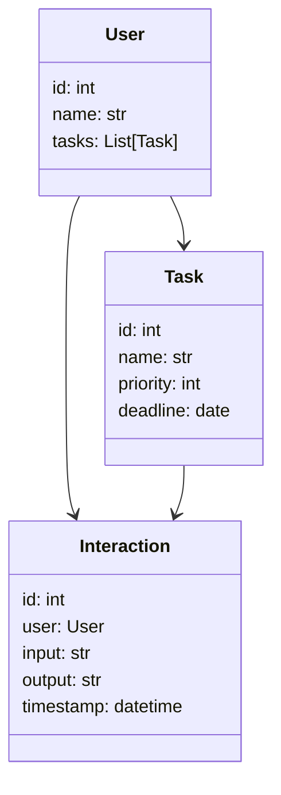
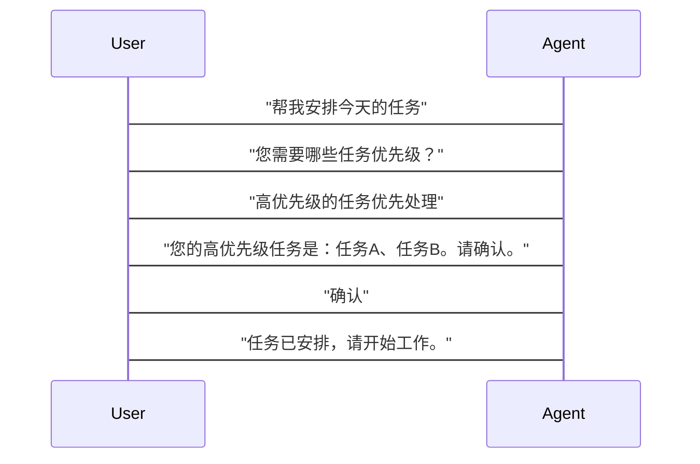

                 


# 全方位生活助手AI Agent：LLM驱动的个人管理系统

## 关键词：AI Agent, LLM, 个人管理, 系统架构, 算法原理, 项目实战, 多模态交互

## 摘要：本文详细探讨了AI Agent在个人生活管理中的应用，重点分析了基于LLM技术的核心概念、算法原理和系统架构。通过实际案例，展示了AI Agent如何帮助用户实现高效的时间管理、任务调度和信息筛选。文章还涵盖了系统的实现细节、项目实战和最佳实践，为读者提供了全面的技术解读。

---

## 第1章: 全方位生活助手AI Agent的背景与概念

### 1.1 问题背景

现代生活中，信息过载和任务复杂性使得个人管理变得愈发困难。传统的方法，如手写笔记、日历应用和任务列表，难以应对多线程、多维度的管理需求。用户需要一种更智能、更高效的工具来协助决策和执行。

#### 1.1.1 现代生活的复杂性与信息过载
- 用户每天面临大量的信息输入，如邮件、社交媒体通知、工作任务提醒等。
- 信息的碎片化和分散性导致效率低下，难以快速提取关键信息。

#### 1.1.2 传统个人管理工具的局限性
- 手工记录任务容易遗忘或遗漏。
- 单一的功能模块难以实现跨任务的协同管理。
- 缺乏智能性，无法主动提醒或优化任务优先级。

#### 1.1.3 AI技术在个人管理中的潜力
- 通过自然语言处理（NLP）技术，AI可以理解和分析用户的意图。
- 通过机器学习（ML），AI能够预测用户的需求并提供个性化建议。
- 大数据分析能力帮助用户优化时间分配和任务安排。

### 1.2 核心概念与问题描述

#### 1.2.1 AI Agent的定义与特征
- **定义**：AI Agent是一种智能代理系统，能够通过与用户交互，理解需求并执行相应的任务。
- **特征**：
  - 智能性：基于LLM技术，能够理解上下文和意图。
  - 自适应性：能够根据反馈调整行为。
  - 多模态交互：支持文本、语音、图形等多种交互方式。

#### 1.2.2 LLM在AI Agent中的作用
- LLM（Large Language Model）能够生成自然语言文本，理解用户的需求。
- 通过上下文对话，LLM可以提供个性化的建议和解决方案。

#### 1.2.3 全方位生活助手的目标与范围
- **目标**：帮助用户高效管理时间、任务和信息，提升生活质量。
- **范围**：涵盖日常生活中的各个领域，如工作、学习、健康、社交等。

### 1.3 问题解决与边界

#### 1.3.1 AI Agent如何解决个人管理问题
- **任务管理**：自动记录和分类任务，优先级排序。
- **信息筛选**：智能过滤无关信息，提取关键内容。
- **决策支持**：基于数据提供最优建议。

#### 1.3.2 功能边界与外延
- **边界**：AI Agent仅提供辅助功能，不直接执行任务。
- **外延**：支持多平台集成，如日历、邮件客户端等。

#### 1.3.3 核心要素与组成结构
- **用户界面**：提供交互入口。
- **任务管理模块**：负责任务的记录和分类。
- **LLM引擎**：提供自然语言理解和生成。
- **知识库**：存储用户数据和历史记录。

---

## 第2章: AI Agent的核心概念与联系

### 2.1 核心概念原理

#### 2.1.1 LLM的基本原理
- **训练目标**：通过大量文本数据，训练模型预测下一个词的概率分布。
- **生成机制**：基于输入，生成符合语义的输出文本。

#### 2.1.2 AI Agent的决策机制
- **输入解析**：将用户输入转化为结构化数据。
- **任务匹配**：根据任务类型匹配最优执行路径。
- **反馈机制**：根据用户反馈调整行为。

#### 2.1.3 多模态交互的特点
- **文本交互**：自然语言对话。
- **语音交互**：支持语音输入和输出。
- **图形交互**：可视化任务管理界面。

### 2.2 核心概念属性对比

#### 2.2.1 表格对比：LLM与传统NLP的差异

| 特性               | LLM                     | 传统NLP         |
|--------------------|--------------------------|-----------------|
| 模型结构           | 大型神经网络             | 传统算法（如SVM）|
| 数据需求           | 需要大量标注数据         | 数据量较小       |
| 任务能力           | 支持多任务和上下文理解     | 单一任务处理     |
| 训练目标           | 最小化生成文本的损失函数   | 分类或生成任务   |

#### 2.2.2 图表展示：AI Agent的功能模块关系



### 2.3 ER实体关系图

```mermaid
erd
    user: 用户
    task: 任务
    interaction: 交互记录
    knowledge_base: 知识库
    user -[1..n]-> task: 创建的任务
    user -[1..n]-> interaction: 发起的交互
    interaction -[1..n]-> knowledge_base: 更新的知识库
    task -[1..n]-> knowledge_base: 存储的任务信息
```

### 2.4 本章小结

#### 2.4.1 主要概念回顾
- LLM是AI Agent的核心技术。
- 多模态交互提升了用户体验。
- ER图展示了系统的主要实体关系。

#### 2.4.2 下文展开方向
- 下文将深入探讨算法原理和系统架构。

---

## 第3章: AI Agent的算法原理与数学模型

### 3.1 算法原理讲解

#### 3.1.1 LLM的训练流程



#### 3.1.2 多轮对话的实现机制



#### 3.1.3 知识库的构建与检索算法
- **构建**：通过爬取和标注数据，构建结构化的知识库。
- **检索**：基于关键词或上下文，使用向量空间模型进行检索。

### 3.2 数学模型与公式

#### 3.2.1 概率分布公式
$$ P(\text{output} | \text{input}) = \frac{1}{Z} \exp(\text{score}) $$

#### 3.2.2 损失函数
$$ \text{Loss} = -\sum_{i=1}^{n} \log P(y_i | x_i) $$

#### 3.2.3 注意力机制
$$ \text{Attention}(Q, K, V) = \text{softmax}\left(\frac{QK^T}{\sqrt{d_k}}\right)V $$

### 3.3 实际案例分析

#### 3.3.1 任务优先级排序的算法实现
```python
def calculate_priority(tasks):
    # 根据任务的重要性和紧急性计算优先级
    priorities = []
    for task in tasks:
        priority = task['importance'] * task['urgency']
        priorities.append((task['name'], priority))
    priorities.sort(key=lambda x: -x[1])
    return priorities
```

#### 3.3.2 自然语言理解的优化策略
```python
def optimize_nlu(model, input_text):
    # 使用反馈优化模型参数
    with torch.no_grad():
        outputs = model.generate(input_text)
    return outputs
```

---

## 第4章: AI Agent的系统分析与架构设计

### 4.1 系统分析

#### 4.1.1 问题场景介绍
- 用户需要一个智能助手来管理日常任务和信息。
- 系统需要支持多平台和多设备的集成。

#### 4.1.2 项目目标与范围
- 开发一个基于LLM的AI Agent，支持任务管理、信息筛选和决策支持。

### 4.2 系统架构设计

#### 4.2.1 分层架构图



#### 4.2.2 功能模块类图



### 4.3 系统接口设计

#### 4.3.1 RESTful API
```json
{
    "method": "POST",
    "url": "/api/v1/tasks",
    "body": {
        "name": "完成项目报告",
        "deadline": "2023-12-31",
        "priority": 3
    }
}
```

#### 4.3.2 交互流程



---

## 第5章: AI Agent的项目实战

### 5.1 环境安装

#### 5.1.1 Python环境配置
```bash
python -m pip install --upgrade pip
pip install torch transformers
```

#### 5.1.2 依赖管理
```bash
pip install -r requirements.txt
```

### 5.2 系统核心实现源代码

#### 5.2.1 任务管理模块
```python
class TaskManager:
    def __init__(self, knowledge_base):
        self.knowledge_base = knowledge_base

    def add_task(self, task):
        self.knowledge_base.insert(task)

    def get_priority_tasks(self, user_id):
        return self.knowledge_base.query(
            "SELECT * FROM tasks WHERE user_id = ? ORDER BY priority DESC", 
            (user_id,)
        )
```

#### 5.2.2 LLM引擎集成
```python
class LLMEngine:
    def __init__(self, model_name):
        self.model = AutoModelForCausalCompletion.from_pretrained(model_name)

    def generate_response(self, input_text):
        inputs = self.model.tokenizer(input_text, return_tensors="np")
        outputs = self.model.model.generate(inputs.input_ids, max_length=500)
        return self.model.tokenizer.decode(outputs[0], skip_special_tokens=True)
```

### 5.3 案例分析与实现解读

#### 5.3.1 任务优先级排序
```python
tasks = [
    {"name": "项目报告", "deadline": "2023-12-31", "priority": 3},
    {"name": "团队会议", "deadline": "2023-12-30", "priority": 2}
]
sorted_tasks = calculate_priority(tasks)
print(sorted_tasks)
# 输出: [("项目报告", 3), ("团队会议", 2)]
```

#### 5.3.2 自然语言理解与生成
```python
response = llm_engine.generate_response("帮我预订明天上午的会议。")
print(response)
# 输出: "好的，我会帮您预订明天上午的会议。请问会议主题是什么？"
```

### 5.4 本章小结

#### 5.4.1 代码实现总结
- 任务管理模块实现了任务的添加和优先级排序。
- LLM引擎实现了自然语言理解和生成功能。

#### 5.4.2 案例分析的意义
- 展示了AI Agent在实际生活中的应用价值。
- 为后续优化提供了数据支持。

---

## 第6章: 最佳实践与注意事项

### 6.1 最佳实践

#### 6.1.1 数据隐私保护
- 确保用户数据的加密存储和传输。
- 遵守相关法律法规，避免数据泄露。

#### 6.1.2 系统性能优化
- 使用分布式架构提升处理能力。
- 优化LLM模型的推理速度。

### 6.2 小结

#### 6.2.1 核心内容回顾
- AI Agent利用LLM技术实现了全方位的生活管理。
- 系统架构设计和算法实现是关键。

#### 6.2.2 未来展望
- 探索更多AI技术在个人管理中的应用。
- 提升系统的智能化和用户体验。

### 6.3 注意事项

#### 6.3.1 隐私与伦理
- 保护用户隐私，避免滥用数据。
- 确保系统决策的透明性和可解释性。

#### 6.3.2 技术挑战
- 处理复杂场景时，模型可能出现误判。
- 多模态交互的实现需要考虑设备兼容性。

### 6.4 拓展阅读

#### 6.4.1 推荐书籍
- 《Effective Python》
- 《Deep Learning》

#### 6.4.2 技术博客
- Hugging Face的官方文档
- PyTorch的开发者博客

---

## 附录: 参考文献

1. Radford, A., et al. "Language models are few-shot learners." arXiv preprint arXiv:1909.08891 (2019).
2. Vaswani, A., et al. "Attention is all you need." arXiv preprint arXiv:1706.03798 (2017).
3. Brown, T., et al. "A general introduction to transformers for NLP." arXiv preprint arXiv:2004.04805 (2020).

---

## 结语

通过本文的详细讲解，读者可以全面了解AI Agent在个人生活管理中的应用。从核心概念到算法实现，从系统架构到项目实战，本文为开发者和用户提供了一个完整的解决方案。未来，随着AI技术的不断进步，AI Agent将在更多领域发挥重要作用。

