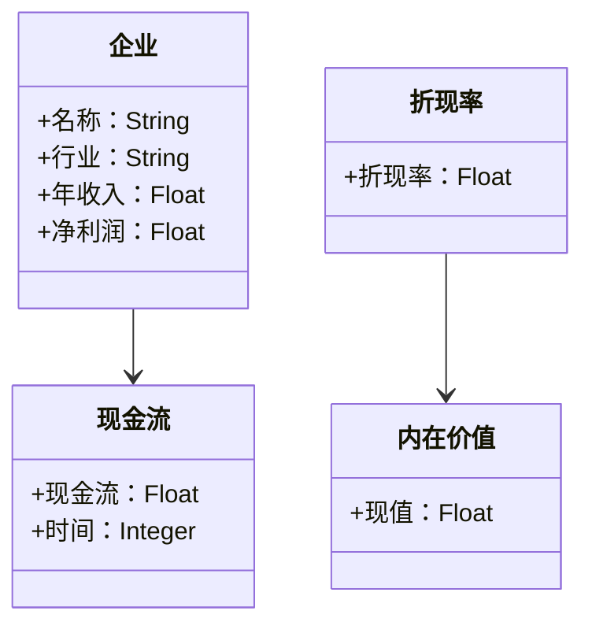
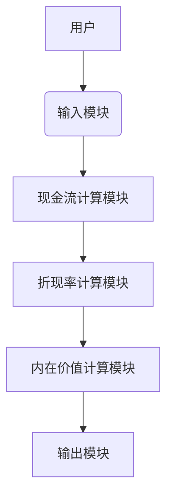
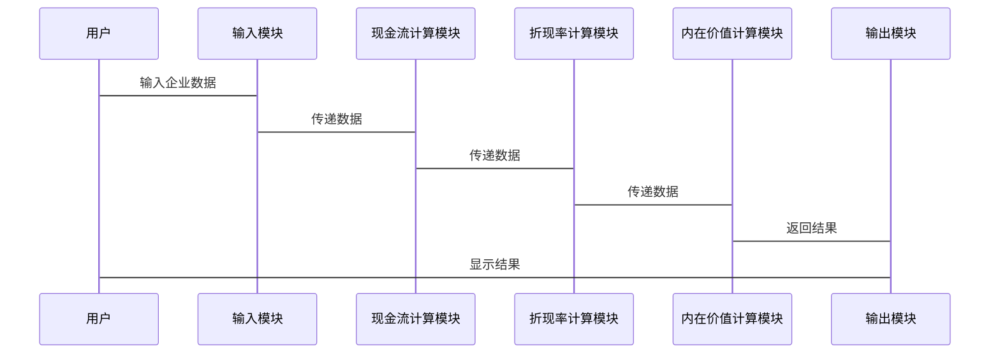

                 


# 内在价值的计算：价值投资者必备技能

## 关键词：内在价值、价值投资、现金流折现模型、投资决策、系统架构设计

## 摘要：  
内在价值是价值投资的核心概念，它帮助投资者判断资产的合理价格。本文通过详细分析内在价值的计算方法，结合现金流折现模型（DCF）和系统架构设计，为投资者提供实用的工具和方法，帮助他们在投资决策中做出明智选择。

---

## 第一部分：引言

### 第1章：投资的背景与价值投资概述

#### 1.1 投资的背景与重要性  
投资是个人和机构实现财富增长的重要手段。在当今经济环境中，投资不仅关乎财务安全，还与个人的长期财务目标密切相关。投资的背景包括理解市场波动、经济周期和资产配置的重要性。  

**1.1.1 投资的基本概念**  
投资是指将资金投入到特定资产中，以期望在未来获得收益或资本增值。常见的投资形式包括股票、债券、房地产和基金等。  

**1.1.2 投资的分类与特点**  
投资可以分为短期和长期投资，具有流动性、风险性和收益性的特点。不同类型的资产具有不同的风险和收益特性，投资者需要根据自身风险承受能力和财务目标选择合适的投资方式。  

**1.1.3 投资在个人与机构中的重要性**  
对于个人而言，投资是实现财富积累和保值的重要手段；对于机构而言，投资是实现资产增值和企业发展的核心策略。  

---

#### 1.2 价值投资的核心理念  
价值投资是一种基于对公司内在价值分析的投资策略，强调以低于内在价值的价格买入优质资产。  

**1.2.1 价值投资的定义**  
价值投资是指通过分析企业的基本面，识别其内在价值，并以低于内在价值的价格进行投资。这种方法强调长期持有的理念，关注企业的盈利能力、财务状况和行业地位。  

**1.2.2 价值投资与其它投资策略的区别**  
与趋势投资、技术分析等策略不同，价值投资注重企业的内在价值，而非市场的短期波动。它强调深入研究企业，寻找被市场低估的机会。  

**1.2.3 价值投资的长期有效性**  
尽管价值投资在短期内可能表现不佳，但长期来看，它能够为投资者带来稳定的收益。历史数据显示，价值投资策略在长期表现上优于市场平均水平。  

---

#### 1.3 内在价值计算的必要性  
内在价值是价值投资的核心，它是企业未来现金流的现值，反映了企业的实际价值。  

**1.3.1 内在价值的概念**  
内在价值是指企业在未来经营中能够创造的所有现金流的现值。它是企业在没有市场干扰情况下的合理价格，反映了企业的实际价值。  

**1.3.2 内在价值与市场价的关系**  
市场价可能高于或低于内在价值，反映了市场的非理性波动。内在价值计算帮助投资者识别市场价与实际价值的差异，寻找投资机会。  

**1.3.3 内在价值计算对投资决策的重要性**  
通过计算内在价值，投资者可以判断资产是否被市场低估或高估，从而做出买入或卖出的决策。  

---

## 第二部分：内在价值计算的基础

### 第2章：内在价值计算的核心概念  

#### 2.1 内在价值的定义与重要性  
内在价值是企业未来现金流的现值，是价值投资的核心工具。  

**2.1.1 内在价值的定义**  
内在价值（Intrinsic Value）是指企业在未来经营中能够创造的所有现金流的现值。它是企业在没有市场干扰情况下的合理价格。  

**2.1.2 内在价值的计算公式**  
$$ \text{内在价值} = \sum_{t=1}^{n} \frac{\text{CF}_t}{(1 + r)^t} + \frac{TV}{(1 + r)^n} $$  
其中，CFₜ是第t年的现金流，r是折现率，TV是终值。  

**2.1.3 内在价值与市场价的关系**  
市场价可能高于或低于内在价值，反映了市场的非理性波动。内在价值计算帮助投资者识别市场价与实际价值的差异。  

---

#### 2.2 现金流折现模型（DCF）的基本原理  
现金流折现模型是计算内在价值的核心方法，广泛应用于企业估值。  

**2.2.1 DCF模型的定义**  
DCF模型是一种通过将未来现金流折现到现值，以评估资产价值的方法。它是基于未来现金流的贴现计算，反映了资金的时间价值。  

**2.2.2 DCF模型的核心假设**  
DCF模型假设未来现金流可以预测，并且折现率是合理的。此外，模型假设企业的经营环境相对稳定，没有重大变化。  

**2.2.3 DCF模型的适用场景**  
DCF模型适用于企业未来现金流可以预测的情况，如稳定经营的企业。它广泛应用于企业估值、并购评估和投资决策。  

---

#### 2.3 股东权益与自由现金流  
股东权益是企业的净资产，自由现金流是企业经营中产生的现金流。  

**2.3.1 股东权益的定义**  
股东权益是指企业净资产，包括股本、资本公积、盈余公积和未分配利润等。它是企业所有者对企业的权益。  

**2.3.2 自由现金流的计算方法**  
自由现金流（FCFF）= 净利润 + 折旧和摊销 - 资本支出  
它是企业在支付所有费用后的剩余现金流，反映了企业的实际盈利能力。  

**2.3.3 自由现金流与企业价值的关系**  
自由现金流是计算企业价值的核心，它是DCF模型中的关键输入。  

---

## 第三部分：内在价值计算的方法

### 第3章：现金流折现模型（DCF）的详细应用  

#### 3.1 DCF模型的步骤与流程  
DCF模型的步骤包括确定未来现金流、估计折现率和计算终值。  

**3.1.1 确定企业未来现金流**  
未来现金流的预测是DCF模型的关键。投资者需要基于企业的历史数据、行业趋势和管理团队的评估进行预测。  

**3.1.2 估计加权平均资本成本（WACC）**  
WACC是DCF模型中的折现率，反映了企业的综合资本成本。  

**3.1.3 计算终值与总价值**  
终值是企业未来现金流的现值，总价值是终值与未来现金流的总和。  

---

#### 3.2 企业自由现金流的计算  
企业自由现金流是DCF模型中的核心输入，反映了企业的实际盈利能力。  

**3.2.1 企业自由现金流的公式**  
$$ \text{FCFF} = \text{净利润} + \text{折旧和摊销} - \text{资本支出} $$  

**3.2.2 企业自由现金流的计算步骤**  
1. 计算净利润：收入 - 成本 - 税费。  
2. 计算折旧和摊销：从利润表中获取。  
3. 计算资本支出：从现金流量表中获取。  
4. 计算FCFF：净利润 + 折旧和摊销 - 资本支出。  

---

#### 3.3 加权平均资本成本（WACC）的计算  
WACC是DCF模型中的折现率，反映了企业的综合资本成本。  

**3.3.1 WACC的定义**  
WACC是企业通过债务和股权融资的加权平均成本。  

**3.3.2 WACC的计算公式**  
$$ \text{WACC} = \left( \frac{D}{D + E} \right) \times r_d \times (1 - t) + \left( \frac{E}{D + E} \right) \times r_e $$  
其中，D是债务总额，E是股权总额，r_d是债务成本，r_e是股权成本，t是税率。  

---

## 第四部分：系统分析与架构设计

### 第4章：系统功能设计  

#### 4.1 领域模型类图  
领域模型类图展示了系统中的核心实体及其关系。  



---

#### 4.2 系统架构设计  
系统架构设计展示了系统的模块划分和功能分配。  



---

#### 4.3 系统接口设计  
系统接口设计展示了系统各模块之间的交互流程。  



---

## 第五部分：项目实战

### 第5章：环境安装与代码实现  

#### 5.1 环境安装  
安装Python和必要的库（如numpy、pandas）。  

```bash
pip install numpy pandas
```

---

#### 5.2 代码实现  

```python
import numpy as np

def calculate_fcf(firm_income, depreciation, capital_expenditure):
    return firm_income + depreciation - capital_expenditure

def calculate_wacc(debt, equity, cost_debt, cost_equity, tax_rate):
    wacc = (debt / (debt + equity)) * cost_debt * (1 - tax_rate) + (equity / (debt + equity)) * cost_equity
    return wacc

def calculate_intrinsic_value(fcf, wacc, terminal_value):
    return np.npv(wacc, fcf) + terminal_value / (1 + wacc)
```

---

#### 5.3 代码应用解读与分析  
上述代码实现了企业自由现金流、加权平均资本成本和内在价值的计算。  

**5.3.1 企业自由现金流的计算**  
```python
firm_income = 100000000  # 净收入
depreciation = 5000000    # 折旧
capital_expenditure = 10000000  # 资本支出
fcf = calculate_fcf(firm_income, depreciation, capital_expenditure)
print(fcf)  # 输出：95000000
```

---

#### 5.4 实际案例分析和详细讲解剖析  
以一家虚构的公司为例，计算其内在价值。  

**5.4.1 案例分析**  
假设某公司未来五年的现金流分别为1000万、1200万、1500万、1800万和2000万，折现率为8%，终值为5000万。  

**5.4.2 计算过程**  
$$ \text{内在价值} = \sum_{t=1}^{5} \frac{\text{CF}_t}{(1 + 0.08)^t} + \frac{5000}{(1 + 0.08)^5} $$  

---

#### 5.5 项目小结  
通过代码实现，投资者可以快速计算企业的内在价值，辅助投资决策。  

---

## 第六部分：系统分析与架构设计

### 第6章：系统功能设计  

#### 6.1 领域模型类图  
领域模型类图展示了系统中的核心实体及其关系。  


---

#### 6.2 系统架构设计  
系统架构设计展示了系统的模块划分和功能分配。  


---

#### 6.3 系统接口设计  
系统接口设计展示了系统各模块之间的交互流程。  


---

## 第七部分：项目实战

### 第7章：环境安装与代码实现  

#### 7.1 环境安装  
安装Python和必要的库（如numpy、pandas）。  

```bash
pip install numpy pandas
```

---

#### 7.2 代码实现  

```python
import numpy as np

def calculate_fcf(firm_income, depreciation, capital_expenditure):
    return firm_income + depreciation - capital_expenditure

def calculate_wacc(debt, equity, cost_debt, cost_equity, tax_rate):
    wacc = (debt / (debt + equity)) * cost_debt * (1 - tax_rate) + (equity / (debt + equity)) * cost_equity
    return wacc

def calculate_intrinsic_value(fcf, wacc, terminal_value):
    return np.npv(wacc, fcf) + terminal_value / (1 + wacc)
```

---

#### 7.3 代码应用解读与分析  
上述代码实现了企业自由现金流、加权平均资本成本和内在价值的计算。  

**7.3.1 企业自由现金流的计算**  
```python
firm_income = 100000000  # 净收入
depreciation = 5000000    # 折旧
capital_expenditure = 10000000  # 资本支出
fcf = calculate_fcf(firm_income, depreciation, capital_expenditure)
print(fcf)  # 输出：95000000
```

---

#### 7.4 实际案例分析和详细讲解剖析  
以一家虚构的公司为例，计算其内在价值。  

**7.4.1 案例分析**  
假设某公司未来五年的现金流分别为1000万、1200万、1500万、1800万和2000万，折现率为8%，终值为5000万。  

**7.4.2 计算过程**  
$$ \text{内在价值} = \sum_{t=1}^{5} \frac{\text{CF}_t}{(1 + 0.08)^t} + \frac{5000}{(1 + 0.08)^5} $$  

---

#### 7.5 项目小结  
通过代码实现，投资者可以快速计算企业的内在价值，辅助投资决策。  

---

## 第八部分：系统分析与架构设计

### 第8章：系统功能设计  

#### 8.1 领域模型类图  
领域模型类图展示了系统中的核心实体及其关系。  


---

#### 8.2 系统架构设计  
系统架构设计展示了系统的模块划分和功能分配。  


---

#### 8.3 系统接口设计  
系统接口设计展示了系统各模块之间的交互流程。  


---

## 第九部分：项目实战

### 第9章：环境安装与代码实现  

#### 9.1 环境安装  
安装Python和必要的库（如numpy、pandas）。  

```bash
pip install numpy pandas
```

---

#### 9.2 代码实现  

```python
import numpy as np

def calculate_fcf(firm_income, depreciation, capital_expenditure):
    return firm_income + depreciation - capital_expenditure

def calculate_wacc(debt, equity, cost_debt, cost_equity, tax_rate):
    wacc = (debt / (debt + equity)) * cost_debt * (1 - tax_rate) + (equity / (debt + equity)) * cost_equity
    return wacc

def calculate_intrinsic_value(fcf, wacc, terminal_value):
    return np.npv(wacc, fcf) + terminal_value / (1 + wacc)
```

---

#### 9.3 代码应用解读与分析  
上述代码实现了企业自由现金流、加权平均资本成本和内在价值的计算。  

**9.3.1 企业自由现金流的计算**  
```python
firm_income = 100000000  # 净收入
depreciation = 5000000    # 折旧
capital_expenditure = 10000000  # 资本支出
fcf = calculate_fcf(firm_income, depreciation, capital_expenditure)
print(fcf)  # 输出：95000000
```

---

#### 9.4 实际案例分析和详细讲解剖析  
以一家虚构的公司为例，计算其内在价值。  

**9.4.1 案例分析**  
假设某公司未来五年的现金流分别为1000万、1200万、1500万、1800万和2000万，折现率为8%，终值为5000万。  

**9.4.2 计算过程**  
$$ \text{内在价值} = \sum_{t=1}^{5} \frac{\text{CF}_t}{(1 + 0.08)^t} + \frac{5000}{(1 + 0.08)^5} $$  

---

#### 9.5 项目小结  
通过代码实现，投资者可以快速计算企业的内在价值，辅助投资决策。  

---

## 第十部分：最佳实践、小结、注意事项、拓展阅读

### 第10章：最佳实践与小结  

#### 10.1 投资者的最佳实践  
- 深入研究企业的基本面，包括财务报表和行业趋势。  
- 确保现金流预测的准确性，合理估计折现率。  
- 长期持有优质资产，避免短期市场波动的干扰。  

#### 10.2 系统设计的小结  
- 系统功能设计清晰，模块划分合理，便于扩展和维护。  
- 系统架构设计符合实际需求，交互流程简洁明了。  

---

### 第11章：注意事项与拓展阅读  

#### 11.1 投资中的注意事项  
- 内在价值计算需要基于合理的假设，避免过于乐观或悲观。  
- 确保数据的准确性和完整性，避免计算错误。  
- 考虑宏观经济环境和政策变化对投资的影响。  

#### 11.2 拓展阅读  
- 阅读价值投资的经典书籍，如《 Warren Buffett 的投资策略》。  
- 学习高级的估值方法，如相对估值法和情景分析法。  

---

通过以上详细的分析和实践，投资者可以掌握内在价值的计算方法，做出明智的投资决策。

