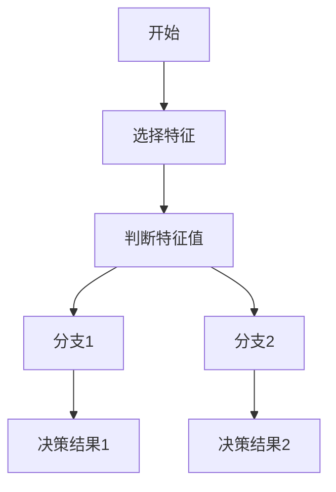
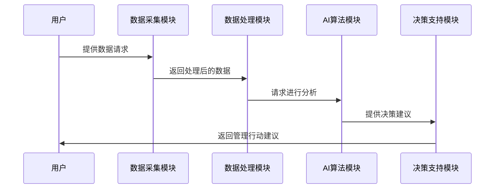

                 


# 目录大纲：农业AI Agent：智能种植与农场管理

## 第一部分：背景介绍

### 第1章：农业AI Agent的背景与重要性

#### 1.1 农业现代化与智能化的背景
- 1.1.1 农业生产的历史演变与现状
- 1.1.2 科技在农业中的应用与发展
- 1.1.3 智能化种植与管理的必要性

#### 1.2 农业AI Agent的概念与定义
- 1.2.1 人工智能在农业中的应用概述
- 1.2.2 农业AI Agent的定义与特征
- 1.2.3 农业AI Agent的核心功能与目标

#### 1.3 问题背景与挑战
- 1.3.1 农业生产中的主要问题
- 1.3.2 农场管理中的痛点分析
- 1.3.3 农业AI Agent解决的关键问题

## 第二部分：核心概念与联系

### 第2章：农业AI Agent的核心概念

#### 2.1 核心概念与原理
- 2.1.1 农业AI Agent的核心功能模块
- 2.1.2 人工智能算法在农业中的应用
- 2.1.3 农业数据的采集与处理

#### 2.2 核心概念的属性特征
- 2.2.1 农业AI Agent的属性与特征
- 2.2.2 与传统农业管理的对比分析
- 2.2.3 系统性能指标与评估标准

#### 2.3 ER实体关系图
```mermaid
er
  actor: 用户
  agent: 农业AI Agent
  farm: 农场
  crop: 作物
  weather: 天气数据
  soil: 土壤数据
  action: 管理行动
  relation 用户 --> 农业AI Agent
  relation 用户 --> 农场
  relation 农业AI Agent --> 作物
  relation 天气数据 --> 农业AI Agent
  relation 土壤数据 --> 农业AI Agent
  relation 农业AI Agent --> 管理行动
  relation 管理行动 --> 农场
```

## 第三部分：算法原理

### 第3章：决策树算法在农业AI Agent中的应用

#### 3.1 决策树算法的基本原理
- 3.1.1 决策树的定义与特点
- 3.1.2 农业场景中的适用性分析
- 3.1.3 决策树的构建过程与优势

#### 3.2 决策树流程图


#### 3.3 决策树的Python实现
```python
from sklearn.tree import DecisionTreeClassifier
from sklearn.model_selection import train_test_split
from sklearn.metrics import accuracy_score

# 示例数据
X = [[特征1, 特征2], ...]
y = [标签]

# 数据分割
X_train, X_test, y_train, y_test = train_test_split(X, y, test_size=0.3)

# 模型训练
model = DecisionTreeClassifier()
model.fit(X_train, y_train)

# 模型预测
y_pred = model.predict(X_test)

# 准确率计算
print("Accuracy:", accuracy_score(y_test, y_pred))
```

#### 3.4 决策树的数学模型与公式
- 决策树的分裂标准：信息增益
  $$ \text{信息增益} = \text{熵}(S) - \sum \text{权重} \times \text{熵}(S_i) $$
- 决策树的剪枝方法：极大极小剪枝

## 第四部分：系统分析与架构设计

### 第4章：系统分析与架构设计

#### 4.1 问题场景介绍
- 农场管理中的典型问题
- 农业AI Agent的应用场景

#### 4.2 系统功能设计
- 用户界面设计
- 数据采集与处理模块
- 决策支持系统

#### 4.3 系统架构设计


#### 4.4 系统接口设计
- 用户与系统的交互接口
- 数据接口与AI算法的集成

#### 4.5 系统交互流程图


## 第五部分：项目实战

### 第5章：项目实战与实现

#### 5.1 环境安装与配置
- Python与相关库的安装
- 开发工具的配置

#### 5.2 核心代码实现
- 农业AI Agent的核心算法实现
- 数据处理与分析的代码示例

#### 5.3 代码解读与分析
- 核心算法的详细解读
- 系统功能模块的实现细节

#### 5.4 案例分析与实际应用
- 典型案例的详细分析
- 实际应用中的效果展示

## 第六部分：最佳实践与总结

### 第6章：最佳实践与总结

#### 6.1 小结
- 农业AI Agent的优势与不足
- 未来的发展方向

#### 6.2 注意事项
- 数据采集的准确性与完整性
- 系统维护与更新的重要性

#### 6.3 拓展阅读
- 推荐的相关书籍与资源
- 进一步学习的方向与建议

## 参考文献
- 列出所有引用的书籍、论文、工具和技术资料

## 致谢
- 感谢参与项目的团队成员和指导老师

