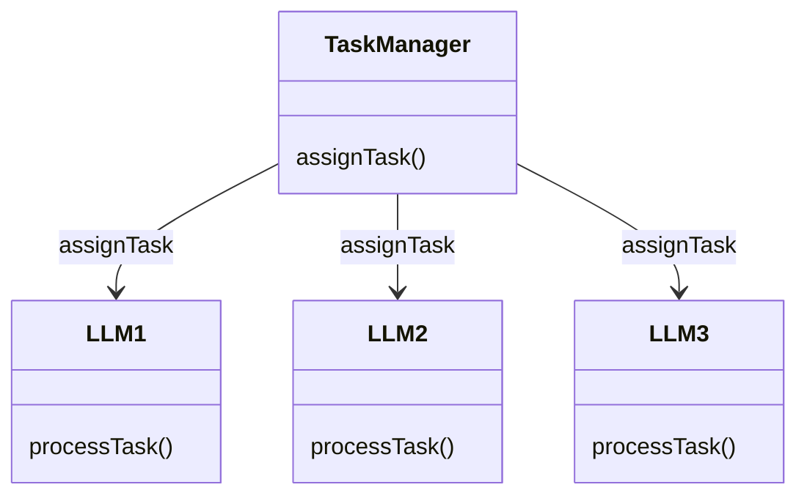

                 


# 分布式协作AI Agent：多LLM系统的群体智能

## 关键词
- 分布式协作AI Agent
- 多LLM系统
- 群体智能
- 分布式计算
- 自然语言处理

## 摘要
本文深入探讨了分布式协作AI Agent与多LLM系统的群体智能，从理论基础到实际应用，全面分析了多LLM系统在分布式协作环境下的工作原理和应用场景。文章详细讲解了群体智能的基本原理、分布式协作机制的实现、多LLM系统的算法设计与优化，并通过实际案例展示了如何在复杂场景中实现高效协作。通过本文的分析，读者将能够理解并掌握如何构建和优化分布式协作AI Agent系统，为未来的智能系统设计提供重要参考。

---

# 第1章 分布式协作AI Agent与多LLM系统概述

## 1.1 分布式协作AI Agent的基本概念
### 1.1.1 分布式协作AI Agent的定义
分布式协作AI Agent（Distributed Collaborative AI Agent，DCAA）是指多个独立的AI代理在分布式环境中通过协作完成特定任务的系统。这些代理之间通过通信和协调，共同完成复杂问题的解决。

### 1.1.2 多LLM系统的核心特点
多LLM系统（Multi-Large Language Model System）是指在系统中使用多个大语言模型（LLM）进行协作，每个LLM负责不同的任务或子问题，通过分布式计算实现高效的协同工作。

### 1.1.3 群体智能的基本原理
群体智能（Swarm Intelligence）是指通过多个简单个体的协作，实现复杂问题解决的智能形式。它强调个体之间的局部交互，通过自组织和涌现性实现全局目标。

### 1.1.4 分布式协作AI Agent与传统AI的区别
| 特性 | 分布式协作AI Agent | 传统AI系统 |
|------|---------------------|------------|
| 结构 | 分布式、去中心化 | 中心化 |
| 智能 | 基于群体协作 | 基于单点计算 |
| 可扩展性 | 高 | 有限 |

### 1.1.5 应用场景
- 分布式自然语言处理
- 多任务协作
- 分布式问题求解
- 集智决策

## 1.2 多LLM系统的核心优势
### 1.2.1 高可扩展性
通过分布式计算，多LLM系统能够处理更大的数据量和更复杂的任务。

### 1.2.2 高容错性
多个LLM的协作能够在单个模型失效时，通过其他模型继续完成任务。

### 1.2.3 高效性
通过任务分解和并行计算，多LLM系统能够显著提高计算效率。

## 1.3 本章小结
本章介绍了分布式协作AI Agent和多LLM系统的概念、特点以及应用场景，为后续章节的深入分析奠定了基础。

---

# 第2章 群体智能与分布式协作机制

## 2.1 群体智能的基本原理
### 2.1.1 群体智能的定义
群体智能是指通过多个简单个体的协作，实现复杂问题解决的智能形式。

### 2.1.2 群体智能的核心特征
- **去中心化**：没有中央控制节点。
- **自组织**：个体通过局部交互实现全局目标。
- **涌现性**：全局智能通过个体协作自然涌现。

## 2.2 分布式协作机制的实现原理
### 2.2.1 分布式协作的基本概念
分布式协作是指多个独立实体通过通信和协调，共同完成任务的过程。

### 2.2.2 分布式协作的实现方式
- **基于消息传递**：通过消息传递实现个体之间的通信。
- **基于状态共享**：通过共享状态实现协作。
- **基于分布式算法**：通过分布式算法实现任务分配和协调。

## 2.3 分布式协作中的通信机制
### 2.3.1 通信模型
- **发布-订阅模型**：个体通过发布事件和订阅事件进行通信。
- **点对点模型**：个体之间直接通信。

### 2.3.2 通信协议
- **HTTP/HTTPS**：基于HTTP协议的通信。
- **WebSocket**：实时通信协议。

## 2.4 本章小结
本章详细讲解了群体智能和分布式协作机制的基本原理，并分析了其实现方式和通信机制。

---

# 第3章 多LLM系统的算法原理

## 3.1 多LLM系统的算法概述
### 3.1.1 多LLM系统的算法分类
- **基于任务分解的算法**：将任务分解为多个子任务，分别由不同的LLM处理。
- **基于协同过滤的算法**：通过协同过滤实现LLM之间的协作。
- **基于分布式注意力机制的算法**：通过注意力机制实现多个LLM的协作。

## 3.2 分布式协作AI Agent的算法实现
### 3.2.1 分布式协作AI Agent的算法设计
- **任务分配算法**：通过任务分配算法将任务分配给不同的LLM。
- **协作算法**：通过协作算法实现LLM之间的协作。

### 3.2.2 分布式协作AI Agent的实现步骤
1. 初始化：初始化多个LLM。
2. 任务分配：将任务分配给不同的LLM。
3. 协作：LLM之间通过通信和协作完成任务。
4. 结果整合：将各个LLM的结果整合成最终结果。

## 3.3 多LLM系统中的分布式注意力机制
### 3.3.1 分布式注意力机制的定义
分布式注意力机制是指在分布式环境中，通过多个LLM的协作实现注意力分配。

### 3.3.2 分布式注意力机制的数学模型
$$
\text{Attention}(Q, K, V) = \text{softmax}(\frac{QK^T}{\sqrt{d}})V
$$

### 3.3.3 分布式注意力机制的实现
1. 将查询（Q）、键（K）、值（V）分发给不同的LLM。
2. 各个LLM分别计算注意力权重。
3. 将注意力权重整合，生成最终的注意力结果。

## 3.4 本章小结
本章详细讲解了多LLM系统的算法原理，包括算法分类、实现步骤和分布式注意力机制的设计。

---

# 第4章 系统分析与架构设计

## 4.1 系统分析
### 4.1.1 问题场景
- 分布式协作AI Agent需要在多个LLM之间实现高效协作。
- 系统需要处理大规模数据和复杂任务。

### 4.1.2 项目介绍
本项目旨在设计和实现一个多LLM系统的分布式协作架构。

## 4.2 系统功能设计
### 4.2.1 功能模块
- **任务管理模块**：负责任务的分配和管理。
- **通信模块**：负责LLM之间的通信。
- **协作模块**：负责LLM之间的协作。

### 4.2.2 领域模型


## 4.3 系统架构设计
### 4.3.1 系统架构
```mermaid
graph TD
    A[TaskManager] --> B[LLM1]
    A --> C[LLM2]
    A --> D[LLM3]
    B --> C: collaborate
    C --> D: collaborate
```

## 4.4 系统接口设计
### 4.4.1 接口设计
- **assignTask接口**：用于任务分配。
- **collaborate接口**：用于LLM之间的协作。

### 4.4.2 接口实现
```python
class TaskManager:
    def assignTask(self, task, llm):
        llm.processTask(task)
```

## 4.5 本章小结
本章分析了系统的功能需求，并通过领域模型图和架构图展示了系统的整体设计。

---

# 第5章 项目实战

## 5.1 环境安装
### 5.1.1 环境要求
- Python 3.8+
- LLM模型（如GPT-3）
- 网络通信库（如WebSocket）

### 5.1.2 安装步骤
```bash
pip install websockets
pip install numpy
```

## 5.2 核心代码实现
### 5.2.1 TaskManager实现
```python
import websockets
import asyncio

class TaskManager:
    def __init__(self):
        self.llms = []

    async def assignTask(self, task, llm):
        await llm.processTask(task)
```

### 5.2.2 LLM实现
```python
class LLM:
    async def processTask(self, task):
        # 处理任务
        pass
```

## 5.3 案例分析
### 5.3.1 案例描述
- 系统需要处理多个LLM之间的协作任务。

### 5.3.2 实施步骤
1. 初始化TaskManager。
2. 添加多个LLM到TaskManager。
3. 通过TaskManager分配任务给各个LLM。
4. LLM之间通过协作完成任务。

## 5.4 项目总结
通过本项目的实现，我们验证了分布式协作AI Agent和多LLM系统的可行性，并展示了其在实际应用中的优势。

---

# 第6章 最佳实践与未来趋势

## 6.1 最佳实践
### 6.1.1 系统设计
- 确保系统的可扩展性和容错性。
- 使用高效的通信机制。

### 6.1.2 算法优化
- 优化任务分配算法。
- 提高协作效率。

## 6.2 未来趋势
### 6.2.1 技术发展
- 更高效的分布式算法。
- 更智能的群体智能。

### 6.2.2 应用领域
- 智能城市
- 智能制造
- 智能交通

## 6.3 注意事项
- 确保系统的安全性和隐私性。
- 定期维护和优化系统。

---

# 附录

## 附录A 参考文献
1. 群体智能的相关研究
2. 分布式协作AI Agent的理论基础
3. 多LLM系统的实现技术

## 附录B 工具资源
- LLM模型资源
- 分布式计算工具
- 网络通信库

---

通过本文的详细分析，读者可以全面理解分布式协作AI Agent和多LLM系统的群体智能，并能够在实际应用中灵活运用这些技术。

