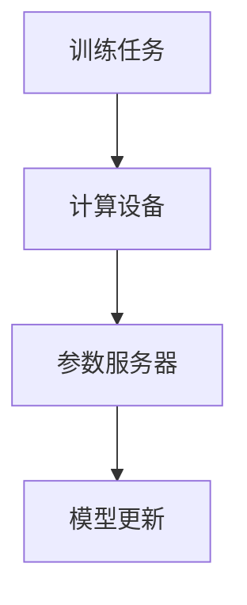
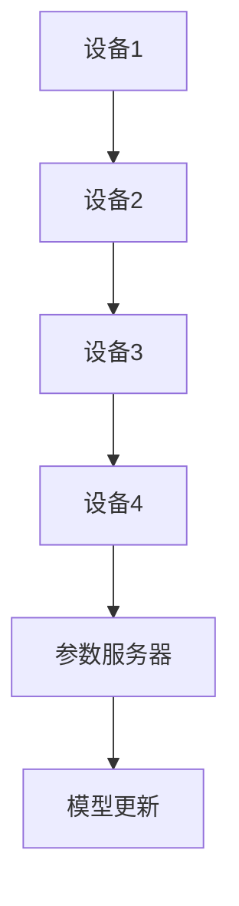
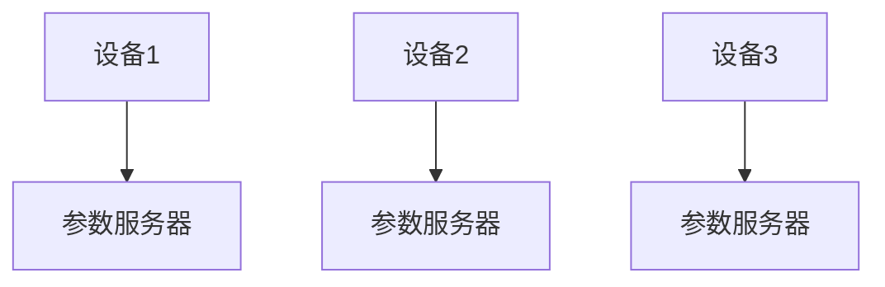
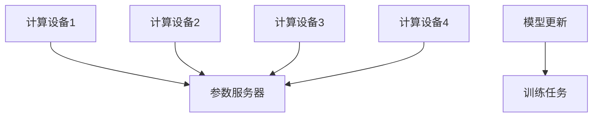

                 


# 分布式训练：加速大规模AI Agent的开发

> 关键词：分布式训练，AI Agent，大规模模型，计算效率，同步并行，异步并行

> 摘要：随着人工智能技术的快速发展，AI Agent的规模和复杂性不断提高，传统的单机训练方式已经无法满足高效训练的需求。本文详细探讨了分布式训练的核心概念、算法原理、系统架构设计以及实际应用，旨在为读者提供一个全面理解分布式训练的框架，从而加速大规模AI Agent的开发过程。

---

# 第1章: 分布式训练的核心概念与背景

## 1.1 分布式训练的背景与意义

### 1.1.1 大规模AI模型的训练需求

随着深度学习技术的不断进步，AI模型的复杂性和规模也在不断增加。为了训练这些大规模模型，单台机器的计算能力已经远远不够，必须借助分布式计算技术来分担计算任务。分布式训练通过将训练任务分解到多台机器或多个GPU上并行执行，显著提高了训练效率和模型性能。

### 1.1.2 分布式训练的必要性

在AI Agent开发中，数据集通常非常庞大，且模型参数数量也急剧增加。单机训练不仅效率低下，还可能面临内存不足的问题。通过分布式训练，可以将数据集和模型参数分布在多个计算节点上，充分利用计算资源，缩短训练时间，降低计算成本。

### 1.1.3 分布式训练的核心目标

分布式训练的核心目标是通过并行计算和资源利用最大化，提高AI模型的训练效率和性能。具体目标包括：

1. **提高计算效率**：通过并行计算减少训练时间。
2. **扩展计算能力**：支持更大规模的数据集和模型。
3. **降低计算成本**：通过资源优化减少计算资源的浪费。

---

## 1.2 分布式训练的基本概念

### 1.2.1 分布式训练的定义

分布式训练是一种利用多台计算设备（如多台GPU或CPU）协作完成AI模型训练的技术。通过将训练任务分解为多个子任务，并行执行，最终将结果汇总得到完整的训练结果。

### 1.2.2 分布式训练的分类

分布式训练主要分为以下几种类型：

1. **数据并行**：将数据集分割成多个子集，每个子集在不同的计算设备上进行训练，最终将梯度汇总到参数服务器。
2. **模型并行**：将模型参数分布在多个设备上，每个设备负责计算模型的一部分。
3. **混合并行**：结合数据并行和模型并行，充分利用计算资源。

### 1.2.3 分布式训练的关键特征

- **并行计算**：通过多台设备协作完成任务。
- **通信与同步**：设备之间需要定期同步参数和梯度。
- **资源分配**：合理分配计算资源以提高效率。

---

## 1.3 分布式训练的应用场景

### 1.3.1 大规模数据集处理

在处理如图像识别、自然语言处理等任务时，数据集通常非常庞大。分布式训练可以通过多台设备并行处理数据，显著提高训练效率。

### 1.3.2 高性能计算需求

对于需要高性能计算的任务，如实时AI Agent开发，分布式训练可以提供更高的计算能力，确保模型快速迭代和优化。

### 1.3.3 多任务学习与分布式训练

多任务学习需要同时优化多个任务，分布式训练可以通过并行计算将不同任务分配到不同的设备上，提高训练效率。

---

## 1.4 分布式训练的挑战与解决方案

### 1.4.1 分布式训练的主要挑战

1. **通信开销**：设备之间的通信会增加计算延迟。
2. **同步开销**：同步梯度和参数会占用额外的计算资源。
3. **资源分配**：如何合理分配计算资源以提高效率。

### 1.4.2 分布式训练的优化策略

1. **减少通信开销**：通过优化通信协议和数据传输方式。
2. **降低同步开销**：采用异步更新策略减少同步次数。
3. **动态资源分配**：根据任务需求动态调整计算资源。

### 1.4.3 分布式训练的未来趋势

随着AI技术的不断发展，分布式训练将朝着更高效、更智能的方向发展。未来的研究方向包括：

1. **更高效的通信协议**：减少设备之间的通信延迟。
2. **更智能的资源分配**：动态调整计算资源以适应任务需求。
3. **结合边缘计算**：将分布式训练应用于边缘计算场景，提高实时性。

---

## 1.5 本章小结

本章介绍了分布式训练的核心概念和背景，探讨了其在AI Agent开发中的重要性。通过理解分布式训练的基本概念和应用场景，我们可以更好地利用这一技术来加速大规模AI模型的训练过程。

---

# 第2章: 分布式训练的核心概念与联系

## 2.1 分布式训练的核心原理

### 2.1.1 分布式训练的数学模型

在分布式训练中，模型的更新通常采用参数平均的方式。假设我们有多个计算设备，每个设备计算出梯度后，将梯度汇总到参数服务器，最终更新模型参数。数学模型如下：

$$\theta_{\text{new}} = \frac{1}{n}\sum_{i=1}^{n}\theta_i$$

其中，$\theta_{\text{new}}$是更新后的模型参数，$\theta_i$是各个设备计算出的梯度。

### 2.1.2 分布式训练的同步与异步机制

#### 同步并行

在同步并行中，所有设备必须等待彼此计算完梯度后才能进行参数更新。这种方式保证了模型的一致性，但可能会增加通信延迟。

#### 异步并行

在异步并行中，设备可以异步地计算梯度并更新参数，不需要等待其他设备完成。这种方式可以减少通信开销，但可能会导致参数不一致。

### 2.1.3 分布式训练的通信与同步

在分布式训练中，设备之间的通信是关键。通常采用以下两种方式：

1. **点对点通信**：设备之间直接交换数据。
2. **集中式通信**：通过参数服务器汇总梯度。

---

## 2.2 分布式训练的核心概念对比

### 2.2.1 同步并行与异步并行的对比

| 对比维度       | 同步并行                | 异步并行                |
|-----------------|------------------------|-------------------------|
| 同步方式         | 必须等待所有设备完成    | 不需要等待，异步更新    |
| 通信开销         | 较高                   | 较低                    |
| 延迟             | 较高                   | 较低                    |
| 一致性           | 高                    | 低                     |

### 2.2.2 数据并行与模型并行的对比

| 对比维度       | 数据并行                | 模型并行                |
|-----------------|------------------------|-------------------------|
| 参数分配方式     | 每个设备负责不同的数据子集 | 每个设备负责模型的不同部分 |
| 适用场景         | 数据量大               | 模型复杂度高            |
| 通信需求         | 较高（梯度同步）        | 较高（参数同步）         |

### 2.2.3 分布式训练中的参数同步机制

参数同步机制是分布式训练的核心，通常采用以下两种方式：

1. **全同步**：所有设备计算完梯度后，同步更新参数。
2. **部分同步**：部分设备计算完梯度后，同步更新参数。

---

## 2.3 分布式训练的ER实体关系图

在分布式训练中，主要实体包括：

- **训练任务**：需要分配到多个设备上执行。
- **计算设备**：负责执行具体的训练任务。
- **参数服务器**：负责汇总梯度并更新模型参数。

以下是一个简单的ER实体关系图：



---

## 2.4 本章小结

本章详细讲解了分布式训练的核心原理和关键概念，包括同步与异步机制、数据并行与模型并行的对比，以及参数同步机制。通过理解这些核心概念，我们可以更好地设计和优化分布式训练系统。

---

# 第3章: 分布式训练的算法原理与实现

## 3.1 分布式训练的算法流程

### 3.1.1 分布式训练的基本流程

1. **初始化**：将模型参数初始化到所有设备上。
2. **数据划分**：将数据集划分到各个设备上。
3. **梯度计算**：每个设备计算其负责数据的梯度。
4. **梯度汇总**：将所有设备的梯度汇总到参数服务器。
5. **参数更新**：参数服务器更新模型参数并分发到所有设备。

### 3.1.2 分布式训练的同步机制

同步机制是分布式训练的核心，通常采用以下步骤：

1. **计算梯度**：每个设备计算其负责数据的梯度。
2. **同步梯度**：将所有设备的梯度汇总到参数服务器。
3. **更新参数**：参数服务器更新模型参数并分发到所有设备。

### 3.1.3 分布式训练的通信协议

通信协议是设备之间交换数据的方式。常用的通信协议包括：

1. **HTTP**：基于HTTP协议的通信。
2. **TCP/IP**：基于TCP/IP协议的通信。
3. **gRPC**：高性能的RPC通信协议。

---

## 3.2 同步并行的算法实现

### 3.2.1 同步并行的数学模型

在同步并行中，模型参数的更新公式为：

$$\theta_{\text{new}} = \theta_{\text{old}} + \eta \cdot \frac{1}{n}\sum_{i=1}^{n}\nabla L_i(\theta_{\text{old}})$$

其中，$\theta_{\text{old}}$是旧的模型参数，$\eta$是学习率，$n$是设备数量，$\nabla L_i$是第$i$个设备计算出的梯度。

### 3.2.2 同步并行的流程图

以下是一个同步并行的流程图：



---

## 3.3 异步并行的算法实现

### 3.3.1 异步并行的数学模型

在异步并行中，模型参数的更新公式为：

$$\theta_{\text{new}} = \theta_{\text{old}} + \eta \cdot \nabla L_i(\theta_{\text{old}})$$

其中，$\nabla L_i$是第$i$个设备异步计算出的梯度。

### 3.3.2 异步并行的流程图

以下是一个异步并行的流程图：



---

## 3.4 本章小结

本章详细讲解了分布式训练的算法原理与实现，包括同步并行和异步并行的数学模型和流程图。通过理解这些算法，我们可以更好地设计和优化分布式训练系统。

---

# 第4章: 分布式训练的系统架构设计

## 4.1 系统架构设计概述

### 4.1.1 系统组成

分布式训练系统通常由以下部分组成：

1. **计算设备**：负责执行具体的训练任务。
2. **参数服务器**：负责汇总梯度并更新模型参数。
3. **通信模块**：负责设备之间的数据交换。
4. **管理模块**：负责系统的协调和管理。

### 4.1.2 系统功能设计

1. **数据划分**：将数据集划分到各个设备上。
2. **梯度计算**：每个设备计算其负责数据的梯度。
3. **梯度汇总**：将所有设备的梯度汇总到参数服务器。
4. **参数更新**：参数服务器更新模型参数并分发到所有设备。

---

## 4.2 系统架构设计图

以下是一个分布式训练系统的架构图：



---

## 4.3 系统接口设计

### 4.3.1 计算设备接口

1. `compute_gradient`：计算梯度并返回。
2. `update_parameters`：更新模型参数。

### 4.3.2 参数服务器接口

1. `aggregate_gradients`：汇总梯度并更新模型参数。
2. `get_parameters`：获取当前模型参数。

---

## 4.4 系统交互流程

### 4.4.1 同步交互流程

1. 计算设备计算梯度并发送到参数服务器。
2. 参数服务器汇总梯度并更新模型参数。
3. 计算设备获取更新后的模型参数。

### 4.4.2 异步交互流程

1. 计算设备异步计算梯度并发送到参数服务器。
2. 参数服务器异步更新模型参数并分发到计算设备。

---

## 4.5 本章小结

本章详细讲解了分布式训练的系统架构设计，包括系统的组成、功能设计、架构图以及接口设计。通过理解这些设计，我们可以更好地实现和优化分布式训练系统。

---

# 第5章: 分布式训练的项目实战

## 5.1 项目概述

### 5.1.1 项目目标

本项目旨在通过分布式训练技术，加速大规模AI Agent的开发。具体目标包括：

1. 实现一个简单的分布式训练系统。
2. 验证分布式训练的效率和性能。

### 5.1.2 项目技术选型

1. **框架选择**：选择TensorFlow或PyTorch框架。
2. **通信库选择**：选择gRPC或Kafka作为通信库。
3. **计算设备选择**：选择多台GPU或多台CPU。

---

## 5.2 环境搭建

### 5.2.1 系统环境

1. **操作系统**：建议使用Linux系统。
2. **编程语言**：Python 3.6及以上版本。
3. **框架安装**：安装TensorFlow或PyTorch框架。

### 5.2.2 依赖安装

1. **TensorFlow安装**：
   ```bash
   pip install tensorflow
   ```
2. **gRPC安装**：
   ```bash
   pip install grpcio
   ```

---

## 5.3 核心代码实现

### 5.3.1 计算设备实现

```python
import grpc
import tensorflow as tf
from concurrent.futures import ThreadPoolExecutor

class Worker:
    def __init__(self, task_id, server_address):
        self.task_id = task_id
        self.server_address = server_address
        self.channel = grpc.insecure_channel(server_address)
        self.stub = SomeServiceStub(self.channel)
    
    def compute_gradient(self, model):
        # 计算梯度
        gradients = model.compute_gradients()
        return gradients
    
    def update_parameters(self, gradients):
        # 更新参数
        model.update_parameters(gradients)
```

### 5.3.2 参数服务器实现

```python
import grpc
import tensorflow as tf
from concurrent.futures import ThreadPoolExecutor

class ParameterServer:
    def __init__(self, server_address):
        self.server_address = server_address
        self.model = SomeModel()
        self.executor = ThreadPoolExecutor(max_workers=4)
    
    def aggregate_gradients(self, gradients):
        # 汇总梯度
        aggregated_gradients = self.model.aggregate_gradients(gradients)
        return aggregated_gradients
    
    def update_parameters(self, gradients):
        # 更新参数
        self.model.update_parameters(gradients)
```

---

## 5.4 项目小结

本章通过一个具体的项目实战，详细讲解了分布式训练的环境搭建和核心代码实现。通过理解这些实现，读者可以更好地掌握分布式训练的实践技巧。

---

# 第6章: 分布式训练的最佳实践与未来展望

## 6.1 最佳实践

### 6.1.1 合理分配计算资源

根据任务需求合理分配计算资源，避免资源浪费。

### 6.1.2 优化通信协议

选择高效的通信协议，减少通信开销。

### 6.1.3 定期同步模型参数

在异步并行中，定期同步模型参数可以提高模型的一致性。

---

## 6.2 未来展望

随着AI技术的不断发展，分布式训练将朝着更高效、更智能的方向发展。未来的研究方向包括：

1. **更高效的通信协议**：减少设备之间的通信延迟。
2. **更智能的资源分配**：动态调整计算资源以适应任务需求。
3. **结合边缘计算**：将分布式训练应用于边缘计算场景，提高实时性。

---

## 6.3 本章小结

本章总结了分布式训练的最佳实践，并展望了未来的发展方向。通过不断优化和创新，分布式训练将为AI Agent的开发提供更强大的支持。

---

# 第7章: 分布式训练的注意事项与拓展阅读

## 7.1 注意事项

### 7.1.1 数据一致性问题

在分布式训练中，数据一致性问题需要特别注意。不同设备上的数据可能会有不同的版本，导致训练结果不一致。

### 7.1.2 同步与异步的权衡

同步并行一致性高但延迟高，异步并行延迟低但一致性差。需要根据具体任务需求进行权衡。

### 7.1.3 网络带宽问题

设备之间的通信需要占用网络带宽，需要选择合适的网络架构和通信协议。

---

## 7.2 拓展阅读

1. **《分布式系统：概念与设计》**：深入理解分布式系统的基本概念和设计原则。
2. **《深度学习实战：分布式训练优化》**：学习如何在实际项目中优化分布式训练。
3. **《gRPC 实战：高并发通信协议》**：掌握高效的通信协议设计和实现。

---

## 7.3 本章小结

本章总结了分布式训练的注意事项，并提供了拓展阅读的建议。通过不断学习和实践，读者可以更好地掌握分布式训练的技术细节。

---

# 附录: 分布式训练相关工具与框架

## 附录A: 常用分布式训练框架

1. **TensorFlow**：Google的深度学习框架，支持分布式训练。
2. **PyTorch**：Facebook的深度学习框架，支持分布式训练。
3. **Horovod**：Uber开源的分布式训练框架。

## 附录B: 分布式训练相关工具

1. **Kubernetes**：容器编排工具，支持分布式训练任务的部署和管理。
2. **Docker**：容器化技术，便于分布式训练环境的搭建和部署。
3. **gRPC**：高性能的RPC通信协议，常用于分布式训练中的设备间通信。

---

## 附录C: 分布式训练的性能优化技巧

1. **减少通信开销**：优化通信协议和数据传输方式。
2. **负载均衡**：合理分配计算任务，避免设备过载。
3. **缓存优化**：优化设备之间的数据缓存，减少通信次数。

---

## 附录D: 本章小结

本附录总结了分布式训练的相关工具和框架，并提供了性能优化的技巧。通过合理选择和使用这些工具，读者可以更好地优化分布式训练系统的性能。

---

# 结语

分布式训练是加速大规模AI Agent开发的重要技术。通过理解其核心概念、算法原理和系统架构设计，我们可以更好地设计和优化分布式训练系统。未来，随着AI技术的不断发展，分布式训练将为AI Agent的开发提供更强大的支持。希望本文能够为读者提供有价值的技术参考，帮助他们在实际项目中更好地应用分布式训练技术。

--- 

**（全文完）**

