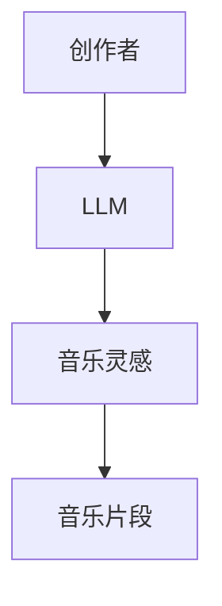
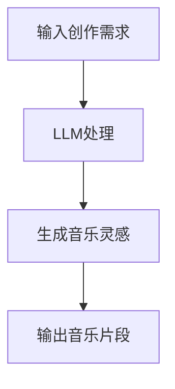
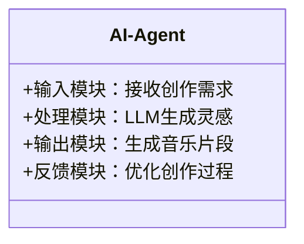
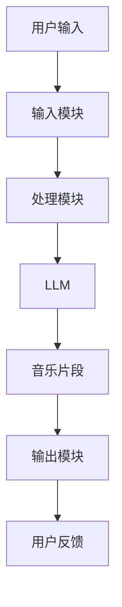
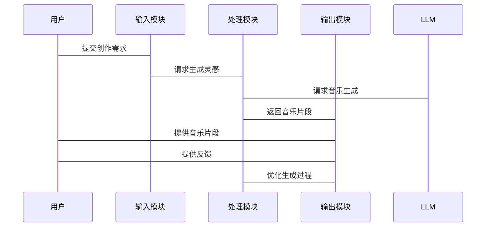

                 


# 创新音乐创作AI Agent：LLM在艺术创作中的应用

## 关键词
- 创新音乐创作
- AI Agent
- LLM
- 艺术创作
- 音乐生成
- 大语言模型
- AI技术

## 摘要
本文探讨了大语言模型（LLM）在音乐创作中的创新应用，详细分析了AI代理（AI Agent）如何辅助音乐创作的过程。文章从背景介绍、核心概念、算法原理、系统架构、项目实战到案例分析，全面解析了LLM在音乐创作中的潜力和实现方法。通过实际案例和系统设计，展示了AI如何赋能音乐创作，为艺术家和音乐爱好者提供了新的创作工具和思路。

---

## 第一部分：引言

### 第1章：AI在艺术创作中的背景

#### 1.1 问题背景
- **1.1.1 艺术创作的现状与挑战**  
  艺术创作是一个复杂的过程，尤其是音乐创作，需要创作者具备深厚的音乐理论知识和灵感。然而，传统创作方式存在效率低下、灵感难以捕捉等问题，尤其是在多风格、多语言的创作需求下，创作者往往难以独自完成复杂的音乐作品。

- **1.1.2 AI技术如何推动艺术创新**  
  AI技术的快速发展为艺术创作带来了新的可能性。通过自然语言处理（NLP）和生成式AI，AI能够帮助创作者快速生成音乐灵感、优化旋律结构，并探索新的音乐风格。

- **1.1.3 音乐创作中的痛点分析**  
  音乐创作过程中，创作者常常面临灵感枯竭、技术限制和时间效率的问题。AI技术可以辅助创作者快速生成音乐片段、提供风格建议，并通过数据驱动的方式优化音乐结构。

- **1.1.4 LLM在音乐创作中的应用潜力**  
  大语言模型（LLM）通过处理大量音乐相关的文本数据，能够生成歌词、分析音乐风格，并协助创作旋律和编曲。LLM的多语言处理能力使其在跨文化音乐创作中具有独特优势。

#### 1.2 问题描述
- **1.2.1 创新音乐创作的核心问题**  
  创新音乐创作需要结合技术与艺术，既要考虑音乐的结构和风格，又要满足创作灵感的需求。AI技术可以提供技术支持，但如何将AI与人类的创作灵感结合，是当前面临的主要挑战。

- **1.2.2 LLM在音乐创作中的应用目标**  
  通过LLM构建一个AI代理（AI Agent），帮助音乐创作者快速生成灵感、优化创作流程，并探索新的音乐风格。

- **1.2.3 创新音乐创作的实现路径**  
  通过AI代理实现音乐创作的辅助功能，包括歌词生成、旋律优化、风格迁移等，同时保持音乐的原创性和艺术性。

#### 1.3 问题解决
- **1.3.1 LLM如何辅助音乐创作**  
  LLM可以通过生成式模型生成歌词和旋律，分析音乐风格，并提供建议。同时，LLM可以与音乐生成工具（如MIDI生成器）结合，实现从创意到制作的完整流程。

- **1.3.2 创新音乐创作的AI Agent概念**  
  AI Agent是一个智能化的创作工具，能够根据创作者的需求生成音乐灵感，并协助完成创作过程。它结合了LLM的语言处理能力和音乐生成算法，为创作者提供全方位的支持。

#### 1.4 边界与外延
- **1.4.1 AI在音乐创作中的边界**  
  AI主要用于辅助创作，而非替代人类的创作灵感。AI代理可以生成音乐片段，但最终的创作决策仍需要创作者的参与。

- **1.4.2 创新音乐创作的外延应用**  
  创新音乐创作的AI代理不仅可以用于音乐创作，还可以扩展到音乐教育、音乐分析等领域，为音乐产业提供更广泛的支持。

#### 1.5 概念结构与核心要素
- **1.5.1 AI Agent的基本结构**  
  AI Agent由输入模块、处理模块、输出模块和反馈模块组成。输入模块接收创作需求，处理模块结合LLM生成音乐灵感，输出模块生成音乐片段，反馈模块根据用户反馈优化创作过程。

- **1.5.2 核心要素分析**  
  核心要素包括：创作需求分析、LLM生成能力、音乐生成算法、用户反馈机制。

---

## 第二部分：核心概念与联系

### 第2章：LLM的基本概念与原理

#### 2.1 核心概念原理
- **2.1.1 大语言模型的工作机制**  
  LLM通过大规模预训练，掌握了音乐相关的文本数据，能够理解音乐风格、歌词内容，并生成符合要求的文本。

- **2.1.2 Transformer架构的音乐生成能力**  
  Transformer模型通过自注意力机制，能够捕捉音乐中的模式和结构，从而生成连贯的音乐片段。

#### 2.2 概念属性特征对比
| 概念       | 特征描述                                                                 |
|------------|--------------------------------------------------------------------------|
| LLM        | 大规模预训练，支持多语言，生成能力强，擅长文本处理                   |
| 传统音乐生成技术 | 基于规则或随机生成，受限于数据和模型结构，生成能力有限             |

#### 2.3 ER实体关系图


---

## 第三部分：算法原理讲解

### 第3章：LLM的音乐生成算法

#### 3.1 算法流程


#### 3.2 Python源代码实现
```python
import torch
import torch.nn as nn
import torch.nn.functional as F

class MusicLM(nn.Module):
    def __init__(self, vocab_size, d_model, n_head, dff):
        super().__init__()
        self.embedding = nn.Embedding(vocab_size, d_model)
        self.transformer = nn.Transformer(d_model=d_model, nhead=n_head, dff=dff)
        self.output = nn.Linear(d_model, vocab_size)

    def forward(self, x):
        x = self.embedding(x)
        x = self.transformer(x)
        x = self.output(x)
        return F.softmax(x, dim=-1)

# 示例代码：生成歌词
model = MusicLM(vocab_size=1000, d_model=512, n_head=8, dff=2048)
input_tensor = torch.tensor([1], dtype=torch.long)
output = model(input_tensor)
```

#### 3.3 数学模型与公式
- **自注意力机制**  
  $$\text{Attention}(Q,K,V) = \text{softmax}(\frac{QK^T}{\sqrt{d_k}})V$$  
  其中，$Q$、$K$、$V$分别为查询、键和值向量。

---

## 第四部分：系统分析与架构设计方案

### 第4章：AI Agent的系统架构

#### 4.1 问题场景介绍
- AI Agent需要支持多语言、多风格的音乐创作，能够根据用户需求生成歌词、旋律，并提供创作建议。

#### 4.2 系统功能设计


#### 4.3 系统架构设计


#### 4.4 系统接口设计
- 输入接口：接收用户的创作需求
- 输出接口：生成音乐片段并返回
- 反馈接口：根据用户反馈优化生成过程

#### 4.5 系统交互


---

## 第五部分：项目实战

### 第5章：AI Agent的实现与应用

#### 5.1 项目介绍
- 本项目旨在通过LLM构建一个AI代理，帮助音乐创作者生成歌词、旋律，并提供创作建议。

#### 5.2 核心实现
- **歌词生成**：通过LLM生成歌词，支持多语言和多种风格。
- **旋律生成**：结合MIDI生成工具，根据生成的歌词自动创作旋律。

#### 5.3 代码实现
```python
def generate_music(instrument, style):
    # 生成歌词
    lyrics = model.generate_lyrics(style)
    # 生成旋律
    melody = model.generate_melody(instrument, lyrics)
    return melody
```

#### 5.4 案例分析
- 案例1：生成一首中文流行歌曲的歌词和旋律。
- 案例2：基于用户输入的歌词，生成不同风格的旋律。

#### 5.5 项目小结
- 通过AI Agent，音乐创作者可以快速生成灵感，优化创作流程，探索新的音乐风格。

---

## 第六部分：案例分析与未来展望

### 第6章：创新音乐创作的案例分析

#### 6.1 成功案例
- 案例1：利用LLM生成流行歌曲的歌词，结合AI生成旋律，制作完整音乐作品。
- 案例2：跨语言创作，生成双语歌曲，探索音乐国际化的新可能。

#### 6.2 案例分析
- 技术实现：LLM与音乐生成工具的结合。
- 创新点：AI代理辅助创作，实现从创意到制作的全流程支持。

### 第7章：未来展望

#### 7.1 技术进步
- 更强大的LLM和生成式AI将推动音乐创作的进一步创新。

#### 7.2 应用场景扩展
- AI代理将应用于音乐教育、音乐分析等领域，为音乐产业提供更多支持。

#### 7.3 未来挑战
- 如何平衡AI生成的音乐与人类创作的独特性。
- 数据隐私和版权问题。

---

## 第七部分：总结与展望

### 第8章：总结与展望

#### 8.1 总结
- LLM在音乐创作中的应用潜力巨大，通过AI代理，音乐创作者可以更高效地完成创作，探索新的音乐风格。

#### 8.2 展望
- 未来，AI代理将更加智能化，为音乐创作提供更多可能性，推动音乐艺术的发展。

---

通过以上结构，本文系统地介绍了LLM在音乐创作中的应用，结合理论分析和实际案例，为读者提供了全面的视角。希望本文能为音乐创作者和AI技术爱好者提供有价值的参考。

