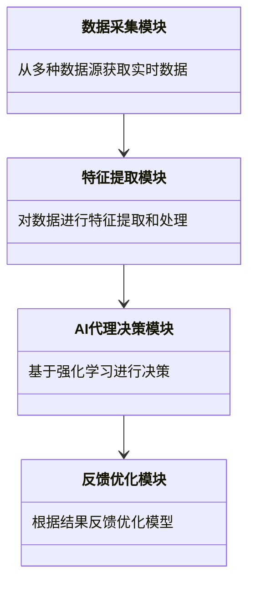

                 


# 利用AI agents构建动态产品生命周期模型：评估公司产品组合

**关键词**：AI代理、动态产品生命周期模型、产品组合评估、系统架构设计、算法原理

**摘要**：随着市场的动态变化，传统的产品生命周期管理方法逐渐显现出局限性。本文将介绍如何利用AI代理构建动态产品生命周期模型，以优化公司产品组合评估。通过理论分析、算法设计、系统架构和实际案例，本文详细阐述了AI代理在产品生命周期管理中的应用，探讨了其在动态市场环境下的优势及实现方法，为企业的智能化管理提供了新的思路。

---

# 目录大纲

## 第一章：动态产品生命周期模型的背景与问题

### 1.1 问题背景
- 1.1.1 传统产品生命周期管理的局限性
- 1.1.2 动态市场环境对企业的影响
- 1.1.3 AI技术在产品管理中的应用潜力

### 1.2 问题描述
- 1.2.1 产品组合评估的复杂性
- 1.2.2 市场变化对企业产品策略的影响
- 1.2.3 现有模型在动态环境中的不足

### 1.3 问题解决
- 1.3.1 引入AI代理的必要性
- 1.3.2 动态模型的优势与应用前景
- 1.3.3 解决方案的技术可行性

### 1.4 边界与外延
- 1.4.1 模型的适用范围与限制
- 1.4.2 与其他管理模型的关系
- 1.4.3 动态模型在不同行业中的应用差异

---

## 第二章：动态产品生命周期模型的核心概念

### 2.1 核心概念原理
- 2.1.1 产品生命周期的阶段划分与特征
- 2.1.2 动态模型的特征与属性
- 2.1.3 AI代理在模型中的角色与功能

### 2.2 核心概念对比表格
| 对比维度 | 静态模型 | 动态模型 | AI代理驱动的动态模型 |
|----------|----------|----------|------------------------|
| 时间维度 | 固定阶段 | 动态调整 | 实时更新与优化         |
| 数据来源 | 历史数据 | 实时数据 | 多源异构数据整合       |
| 决策机制 | 人工决策 | 简单规则 | 复杂AI算法驱动         |

### 2.3 概念结构与核心要素组成
- 2.3.1 产品生命周期的四个阶段（引入期、成长期、成熟期、衰退期）及其特征
- 2.3.2 动态模型的核心要素：时间、市场、产品、资源
- 2.3.3 AI代理的功能模块：数据采集、特征提取、决策优化、反馈机制

---

## 第三章：AI代理的决策机制与算法原理

### 3.1 AI代理的决策机制
- 3.1.1 基于强化学习的决策过程
- 3.1.2 基于监督学习的模式识别
- 3.1.3 基于无监督学习的异常检测

### 3.2 算法原理
#### 3.2.1 基于强化学习的动态优化
- **算法流程图**：
  ```mermaid
  graph LR
      A[状态空间] --> B[动作选择]
      B --> C[执行动作]
      C --> D[环境反馈]
      D --> E[更新策略]
      E --> A
  ```
- **数学模型**：
  $$ Q(s, a) = Q(s, a) + \alpha [r + \max_{a'} Q(s', a') - Q(s, a)] $$
  其中，$Q$ 是价值函数，$s$ 是状态，$a$ 是动作，$\alpha$ 是学习率。

#### 3.2.2 基于机器学习的产品特征提取
- **特征提取流程图**：
  ```mermaid
  graph LR
      A[原始数据] --> B[预处理]
      B --> C[特征选择]
      C --> D[特征提取]
      D --> E[特征向量]
  ```

---

## 第四章：动态产品生命周期模型的数学建模

### 4.1 数学模型构建
#### 4.1.1 产品生命周期阶段的数学表示
$$ \text{阶段划分} = f(t, m, r) $$
其中，$t$ 是时间，$m$ 是市场指标，$r$ 是资源指标。

#### 4.1.2 动态优化的数学表达
$$ \max_{\theta} \sum_{t=1}^{T} \pi(t, \theta) $$
其中，$\pi$ 是目标函数，$\theta$ 是优化参数，$T$ 是时间跨度。

### 4.2 算法流程图


---

## 第五章：系统架构设计

### 5.1 系统功能设计
#### 5.1.1 功能模块划分
- 数据采集模块
- 特征提取模块
- AI代理决策模块
- 反馈优化模块

#### 5.1.2 领域模型


### 5.2 系统架构设计


### 5.3 接口设计
- 数据接口：RESTful API，支持POST和GET请求
- 决策接口：基于JSON-RPC的实时决策服务

---

## 第六章：项目实战

### 6.1 环境安装
- 安装Python、TensorFlow、Keras等工具
- 配置虚拟环境和依赖管理

### 6.2 核心代码实现
```python
import numpy as np
import tensorflow as tf

# 定义强化学习模型
class AI-Agent:
    def __init__(self, state_dim, action_dim):
        self.state_dim = state_dim
        self.action_dim = action_dim
        self.model = self.build_model()
    
    def build_model(self):
        # 构建神经网络模型
        model = tf.keras.Sequential([
            tf.keras.layers.Dense(64, activation='relu', input_dim=self.state_dim),
            tf.keras.layers.Dense(self.action_dim)
        ])
        model.compile(optimizer='adam', loss='mse')
        return model
    
    def act(self, state):
        # 输出动作
        return self.model.predict(np.array([state]))[0]
    
    def train(self, state, target):
        # 更新模型
        self.model.fit(np.array([state]), np.array([target]), epochs=1, verbose=0)
```

### 6.3 案例分析
- 某科技公司的产品组合优化案例
- 使用动态模型进行产品阶段划分和资源分配
- 实施后的效果对比与分析

---

## 第七章：最佳实践与小结

### 7.1 最佳实践
- 数据质量的重要性
- 模型的可解释性与调试
- 系统的可扩展性与维护

### 7.2 小结
- 动态产品生命周期模型的优势
- AI代理在实际应用中的价值
- 未来的研究方向与改进空间

### 7.3 注意事项
- 数据隐私与安全问题
- 模型的泛化能力与鲁棒性
- 系统的实时性和稳定性

---

## 第八章：附录

### 8.1 工具安装指南
- Python包的安装与配置
- 环境搭建的详细步骤

### 8.2 数据集介绍
- 数据来源与预处理方法
- 数据格式与字段说明

### 8.3 参考文献
- 相关书籍、论文、技术文档的引用

---

通过以上目录大纲，我们可以系统地构建和理解动态产品生命周期模型，并通过实际案例和代码实现，帮助读者掌握AI代理在产品管理中的应用。

