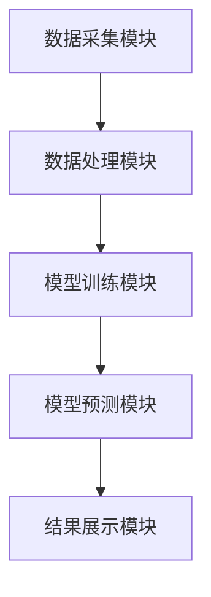
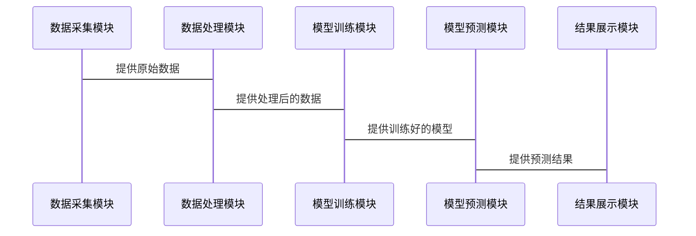

                 


# 利用AI agents构建动态市场份额预测模型：把握竞争态势

> 关键词：AI agents，市场份额预测，动态模型，竞争态势，商业分析，强化学习

> 摘要：本文深入探讨了利用AI agents构建动态市场份额预测模型的方法，结合理论分析和实际案例，详细讲解了AI agents在商业预测中的应用。通过分析AI agents的核心原理和市场份额预测模型的构建方法，本文为商业分析师和IT技术人员提供了从理论到实践的全面指导，帮助他们更好地理解和应用这一技术。

---

## 第1章：AI agents与动态市场份额预测模型概述

### 1.1 AI agents的基本概念与特点

#### 1.1.1 AI agents的定义
AI agents（人工智能代理）是指能够感知环境、做出决策并采取行动的智能实体。它们通过传感器获取信息，利用算法处理数据，并通过执行器与环境交互。AI agents可以是软件程序，也可以是机器人或其他智能设备。

#### 1.1.2 AI agents的核心特点
- **自主性**：AI agents能够在没有外部干预的情况下自主运行。
- **反应性**：能够实时感知环境变化并做出相应调整。
- **目标导向**：基于预设目标或优化目标进行决策。
- **学习能力**：通过机器学习算法不断优化自身的预测和决策能力。

#### 1.1.3 AI agents与传统算法的对比分析
| 对比维度 | 传统算法 | AI agents |
|----------|----------|------------|
| 决策方式 | 基于规则或固定模型 | 基于实时数据和动态调整 |
| 学习能力 | 无学习能力 | 具备学习能力，可优化决策 |
| 应用场景 | 固定场景，适应性差 | 适用于复杂动态环境，适应性强 |

### 1.2 动态市场份额预测模型的定义与特点

#### 1.2.1 市场份额预测的基本概念
市场份额预测是指通过分析市场数据，预测某产品或企业在市场中的份额占比。动态市场份额预测是指在市场环境不断变化的情况下，实时更新预测结果的过程。

#### 1.2.2 动态市场份额预测的核心要素
- **实时数据**：动态预测需要实时或高频的数据输入。
- **动态调整**：模型能够根据新数据实时更新预测结果。
- **反馈机制**：模型能够根据实际结果调整预测参数。

#### 1.2.3 动态预测与静态预测的主要区别
| 对比维度 | 静态预测 | 动态预测 |
|----------|----------|------------|
| 数据更新 | 静态数据，定期更新 | 实时数据，动态更新 |
| 预测结果 | 预测结果固定 | 预测结果动态调整 |
| 应用场景 | 适用于市场环境相对稳定的场景 | 适用于市场环境快速变化的场景 |

### 1.3 AI agents在市场份额预测中的应用前景

#### 1.3.1 AI agents在商业分析中的优势
- **实时性**：AI agents能够实时处理数据，提供实时预测。
- **准确性**：通过机器学习算法，AI agents能够提高预测的准确性。
- **适应性**：AI agents能够根据市场变化自动调整预测模型。

#### 1.3.2 动态预测模型在市场竞争中的价值
- **竞争优势**：通过动态预测，企业能够更快地发现市场机会和威胁。
- **决策优化**：动态预测能够为企业的市场策略提供科学依据。
- **成本降低**：通过动态预测，企业能够减少因市场波动带来的损失。

#### 1.3.3 企业采用AI agents的挑战与机遇
- **挑战**：数据获取难度、模型优化难度、技术门槛高。
- **机遇**：提高市场预测能力、增强企业竞争力、推动业务创新。

---

## 第2章：AI agents与市场份额预测模型的核心概念对比

### 2.1 AI agents的原理与实现机制

#### 2.1.1 基于强化学习的AI agents
强化学习是一种通过试错机制优化决策模型的算法。AI agents通过与环境交互，不断优化自身的策略，以实现目标。

#### 2.1.2 基于监督学习的AI agents
监督学习是一种基于标记数据的机器学习方法。AI agents通过学习带标签的数据，优化自身的预测能力。

#### 2.1.3 基于无监督学习的AI agents
无监督学习是一种基于无标记数据的机器学习方法。AI agents通过发现数据中的模式，优化自身的聚类能力。

### 2.2 市场份额预测模型的构建与优化

#### 2.2.1 市场份额预测的基本方法
- **时间序列分析**：通过历史数据预测未来趋势。
- **回归分析**：通过变量之间的关系预测市场份额。
- **贝叶斯网络**：通过概率推理预测市场份额。

#### 2.2.2 动态预测模型的构建步骤
1. 数据收集：收集市场数据，包括销售数据、竞争数据、经济指标等。
2. 数据预处理：清洗数据，处理缺失值、异常值等。
3. 模型训练：利用机器学习算法训练预测模型。
4. 模型优化：通过调参、交叉验证等方法优化模型性能。
5. 模型部署：将模型部署到生产环境，实时更新预测结果。

#### 2.2.3 模型优化的关键因素
- **数据质量**：数据的完整性和准确性直接影响预测结果。
- **模型选择**：选择合适的算法和模型结构。
- **特征工程**：提取有效的特征，提高模型的预测能力。

### 2.3 AI agents与市场份额预测模型的结合方式

#### 2.3.1 基于AI agents的实时预测
AI agents通过实时数据处理和实时预测，提供动态市场份额预测结果。

#### 2.3.2 基于动态模型的反馈优化
AI agents通过反馈机制优化预测模型，提高预测的准确性。

#### 2.3.3 AI agents与预测模型的协同进化
AI agents和预测模型相互促进，共同优化，形成协同进化的关系。

---

## 第3章：AI agents与市场份额预测模型的理论基础

### 3.1 AI agents的数学模型与公式

#### 3.1.1 强化学习的数学表达式
强化学习的Q-learning算法公式如下：
$$ Q(s, a) = Q(s, a) + \alpha \left[ r + \gamma \max_{a'} Q(s', a') - Q(s, a) \right] $$
其中，$Q(s, a)$表示状态$s$和动作$a$的Q值，$\alpha$表示学习率，$\gamma$表示折扣率，$r$表示奖励。

#### 3.1.2 监督学习的数学模型
线性回归模型的数学公式如下：
$$ y = \beta_0 + \beta_1 x_1 + \beta_2 x_2 + \ldots + \beta_n x_n + \epsilon $$
其中，$y$表示目标变量，$x_i$表示自变量，$\beta_i$表示回归系数，$\epsilon$表示误差项。

#### 3.1.3 聚类分析的数学公式
K-means聚类算法的目标函数为：
$$ \min_{K} \sum_{i=1}^{n} \min_{k=1}^{K} \| x_i - \mu_k \|^2 $$
其中，$x_i$表示数据点，$\mu_k$表示第$k$个聚类的中心点，$K$表示聚类数。

### 3.2 市场份额预测的数学模型与公式

#### 3.2.1 时间序列分析的数学公式
ARIMA模型的数学公式为：
$$ y_t = \phi_1 y_{t-1} + \phi_2 y_{t-2} + \ldots + \phi_p y_{t-p} + \theta_1 \epsilon_{t-1} + \ldots + \theta_q \epsilon_{t-q} + \epsilon_t $$
其中，$y_t$表示$t$时刻的预测值，$\phi_i$表示自回归系数，$\theta_i$表示移动平均系数，$\epsilon_t$表示白噪声。

#### 3.2.2 回归分析的数学模型
多元回归分析的数学公式为：
$$ y = \beta_0 + \beta_1 x_1 + \beta_2 x_2 + \ldots + \beta_k x_k + \epsilon $$
其中，$y$表示目标变量，$x_i$表示自变量，$\beta_i$表示回归系数，$\epsilon$表示误差项。

#### 3.2.3 贝叶斯网络的数学表达
贝叶斯网络的概率公式为：
$$ P(y|x) = \prod_{i=1}^{n} P(x_i|y) $$
其中，$y$表示目标变量，$x_i$表示自变量，$P(x_i|y)$表示在目标变量$y$下的条件概率。

### 3.3 AI agents与市场份额预测模型的结合公式

#### 3.3.1 动态预测的数学表达
动态预测的公式为：
$$ P(t+1) = f(P(t), D(t)) $$
其中，$P(t)$表示$t$时刻的预测值，$D(t)$表示$t$时刻的输入数据，$f$表示预测函数。

#### 3.3.2 AI agents的优化公式
AI agents的优化公式为：
$$ \theta_{t+1} = \theta_t + \alpha (r - Q(\theta_t)) $$
其中，$\theta_t$表示当前参数，$\alpha$表示学习率，$r$表示奖励，$Q(\theta_t)$表示当前Q值。

---

## 第4章：AI agents与市场份额预测模型的算法原理

### 4.1 算法原理概述

#### 4.1.1 AI agents的算法流程
1. 数据收集：通过传感器或数据库获取实时数据。
2. 数据处理：清洗数据，提取特征。
3. 模型训练：利用机器学习算法训练预测模型。
4. 模型预测：基于训练好的模型进行预测。
5. 反馈优化：根据实际结果优化模型参数。

#### 4.1.2 市场份额预测的算法流程
1. 数据预处理：清洗数据，处理缺失值和异常值。
2. 特征工程：提取有效特征，构建特征向量。
3. 模型选择：选择合适的算法，训练预测模型。
4. 模型优化：通过交叉验证和调参优化模型性能。
5. 模型部署：将模型部署到生产环境，实时更新预测结果。

### 4.2 算法实现的步骤

#### 4.2.1 数据预处理
```python
import pandas as pd
import numpy as np

# 加载数据
data = pd.read_csv('market_share.csv')

# 处理缺失值
data = data.dropna()

# 标准化数据
from sklearn.preprocessing import StandardScaler
scaler = StandardScaler()
data_scaled = scaler.fit_transform(data)
```

#### 4.2.2 特征工程
```python
# 特征选择
features = data_scaled[:, :-1]
labels = data_scaled[:, -1]

# 数据分割
from sklearn.model_selection import train_test_split
X_train, X_test, y_train, y_test = train_test_split(features, labels, test_size=0.2, random_state=42)
```

#### 4.2.3 模型训练
```python
# 训练模型
from sklearn.linear_model import LinearRegression
model = LinearRegression()
model.fit(X_train, y_train)

# 模型预测
y_pred = model.predict(X_test)
```

#### 4.2.4 模型优化
```python
# 调参优化
from sklearn.model_selection import GridSearchCV
param_grid = {'fit_intercept': [True, False], 'normalize': [True, False]}
grid_search = GridSearchCV(LinearRegression(), param_grid, cv=5)
grid_search.fit(X_train, y_train)
best_model = grid_search.best_estimator_
```

### 4.3 算法实现的代码示例

#### 4.3.1 AI agents的实现代码
```python
# 强化学习AI agent实现
import numpy as np

class AI_Agent:
    def __init__(self, state_size, action_size):
        self.state_size = state_size
        self.action_size = action_size
        self.Q = np.zeros((state_size, action_size))
        self.lr = 0.1
        self.gamma = 0.9

    def take_action(self, state):
        return np.argmax(self.Q[state, :])

    def update_Q(self, state, action, reward, next_state):
        self.Q[state, action] += self.lr * (reward + self.gamma * np.max(self.Q[next_state, :]) - self.Q[state, action])
```

#### 4.3.2 市场份额预测模型的实现代码
```python
# 动态市场份额预测模型实现
import pandas as pd
import numpy as np
from sklearn.linear_model import LinearRegression
from sklearn.model_selection import train_test_split

class MarketSharePredictor:
    def __init__(self):
        self.model = LinearRegression()
        self.scaler = StandardScaler()

    def fit(self, X, y):
        self.scaler.fit(X)
        X_scaled = self.scaler.transform(X)
        self.model.fit(X_scaled, y)

    def predict(self, X):
        X_scaled = self.scaler.transform(X)
        return self.model.predict(X_scaled)
```

---

## 第5章：AI agents与市场份额预测模型的系统架构设计

### 5.1 系统功能设计

#### 5.1.1 功能模块划分
- 数据采集模块：负责采集市场数据。
- 数据处理模块：负责数据预处理和特征工程。
- 模型训练模块：负责训练和优化预测模型。
- 模型预测模块：负责实时预测市场份额。
- 结果展示模块：负责展示预测结果和分析报告。

#### 5.1.2 功能模块之间的关系
- 数据采集模块向数据处理模块提供原始数据。
- 数据处理模块向模型训练模块提供处理后的数据。
- 模型训练模块向模型预测模块提供训练好的模型。
- 模型预测模块向结果展示模块提供预测结果。

### 5.2 系统架构设计

#### 5.2.1 系统架构图


#### 5.2.2 系统功能模块的实现
- 数据采集模块：使用API接口或数据库连接获取实时数据。
- 数据处理模块：使用Pandas和NumPy进行数据清洗和特征工程。
- 模型训练模块：使用Scikit-learn或TensorFlow训练预测模型。
- 模型预测模块：使用训练好的模型进行实时预测。
- 结果展示模块：使用可视化工具展示预测结果和分析报告。

### 5.3 系统接口设计

#### 5.3.1 数据接口
- 数据输入接口：接收原始数据。
- 数据输出接口：输出处理后的数据。

#### 5.3.2 模型接口
- 模型输入接口：接收特征向量。
- 模型输出接口：输出预测结果。

### 5.4 系统交互流程

#### 5.4.1 系统交互流程图


---

## 第6章：AI agents与市场份额预测模型的项目实战

### 6.1 项目环境搭建

#### 6.1.1 开发环境
- 操作系统：Linux/MacOS/Windows
- 编程语言：Python 3.8+
- 开发工具：Jupyter Notebook或PyCharm
- 依赖库：NumPy、Pandas、Scikit-learn、TensorFlow

#### 6.1.2 环境搭建步骤
```bash
pip install numpy pandas scikit-learn tensorflow
```

### 6.2 项目核心实现

#### 6.2.1 数据处理代码
```python
import pandas as pd
import numpy as np
from sklearn.preprocessing import StandardScaler

# 加载数据
data = pd.read_csv('market_share.csv')

# 处理缺失值
data = data.dropna()

# 标准化数据
scaler = StandardScaler()
data_scaled = scaler.fit_transform(data)
```

#### 6.2.2 模型实现代码
```python
from sklearn.linear_model import LinearRegression
from sklearn.model_selection import train_test_split

# 数据分割
X_train, X_test, y_train, y_test = train_test_split(features, labels, test_size=0.2, random_state=42)

# 训练模型
model = LinearRegression()
model.fit(X_train, y_train)

# 模型预测
y_pred = model.predict(X_test)
```

#### 6.2.3 优化代码
```python
from sklearn.model_selection import GridSearchCV

# 调参优化
param_grid = {'fit_intercept': [True, False], 'normalize': [True, False]}
grid_search = GridSearchCV(LinearRegression(), param_grid, cv=5)
grid_search.fit(X_train, y_train)
best_model = grid_search.best_estimator_
```

### 6.3 项目实战案例分析

#### 6.3.1 案例背景
假设我们有一个电子产品市场，我们需要预测某款手机在市场中的份额占比。

#### 6.3.2 数据分析
通过对历史销售数据、竞争对手数据、经济指标等进行分析，提取有效的特征。

#### 6.3.3 模型实现
使用线性回归模型进行训练和预测，优化模型参数，提高预测的准确性。

#### 6.3.4 模型优化
通过交叉验证和调参优化，找到最佳模型参数，提高预测的准确率。

#### 6.3.5 模型评估
通过均方误差（MSE）、平均绝对误差（MAE）等指标评估模型的性能。

---

## 第7章：AI agents与市场份额预测模型的最佳实践

### 7.1 实战经验总结

#### 7.1.1 小结
通过项目实战，我们掌握了AI agents与动态市场份额预测模型的实现方法，提高了模型的预测准确性。

#### 7.1.2 注意事项
- 数据质量直接影响预测结果，需确保数据的完整性和准确性。
- 模型选择和调参是关键，需根据实际场景选择合适的算法。
- 模型优化是一个持续的过程，需不断监控和调整模型参数。

### 7.2 项目注意事项

#### 7.2.1 数据处理注意事项
- 数据清洗是关键，需处理缺失值和异常值。
- 特征工程是提高模型性能的重要手段，需提取有效的特征。

#### 7.2.2 模型优化注意事项
- 调参是优化模型性能的重要步骤，需结合实际场景选择合适的参数。
- 模型评估是优化的重要环节，需选择合适的评估指标。

### 7.3 未来研究方向

#### 7.3.1 AI agents与市场份额预测的结合
AI agents与动态市场份额预测模型的结合是未来研究的重要方向，需进一步探索其在商业中的应用。

#### 7.3.2 深度学习在市场份额预测中的应用
深度学习算法在市场份额预测中具有潜力，需进一步研究其应用。

#### 7.3.3 多模态数据的整合与分析
多模态数据的整合与分析是未来研究的另一个重要方向，需进一步探索其在市场份额预测中的应用。

---

## 第8章：总结与展望

### 8.1 总结
本文深入探讨了AI agents与动态市场份额预测模型的结合方法，通过理论分析和实际案例，详细讲解了AI agents在商业预测中的应用。我们通过分析AI agents的核心原理和市场份额预测模型的构建方法，为商业分析师和IT技术人员提供了从理论到实践的全面指导。

### 8.2 展望
未来，随着AI技术的不断发展，AI agents与动态市场份额预测模型的结合将更加紧密。我们需要进一步研究其在商业中的应用，探索新的技术和方法，推动商业预测技术的发展。

---

通过本文的深入分析，我们不仅掌握了AI agents与动态市场份额预测模型的实现方法，还为未来的商业预测技术研究提供了重要的参考和指导。希望本文能够为读者在AI技术与商业分析领域提供有价值的帮助。

