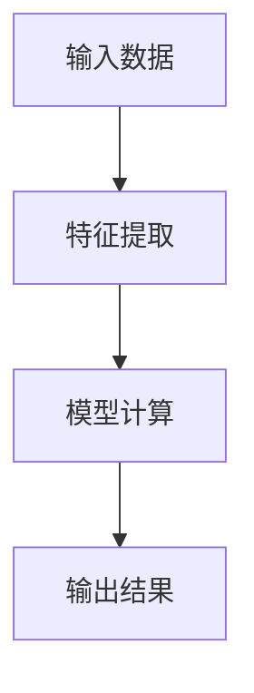

                 


# 利用AI agents构建动态竞争优势评估模型：护城河分析

> 关键词：AI代理，竞争优势评估模型，护城河分析，动态评估，企业战略，商业分析

> 摘要：本文详细探讨了如何利用AI代理构建动态竞争优势评估模型，并通过护城河分析为企业提供战略支持。文章从AI代理的核心原理出发，分析竞争优势模型的构建方法，并结合实际案例，展示如何利用护城河分析框架为企业构建动态竞争优势评估模型。通过数学公式、算法流程图和系统架构设计，本文为企业提供了一套完整的解决方案，帮助企业在复杂多变的市场环境中保持竞争优势。

---

# 第一部分: 利用AI代理构建竞争优势评估模型的背景与基础

## 第1章: AI代理与竞争优势评估模型概述

### 1.1 AI代理的核心概念与背景

#### 1.1.1 AI代理的基本定义与特点
AI代理（Artificial Intelligence Agents）是指具有感知环境、自主决策和执行任务能力的智能体。AI代理的核心特点包括：
- **自主性**：能够自主决策和执行任务。
- **反应性**：能够实时感知环境并做出反应。
- **目标导向性**：基于目标驱动行为。
- **学习能力**：能够通过数据和经验进行优化和改进。

#### 1.1.2 竞争优势评估模型的背景与意义
竞争优势评估模型是帮助企业识别和评估其在市场中的竞争优势的工具。随着市场竞争的加剧，企业需要动态评估自身的竞争优势，以应对市场变化。AI代理的引入，使得竞争优势评估模型更加智能化和动态化。

#### 1.1.3 护城河分析在商业战略中的作用
护城河分析是企业战略管理中的重要方法，用于评估企业在市场中的竞争优势和防御能力。通过AI代理，护城河分析能够实时更新数据，帮助企业更好地识别和强化竞争优势。

---

## 第2章: AI代理与竞争优势评估模型的核心概念

### 2.1 AI代理的核心原理与技术

#### 2.1.1 AI代理的定义与分类
AI代理可以分为以下几类：
- **简单反射代理**：基于当前输入做出反应，不涉及复杂推理。
- **基于模型的反射代理**：通过内部模型进行推理和决策。
- **目标驱动代理**：基于目标驱动行为。
- **学习代理**：通过机器学习算法不断优化行为。

#### 2.1.2 竞争优势评估模型的构建原理
竞争优势评估模型的核心原理包括：
- **数据输入**：收集企业内外部数据。
- **特征提取**：提取关键竞争优势特征。
- **模型计算**：通过算法计算竞争优势指数。
- **结果输出**：输出竞争优势评估结果。

#### 2.1.3 护城河分析的AI驱动模式
护城河分析的AI驱动模式包括以下步骤：
1. 数据采集：收集企业内外部数据。
2. 数据处理：清洗和预处理数据。
3. 护城河宽度计算：基于数据计算护城河宽度。
4. 动态更新：实时更新护城河宽度。

---

## 第3章: 竞争优势评估模型的算法原理与数学模型

### 3.1 竞争优势评估模型的算法概述

#### 3.1.1 竞争优势指数的计算公式
竞争优势指数（Competitive Advantage Index，CAI）的计算公式如下：
$$ CAI = \frac{\sum_{i=1}^{n} w_i x_i}{\sum_{i=1}^{n} w_i} $$
其中，$w_i$ 是第 $i$ 个竞争优势特征的权重，$x_i$ 是第 $i$ 个竞争优势特征的值。

#### 3.1.2 动态竞争优势的更新公式
动态竞争优势的更新公式如下：
$$ C_{new} = C_{old} \times (1 + \alpha \times \Delta t) $$
其中，$\alpha$ 是更新速率，$\Delta t$ 是时间步长。

#### 3.1.3 护城河宽度的量化公式
护城河宽度的量化公式如下：
$$ H = \sum_{i=1}^{m} f_i \times w_i $$
其中，$f_i$ 是第 $i$ 个护城河特征的重要性，$w_i$ 是第 $i$ 个护城河特征的权重。

### 3.2 算法实现的流程图
以下是竞争优势评估模型的算法流程图：



---

## 第4章: 竞争优势评估模型的系统架构与实现

### 4.1 系统功能模块划分

#### 4.1.1 数据采集模块
数据采集模块负责收集企业内外部数据，包括竞争对手数据、市场数据和企业内部数据。

#### 4.1.2 特征提取模块
特征提取模块基于收集的数据，提取关键竞争优势特征，例如市场份额、产品质量、品牌影响力等。

#### 4.1.3 模型计算模块
模型计算模块基于提取的特征，计算竞争优势指数和护城河宽度。

#### 4.1.4 结果展示模块
结果展示模块将计算结果以可视化形式展示，帮助企业管理者更好地理解和应用评估结果。

---

## 第5章: 竞争优势评估模型的项目实战

### 5.1 环境安装
为了实现竞争优势评估模型，首先需要安装以下环境：
- Python 3.8+
- NumPy
- Pandas
- Scikit-learn
- Mermaid

### 5.2 核心代码实现

#### 5.2.1 数据采集与处理
以下是数据采集与处理的Python代码：
```python
import pandas as pd
import numpy as np

# 数据采集
data = pd.read_csv('competitor_data.csv')

# 数据清洗
data.dropna(inplace=True)
data['市场份额'] = data['市场份额'].astype(float)
```

#### 5.2.2 竞争优势评估模型实现
以下是竞争优势评估模型的实现代码：
```python
def calculate_cai(features, weights):
    weighted_sum = np.sum(features * weights)
    total_weight = np.sum(weights)
    return weighted_sum / total_weight

# 示例数据
features = np.array([0.8, 0.6, 0.9])
weights = np.array([0.3, 0.5, 0.2])

# 计算竞争优势指数
cai = calculate_cai(features, weights)
print(f"竞争优势指数: {cai}")
```

#### 5.2.3 护城河分析实现
以下是护城河分析的实现代码：
```python
def calculate_h_width(features, weights):
    return np.sum(features * weights)

# 示例数据
features = np.array([0.8, 0.6, 0.9])
weights = np.array([0.3, 0.5, 0.2])

# 计算护城河宽度
h_width = calculate_h_width(features, weights)
print(f"护城河宽度: {h_width}")
```

### 5.3 案例分析
以一家科技公司为例，假设其竞争优势特征为市场份额（0.8）、产品质量（0.6）、品牌影响力（0.9），权重分别为0.3、0.5、0.2。计算其竞争优势指数和护城河宽度：
```python
# 计算竞争优势指数
cai = calculate_cai(features, weights)
print(f"竞争优势指数: {cai}")

# 计算护城河宽度
h_width = calculate_h_width(features, weights)
print(f"护城河宽度: {h_width}")
```

---

## 第6章: 竞争优势评估模型的扩展与优化

### 6.1 未来发展趋势
竞争优势评估模型的未来发展趋势包括：
- **实时更新**：基于实时数据动态评估竞争优势。
- **多维度分析**：结合更多维度的数据进行分析。
- **智能化决策**：基于AI代理实现智能化决策支持。

### 6.2 注意事项
在实际应用中，需要注意以下几点：
- **数据质量**：确保数据的准确性和完整性。
- **模型优化**：定期优化模型以适应市场变化。
- **风险管理**：制定风险管理策略，应对模型失效的风险。

---

# 结语

通过本文的详细讲解，读者可以了解到如何利用AI代理构建动态竞争优势评估模型，并通过护城河分析为企业提供战略支持。本文结合理论与实践，提供了完整的解决方案，帮助企业更好地应对市场竞争。

--- 

以上是文章的完整目录结构和内容框架，您可以根据需要进一步扩展每个章节的具体内容。

