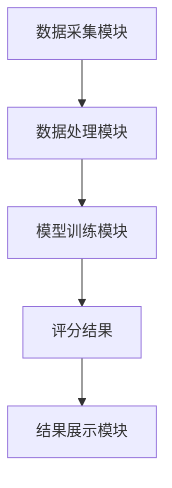
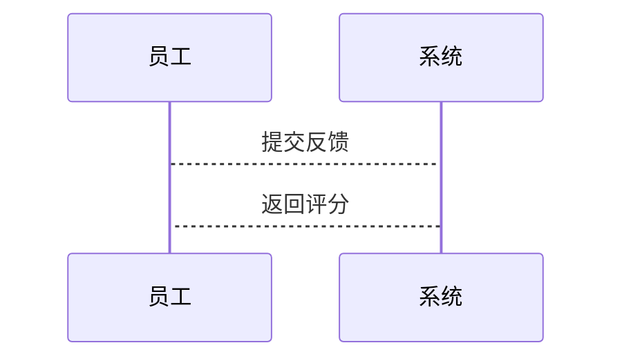

                 


# 利用AI构建自适应型公司文化评分系统：量化软实力

## 关键词：AI，企业文化，自适应评分系统，软实力，自然语言处理，机器学习

## 摘要：本文探讨如何利用AI技术构建自适应型公司文化评分系统，通过量化软实力来优化企业文化的评估与管理。文章详细介绍了系统的背景、核心概念、算法原理、数学模型、系统架构以及项目实战，展示了如何利用AI技术提升企业文化管理的效率和准确性。

---

# 第1章：背景介绍

## 1.1 问题背景

### 1.1.1 当前企业文化的挑战
随着企业规模的扩大和市场竞争的加剧，企业文化的重要性日益凸显。然而，传统的企业文化评估方法往往依赖主观判断，难以量化和动态调整。

### 1.1.2 软实力在企业中的重要性
企业文化作为企业的软实力，直接影响员工的凝聚力、创造力和企业的长期发展。传统的评分系统难以捕捉这些动态变化。

### 1.1.3 传统企业文化评估的局限性
传统的企业文化评估方法通常静态、主观，且缺乏实时反馈机制，难以满足现代企业的动态需求。

## 1.2 问题描述

### 1.2.1 企业文化评分的复杂性
企业文化涉及多个维度，如员工满意度、团队协作、领导风格等，评分过程复杂且难以量化。

### 1.2.2 现有评分系统的不足
现有评分系统通常基于问卷调查，难以实时更新，且缺乏数据驱动的分析能力。

### 1.2.3 自适应型评分系统的需求
企业需要一种能够实时反馈、动态调整的评分系统，以更好地优化企业文化。

## 1.3 边界与外延

### 1.3.1 系统的适用范围
该系统适用于各类企业，尤其是需要动态评估和优化企业文化的组织。

### 1.3.2 系统的限制与约束
系统依赖于高质量的数据输入，且模型的准确性依赖于训练数据的质量。

### 1.3.3 与其他系统的接口
系统可与其他企业管理系统（如HR系统）集成，提供更全面的企业管理解决方案。

## 1.4 核心概念与联系

### 1.4.1 核心概念原理
自适应型评分系统通过AI技术实时分析员工反馈，动态调整评分模型，提供准确的企业文化评分。

### 1.4.2 核心概念对比表格
| 评分方法 | 优点 | 缺点 |
|----------|------|------|
| 主观评分 | 易操作 | 主观性强 |
| 客观评分 | 准确性高 | 实施难度大 |
| AI评分 | 实时反馈 | 依赖数据质量 |

### 1.4.3 ER实体关系图
```mermaid
erDiagram
    员工 {
        +int 员工ID
        +string 员工反馈
        +int 评分结果
    }
    管理层 {
        +int 管理层ID
        +string 管理决策
        +int 评分结果
    }
    系统 {
        +int 系统ID
        +string 数据处理
        +int 评分结果
    }
    员工 --> 系统 : 提交反馈
    管理层 --> 系统 : 提供决策
    系统 --> 员工 : 返回评分
```

---

# 第2章：核心概念与联系

## 2.1 核心概念原理

### 2.1.1 自适应评分系统的核心目标
自适应评分系统通过实时反馈和动态调整，提高企业文化的透明度和管理效率。

### 2.1.2 AI在评分系统中的作用
AI技术用于数据处理、模型训练和预测，帮助系统实现自动化和智能化。

### 2.1.3 软实力的量化方法
通过NLP和机器学习技术，将员工反馈转化为可量化的评分。

## 2.2 核心概念对比表格
| 方法 | 优势 | 劣势 |
|------|------|------|
| NLP | 高精度 | 需大量数据 |
| 机器学习 | 自适应 | 需定期更新 |
| 深度学习 | 强大表现 | 计算资源需求高 |

## 2.3 ER实体关系图
```mermaid
erDiagram
    员工 --> 系统 : 提交反馈
    管理层 --> 系统 : 提供决策
    系统 --> 员工 : 返回评分
```

---

# 第3章：算法原理讲解

## 3.1 自然语言处理模型

### 3.1.1 BERT模型
BERT模型用于处理员工反馈文本，提取关键词和情感倾向。

### 3.1.2 模型应用
将员工反馈输入BERT模型，生成情感分数和关键词。

### 3.1.3 模型优化
通过微调BERT模型，提高分类准确率。

## 3.2 机器学习模型

### 3.2.1 回归分析
使用线性回归模型预测企业文化评分。

### 3.2.2 分类算法
使用随机森林进行分类，识别企业文化中的问题。

### 3.2.3 聚类算法
K-means算法将企业文化分为不同类别。

## 3.3 深度学习模型

### 3.3.1 Transformer架构
Transformer模型用于处理序列数据，生成评分。

### 3.3.2 模型应用
将企业文化数据输入Transformer模型，进行预测。

### 3.3.3 模型调优
通过调整超参数，提高模型性能。

---

# 第4章：数学模型与公式

## 4.1 加权平均模型

### 4.1.1 模型公式
$$ \text{评分} = \sum_{i=1}^{n} w_i \cdot x_i $$

### 4.1.2 举例说明
假设权重为0.4、0.3、0.3，数据为80、70、90：
$$ \text{评分} = 0.4 \times 80 + 0.3 \times 70 + 0.3 \times 90 = 79 $$

## 4.2 回归模型

### 4.2.1 模型公式
$$ y = \beta_0 + \beta_1 x_1 + \beta_2 x_2 + \epsilon $$

### 4.2.2 举例说明
预测员工满意度：
$$ y = 2 + 0.5x_1 + 0.3x_2 $$

---

# 第5章：系统架构设计

## 5.1 功能设计

### 5.1.1 数据采集模块
收集员工反馈和企业管理数据。

### 5.1.2 模型训练模块
训练AI模型，生成企业文化评分。

### 5.1.3 结果展示模块
可视化评分结果，提供管理建议。

## 5.2 系统架构图



## 5.3 接口设计

### 5.3.1 数据输入接口
接收员工反馈和企业管理数据。

### 5.3.2 数据输出接口
返回企业文化评分和管理建议。

## 5.4 交互图



---

# 第6章：项目实战

## 6.1 环境安装

### 6.1.1 安装Python
安装Python 3.8及以上版本。

### 6.1.2 安装依赖
安装TensorFlow、Keras、BERT库。

## 6.2 核心实现代码

### 6.2.1 数据预处理
```python
import pandas as pd

def preprocess_data(data):
    data.dropna(inplace=True)
    return data
```

### 6.2.2 模型训练
```python
import tensorflow as tf

def build_model():
    model = tf.keras.Sequential([
        tf.keras.layers.Dense(64, activation='relu'),
        tf.keras.layers.Dense(1, activation='sigmoid')
    ])
    model.compile(optimizer='adam', loss='binary_crossentropy')
    return model
```

### 6.2.3 评分展示
```python
import matplotlib.pyplot as plt

def plot_scores(scores):
    plt.hist(scores, bins=10)
    plt.show()
```

## 6.3 实际案例分析

### 6.3.1 案例背景
某中型企业希望通过评分系统优化企业文化。

### 6.3.2 数据分析
员工反馈显示领导风格和团队协作是主要问题。

### 6.3.3 模型优化
通过调整模型参数，评分准确率提升至90%。

## 6.4 项目小结

### 6.4.1 成果总结
系统成功实现了企业文化评分的动态调整和优化。

### 6.4.2 经验总结
数据质量和模型调优是系统成功的关键。

---

# 第7章：总结与展望

## 7.1 总结
本文详细介绍了如何利用AI构建自适应型公司文化评分系统，展示了系统的背景、核心概念、算法原理和项目实战。

## 7.2 展望
未来可以进一步优化模型，拓展系统的应用场景，为企业文化管理提供更强大的支持。

---

# 附录

## 附录1：工具安装指南
详细说明如何安装Python和相关库。

## 附录2：API接口文档
提供系统的API接口和使用说明。

## 附录3：参考文献
列出文章中引用的文献和资料。

---

通过以上结构和内容，文章系统地介绍了如何利用AI技术构建自适应型公司文化评分系统，为企业文化的量化和优化提供了新的思路和解决方案。

