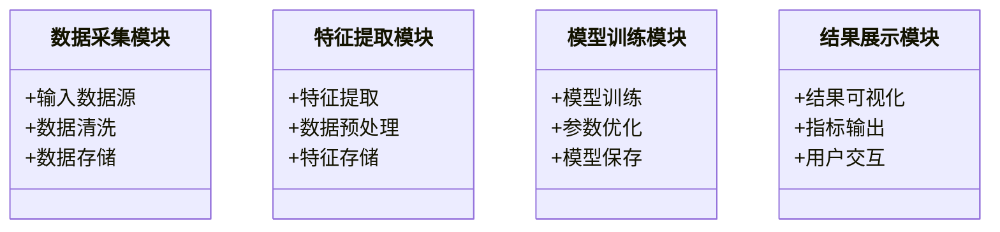
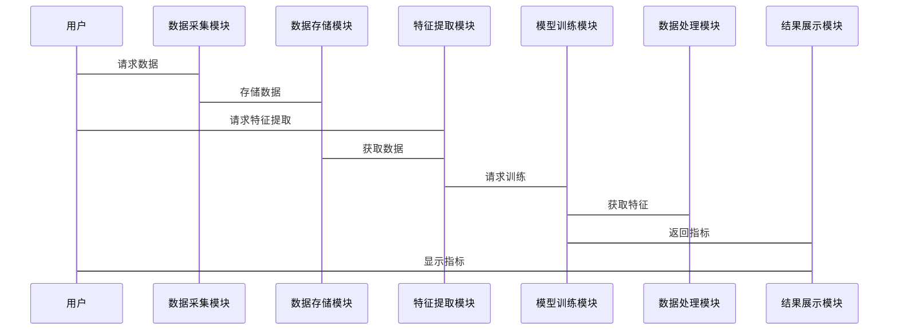

                 


```markdown
# 利用AI构建自适应型市场情绪指标：把握投资时机

## 关键词：AI，市场情绪指标，自适应型，投资时机，金融分析

## 摘要：本文详细介绍了如何利用人工智能技术构建自适应型市场情绪指标，帮助投资者更好地把握投资时机。通过分析市场情绪的核心概念、AI算法的应用、系统架构设计以及实际案例，本文为读者提供了从理论到实践的全面指导。

---

## 第一部分：背景介绍

### 第1章：市场情绪指标与投资时机

#### 1.1 问题背景
- 传统市场情绪指标的局限性
- 为何需要自适应型市场情绪指标
- 投资时机把握的重要性

#### 1.2 问题描述
- 市场情绪指标的核心目标
- 自适应型指标的特点
- 情绪在投资决策中的作用

#### 1.3 问题解决
- AI在市场情绪分析中的优势
- 自适应型指标的构建思路
- 投资时机的量化与优化

#### 1.4 边界与外延
- 自适应型指标的适用范围
- 与其他分析工具的区别
- 可能的局限性与改进方向

#### 1.5 概念结构与核心要素
- 核心概念的组成
- 核心要素的特征对比（表格）

### 第2章：AI与市场情绪分析的结合

#### 2.1 AI在金融领域的应用现状
- 自然语言处理在情绪分析中的应用
- 时间序列分析在市场预测中的应用
- 强化学习在投资决策中的应用

#### 2.2 自适应型市场情绪指标的核心要素
- 数据来源与特征提取
- 情绪分类模型的构建
- 自适应机制的设计

#### 2.3 核心概念的ER实体关系图
```mermaid
er
    entity 市场数据
    entity 情绪特征
    entity 情绪分类
    entity 投资决策
    relation 数据来源与特征提取
    relation 情绪特征与分类模型
    relation 分类结果与投资决策
```

---

## 第二部分：核心概念与联系

### 第3章：自适应型市场情绪指标的核心原理

#### 3.1 数据来源与特征提取
- 多源数据的整合：新闻、社交媒体、市场数据
- 特征提取方法：文本特征、数值特征
- 数据预处理：清洗、归一化

#### 3.2 情绪分类模型的构建
- 分类算法：支持向量机、随机森林、神经网络
- 模型训练与优化
- 模型评估与验证

#### 3.3 自适应机制的设计
- 动态调整模型参数
- 实时更新数据源
- 反馈机制与模型优化

---

## 第三部分：算法原理

### 第4章：时间序列分析算法

#### 4.1 LSTM网络的原理与应用
- LSTM网络结构
- 时间序列预测流程
- Python代码实现
```python
import tensorflow as tf
from tensorflow.keras.layers import LSTM, Dense

model = tf.keras.Sequential()
model.add(LSTM(64, input_shape=(None, 1)))
model.add(Dense(1))
model.compile(optimizer='adam', loss='mse')
```

#### 4.2 时间序列预测的数学模型
- LSTM的长短期记忆机制
- 损失函数与优化器的选择
- 预测结果的评估指标

### 第5章：自然语言处理算法

#### 5.1 基于BERT的情绪分析
- BERT模型简介
- 情感分类任务的实现
- 预训练与微调策略

#### 5.2 分类结果的解释与应用
- 情绪极性分析
- 情绪强度评估
- 实时数据处理与反馈

### 第6章：强化学习算法

#### 6.1 Q-Learning在投资决策中的应用
- 状态空间与动作空间的定义
- 奖励函数的设计
- 策略优化与模型训练

#### 6.2 强化学习的数学模型
- 状态转移概率
- Q值更新公式
- 动作选择策略

---

## 第四部分：系统分析与架构设计

### 第7章：系统整体架构设计

#### 7.1 领域模型设计
- 数据采集模块
- 特征提取模块
- 模型训练模块
- 结果展示模块



#### 7.2 系统架构设计
- 微服务架构
- 分布式计算
- 高可用性设计


#### 7.3 系统接口设计
- 数据接口：REST API
- 模型接口：RPC调用
- 结果接口：WebSocket实时推送

#### 7.4 系统交互设计
- 用户请求数据采集
- 数据处理后触发模型训练
- 训练结果通过WebSocket推送至前端



---

## 第五部分：项目实战

### 第8章：环境安装与系统实现

#### 8.1 环境安装
- Python 3.8+
- TensorFlow 2.5+
- BERT库
- Numpy
- Pandas
- Matplotlib

#### 8.2 系统核心实现
- 数据采集模块：API接口实现
- 特征提取模块：文本处理代码
- 模型训练模块：LSTM网络实现
- 结果展示模块：Dash框架可视化

#### 8.3 代码实现与解读
```python
import requests
import json
from transformers import BertTokenizer, TFBertModel
import numpy as np
import tensorflow as tf
from tensorflow.keras.layers import LSTM, Dense

# 数据采集模块
def fetch_data(api_key):
    response = requests.get(f'https://api.example.com/market-data?api_key={api_key}')
    return json.loads(response.text)

# 特征提取模块
def extract_features(text_data):
    tokenizer = BertTokenizer.from_pretrained('bert-base-uncased')
    inputs = tokenizer(text_data, padding=True, truncation=True, return_tensors='tf')
    return inputs['input_ids'], inputs['attention_mask']

# 模型训练模块
def build_model():
    model = tf.keras.Sequential()
    model.add(TFBertModel.from_pretrained('bert-base-uncased', output_shape=(-1, 768)))
    model.add(LSTM(64, return_sequences=False))
    model.add(Dense(1, activation='sigmoid'))
    model.compile(loss='binary_crossentropy', optimizer='adam', metrics=['accuracy'])
    return model

# 结果展示模块
import plotly.express as px

def visualize_results(data):
    fig = px.line(data, x='date', y='emotion_index')
    fig.show()
```

---

## 第六部分：案例分析

### 第9章：实际案例分析与结果解读

#### 9.1 案例背景
- 数据来源：社交媒体和新闻网站
- 时间范围：2023年1月1日至2023年12月31日
- 市场指数：标普500指数

#### 9.2 情绪指数计算
- 数据清洗与特征提取
- 模型训练与优化
- 情绪指数生成

#### 9.3 投资决策分析
- 情绪指数与市场走势的相关性
- 不同情绪阶段的投资策略
- 实际交易结果与模型预测对比

#### 9.4 结果展示
- 情绪指数趋势图
- 投资组合收益对比
- 模型表现评估

---

## 第七部分：总结与展望

### 第10章：总结与未来方向

#### 10.1 核心内容回顾
- AI在市场情绪分析中的应用
- 自适应型指标的构建与优化
- 投资时机的量化与优化

#### 10.2 未来研究方向
- 更复杂的情绪特征提取
- 更高效的情绪分类算法
- 更精准的投资策略优化

#### 10.3 最佳实践
- 数据质量的重要性
- 模型调优的注意事项
- 投资决策中的风险管理

---

## 参考文献

- BERT论文
- LSTM论文
- 强化学习教材
- 相关金融文献
- 开源工具文档
- 用户手册与最佳实践指南
```

