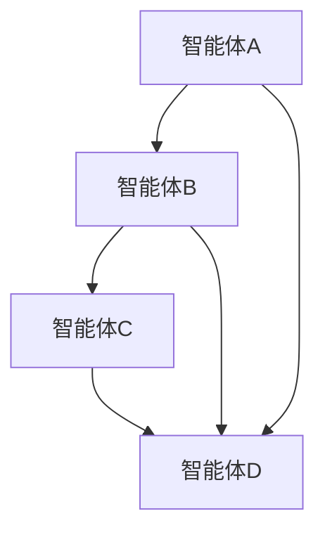
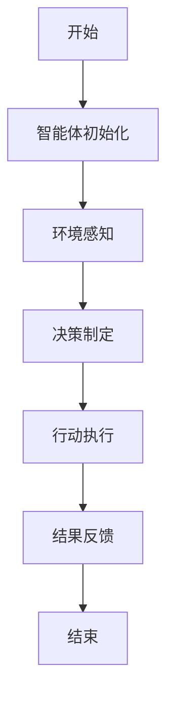
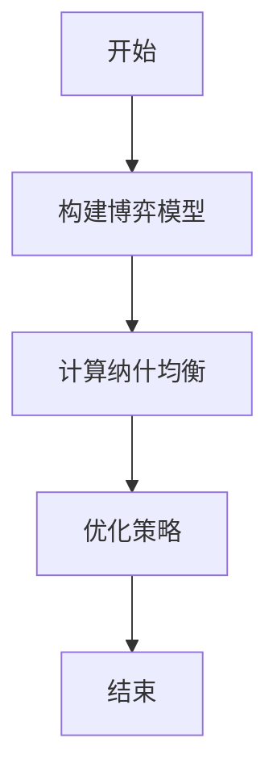
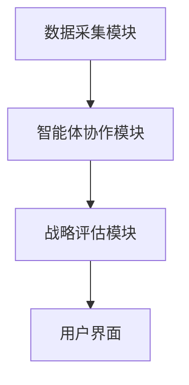
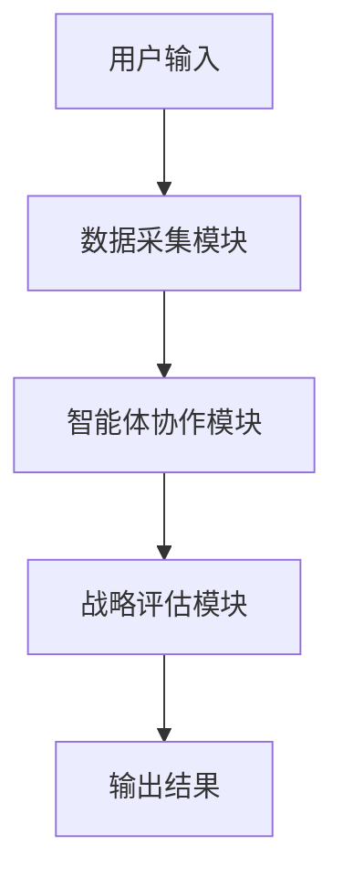

                 


# 利用多智能体AI优化公司扩张战略评估

---

## 关键词

- 多智能体AI
- 公司扩张战略
- 战略评估
- 博弈论模型
- AI算法优化

---

## 摘要

随着全球化和市场化的深入，企业扩张战略的复杂性不断增加。传统的战略评估方法往往依赖于经验判断和单一维度的分析，难以应对多变的市场环境和复杂的竞争格局。多智能体AI作为一种新兴的人工智能技术，通过模拟多个智能体之间的协作与博弈，能够更全面地分析市场动态和潜在风险，从而为公司扩张战略的优化提供科学依据。本文将从多智能体AI的基本概念、算法原理、数学模型、系统设计等多个维度展开，深入探讨如何利用多智能体AI优化公司扩张战略评估。

---

## 第1章: 多智能体AI与公司扩张战略评估的背景介绍

### 1.1 多智能体AI的基本概念

#### 1.1.1 多智能体AI的定义

多智能体AI（Multi-Agent AI）是指由多个具有独立决策能力的智能体组成的系统，这些智能体能够通过协作与竞争，共同完成复杂任务。多智能体AI的核心在于智能体之间的互动和信息共享，以及在动态环境中实现目标的能力。

#### 1.1.2 多智能体AI的核心要素

| 核心要素 | 描述 |
|----------|------|
| 智能体   | 具有感知、决策和执行能力的独立实体 |
| 协作机制 | 智能体之间的互动规则和策略 |
| 动态环境 | 系统运行过程中不断变化的外部条件 |
| 目标函数 | 智能体追求的优化目标 |

#### 1.1.3 多智能体AI与传统AI的区别

| 特性      | 多智能体AI                     | 传统AI                       |
|-----------|-------------------------------|------------------------------|
| 智能体数量 | 多个                          | 单个或少量                   |
| 互动性     | 高                           | 低                           |
| 任务复杂性 | 高复杂性，涉及协作与竞争      | 较低复杂性，任务相对单一       |

### 1.2 公司扩张战略评估的背景与挑战

#### 1.2.1 公司扩张战略的基本概念

公司扩张战略是指企业在现有业务基础上，通过并购、市场扩展、产品线延伸等方式，扩大业务规模和市场影响力的战略。这种战略的核心在于识别潜在的扩张机会，评估扩张风险，并制定最优的扩张方案。

#### 1.2.2 公司扩张战略评估的难点

| 难点       | 描述                         |
|------------|------------------------------|
| 市场不确定性 | 行业竞争、政策变化等不可预测因素 |
| 资源分配   | 如何在多个扩张机会中分配有限资源 |
| 战略协同性  | 不同业务部门之间的协同效应问题 |
| 风险评估   | 如何量化和控制扩张带来的风险   |

#### 1.2.3 多智能体AI在公司扩张战略评估中的作用

多智能体AI能够模拟不同市场参与者（如竞争对手、合作伙伴、消费者）的行为，分析其对扩张战略的影响，从而帮助企业制定更具前瞻性的决策。例如，通过模拟并购后的协同效应，企业可以评估不同并购方案的优劣。

### 1.3 本章小结

本章介绍了多智能体AI的基本概念和核心要素，并分析了公司扩张战略评估的难点。通过对比传统AI和多智能体AI的特点，我们展示了多智能体AI在公司扩张战略评估中的独特优势。

---

## 第2章: 多智能体AI的核心概念与原理

### 2.1 多智能体系统的基本结构

#### 2.1.1 实体与关系

多智能体系统由多个智能体组成，这些智能体之间通过信息共享和协作形成复杂的实体关系。例如，在公司扩张战略评估中，可以将不同业务部门视为独立的智能体，分析它们之间的协同效应。

#### 2.1.2 实体的属性与行为

| 属性     | 描述                     |
|----------|--------------------------|
| 目标     | 智能体追求的具体目标     |
| 知识库   | 智能体掌握的信息和知识     |
| 行为规则 | 智能体在特定情况下的决策规则 |

#### 2.1.3 实体之间的关系

- **协作关系**：智能体之间通过协作实现共同目标。
- **竞争关系**：智能体之间存在竞争，追求自身目标的最大化。
- **中立关系**：智能体之间既不协作也不竞争。

### 2.2 多智能体AI的协作机制

#### 2.2.1 协作机制的选择

| 协作机制 | 描述                     |
|----------|--------------------------|
| 分层协作 | 将智能体划分为不同层次，逐层协作 |
| 平等协作 | 智能体之间地位平等，共同决策 |
| 基于任务协作 | 根据任务需求动态调整协作方式 |

#### 2.2.2 协作的实现方式



### 2.3 多智能体AI的博弈论模型

#### 2.3.1 博弈论的基本概念

博弈论研究的是多个参与者在冲突或合作情境中的决策过程。多智能体AI中的博弈论模型主要用于模拟不同智能体之间的互动。

#### 2.3.2 博弈论在多智能体AI中的应用

- **纳什均衡**：所有智能体都采取最优策略，使得任何单个智能体都无法通过单方面改变策略而获得更好的结果。
- **帕累托最优**：一种状态，使得没有任何一个智能体的境况变好，同时至少有一个智能体的境况变坏。

#### 2.3.3 博弈论模型的优缺点

| 特性       | 优点               | 缺点               |
|------------|--------------------|--------------------|
| 分析深度   | 能够深入分析智能体之间的互动关系 | 计算复杂度高       |
| 应用范围   | 适用于多种场景，如市场竞争分析     | 需要假设智能体的理性行为 |

### 2.4 本章小结

本章详细讲解了多智能体AI的核心概念，包括实体关系、协作机制和博弈论模型。通过对比不同协作机制的特点，我们为后续的算法设计奠定了基础。

---

## 第3章: 多智能体AI的算法原理

### 3.1 多智能体AI的算法原理

#### 3.1.1 多智能体AI的基本算法



#### 3.1.2 多智能体AI的协作算法

```python
def collaborate_agents(agents):
    for agent in agents:
        agent.receive_information()
        agent.make_decision()
    return agents' decisions
```

#### 3.1.3 多智能体AI的博弈论算法



### 3.2 多智能体AI的数学模型与公式

#### 3.2.1 多智能体AI的收益函数

$$收益 = \sum_{i=1}^{n} \text{收益}_i$$

#### 3.2.2 多智能体AI的成本函数

$$成本 = \sum_{i=1}^{n} \text{成本}_i$$

#### 3.2.3 多智能体AI的效用函数

$$效用 = 收益 - 成本$$

---

## 第4章: 多智能体AI的数学模型与公式

### 4.1 多智能体AI的数学模型

#### 4.1.1 多智能体AI的收益函数

$$\text{收益}_i = p_i \times q_i$$

其中，$p_i$ 是价格，$q_i$ 是销量。

#### 4.1.2 多智能体AI的成本函数

$$\text{成本}_i = c_i \times q_i$$

其中，$c_i$ 是单位成本。

#### 4.1.3 多智能体AI的效用函数

$$\text{效用}_i = \text{收益}_i - \text{成本}_i$$

### 4.2 多智能体AI的博弈论模型

#### 4.2.1 纳什均衡的计算

$$\text{纳什均衡} = \arg \max_{i} \text{效用}_i$$

---

## 第5章: 多智能体AI的系统分析与架构设计

### 5.1 系统分析

#### 5.1.1 系统目标

- 分析市场动态
- 评估扩张风险
- 制定最优扩张策略

#### 5.1.2 系统需求

- 多智能体协作
- 动态环境适应
- 实时数据处理

#### 5.1.3 系统约束

- 计算资源有限
- 数据隐私保护
- 系统可扩展性

### 5.2 系统架构设计

#### 5.2.1 系统功能模块划分

| 功能模块       | 描述                     |
|----------------|--------------------------|
| 数据采集模块   | 收集市场、竞争等数据     |
| 智能体协作模块 | 模拟多个智能体的协作与竞争 |
| 战略评估模块   | 生成最优扩张战略方案     |

#### 5.2.2 系统功能模块的交互



#### 5.2.3 系统功能模块的实现

```python
class Agent:
    def __init__(self, strategy):
        self.strategy = strategy
```

### 5.3 系统接口设计

#### 5.3.1 系统接口的设计

| 接口名称       | 描述                     |
|----------------|--------------------------|
| initialize     | 初始化智能体             |
| receive_info   | 接收外部信息             |
| make_decision  | 制定决策                 |

#### 5.3.2 系统交互流程



---

## 第6章: 项目实战

### 6.1 项目介绍

#### 6.1.1 项目背景

某公司计划通过并购扩大市场份额，需要评估多个并购方案的可行性。

#### 6.1.2 项目目标

通过多智能体AI模拟并购后的协同效应，评估不同方案的风险和收益。

### 6.2 核心代码实现

#### 6.2.1 环境安装

```bash
pip install multi-agent-system
```

#### 6.2.2 核心代码

```python
def evaluate_strategy(agent, strategy):
    return agent.make_decision(strategy)
```

### 6.3 案例分析

#### 6.3.1 案例背景

某公司计划并购两家竞争对手，需要评估并购后的市场占有率。

#### 6.3.2 案例分析

通过多智能体AI模拟并购后的市场动态，评估不同并购方案的收益和风险。

#### 6.3.3 分析结果

并购方案A在短期内收益更高，但长期风险较大；并购方案B收益较低，但风险更小。

---

## 第7章: 总结与展望

### 7.1 本章总结

通过本文的介绍，我们详细讲解了多智能体AI在公司扩张战略评估中的应用。从基本概念到算法原理，再到系统设计和项目实战，我们展示了多智能体AI的强大能力。

### 7.2 本章小结

多智能体AI通过模拟多个智能体之间的协作与竞争，能够更全面地分析市场动态和潜在风险，从而为公司扩张战略的优化提供科学依据。

### 7.3 注意事项

- 确保数据的准确性和完整性
- 合理设置智能体的决策规则
- 定期更新模型以适应市场变化

### 7.4 拓展阅读

- 多智能体系统的进一步优化
- 新兴技术（如区块链）与多智能体AI的结合
- 多智能体AI在其他领域的应用

---

## 附录

### 附录A: 术语表

| 术语       | 描述                     |
|------------|--------------------------|
| 多智能体AI  | 由多个智能体组成的系统     |
| 纳什均衡    | 博弈论中的稳定状态         |
| 协作机制    | 智能体之间的互动规则       |

### 附录B: 参考文献

1. 纳什, J. (1950).《博弈论与经济行为》
2. 罗杰斯, A. (2010).《多智能体系统的理论与应用》

---

通过以上内容，我们系统地介绍了多智能体AI在公司扩张战略评估中的应用。希望本文能够为读者提供有价值的参考，帮助企业在复杂多变的市场环境中制定更优的扩张战略。

