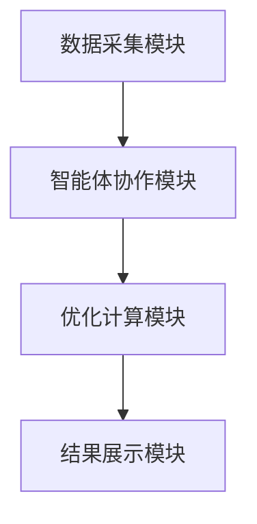

                 


# 利用多智能体AI优化投资组合：价值投资新范式

> 关键词：多智能体AI，投资组合优化，价值投资，人工智能，量化投资，分布式计算，协作优化

> 摘要：本文探讨了利用多智能体AI优化投资组合的新范式，结合现代投资组合理论与多智能体协作优化算法，提出了基于多智能体AI的投资组合优化方法。通过详细分析多智能体AI的核心概念、优化算法、系统架构，并结合实际案例，展示了多智能体AI在投资组合优化中的应用价值。

---

## 第1章: 多智能体AI与投资组合优化的背景

### 1.1 多智能体AI的定义与特点

#### 1.1.1 多智能体AI的定义
多智能体AI（Multi-Agent AI）是指由多个相互协作或竞争的智能体组成的系统，每个智能体都具有一定的自主性、目标导向性和学习能力。这些智能体能够通过通信和协作，共同完成复杂的任务。

#### 1.1.2 多智能体AI的核心特点
- **分布式智能**：智能体之间分布协作，避免单点依赖。
- **自主性**：每个智能体能够独立决策和行动。
- **协作性**：智能体之间通过通信和协作，共同完成目标。
- **动态性**：能够适应环境的变化和不确定性。

#### 1.1.3 多智能体AI与传统AI的区别
| 特性       | 多智能体AI                          | 传统AI                              |
|------------|------------------------------------|--------------------------------------|
| 智能体数量 | 多个                               | 单个或少量                          |
| 任务协作   | 高度协作                           | 较少协作                            |
| 环境复杂性 | 高复杂性                           | 较低复杂性                          |
| 应用场景   | 分布式计算、协作优化、博弈论等     | 单任务处理、模式识别、自然语言处理等 |

---

### 1.2 投资组合优化的基本理论

#### 1.2.1 投资组合优化的定义
投资组合优化是指在给定风险和收益目标下，选择最优的资产配置方式，以最大化收益或最小化风险。

#### 1.2.2 现代投资组合理论（MPT）
现代投资组合理论（MPT）由哈里·马科维茨提出，核心思想是通过资产组合分散投资以降低风险。其数学模型如下：

$$
\text{目标函数：} \quad \min_w \sigma^2(w) \\
\text{约束条件：} \quad w^T \mathbf{1} = 1, \quad w^T r = \text{目标收益} \\
$$

其中，$\sigma^2(w)$表示投资组合的方差，$w$为投资权重，$\mathbf{1}$为全1向量，$r$为目标收益。

#### 1.2.3 投资组合优化的目标与约束
- **目标**：最大化收益、最小化风险。
- **约束**：投资权重之和为1，满足流动性要求等。

---

### 1.3 多智能体AI在投资组合优化中的应用背景

#### 1.3.1 传统投资组合优化的局限性
传统优化方法通常假设市场是完美的，忽略了现实中的交易费用、市场冲击等复杂因素。

#### 1.3.2 多智能体AI的优势与潜力
多智能体AI能够模拟市场中不同投资者的行为，通过协作优化找到更优的投资组合。

#### 1.3.3 价值投资新范式的概念
价值投资新范式是指利用多智能体AI技术，从多个维度分析资产价值，动态优化投资组合。

---

### 1.4 本章小结
本章介绍了多智能体AI的核心概念及其在投资组合优化中的潜力，为后续章节的分析奠定了基础。

---

## 第2章: 多智能体AI的核心概念与原理

### 2.1 多智能体系统的结构与组成

#### 2.1.1 多智能体系统的组成要素
- **智能体**：具有目标、知识、感知和行动能力的主体。
- **环境**：智能体所处的外部环境，如金融市场。
- **通信机制**：智能体之间交换信息的方式。
- **协作协议**：智能体协作的规则和策略。

#### 2.1.2 多智能体系统中的通信与协作
- **通信方式**：直接通信和间接通信。
- **协作方式**：任务分配、协调同步。

#### 2.1.3 多智能体系统的分类与特征
| 特性       | 分布式多智能体系统                | 集中式多智能体系统                |
|------------|--------------------------------|---------------------------------|
| 结构       | 去中心化                         | 中心化                          |
| 协作方式   | 分散协作                         | 集中协作                        |
| 应用场景   | 分布式计算、网络优化             | 游戏AI、自动驾驶等                |

---

### 2.2 多智能体AI的算法原理

#### 2.2.1 分布式计算与协作优化
分布式计算通过将任务分解到多个智能体，利用局部信息完成全局优化。

#### 2.2.2 多智能体强化学习
多智能体强化学习中，每个智能体通过与环境和其他智能体的互动，学习最优策略。

#### 2.2.3 联合优化与博弈论
联合优化算法通过多个智能体的协作，找到全局最优解。博弈论则研究智能体之间的竞争与合作。

---

### 2.3 多智能体AI与投资组合优化的结合

#### 2.3.1 投资组合优化的数学模型
投资组合优化的数学模型如下：

$$
\min_w \sigma^2(w) \\
s.t. \quad r^T w = \text{目标收益} \\
$$

其中，$\sigma^2(w)$为投资组合的方差，$r$为目标收益向量。

#### 2.3.2 多智能体AI在投资组合优化中的应用场景
- **资产配置**：智能体协作优化资产权重。
- **风险管理**：智能体实时监控市场风险。
- **动态调整**：根据市场变化动态优化投资组合。

#### 2.3.3 多智能体AI优化投资组合的核心思想
通过多个智能体的协作，利用分布式计算和强化学习，找到最优投资组合。

---

### 2.4 本章小结
本章详细介绍了多智能体AI的核心概念与算法原理，并分析了其在投资组合优化中的应用。

---

## 第3章: 多智能体AI优化投资组合的数学模型与算法

### 3.1 投资组合优化的数学模型

#### 3.1.1 均值-方差模型
均值-方差模型由马科维茨提出，公式如下：

$$
\min_w \frac{1}{2}w^T \Sigma w \\
s.t. \quad \mathbb{E}[r] = r_p, \quad \sum_{i=1}^n w_i = 1
$$

其中，$\Sigma$为协方差矩阵，$\mathbb{E}[r]$为期望收益，$r_p$为目标收益。

#### 3.1.2 带有约束条件的优化模型
带约束的优化模型通常使用拉格朗日乘数法求解。

#### 3.1.3 非线性优化模型
非线性优化模型考虑了更复杂的约束条件，如交易成本和市场冲击。

---

### 3.2 多智能体AI优化算法的数学推导

#### 3.2.1 分布式优化算法
分布式优化算法通过分解问题到多个智能体，利用局部信息进行全局优化。

#### 3.2.2 联合优化算法
联合优化算法通过智能体之间的协作，将问题转化为全局优化问题。

#### 3.2.3 协作学习算法
协作学习算法通过智能体之间的知识共享，提高整体学习效率。

---

### 3.3 多智能体AI优化投资组合的数学公式

#### 3.3.1 均值-方差模型的公式表示
均值-方差模型的公式如下：

$$
\min_w \frac{1}{2}w^T \Sigma w \\
s.t. \quad \mathbb{E}[r] = r_p, \quad \sum_{i=1}^n w_i = 1
$$

#### 3.3.2 分布式优化的数学表达
分布式优化的数学表达如下：

$$
\min_{w_i} \sum_{i=1}^n f_i(w_i) \\
s.t. \quad \sum_{i=1}^n w_i = 1
$$

其中，$f_i(w_i)$为每个智能体的目标函数。

---

### 3.4 本章小结
本章通过数学推导，详细分析了多智能体AI优化投资组合的算法原理。

---

## 第4章: 多智能体AI优化投资组合的系统架构与设计

### 4.1 投资组合优化系统的总体架构

#### 4.1.1 系统模块划分
- **数据采集模块**：获取市场数据。
- **智能体协作模块**：智能体之间的通信与协作。
- **优化计算模块**：执行投资组合优化。
- **结果展示模块**：展示优化结果。

#### 4.1.2 系统功能描述
- 数据采集：实时获取市场数据。
- 智能体协作：智能体之间通信协作。
- 优化计算：执行投资组合优化。
- 结果展示：可视化优化结果。

#### 4.1.3 系统架构图


---

### 4.2 多智能体协作的系统设计

#### 4.2.1 智能体的通信机制
- **直接通信**：智能体之间直接交换信息。
- **间接通信**：通过共享介质进行信息交换。

#### 4.2.2 智能体的协作策略
- **任务分配**：智能体根据自身能力分配任务。
- **协调同步**：智能体之间同步状态和决策。

#### 4.2.3 系统的扩展性设计
- **模块化设计**：便于扩展新的智能体。
- **分布式架构**：支持大规模扩展。

---

### 4.3 系统实现的关键技术

#### 4.3.1 分布式计算技术
- **分布式计算框架**：如Spark、Flink。
- **通信协议**：如HTTP、WebSocket。

#### 4.3.2 多智能体协作算法
- **分布式优化算法**：如ADMM。
- **协作学习算法**：如联邦学习。

#### 4.3.3 数据处理与分析技术
- **数据清洗**：处理缺失值、异常值。
- **特征提取**：提取有用特征。

---

### 4.4 本章小结
本章详细描述了多智能体AI优化投资组合的系统架构与设计。

---

## 第5章: 多智能体AI优化投资组合的项目实战

### 5.1 项目环境搭建

#### 5.1.1 开发环境的选择
推荐使用Python和Jupyter Notebook进行开发。

#### 5.1.2 依赖库的安装
安装必要的依赖库：

```bash
pip install numpy pandas scikit-learn matplotlib
```

#### 5.1.3 数据源的获取与处理
从金融数据源（如Yahoo Finance）获取市场数据。

---

### 5.2 项目核心代码实现

#### 5.2.1 多智能体协作算法的实现
```python
import numpy as np

def distributed_optimization(data, num_agents):
    agents = []
    for _ in range(num_agents):
        agent = Agent(data)
        agents.append(agent)
    
    for agent in agents:
        agent.collaborate()
    
    return agents[0].optimized_weights()

class Agent:
    def __init__(self, data):
        self.data = data
    
    def collaborate(self):
        pass
    
    def optimized_weights(self):
        pass
```

#### 5.2.2 投资组合优化模型的实现
```python
import numpy as np
from sklearn.linear_model import LinearRegression

def portfolio_optimization(data):
    returns = data.pct_change().dropna()
    mu = returns.mean(axis=0)
    sigma = returns.cov()
    
    # 均值-方差优化
    n = len(mu)
    mu_vec = np.array([mu.values]).T
    cov_matrix = sigma.values
    
    inv_cov = np.linalg.inv(cov_matrix)
    w = inv_cov @ mu_vec / (mu_vec.T @ inv_cov @ mu_vec)
    
    return w
```

#### 5.2.3 系统功能的实现
```python
import matplotlib.pyplot as plt

def visualize_portfolio(weights, returns):
    plt.figure(figsize=(10, 6))
    plt.bar(weights.index, weights.values)
    plt.title('Optimized Portfolio Weights')
    plt.ylabel('Weight')
    plt.show()
```

---

### 5.3 项目运行与测试

#### 5.3.1 系统功能测试
测试多智能体协作算法是否能够正确优化投资组合。

#### 5.3.2 性能测试与优化
测试系统在大规模数据下的性能，并进行优化。

#### 5.3.3 测试结果分析
分析优化结果是否符合预期。

---

### 5.4 项目小结与经验总结
本章通过实际案例，展示了多智能体AI优化投资组合的实现过程，并总结了项目经验。

---

## 第6章: 多智能体AI优化投资组合的最佳实践与注意事项

### 6.1 最佳实践

#### 6.1.1 系统设计
- **模块化设计**：便于维护和扩展。
- **容错设计**：处理智能体故障。

#### 6.1.2 数据处理
- **数据清洗**：确保数据质量。
- **特征工程**：提取有用特征。

#### 6.1.3 算法优化
- **参数调优**：优化算法性能。
- **模型评估**：评估模型效果。

---

### 6.2 小结
多智能体AI优化投资组合是一种创新的方法，能够提高投资效率和收益。

### 6.3 注意事项
- **风险管理**：注意市场波动带来的风险。
- **数据质量**：确保数据的准确性和完整性。
- **系统稳定性**：确保系统的稳定运行。

---

### 6.4 拓展阅读
- 推荐阅读《分布式计算与多智能体系统》。
- 推荐阅读《强化学习与投资组合优化》。

---

## 附录: 代码示例

### 附录A: 数据采集代码
```python
import pandas as pd
import yfinance as yf

def get_data(tickers, start, end):
    data = yf.download(tickers, start=start, end=end)['Adj Close']
    return data

tickers = ['AAPL', 'GOOGL', 'MSFT']
data = get_data(tickers, '2020-01-01', '2023-12-31')
```

### 附录B: 优化算法代码
```python
def portfolio_optimization(data):
    returns = data.pct_change().dropna()
    mu = returns.mean()
    sigma = returns.cov()
    
    n = len(mu)
    mu_vec = np.array([mu.values]).T
    cov_matrix = sigma.values
    
    inv_cov = np.linalg.inv(cov_matrix)
    w = inv_cov @ mu_vec / (mu_vec.T @ inv_cov @ mu_vec)
    
    return w
```

---

## 结语
多智能体AI优化投资组合是一种创新的范式，结合了分布式计算和协作优化的优势，为价值投资提供了新的思路。未来，随着技术的进步，多智能体AI在投资领域的应用将更加广泛和深入。

