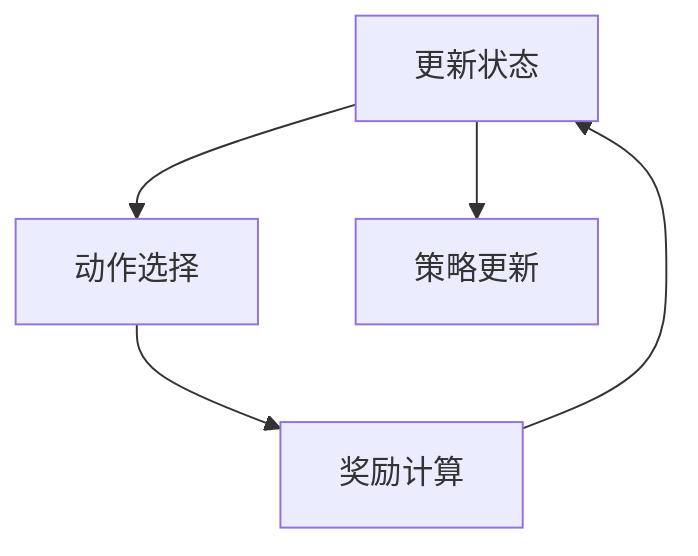
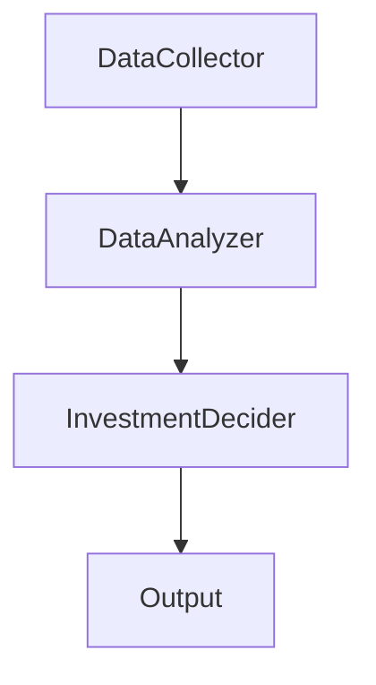

                 


# 利用多智能体AI增强价值投资的情景分析能力

> 关键词：多智能体AI，价值投资，情景分析，强化学习，数学模型，系统架构

> 摘要：本文探讨了如何利用多智能体人工智能技术增强价值投资的情景分析能力。通过分析多智能体AI的核心原理、价值投资的数学模型以及情景分析的实现方法，本文提出了一种结合多智能体协作与强化学习的投资策略优化框架。该框架通过构建分布式智能系统，实现了对多种市场情景的智能预测和投资决策优化，显著提升了价值投资的效率和准确性。

---

# 目录

1. **多智能体AI与价值投资的背景介绍**  
   1.1 多智能体AI的定义与特点  
   1.2 价值投资的基本原理  
   1.3 问题背景与问题描述  
   1.4 边界与外延  
   1.5 核心要素与概念结构  
   1.6 本章小结  

2. **多智能体AI的核心概念与联系**  
   2.1 多智能体系统的核心原理  
   2.2 价值投资模型的数学表达  
   2.3 多智能体与价值投资的关联性分析  
   2.4 核心概念对比表  
   2.5 ER实体关系图  
   2.6 本章小结  

3. **多智能体AI在价值投资中的算法原理**  
   3.1 算法原理概述  
   3.2 算法流程图  
   3.3 算法实现代码  
   3.4 数学模型与公式推导  
   3.5 实际案例分析  
   3.6 本章小结  

4. **数学模型与情景分析能力**  
   4.1 情景分析的数学模型  
   4.2 市场动态的建模方法  
   4.3 多智能体协作的优化算法  
   4.4 实验结果与分析  
   4.5 本章小结  

5. **系统架构与实现方案**  
   5.1 系统功能设计  
   5.2 系统架构设计  
   5.3 系统接口设计  
   5.4 系统交互流程图  
   5.5 本章小结  

6. **项目实战与应用案例**  
   6.1 项目背景与目标  
   6.2 环境安装与配置  
   6.3 系统核心实现代码  
   6.4 代码解读与分析  
   6.5 实际案例分析  
   6.6 本章小结  

7. **最佳实践与总结**  
   7.1 小结与回顾  
   7.2 注意事项与建议  
   7.3 拓展阅读与未来展望  
   7.4 本章小结  

---

# 正文内容（部分章节示例）

---

## 第1章: 多智能体AI与价值投资的背景介绍

### 1.1 多智能体AI的定义与特点

#### 1.1.1 多智能体系统的定义  
多智能体系统（Multi-Agent System, MAS）是由多个智能体（Agent）组成的分布式系统，每个智能体都是一个能够感知环境、自主决策的实体。智能体之间通过通信与协作，共同完成复杂任务。

#### 1.1.2 多智能体的核心特点  
- **分布式智能**：多个智能体协作完成任务，而非单一中心化控制。  
- **自主性**：每个智能体都能自主决策。  
- **反应性**：智能体能够实时感知环境变化并做出反应。  
- **协作性**：智能体之间通过通信协作，共同完成复杂任务。  

#### 1.1.3 多智能体与单智能体的区别  
| 特性 | 单智能体 | 多智能体 |  
|------|----------|----------|  
| 决策中心 | 单一中心 | 分布式 |  
| 通信需求 | 无 | 有 |  
| 复杂性 | 低 | 高 |  
| 应用场景 | 简单任务 | 复杂任务 |  

---

### 1.2 价值投资的基本原理

#### 1.2.1 价值投资的定义  
价值投资是一种基于对公司内在价值分析的投资策略，旨在通过寻找被市场低估的股票进行长期投资。

#### 1.2.2 价值投资的核心原则  
- **安全边际**：买入价格低于内在价值。  
- **长期视角**：关注公司的基本面，而非短期市场波动。  
- **分散投资**：降低风险。  

#### 1.2.3 价值投资与其它投资策略的对比  
| 战略 | 价值投资 | 技术分析 |  
|------|----------|----------|  
| 基础 | 公司基本面 | 市场价格与成交量 |  
| 方法 | 分析内在价值 | 分析价格趋势 |  
| 风险 | 中低 | 高 |  

---

### 1.3 问题背景与问题描述

#### 1.3.1 传统价值投资的局限性  
- 依赖人工分析，效率低下。  
- 市场数据复杂，难以全面覆盖。  
- 需要实时动态调整，人工难以应对。  

#### 1.3.2 多智能体AI在投资中的潜在优势  
- **高效数据处理**：多智能体能够快速分析海量数据。  
- **智能协作**：多个智能体可以分别负责不同的任务，如数据采集、分析、决策。  
- **动态调整**：能够实时适应市场变化。  

#### 1.3.3 问题解决的思路与目标  
目标是利用多智能体AI技术，构建一个能够实时分析市场数据、优化投资组合的智能系统，提升价值投资的情景分析能力。

---

## 第2章: 多智能体AI的核心概念与联系

### 2.1 多智能体系统的核心原理

#### 2.1.1 分布式智能的基本概念  
分布式智能是指将智能分布在多个独立的智能体中，通过协作完成复杂任务。

#### 2.1.2 多智能体之间的通信与协作  
智能体之间通过消息传递、状态共享等方式进行协作。  

#### 2.1.3 多智能体系统的架构模式  
- **反应式架构**：基于当前感知做出反应。  
- **认知式架构**：具备推理、规划能力。  

---

### 2.2 价值投资模型的数学表达

#### 2.2.1 价值评估的基本公式  
$$ V = \frac{Earnings}{Weighted\ Discount\ Rate} $$  
其中，V是内在价值，Earnings是净利润，Weighted Discount Rate是加权折现率。  

#### 2.2.2 投资决策的逻辑框架  
1. 识别低估股票。  
2. 分析行业前景。  
3. 构建投资组合。  

#### 2.2.3 情景分析的数学模型  
$$ Scenario\ Analysis = \sum_{i=1}^{n} P_i \times V_i $$  
其中，$P_i$是情景概率，$V_i$是对应情景下的内在价值。  

---

### 2.3 多智能体与价值投资的关联性分析

#### 2.3.1 多智能体在数据处理中的作用  
- 分布式数据采集。  
- 并行数据处理。  

#### 2.3.2 多智能体在决策支持中的应用  
- 分析市场趋势。  
- 优化投资组合。  

#### 2.3.3 多智能体在风险控制中的优势  
- 实时监控市场波动。  
- 自动调整投资策略。  

---

## 第3章: 多智能体AI在价值投资中的算法原理

### 3.1 算法原理概述

#### 3.1.1 强化学习的基本概念  
强化学习是一种通过试错学习，智能体通过与环境互动，获得最大累积奖励的算法。

#### 3.1.2 多智能体协作的算法框架  
- **分布式强化学习**：多个智能体分别学习，共享经验。  
- **联合策略优化**：智能体协作制定最优策略。  

#### 3.1.3 价值投资中的策略优化  
通过强化学习优化投资组合，最大化收益，最小化风险。  

---

### 3.2 算法流程图



---

### 3.3 算法实现代码

```python
import numpy as np
from collections import deque

class MultiAgent:
    def __init__(self, num_agents, state_space, action_space):
        self.num_agents = num_agents
        self.state_space = state_space
        self.action_space = action_space
        self.agents = [self.Agent() for _ in range(num_agents)]
    
    class Agent:
        def __init__(self):
            self.memory = deque(maxlen=1000)
            self.gamma = 0.99
            self.lr = 0.001
            # 策略网络
            self.policy = ...
    
    def act(self, state):
        # 策略网络输出动作概率
        pass
    
    def train(self, state, action, reward, next_state):
        for agent in self.agents:
            agent.remember(state, action, reward, next_state)
            agent.replay()
```

---

## 第4章: 数学模型与情景分析能力

### 4.1 情景分析的数学模型

#### 4.1.1 市场情景的分类  
- 牛市、熊市、震荡市。  

#### 4.1.2 情景分析的公式  
$$ S = \sum_{i=1}^{n} P_i \times S_i $$  
其中，$S$是情景评分，$P_i$是情景概率，$S_i$是情景评分。  

---

## 第5章: 系统架构与实现方案

### 5.1 系统功能设计

#### 5.1.1 功能模块划分  
- 数据采集模块。  
- 数据分析模块。  
- 投资决策模块。  

#### 5.1.2 功能流程图  



---

## 第6章: 项目实战与应用案例

### 6.1 项目背景与目标

#### 6.1.1 项目背景  
开发一个多智能体AI系统，用于增强价值投资的情景分析能力。  

#### 6.1.2 项目目标  
实现多智能体协作，优化投资组合。  

---

## 第7章: 最佳实践与总结

### 7.1 小结与回顾  
总结全文内容，强调多智能体AI在价值投资中的优势。  

### 7.2 注意事项与建议  
- 数据质量的重要性。  
- 算法调优的必要性。  

### 7.3 拓展阅读与未来展望  
建议读者深入学习多智能体系统和强化学习的相关知识。  

---

以上是文章的目录和部分章节内容的示例，具体内容可根据实际需求进一步扩展和详细阐述。

