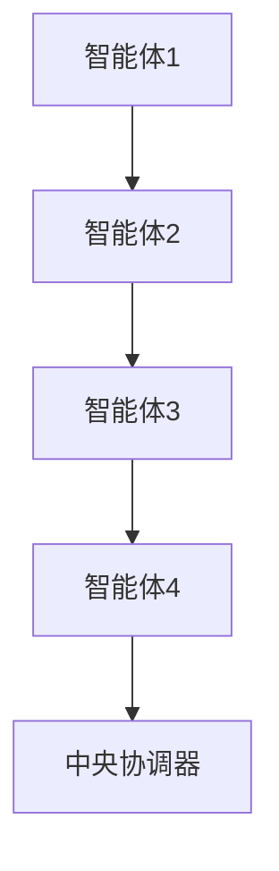
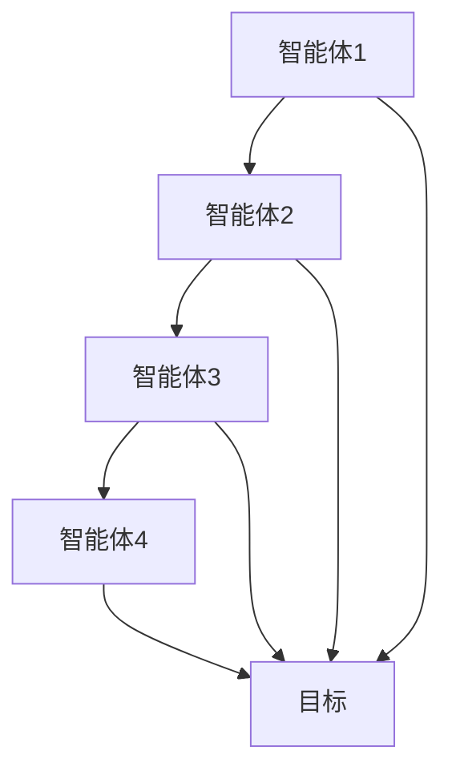
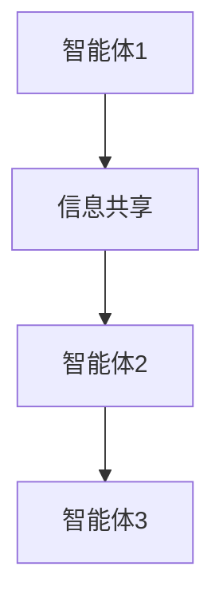
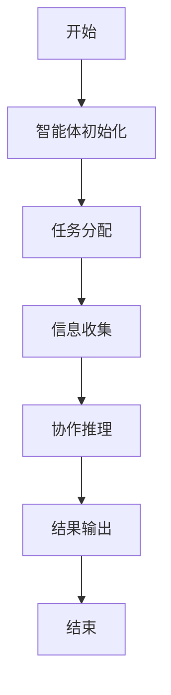
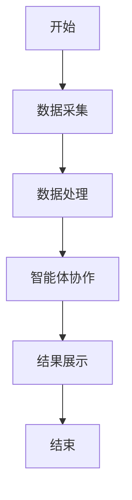
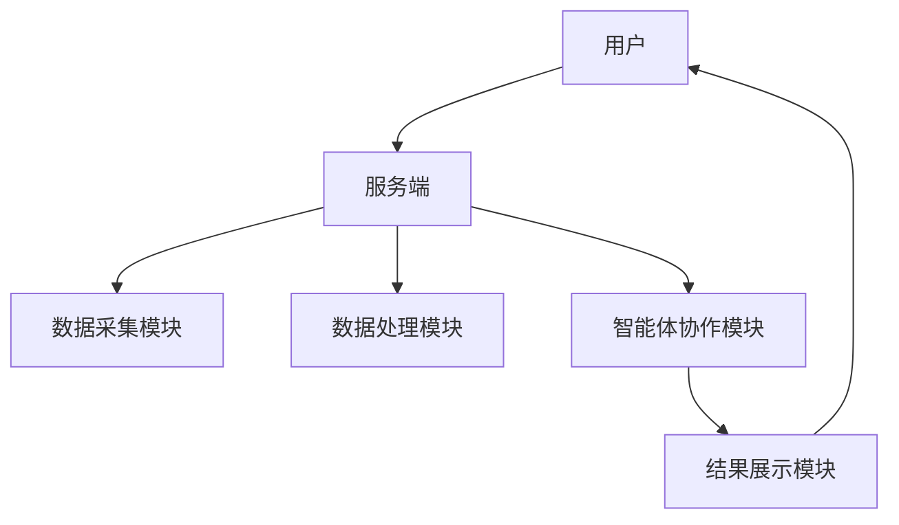
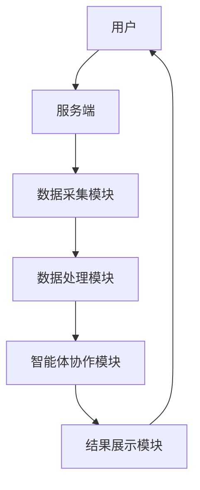

                 


# 利用多智能体AI实现动态市场份额预测

> 关键词：多智能体AI，动态市场份额预测，协同学习，博弈论模型，系统架构

> 摘要：本文详细探讨了利用多智能体AI技术实现动态市场份额预测的方法。通过分析多智能体系统的协同学习机制、博弈论模型以及系统架构设计，展示了如何利用多智能体AI技术来预测市场动态变化下的市场份额。文章从背景介绍、核心概念、算法原理、系统设计到项目实战，全面阐述了多智能体AI在动态市场份额预测中的应用，为相关领域研究和实践提供了理论和实践参考。

---

# 第一部分: 多智能体AI与动态市场份额预测概述

## 第1章: 多智能体AI与动态市场份额预测概述

### 1.1 多智能体AI的定义与特点

#### 1.1.1 多智能体系统的基本概念
多智能体系统（Multi-Agent System, MAS）是由多个智能体（Agent）组成的分布式系统，这些智能体通过协同工作完成特定任务。每个智能体都是一个能够感知环境、做出决策并采取行动的独立实体。

#### 1.1.2 多智能体AI的核心特点
- **分布式性**：智能体之间分布在网络中，各自独立运行。
- **协作性**：智能体之间通过信息交互和协同完成复杂任务。
- **自主性**：每个智能体都有自主决策的能力，能够根据环境动态调整行为。
- **反应性**：智能体能够实时感知环境变化并做出反应。

#### 1.1.3 多智能体AI与传统AI的区别
传统AI通常基于单一智能体完成任务，而多智能体AI通过多个智能体的协作实现更复杂的任务。多智能体AI的优势在于能够处理分布式、动态的环境问题，适用于需要多个决策主体协同的场景。

---

### 1.2 动态市场份额预测的背景与意义

#### 1.2.1 市场份额预测的基本概念
市场份额预测是指对某一产品或服务在市场中的占有率进行预测。动态市场份额预测则考虑了市场环境的实时变化，如竞争对手的策略调整、消费者行为变化等因素。

#### 1.2.2 动态市场份额预测的挑战
- **数据动态性**：市场数据实时变化，需要快速响应。
- **多变量影响**：市场份额受多种因素影响，如价格、竞争策略、消费者偏好等。
- **不确定性**：市场环境的不确定性使得预测难度增加。

#### 1.2.3 多智能体AI在市场份额预测中的优势
多智能体AI能够通过多个智能体的协同，实时捕捉市场变化，分析竞争对手策略，并动态调整预测模型。这种分布式、协作式的预测方式能够提高预测的准确性和实时性。

---

### 1.3 本章小结
本章介绍了多智能体AI的基本概念、特点以及动态市场份额预测的背景与挑战。通过对比传统AI，强调了多智能体AI在处理复杂动态问题中的优势。为后续章节的展开奠定了基础。

---

# 第二部分: 多智能体AI的核心概念与原理

## 第2章: 多智能体AI的核心概念与联系

### 2.1 多智能体系统的组成与关系

#### 2.1.1 实体关系图（ER图）


#### 2.1.2 多智能体系统的属性特征对比表
| 特性         | 单智能体AI       | 多智能体AI       |
|--------------|------------------|------------------|
| 系统结构     | 集中式结构       | 分布式结构       |
| 决策主体     | 单一决策主体     | 多个决策主体     |
| 信息处理     | 中央处理         | 分布式处理       |
| 协作能力     | 无               | 强               |

#### 2.1.3 多智能体系统的交互流程图（Mermaid）


---

### 2.2 多智能体AI的协同学习机制

#### 2.2.1 协同学习的基本原理
协同学习是指多个智能体通过共享信息、协作推理来共同完成一个任务。每个智能体负责一部分数据或任务，最终通过协作完成整体目标。

#### 2.2.2 多智能体之间的信息交互


#### 2.2.3 协同学习的数学模型
协同学习的数学模型可以表示为：
$$
P(y|x) = \prod_{i=1}^{n} P(y| x_i)
$$
其中，$x_i$ 是智能体i的输入数据，$y$ 是输出结果。

---

### 2.3 本章小结
本章详细讲解了多智能体系统的组成、关系以及协同学习机制。通过对比分析，突出了多智能体AI在协作和分布式处理方面的优势。

---

# 第三部分: 多智能体AI的算法原理

## 第3章: 多智能体AI的算法原理

### 3.1 多智能体协同学习的算法流程

#### 3.1.1 算法流程图（Mermaid）


#### 3.1.2 算法实现的Python代码
```python
class Agent:
    def __init__(self, id):
        self.id = id
        self.data = None
        self.result = None

    def collect_data(self):
        # 收集数据
        self.data = "数据" + str(self.id)
        return self.data

    def process_data(self):
        # 处理数据
        self.result = f"结果{self.id}"
        return self.result

# 初始化多个智能体
agents = [Agent(i) for i in range(1, 5)]

# 协作学习过程
for agent in agents:
    agent.collect_data()
    agent.process_data()

# 输出结果
for agent in agents:
    print(f"智能体{agent.id}的处理结果：{agent.result}")
```

---

### 3.2 动态市场份额预测的数学模型

#### 3.2.1 市场份额预测的基本公式
市场份额预测的基本公式可以表示为：
$$
S_i = \frac{p_i}{\sum_{j=1}^{n} p_j}
$$
其中，$S_i$ 是第i个产品的市场份额，$p_i$ 是第i个产品的价格，$n$ 是市场上产品的数量。

#### 3.2.2 动态预测的数学模型
动态预测的数学模型可以表示为：
$$
S_i(t) = \frac{p_i(t)}{\sum_{j=1}^{n} p_j(t)}
$$
其中，$t$ 表示时间，$S_i(t)$ 是第i个产品在时间t的市场份额。

#### 3.2.3 市场竞争的博弈论模型
博弈论模型可以用于描述市场竞争中各参与者的策略选择。例如，纳什均衡是一个市场达到稳定状态的条件：
$$
\text{纳什均衡} \iff \forall i, u_i(s_i, S_{-i}) \geq u_i(s'_i, S_{-i})
$$
其中，$u_i$ 表示第i个参与者的效用函数，$s_i$ 是第i个参与者的策略，$S_{-i}$ 是其他参与者策略的集合。

---

### 3.3 本章小结
本章详细讲解了多智能体协同学习的算法流程，并通过数学模型展示了动态市场份额预测的实现过程。博弈论模型的引入为市场份额预测提供了理论支持。

---

# 第四部分: 系统分析与架构设计

## 第4章: 动态市场份额预测系统的分析与设计

### 4.1 系统问题场景介绍

#### 4.1.1 问题背景
在市场环境中，企业需要实时了解市场份额的变化，以便调整营销策略。传统的市场份额预测方法难以应对动态变化的市场环境，因此需要引入多智能体AI技术。

#### 4.1.2 问题描述
- 数据动态性：市场数据实时变化，需要快速响应。
- 多变量影响：市场份额受多种因素影响，如价格、竞争策略、消费者偏好等。
- 不确定性：市场环境的不确定性使得预测难度增加。

---

### 4.2 系统功能设计

#### 4.2.1 功能模块划分
- 数据采集模块：采集市场数据。
- 数据处理模块：对数据进行清洗和预处理。
- 智能体协作模块：多个智能体协同完成市场份额预测。
- 结果展示模块：展示预测结果。

#### 4.2.2 系统功能流程图（Mermaid）


---

### 4.3 系统架构设计

#### 4.3.1 系统架构图（Mermaid）


#### 4.3.2 系统组件的交互关系
用户通过服务端提交请求，服务端调用数据采集模块获取数据，通过数据处理模块进行清洗和预处理，然后调用智能体协作模块进行预测，最后将结果展示给用户。

---

### 4.4 系统交互流程设计

#### 4.4.1 系统交互流程图（Mermaid）


---

### 4.5 本章小结
本章详细分析了动态市场份额预测系统的功能设计和架构设计，展示了系统如何通过多智能体协作完成预测任务。

---

# 第五部分: 项目实战与案例分析

## 第5章: 多智能体AI在动态市场份额预测中的项目实战

### 5.1 项目环境的安装与配置

#### 5.1.1 Python环境的安装
安装Python 3.8或更高版本。

#### 5.1.2 相关库的安装与配置
安装以下Python库：
- `numpy`
- `pandas`
- `scikit-learn`
- `networkx`

#### 5.1.3 开发环境的搭建
安装Jupyter Notebook或其他IDE，如PyCharm。

---

### 5.2 系统核心实现源代码

#### 5.2.1 多智能体协作模块的实现
```python
import numpy as np
import pandas as pd
from sklearn.linear_model import LinearRegression

class MarketAgent:
    def __init__(self, id):
        self.id = id
        self.model = LinearRegression()
        self.data = None
        self.prediction = None

    def collect_data(self, X):
        self.data = X
        return self.data

    def train_model(self):
        # 假设data是输入特征，y是目标变量
        X = self.data.drop('y', axis=1)
        y = self.data['y']
        self.model.fit(X, y)
        return self.model

    def predict(self, new_X):
        self.prediction = self.model.predict(new_X)
        return self.prediction

# 初始化多个智能体
agents = [MarketAgent(i) for i in range(1, 5)]

# 数据采集与训练
data = pd.DataFrame({
    'x1': [1, 2, 3, 4],
    'x2': [5, 6, 7, 8],
    'y': [10, 20, 30, 40]
})

for agent in agents:
    agent.collect_data(data)
    agent.train_model()

# 预测
new_data = pd.DataFrame({
    'x1': [5],
    'x2': [9]
})
for agent in agents:
    prediction = agent.predict(new_data)
    print(f"智能体{agent.id}的预测结果：{prediction[0]}")
```

---

### 5.3 案例分析与结果解读

#### 5.3.1 案例背景
假设我们有四个竞争产品，需要预测它们在市场中的份额变化。

#### 5.3.2 数据处理与分析
通过数据采集和预处理，将市场数据输入到多智能体系统中。

#### 5.3.3 预测过程与结果
通过多智能体协作，预测出每个产品的市场份额，并动态调整预测模型。

#### 5.3.4 结果解读
通过结果展示模块，分析预测结果，调整市场策略。

---

### 5.4 本章小结
本章通过实际项目展示了多智能体AI在动态市场份额预测中的应用。通过代码实现和案例分析，验证了多智能体协作的有效性。

---

# 第六部分: 总结与展望

## 第6章: 总结与展望

### 6.1 系统总结
本系统通过多智能体AI技术实现了动态市场份额预测，具有以下优势：
- 高实时性：能够实时捕捉市场变化。
- 高准确性：通过多个智能体的协作提高预测精度。
- 高适应性：能够适应市场的动态变化。

---

### 6.2 未来展望
未来的研究方向包括：
- 更复杂的博弈论模型。
- 更高效的多智能体协作算法。
- 更智能化的系统架构设计。

---

## 附录

### 附录A: 数据集与工具链接
- 数据集：[公开市场份额数据集](https://example.com/datasets)
- 工具：[Python官方文档](https://docs.python.org/zh-cn/3/)

---

### 附录B: 常用库与框架
- `numpy`：[官方文档](https://numpy.org/)
- `pandas`：[官方文档](https://pandas.pydata.org/)
- `scikit-learn`：[官方文档](https://scikit-learn.org/stable/index.html)

---

通过以上结构，您可以逐步展开每个部分的内容，撰写一篇完整且详细的关于“利用多智能体AI实现动态市场份额预测”的技术博客文章。

