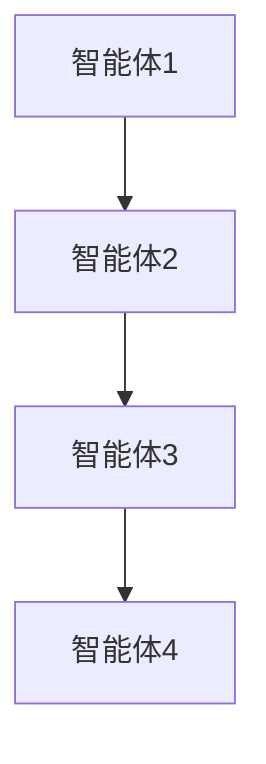
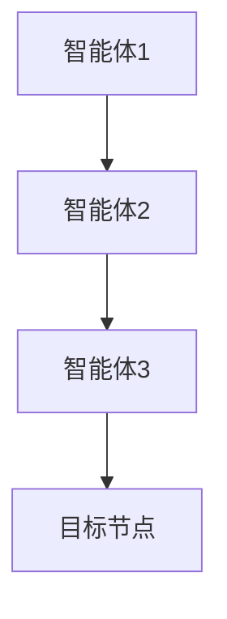
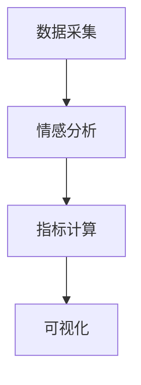
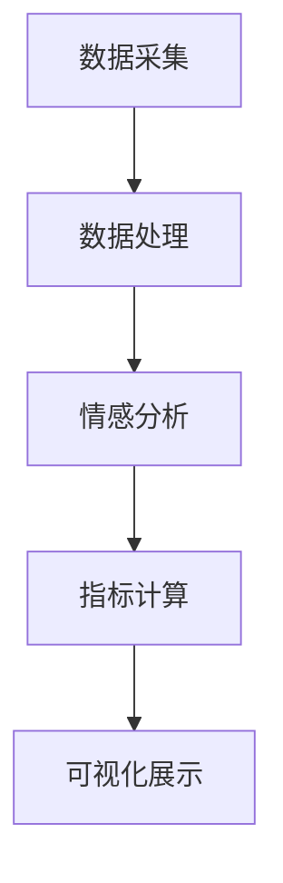

                 


# 利用多智能体AI实现动态市场情绪指标构建

## 关键词：多智能体AI，市场情绪指标，动态分析，情感分析，系统架构

## 摘要：本文将详细探讨如何利用多智能体AI技术构建动态市场情绪指标。首先介绍多智能体系统的基本概念和市场情绪指标的重要性。接着分析动态市场情绪指标构建的核心原理，包括情感分析算法、数学模型和协作机制。然后从系统架构角度，设计实现动态市场情绪指标的分布式系统。最后，通过实际案例展示如何在项目中实现这一目标，并提供相关技术建议。

---

# 第1章: 多智能体AI与动态市场情绪指标概述

## 1.1 多智能体AI的基本概念

### 1.1.1 多智能体系统的定义与特点

多智能体系统（Multi-Agent System, MAS）是由多个相互作用的智能体组成的分布式系统。每个智能体都是一个能够感知环境、做出决策并采取行动的独立实体。与传统单智能体系统相比，多智能体系统具有以下特点：

1. **分布式性**：多个智能体协同工作，每个智能体负责特定的任务。
2. **自主性**：智能体能够自主决策，无需中央控制。
3. **协作性**：智能体之间通过通信和协作完成共同目标。
4. **反应性**：智能体能够实时感知环境变化并做出响应。

### 1.1.2 多智能体系统的核心要素

- **智能体**：能够感知环境、处理信息并采取行动的实体。
- **通信机制**：智能体之间交换信息的方式，如消息传递。
- **协作协议**：定义智能体之间的协作规则和任务分配。
- **环境模型**：描述智能体所处环境的状态和变化。

### 1.1.3 多智能体系统与传统AI的区别

| **方面**       | **多智能体系统**                     | **传统AI系统**                     |
|----------------|--------------------------------------|--------------------------------------|
| 结构           | 分布式、多个智能体                  | 集中式、单个智能体                 |
| 通信           | 智能体之间有通信                   | 单个智能体独立运行                 |
| 协作           | 智能体协作完成任务                 | 单个智能体独立完成任务             |
| 复杂性         | 系统复杂性高，难以预测             | 系统相对简单，易于控制             |

---

## 1.2 市场情绪指标的定义与作用

### 1.2.1 市场情绪指标的定义

市场情绪指标（Market Sentiment Indicator）是衡量市场参与者情绪状态的量化指标。它反映了市场对某一资产、股票或市场的乐观或悲观程度。

### 1.2.2 市场情绪指标的分类

1. **投资者情绪指数（IPI）**：基于投资者的交易行为和市场参与度计算。
2. **市场情绪指数（VIX指数）**：衡量市场波动性，被称为“恐慌指数”。
3. **社交媒体情绪指数**：基于社交媒体上的文本分析计算。

### 1.2.3 市场情绪指标在金融领域的应用

1. **资产配置**：帮助投资者调整资产配置策略。
2. **风险管理**：识别市场波动风险，制定风险管理策略。
3. **交易信号**：作为交易策略的触发条件。

---

## 1.3 动态市场情绪指标构建的背景与意义

### 1.3.1 当前市场情绪分析的挑战

- **数据多样性**：市场数据来源广泛，包括文本、语音、视频等。
- **动态变化**：市场情绪受多种因素影响，实时变化。
- **复杂性**：市场参与者行为复杂，难以准确预测。

### 1.3.2 动态市场情绪指标的优势

- **实时性**：能够快速反映市场情绪变化。
- **准确性**：通过多智能体协作，提高分析精度。
- **适应性**：能够适应市场环境的变化。

### 1.3.3 多智能体AI在动态市场情绪分析中的作用

- **分布式计算**：多个智能体协同处理海量数据。
- **协作分析**：智能体之间共享信息，提高分析准确性。
- **自适应性**：智能体能够根据环境变化调整分析策略。

---

## 1.4 本章小结

本章介绍了多智能体AI的基本概念和市场情绪指标的定义与作用。通过对比分析，强调了多智能体系统在动态市场情绪分析中的优势。下一章将深入探讨动态市场情绪指标的核心概念与原理。

---

# 第2章: 多智能体系统的核心原理

## 2.1 多智能体系统的架构与通信

### 2.1.1 分布式多智能体架构



分布式架构中，每个智能体独立运行，通过通信机制相互协作。

### 2.1.2 智能体之间的通信机制

- **消息传递**：智能体通过消息传递信息。
- **订阅发布**：智能体订阅感兴趣的主题，接收相关消息。
- **RPC调用**：智能体之间通过远程过程调用进行协作。

### 2.1.3 协作与竞争关系

| **关系类型** | **描述**                     |
|--------------|------------------------------|
| 协作          | 智能体之间相互帮助，共同完成任务 |
| 竞争          | 智能体之间争夺资源或目标       |

---

## 2.2 多智能体系统的决策机制

### 2.2.1 分散决策与集中决策

- **分散决策**：每个智能体独立做出决策。
- **集中决策**：由中央控制单元统一决策。

### 2.2.2 基于博弈论的决策模型

博弈论是研究智能体之间策略选择的理论框架。在市场情绪分析中，可以模拟投资者的决策行为。

### 2.2.3 动态环境下的适应性决策

智能体能够根据环境变化动态调整决策策略。

---

## 2.3 多智能体系统的核心算法

### 2.3.1 协作式搜索算法

协作式搜索算法通过智能体之间的协作，提高搜索效率。



### 2.3.2 分布式优化算法

分布式优化算法将问题分解为多个子问题，由多个智能体分别求解。

### 2.3.3 基于强化学习的决策算法

强化学习是一种通过试错方式学习策略的方法。智能体通过与环境交互，逐步优化决策策略。

---

## 2.4 本章小结

本章详细介绍了多智能体系统的核心原理，包括架构、通信机制和决策算法。这些内容为后续动态市场情绪指标的构建奠定了基础。

---

# 第3章: 动态市场情绪指标的构建原理

## 3.1 市场情绪指标的数学模型

### 3.1.1 市场情绪指标的构建框架



### 3.1.2 市场情绪指标的数学公式

市场情绪指数（MSE）的计算公式如下：

$$ MSE(t) = \alpha \cdot MSE(t-1) + \beta \cdot Sentiment(t) $$

其中，$\alpha$ 和 $\beta$ 是权重系数，$Sentiment(t)$ 是当前时间的情感值。

---

## 3.2 情感分析算法的实现

### 3.2.1 基于词袋模型的情感分析

词袋模型（Bag of Words, BoW）是一种简单的情感分析方法，将文本表示为词袋。

```python
from sklearn.feature_extraction.text import CountVectorizer

vectorizer = CountVectorizer()
X = vectorizer.fit_transform(text_data)
```

### 3.2.2 基于深度学习的情感分析

深度学习模型（如LSTM）能够捕捉文本的语义信息，提高情感分析的准确性。

```python
import tensorflow as tf
from tensorflow.keras import layers

model = tf.keras.Sequential()
model.add(layers.Embedding(input_dim=..., output_dim=...))
model.add(layers.LSTM(64))
model.add(layers.Dense(1, activation='sigmoid'))
```

### 3.2.3 基于多智能体的协同分析

多智能体系统通过协作，提高情感分析的准确性和效率。

---

## 3.3 本章小结

本章介绍了动态市场情绪指标的构建原理，包括数学模型和情感分析算法。下一章将从系统架构的角度，详细设计实现方案。

---

# 第4章: 动态市场情绪指标构建系统架构

## 4.1 系统功能需求分析

### 4.1.1 数据采集模块

负责采集市场数据，包括文本、语音等。

### 4.1.2 情感分析模块

对采集的数据进行情感分析，生成情感值。

### 4.1.3 指标计算模块

根据情感值和历史数据，计算市场情绪指标。

### 4.1.4 可视化展示模块

将市场情绪指标以图表形式展示，方便用户查看。

---

## 4.2 系统架构设计

### 4.2.1 分层架构设计



### 4.2.2 模块之间的交互关系

- 数据采集模块向数据处理模块提供原始数据。
- 数据处理模块将数据传递给情感分析模块。
- 情感分析模块将结果传递给指标计算模块。
- 指标计算模块将最终指标传递给可视化展示模块。

### 4.2.3 系统的可扩展性设计

系统采用模块化设计，便于后续功能扩展和性能优化。

---

## 4.3 本章小结

本章详细设计了动态市场情绪指标构建系统的架构，包括功能模块和交互关系。下一章将通过实际案例展示系统的实现过程。

---

# 第5章: 项目实战与实现

## 5.1 环境安装

安装必要的依赖库，如Python的自然语言处理库（如spaCy）、深度学习框架（如TensorFlow）等。

## 5.2 系统核心实现源代码

### 5.2.1 数据采集模块

```python
import requests
from bs4 import BeautifulSoup

def fetch_data(url):
    response = requests.get(url)
    soup = BeautifulSoup(response.text, 'html.parser')
    return [text for text in soup.stripped_strings]
```

### 5.2.2 情感分析模块

```python
from tensorflow.keras.models import load_model

model = load_model('sentiment_model.h5')
def predict_sentiment(text):
    vectorizer = CountVectorizer()
    X = vectorizer.transform([text])
    prediction = model.predict(X)[0]
    return 'positive' if prediction > 0.5 else 'negative'
```

### 5.2.3 指标计算模块

```python
def calculate_mse(previous_mse, current_sentiment):
    alpha = 0.7
    beta = 0.3
    return alpha * previous_mse + beta * (1 if current_sentiment == 'positive' else 0)
```

### 5.2.4 可视化展示模块

```python
import matplotlib.pyplot as plt

def plot_mse(mse_values):
    plt.plot(mse_values)
    plt.xlabel('Time')
    plt.ylabel('Market Sentiment')
    plt.show()
```

## 5.3 案例分析与详细解读

通过实际案例，展示系统如何实时采集数据、分析情感并计算市场情绪指标。

## 5.4 项目小结

总结项目实现的关键点和经验教训，为后续优化提供参考。

---

# 第6章: 总结与展望

## 6.1 本章总结

总结全文内容，强调多智能体AI在动态市场情绪指标构建中的重要性。

## 6.2 注意事项

- 数据质量对分析结果影响重大，需确保数据来源可靠。
- 系统的安全性和稳定性需高度重视。
- 智能体之间的通信机制需合理设计，避免性能瓶颈。

## 6.3 拓展阅读

推荐相关领域的书籍和论文，供读者进一步学习。

---

# 附录: 参考文献

列出文章中引用的文献资料，确保学术严谨性。

---

通过以上目录和内容设计，您可以逐步撰写完整的技术博客文章，确保逻辑清晰、内容详实且易于理解。

