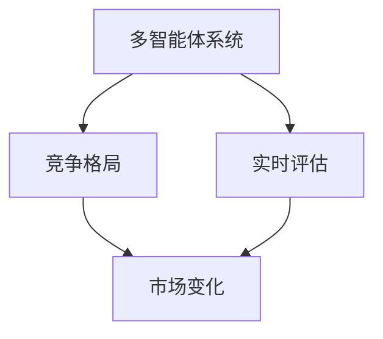
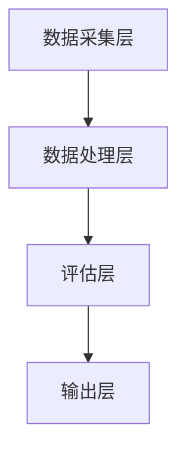

                 


# 利用多智能体AI实现动态竞争格局评估

> 关键词：多智能体AI，动态竞争格局，竞争评估，算法，系统架构

> 摘要：本文详细探讨了利用多智能体AI实现动态竞争格局评估的方法。通过分析多智能体系统的原理、动态竞争格局的评估指标以及相关算法，展示了如何构建一个基于多智能体AI的动态竞争评估系统。文章从背景介绍、核心概念、算法原理、系统设计到项目实战，全面阐述了实现动态竞争格局评估的理论与实践。

---

# 第1章: 多智能体AI与动态竞争格局评估概述

## 1.1 多智能体AI的基本概念

### 1.1.1 多智能体系统定义
多智能体系统（Multi-Agent System, MAS）是由多个相互作用的智能体组成的系统。这些智能体能够感知环境、自主决策，并通过协同完成复杂任务。

### 1.1.2 多智能体与单智能体的区别
- **单智能体**：单一决策主体，决策基于自身信息。
- **多智能体**：多个决策主体，通过协作完成目标。

### 1.1.3 多智能体AI的核心特征
1. **自主性**：智能体能够自主决策。
2. **反应性**：能够实时感知环境并做出反应。
3. **协作性**：通过通信和协作完成共同目标。

## 1.2 动态竞争格局评估的背景与意义

### 1.2.1 竞争格局评估的定义
竞争格局评估是对市场中各参与者（如企业、产品）的竞争关系和市场地位的分析。

### 1.2.2 动态竞争格局的特点
1. **动态性**：市场环境不断变化。
2. **复杂性**：涉及多个竞争主体和多种因素。
3. **不确定性**：市场变化难以完全预测。

### 1.2.3 多智能体AI在竞争评估中的作用
1. **实时分析**：多智能体能够实时感知市场变化。
2. **协同决策**：多个智能体协同完成复杂评估任务。

## 1.3 问题背景与目标

### 1.3.1 竞争格局动态变化的挑战
- 市场变化快，传统静态模型难以应对。
- 竞争关系复杂，难以准确建模。

### 1.3.2 多智能体AI的应用需求
- 实时动态评估需求。
- 多维度数据处理需求。

### 1.3.3 本研究的目标与意义
目标：构建基于多智能体AI的动态竞争评估系统。意义：提升企业对市场变化的响应能力。

## 1.4 核心概念与联系

### 1.4.1 多智能体系统的核心要素
1. **智能体**：独立决策的主体。
2. **通信机制**：智能体之间的信息交换。
3. **协同机制**：任务分配与协作。

### 1.4.2 动态竞争格局的评估维度
1. **市场占有率**：市场份额的动态变化。
2. **竞争对手分析**：竞争对手的策略和行为。
3. **市场趋势预测**：基于历史数据的预测模型。

### 1.4.3 多智能体与竞争格局的关系图


---

# 第2章: 多智能体AI的核心原理

## 2.1 多智能体系统的架构

### 2.1.1 分布式多智能体架构
- **特点**：每个智能体独立运行，无中心控制。
- **优点**：高容错性，适用于分布式环境。

### 2.1.2 集中式多智能体架构
- **特点**：有一个中心控制节点，协调各智能体。
- **优点**：便于管理和任务分配。

### 2.1.3 混合式多智能体架构
- **特点**：结合分布式和集中式，部分功能集中控制。
- **优点**：灵活性高。

## 2.2 多智能体协同机制

### 2.2.1 通信与信息共享
- **方式**：通过消息传递或共享数据库。
- **实现**：使用通信协议或共享接口。

### 2.2.2 协作与任务分配
- **协作方式**：基于角色分配或任务优先级。
- **实现**：使用协商算法或中心协调器。

### 2.2.3 冲突与协调
- **冲突解决**：通过仲裁机制或协商。
- **实现**：基于优先级或利益最大化。

## 2.3 多智能体学习与进化

### 2.3.1 分布式强化学习
- **原理**：智能体通过与环境互动，学习最优策略。
- **实现**：使用Q-learning或Actor-Critic算法。

### 2.3.2 进化算法在多智能体中的应用
- **原理**：基于遗传算法，优化智能体行为。
- **实现**：通过基因编码和变异实现进化。

### 2.3.3 知识共享与经验复用
- **方式**：通过共享数据库或消息传递。
- **实现**：使用知识表示和推理引擎。

---

# 第3章: 动态竞争格局评估的数学模型

## 3.1 竞争格局评估的指标体系

### 3.1.1 市场占有率
- **公式**：$市场占有率 = \frac{销售额}{总市场销售额}$。

### 3.1.2 竞争对手分析
- **指标**：市场份额、产品竞争力、品牌影响力。

### 3.1.3 市场趋势预测
- **方法**：时间序列分析、机器学习模型。

## 3.2 多智能体协同的数学模型

### 3.2.1 博弈论模型
- **纳什均衡**：$Nash Equilibrium$。
- **博弈树**：展示各智能体的策略选择。

### 3.2.2 多智能体决策树
- **结构**：决策树展示各智能体的决策路径。
- **实现**：使用ID3或C4.5算法构建。

### 3.2.3 群体智能模型
- **粒子群优化**：基于群体智能的优化算法。
- **公式**：$v_i = v_i + w(v_i - x_i) + c_1 r_1 (p_i - x_i) + c_2 r_2 (p_g - x_i)$。

## 3.3 动态竞争评估的数学公式

### 3.3.1 市场动态模型
- **公式**：$M(t) = \alpha M(t-1) + (1-\alpha) E(t)$，其中$\alpha$为衰减系数，$E(t)$为外部影响。

### 3.3.2 竞争态势指数计算
- **公式**：$CPI = \frac{\sum_{i=1}^n w_i s_i}{\sum_{i=1}^n w_i}$，其中$w_i$为权重，$s_i$为指标得分。

### 3.3.3 多智能体协同优化公式
- **公式**：$f(x) = \max_{x} \sum_{i=1}^n f_i(x)$，其中$f_i(x)$为各智能体的目标函数。

---

# 第4章: 多智能体AI实现动态竞争格局评估的算法原理

## 4.1 分布式计算与多智能体协同

### 4.1.1 分布式计算原理
- **实现**：通过分布式系统框架（如Hadoop、Spark）实现任务分发。

### 4.1.2 多智能体协同算法
- **算法**：基于消息传递的协同算法，如Gossip算法。

### 4.1.3 分布式计算的实现步骤
1. **任务分解**：将问题分解为多个子任务。
2. **任务分发**：将子任务分发给各个智能体。
3. **协同处理**：智能体协同完成任务。
4. **结果汇总**：汇总各智能体的结果，得到最终结果。

## 4.2 多智能体强化学习

### 4.2.1 强化学习的基本原理
- **原理**：通过奖励机制，智能体学习最优策略。
- **算法**：Q-learning、Deep Q-Networks（DQN）。

### 4.2.2 多智能体强化学习的挑战
- **同步与异步更新**：多个智能体之间的策略更新协调。
- **通信与协调**：智能体之间如何有效通信。

### 4.2.3 基于强化学习的动态竞争评估
- **应用**：智能体通过强化学习，掌握市场变化的规律。

## 4.3 群体智能与动态优化

### 4.3.1 群体智能的基本概念
- **定义**：基于群体行为的智能系统。

### 4.3.2 群体智能在动态竞争中的应用
- **应用**：市场预测、竞争对手分析。

### 4.3.3 基于群体智能的优化算法
- **算法**：粒子群优化（PSO）、蚁群算法（ACO）。

---

# 第5章: 系统分析与架构设计方案

## 5.1 问题场景介绍

### 5.1.1 竞争格局动态变化的场景
- **场景描述**：市场环境快速变化，竞争对手策略调整频繁。

### 5.1.2 多智能体AI的应用场景
- **应用场景**：实时市场监控、竞争对手分析、市场趋势预测。

### 5.1.3 系统需求分析
1. **实时性**：系统需要实时更新市场数据。
2. **高可用性**：系统需要具备容错能力。
3. **可扩展性**：系统需要支持大规模数据处理。

## 5.2 系统功能设计

### 5.2.1 竞争数据采集模块
- **功能**：采集市场数据，如销售数据、竞争对手信息。
- **实现**：通过API接口或爬虫技术采集数据。

### 5.2.2 多智能体协同模块
- **功能**：协调多个智能体协同工作。
- **实现**：通过通信机制实现智能体之间的协作。

### 5.2.3 动态评估输出模块
- **功能**：输出动态竞争评估结果。
- **实现**：通过数据可视化展示评估结果。

## 5.3 系统架构设计

### 5.3.1 分层架构设计
- **分层**：数据采集层、处理层、应用层。
- **实现**：每层通过接口通信。

### 5.3.2 模块化设计
- **模块**：数据采集模块、数据处理模块、评估模块。
- **实现**：模块化开发，便于维护和扩展。

### 5.3.3 系统架构图


---

# 第6章: 项目实战

## 6.1 环境安装

### 6.1.1 系统环境
- **操作系统**：Linux/Windows。
- **编程语言**：Python。
- **框架**：TensorFlow、PyTorch。

### 6.1.2 依赖安装
- **命令**：`pip install numpy, pandas, matplotlib, tensorflow`。

## 6.2 系统核心实现源代码

### 6.2.1 数据采集模块
```python
import requests

def get_market_data():
    response = requests.get('https://api.example.com/market-data')
    return response.json()
```

### 6.2.2 多智能体协同模块
```python
import threading

class Agent:
    def __init__(self, id):
        self.id = id
        self.data = None

    def receive(self, data):
        self.data = data

    def process(self):
        # 处理数据并返回结果
        return self.data * self.id

# 创建多个智能体
agents = [Agent(i) for i in range(5)]

# 启动线程
threads = []
for agent in agents:
    thread = threading.Thread(target=agent.process)
    threads.append(thread)
    thread.start()
```

### 6.2.3 动态评估模块
```python
import numpy as np

def dynamic_assessment(data):
    # 计算竞争态势指数
    weights = np.array([0.3, 0.4, 0.3])
    scores = np.array([data['market_share'], data['product_competition'], data['brand_influence']])
    return np.dot(weights, scores)
```

## 6.3 代码应用解读与分析

### 6.3.1 数据采集模块
- **功能**：从API获取市场数据。
- **实现**：使用`requests`库进行HTTP请求。

### 6.3.2 多智能体协同模块
- **功能**：模拟多个智能体协同工作。
- **实现**：使用线程实现多智能体并行处理。

### 6.3.3 动态评估模块
- **功能**：计算竞争态势指数。
- **实现**：基于加权求和的方法。

## 6.4 实际案例分析

### 6.4.1 案例背景
- **背景**：假设一个在线零售平台，需要实时评估市场竞争情况。

### 6.4.2 数据分析
- **数据**：销售数据、竞争对手数据、市场趋势数据。

### 6.4.3 模型训练
- **训练**：使用历史数据训练模型，预测未来市场变化。

## 6.5 项目小结

### 6.5.1 核心实现总结
- **总结**：通过多智能体协同，实现动态竞争评估。

### 6.5.2 项目经验
- **经验**：多智能体协同需要良好的通信机制和任务分配策略。

---

# 第7章: 最佳实践与总结

## 7.1 最佳实践

### 7.1.1 系统设计
- **建议**：模块化设计，便于维护和扩展。

### 7.1.2 代码实现
- **建议**：使用成熟框架，减少开发时间。

### 7.1.3 性能优化
- **建议**：通过并行计算和缓存优化提升性能。

## 7.2 小结

### 7.2.1 核心内容回顾
- **回顾**：多智能体AI在动态竞争评估中的应用。

### 7.2.2 研究成果
- **成果**：构建了一个基于多智能体AI的动态竞争评估系统。

## 7.3 注意事项

### 7.3.1 系统维护
- **注意事项**：定期更新模型和数据，确保系统准确性和实时性。

### 7.3.2 数据安全
- **注意事项**：确保数据安全，避免数据泄露。

## 7.4 拓展阅读

### 7.4.1 相关书籍
- 《Multi-Agent Systems》
- 《Dynamic Competitive Analysis》

### 7.4.2 技术博客
- 竞争格局分析技术博客。
- 多智能体系统技术博客。

---

# 结语

通过本文的详细阐述，我们了解了如何利用多智能体AI实现动态竞争格局评估。从理论到实践，从算法到系统设计，我们展示了如何构建一个高效的动态竞争评估系统。未来，随着技术的不断发展，多智能体AI在竞争评估中的应用将更加广泛和深入。

---

# 文章结束

