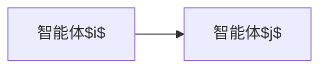
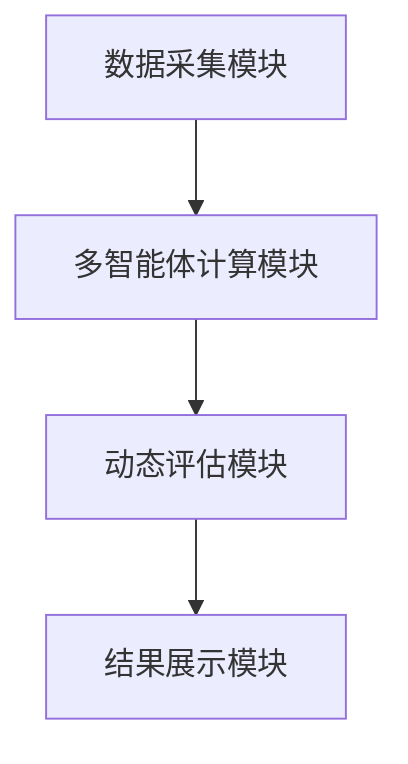
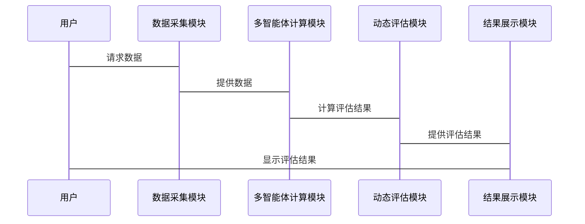

                 


# 利用多智能体AI实现动态行业吸引力评估

## 关键词：多智能体AI，动态评估，行业吸引力，协作学习，分布式计算

## 摘要：  
本文深入探讨了利用多智能体人工智能技术实现动态行业吸引力评估的方法。通过分析行业吸引力的核心概念、多智能体AI的原理及其在动态评估中的应用，本文提出了一种基于多智能体协作的动态评估模型，并通过具体案例展示了该模型的实际应用效果。文章内容包括背景介绍、核心概念与联系、算法原理、系统架构设计、项目实战及总结，旨在为相关领域的研究人员和实践者提供理论支持和实践指导。

---

# 第一部分: 背景介绍

## 第1章: 动态行业吸引力评估的背景与问题

### 1.1 问题背景

#### 1.1.1 行业吸引力评估的重要性  
行业吸引力是企业在制定战略决策时的重要参考指标，它反映了某个行业在当前市场环境下的发展潜力、竞争程度和盈利能力。传统的行业吸引力评估方法通常基于静态数据，无法捕捉市场的动态变化，因此在快速变化的商业环境中显得力不从力。

#### 1.1.2 动态评估的必要性  
随着全球经济的不确定性增加，行业环境的变化速度也在加快。企业需要实时掌握行业吸引力的变化趋势，以便快速调整策略。动态评估能够捕捉短期市场波动和长期趋势，帮助企业更好地应对变化。

#### 1.1.3 多智能体AI的应用价值  
多智能体AI通过分布式计算和协作学习，能够实时处理海量数据，捕捉市场动态。它不仅能够提供实时的行业吸引力评估，还能模拟不同情景下的市场反应，为企业提供决策支持。

### 1.2 问题描述

#### 1.2.1 行业吸引力的定义  
行业吸引力是指某个行业在特定时间和空间范围内，对企业和资本的吸引力程度。它通常包括市场规模、增长潜力、竞争程度、政策环境等多个维度。

#### 1.2.2 动态变化的驱动因素  
市场环境、政策变化、技术进步、企业行为等因素都会影响行业吸引力的动态变化。例如，政策调整可能导致某行业的市场准入门槛变化，从而影响其吸引力。

#### 1.2.3 传统评估方法的局限性  
传统评估方法通常基于历史数据和静态模型，无法实时更新，也无法捕捉短期波动。此外，传统方法往往缺乏对市场参与者的实时行为分析，难以提供动态的评估结果。

### 1.3 问题解决

#### 1.3.1 多智能体AI的优势  
多智能体AI通过分布式计算和协作学习，能够实时处理海量数据，捕捉市场动态。它能够模拟市场参与者的实时行为，提供动态的行业吸引力评估。

#### 1.3.2 动态评估的实现路径  
通过多智能体AI技术，动态评估可以实时更新行业吸引力指标，捕捉市场变化。同时，多智能体系统能够模拟不同情景下的市场反应，为企业提供决策支持。

#### 1.3.3 技术与业务的结合  
动态行业吸引力评估需要将多智能体AI技术与行业分析相结合。通过技术实现动态数据处理，结合行业分析方法，提供实时、动态的评估结果。

### 1.4 边界与外延

#### 1.4.1 行业吸引力的边界条件  
行业吸引力评估的范围通常限定在特定行业和时间段内。边界条件包括行业范围、时间范围、数据来源和评估指标。

#### 1.4.2 动态评估的适用范围  
动态评估适用于市场环境变化较快的行业，如科技、金融和制造业。对于市场环境较为稳定的行业，动态评估可能不如静态评估有效。

#### 1.4.3 多智能体AI的局限性  
多智能体AI依赖于高质量的数据和算法的准确性。在数据不足或算法不完善的情况下，评估结果可能不够准确。此外，多智能体系统的计算复杂度较高，可能需要强大的计算资源支持。

### 1.5 概念结构与核心要素

#### 1.5.1 行业吸引力的构成要素  
行业吸引力由市场规模、增长潜力、竞争程度、政策环境、技术门槛和企业行为等多个要素构成。

#### 1.5.2 多智能体AI的核心要素  
多智能体AI的核心要素包括分布式计算、协作学习、实时通信和联合推理。这些要素共同支持动态行业吸引力评估的实现。

#### 1.5.3 动态评估的系统架构  
动态评估系统通常包括数据采集模块、多智能体计算模块、动态评估模块和结果展示模块。这些模块协同工作，提供实时的行业吸引力评估。

---

## 第2章: 多智能体AI的核心原理

### 2.1 多智能体系统的基本原理

#### 2.1.1 多智能体系统的定义  
多智能体系统是指由多个智能体组成的分布式系统，智能体能够通过通信和协作完成复杂任务。

#### 2.1.2 多智能体系统的组成  
多智能体系统由智能体、通信机制、协作协议和任务目标组成。智能体是系统的基本单位，负责数据处理和决策。

#### 2.1.3 多智能体系统的通信机制  
智能体之间的通信机制包括消息传递、数据共享和协同推理。通信机制支持智能体之间的协作和协调。

### 2.2 动态评估的核心原理

#### 2.2.1 动态评估的定义  
动态评估是指在实时数据流的基础上，不断更新评估结果的过程。

#### 2.2.2 动态评估的实现机制  
动态评估通过实时数据处理和模型更新，保持评估结果的准确性。多智能体系统支持动态评估的实时计算和协作。

#### 2.2.3 动态评估的反馈机制  
动态评估的反馈机制包括评估结果的实时更新和系统参数的自适应调整。反馈机制确保系统能够适应市场环境的变化。

### 2.3 多智能体AI与动态评估的联系

#### 2.3.1 多智能体AI在动态评估中的作用  
多智能体AI通过实时数据处理和协作学习，支持动态评估的实现。它能够捕捉市场变化，提供实时的评估结果。

#### 2.3.2 动态评估对多智能体AI的需求  
动态评估需要多智能体AI的实时计算能力和协作能力。它依赖于智能体之间的高效通信和数据共享。

#### 2.3.3 两者结合的优势  
多智能体AI与动态评估的结合能够实现实时、动态的行业吸引力评估。它能够捕捉市场变化，提供精准的评估结果。

---

## 第3章: 多智能体AI的算法原理

### 3.1 多智能体系统的算法概述

#### 3.1.1 分布式计算算法  
分布式计算算法包括分布式数据处理、分布式任务分配和分布式计算优化。这些算法支持多智能体系统的高效计算。

#### 3.1.2 协作学习算法  
协作学习算法包括协同推理、联合训练和分布式学习。这些算法支持多智能体系统中的协作学习和知识共享。

#### 3.1.3 联合推理算法  
联合推理算法包括联合决策、分布式推理和共识机制。这些算法支持多智能体系统中的联合推理和决策优化。

### 3.2 动态评估的算法实现

#### 3.2.1 动态权重分配算法  
动态权重分配算法根据数据的重要性动态调整权重。例如，$$w_i = \alpha \cdot w_{i-1} + (1-\alpha) \cdot x_i$$，其中$\alpha$是遗忘系数，$x_i$是当前数据的权重。

#### 3.2.2 实时数据处理算法  
实时数据处理算法包括流数据处理、事件驱动处理和实时反馈处理。这些算法支持动态评估的实时数据处理。

#### 3.2.3 智能体协作算法  
智能体协作算法包括任务分配、数据共享和协同推理。这些算法支持多智能体系统中的协作与协调。

### 3.3 算法实现的数学模型

#### 3.3.1 多智能体协作模型  
多智能体协作模型包括智能体之间的通信、协作和决策过程。例如，智能体$i$和智能体$j$之间的通信可以用图论模型表示：



#### 3.3.2 动态权重调整模型  
动态权重调整模型用于根据市场变化调整评估指标的权重。例如，$$w_t = \beta \cdot w_{t-1} + (1-\beta) \cdot w_{init}$$，其中$\beta$是权重调整系数，$w_{init}$是初始权重。

#### 3.3.3 动态评估的数学公式  
动态评估的最终结果可以通过多智能体协作算法和动态权重调整模型的结合实现。例如，行业吸引力评估结果$I_t$可以表示为：

$$I_t = \sum_{i=1}^{n} w_i \cdot x_i$$

其中，$w_i$是智能体$i$的权重，$x_i$是智能体$i$的评估结果。

---

## 第4章: 系统分析与架构设计

### 4.1 问题场景介绍

#### 4.1.1 问题场景描述  
假设我们正在评估科技行业的吸引力。我们需要实时监控市场动态，包括技术创新、政策变化和企业行为等因素。

#### 4.1.2 问题分析  
科技行业的市场环境变化快，需要实时评估行业吸引力。传统的评估方法无法满足实时性和动态性的要求。

### 4.2 系统功能设计

#### 4.2.1 系统功能模块  
系统功能模块包括数据采集、多智能体计算、动态评估和结果展示。每个模块负责特定的任务，协同工作。

#### 4.2.2 领域模型设计  
领域模型设计包括智能体、数据流和任务目标。例如，智能体之间通过数据流进行通信，协同完成任务目标。

### 4.3 系统架构设计

#### 4.3.1 系统架构图  
系统架构图展示了系统的整体结构。例如：



#### 4.3.2 系统接口设计  
系统接口设计包括数据接口、智能体接口和用户接口。数据接口负责数据的输入和输出，智能体接口负责智能体之间的通信，用户接口负责与用户的交互。

#### 4.3.3 系统交互流程  
系统交互流程包括数据采集、智能体计算、动态评估和结果展示。例如：



---

## 第5章: 项目实战

### 5.1 环境安装

#### 5.1.1 环境需求  
项目需要安装Python、相关库（如NumPy、scikit-learn）和Mermaid工具。例如，安装步骤如下：

1. 安装Python：```bash
python --version
```
2. 安装NumPy：```bash
pip install numpy
```
3. 安装scikit-learn：```bash
pip install scikit-learn
```

### 5.2 系统核心实现源代码

#### 5.2.1 多智能体协作算法  
以下是多智能体协作算法的Python实现：

```python
class Agent:
    def __init__(self, id):
        self.id = id
        self.data = None
        self.weight = 0.5

    def receive_data(self, data):
        self.data = data

    def compute(self):
        return self.weight * self.data

    def send_result(self, result):
        pass

# 初始化智能体
agents = [Agent(i) for i in range(5)]

# 智能体协作算法
for agent in agents:
    agent.receive_data(10)
    result = agent.compute()
    agent.send_result(result)
```

#### 5.2.2 动态评估模型  
以下是动态评估模型的Python实现：

```python
import numpy as np

def dynamic_assessment(data, weights):
    return np.dot(data, weights)

# 初始化权重
weights = np.array([0.3, 0.4, 0.3])

# 动态评估
data = np.array([10, 20, 30])
result = dynamic_assessment(data, weights)
print(result)
```

### 5.3 代码应用解读与分析

#### 5.3.1 多智能体协作算法解读  
多智能体协作算法通过智能体之间的协作完成数据处理和计算。每个智能体负责一部分数据，最终结果通过协作得到。

#### 5.3.2 动态评估模型解读  
动态评估模型通过权重调整和实时数据处理，实现动态评估。权重调整系数$\beta$控制权重的变化速度，确保评估结果的稳定性。

### 5.4 实际案例分析

#### 5.4.1 案例背景  
假设我们正在评估科技行业的吸引力。我们需要实时监控技术创新、政策变化和企业行为等因素。

#### 5.4.2 数据采集与处理  
数据采集包括市场数据、政策数据和企业行为数据。例如，市场数据包括市场规模和增长率，政策数据包括政策支持力度，企业行为数据包括企业投资和并购情况。

#### 5.4.3 算法实现与结果展示  
通过多智能体协作算法和动态评估模型，我们能够实时更新行业吸引力评估结果。例如，评估结果可以以图表形式展示，方便用户理解和分析。

### 5.5 项目小结

#### 5.5.1 项目实现的关键点  
项目实现的关键点包括多智能体协作算法的实现、动态评估模型的设计以及系统的集成与测试。

#### 5.5.2 项目实现的价值  
项目实现的价值在于提供了一种实时、动态的行业吸引力评估方法，帮助企业更好地应对市场变化。

---

## 第6章: 总结

### 6.1 本章总结

#### 6.1.1 核心内容回顾  
本文详细介绍了利用多智能体AI实现动态行业吸引力评估的方法。通过分析行业吸引力的核心概念、多智能体AI的原理及其在动态评估中的应用，本文提出了一种基于多智能体协作的动态评估模型。

#### 6.1.2 关键技术总结  
关键技术包括多智能体协作算法、动态权重调整模型和实时数据处理算法。这些技术共同支持动态行业吸引力评估的实现。

### 6.2 最佳实践 tips

#### 6.2.1 技术实现 tips  
在技术实现过程中，需要注意数据的质量和算法的准确性。多智能体系统的计算复杂度较高，需要优化算法和优化系统架构。

#### 6.2.2 业务应用 tips  
在业务应用中，需要结合行业特点和企业需求，调整评估指标和权重。动态评估结果需要实时更新，并与企业的决策流程结合。

### 6.3 未来研究方向

#### 6.3.1 技术方向  
未来研究可以探索更高效的多智能体协作算法和更准确的动态评估模型。例如，研究如何在多智能体系统中实现更高效的分布式计算和协作学习。

#### 6.3.2 应用方向  
未来研究可以探索多智能体AI在其他领域的应用，例如金融、医疗和教育。动态评估方法可以推广到更多行业，支持企业的决策制定。

### 6.4 注意事项

#### 6.4.1 数据质量  
数据质量是动态评估的关键。需要确保数据的准确性和实时性，避免数据偏差对评估结果的影响。

#### 6.4.2 系统性能  
多智能体系统的计算复杂度较高，需要优化算法和系统架构，确保系统的高效运行。

#### 6.4.3 安全与隐私  
多智能体系统涉及大量的数据处理和通信，需要注意数据的安全和隐私保护。例如，需要采取数据加密和访问控制等措施。

### 6.5 拓展阅读

#### 6.5.1 推荐书籍  
推荐书籍包括《分布式计算与多智能体系统》和《动态系统与实时计算》。这些书籍提供了多智能体系统和动态计算的理论基础。

#### 6.5.2 推荐论文  
推荐论文包括《Multi-Agent Systems for Real-Time Data Processing》和《Dynamic Industry Attractiveness Assessment Using Multi-Agent AI》。这些论文提供了多智能体AI在动态评估中的应用案例。

---

通过以上内容，我们详细探讨了利用多智能体AI实现动态行业吸引力评估的方法。从背景介绍到项目实战，本文为读者提供了全面的理论支持和实践指导。希望本文能够为相关领域的研究人员和实践者提供有价值的参考。

