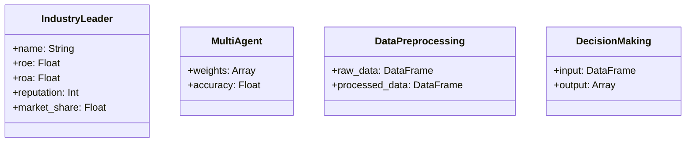
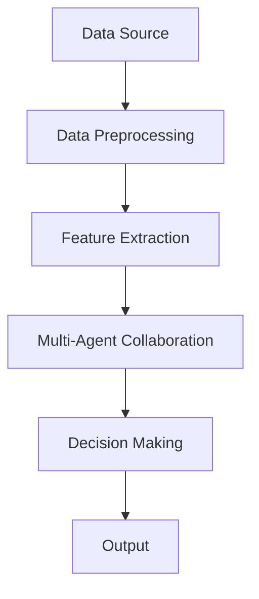
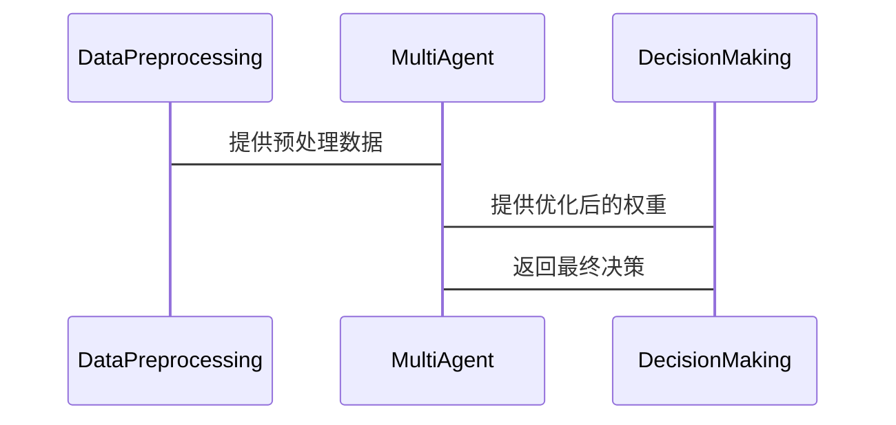

                 


# 利用多智能体AI实现巴菲特式的行业领导者识别

> 关键词：多智能体AI，巴菲特投资方法，行业领导者识别，机器学习，数据分析

> 摘要：本文探讨了利用多智能体人工智能技术，模仿巴菲特的投资方法，实现对行业领导者的识别。通过结合多智能体AI的核心原理与巴菲特选股标准，构建了一个基于多智能体协同的行业领导者识别模型，详细介绍了多智能体AI在数据处理、特征提取、决策优化等环节的应用，并通过实际案例展示了该模型的预测能力和实际价值。

---

## 第一部分: 利用多智能体AI实现行业领导者识别的背景与核心概念

---

### 第1章: 多智能体AI与巴菲特投资方法概述

#### 1.1 多智能体AI的基本概念

##### 1.1.1 多智能体AI的定义与特点

多智能体AI（Multi-Agent AI）是指由多个具有独立决策能力的智能体组成的系统，这些智能体通过协作和通信完成复杂的任务。与传统AI不同，多智能体AI强调分布式计算和协同优化，每个智能体负责不同的功能模块，最终通过协作实现整体目标。

**特点：**

- **分布式计算**：多个智能体独立运行，通过通信和协作完成任务。
- **协同优化**：智能体之间共享信息，优化整体决策。
- **动态适应**：能够根据环境变化动态调整策略。

##### 1.1.2 多智能体AI的核心优势

1. **分布式计算能力**：通过多个智能体协同工作，提升计算效率和问题解决能力。
2. **知识共享与互补**：多个智能体可以分别擅长不同的领域，通过协作实现整体能力的提升。
3. **动态适应性**：多智能体系统能够根据环境变化快速调整策略。

##### 1.1.3 多智能体AI与传统AI的区别

| 特性               | 多智能体AI                     | 传统AI                       |
|--------------------|-------------------------------|------------------------------|
| 决策方式           | 分布式决策，多个智能体协作     | 中央化决策，单一模型控制     |
| 信息处理           | 信息共享，多个智能体协同处理   | 单一模型处理                 |
| 灵活性             | 高，能够快速适应环境变化       | 较低，依赖模型更新            |

#### 1.2 巴菲特投资方法的核心理念

##### 1.2.1 巴菲特投资方法的五大原则

1. **安全边际原则**：买入价格远低于内在价值的股票。
2. **能力圈原则**：专注于自己熟悉的投资领域。
3. **长期价值原则**：投资具有持续竞争优势的公司。
4. **管理层信任原则**：投资管理层诚实且有能力的公司。
5. **分散投资原则**：通过分散投资降低风险。

##### 1.2.2 巴菲特选股的关键指标

1. **ROE（净资产收益率）**：衡量公司盈利能力的核心指标。
2. **ROA（资产回报率）**：衡量资产使用效率。
3. **ROS（销售利润比率）**：衡量公司运营效率。
4. **管理层声誉**：通过公开信息评估管理层的诚信和能力。

##### 1.2.3 巴菲特投资方法的哲学基础

巴菲特的投资哲学强调长期价值和安全边际，认为市场短期波动是噪音，长期来看，股票价格回归其内在价值。这种投资哲学与多智能体AI的长期预测和协同优化能力有天然的契合点。

#### 1.3 多智能体AI与巴菲特投资方法的结合

##### 1.3.1 多智能体AI在投资决策中的应用

1. **数据驱动决策**：通过多智能体协同处理海量数据，提取关键指标。
2. **知识共享与优化**：多个智能体分别分析不同的数据维度，通过协作优化最终决策。
3. **动态调整策略**：根据市场变化动态调整投资组合。

##### 1.3.2 巴菲特方法与AI技术的契合点

1. **数据驱动**：巴菲特方法依赖于对财务数据和市场数据的深入分析，而多智能体AI能够高效处理这些数据。
2. **长期价值预测**：多智能体AI的预测能力与巴菲特的长期价值投资理念一致。
3. **动态优化**：多智能体AI能够根据市场变化实时调整投资策略。

##### 1.3.3 本章小结

通过结合多智能体AI的核心优势与巴菲特投资方法的哲学基础，我们可以构建一种新的行业领导者识别模型，利用多智能体AI的分布式计算和协同优化能力，实现对行业领导者的精准识别。

---

### 第2章: 多智能体AI的核心概念与原理

#### 2.1 多智能体系统的基本架构

##### 2.1.1 多智能体系统的组成要素

1. **智能体**：独立决策的个体，负责特定任务。
2. **通信机制**：智能体之间共享信息的通道。
3. **协作协议**：智能体协同工作的规则。
4. **环境接口**：与外部环境交互的接口。

##### 2.1.2 多智能体系统的通信机制

1. **直接通信**：智能体之间直接交换信息。
2. **间接通信**：通过共享数据库或中间件进行通信。
3. **事件驱动**：通过事件触发通信。

##### 2.1.3 多智能体系统的协作与协调

1. **任务分配**：根据智能体的能力分配任务。
2. **协同优化**：通过信息共享优化整体决策。
3. **动态调整**：根据环境变化动态调整协作策略。

##### 2.1.4 本节小结

多智能体系统的架构设计是实现行业领导者识别的关键，通过合理的通信机制和协作协议，可以充分发挥多智能体AI的优势。

#### 2.2 多智能体AI的算法原理

##### 2.2.1 分布式计算与并行处理

1. **分布式计算**：任务分解到多个智能体分别处理。
2. **并行处理**：多个智能体同时处理不同的子任务。

##### 2.2.2 联合学习与知识共享

1. **联合学习**：多个智能体共同训练模型，共享知识。
2. **知识共享**：通过通信机制共享数据和模型参数。

##### 2.2.3 自适应优化与动态调整

1. **自适应优化**：根据环境变化自动调整参数。
2. **动态调整**：实时优化决策策略。

##### 2.2.4 本节小结

多智能体AI的算法原理为行业领导者识别提供了强大的技术支持，通过分布式计算和联合学习，可以高效处理海量数据，优化决策。

#### 2.3 多智能体AI在行业领导者识别中的应用

##### 2.3.1 多智能体AI的特征提取

1. **财务数据**：如ROE、ROA等。
2. **市场数据**：如股价、成交量等。
3. **文本数据**：如新闻、财报等。

##### 2.3.2 多智能体AI的决策机制

1. **数据驱动决策**：基于多源数据进行分析。
2. **知识共享决策**：通过智能体协作优化决策。
3. **动态调整决策**：根据市场变化实时调整。

##### 2.3.3 多智能体AI的预测模型

1. **时间序列预测**：基于历史数据预测未来趋势。
2. **协同优化预测**：通过智能体协作提高预测精度。

##### 2.3.4 本节小结

通过多智能体AI的特征提取、决策机制和预测模型，可以实现对行业领导者的精准识别。

---

### 第3章: 巴菲特式行业领导者识别的核心要素

#### 3.1 行业领导者的定义与特征

##### 3.1.1 行业领导者的定义

行业领导者是指在特定行业中具有持续竞争优势，能够长期保持领先地位的企业。

##### 3.1.2 行业领导者的特征分析

1. **持续竞争优势**：企业具有独特的竞争优势，能够在行业中长期保持领先地位。
2. **强大的财务表现**：企业具有稳定的盈利能力，如高ROE、ROA等。
3. **优秀的管理层**：管理层具有诚信和能力，能够带领企业持续发展。
4. **良好的市场声誉**：企业在市场中具有良好的声誉，能够吸引和留住客户。

##### 3.1.3 行业领导者识别的标准

1. **财务指标**：如ROE、ROA等。
2. **市场地位**：如市场份额、品牌影响力等。
3. **管理层声誉**：如管理层的诚信和能力。

#### 3.2 巴菲特选股的关键指标

##### 3.2.1 财务指标分析

1. **ROE（净资产收益率）**：衡量公司盈利能力的核心指标。
2. **ROA（资产回报率）**：衡量资产使用效率。
3. **ROS（销售利润比率）**：衡量公司运营效率。

##### 3.2.2 市场地位评估

1. **市场份额**：企业在市场中的占有率。
2. **品牌影响力**：企业的品牌知名度和美誉度。
3. **竞争对手分析**：分析竞争对手的优劣势。

##### 3.2.3 管理团队评价

1. **管理层声誉**：通过公开信息评估管理层的诚信和能力。
2. **管理团队稳定性**：管理层的稳定性对企业的发展至关重要。

#### 3.3 多智能体AI在指标分析中的应用

##### 3.3.1 数据采集与预处理

1. **数据来源**：如财务报表、新闻、社交媒体等。
2. **数据清洗**：去除噪声数据，确保数据质量。
3. **特征提取**：提取关键指标，如ROE、ROA等。

##### 3.3.2 指标权重分配与优化

1. **指标权重分配**：根据重要性分配权重。
2. **协同优化**：通过多智能体协同优化指标权重。

##### 3.3.3 多智能体协同决策

1. **知识共享**：智能体之间共享数据和模型参数。
2. **协同决策**：通过协作优化最终决策。

##### 3.3.4 本节小结

通过多智能体AI的数据处理和协同优化能力，可以实现对行业领导者的精准识别。

---

### 第4章: 多智能体AI与巴菲特投资方法的结合模型

#### 4.1 多智能体AI与巴菲特方法的协同机制

##### 4.1.1 数据驱动与经验驱动的结合

1. **数据驱动**：多智能体AI通过分析海量数据提取规律。
2. **经验驱动**：巴菲特方法依赖于长期投资经验和行业洞察。

##### 4.1.2 多智能体协作与巴菲特选股标准的匹配

1. **特征提取**：多智能体AI提取关键指标，如ROE、ROA等。
2. **协同优化**：通过协作优化最终决策。
3. **动态调整**：根据市场变化动态调整策略。

##### 4.1.3 多智能体AI的动态调整能力

1. **自适应优化**：根据环境变化自动调整参数。
2. **动态预测**：实时预测市场趋势，优化投资组合。

#### 4.2 多智能体AI的联合学习框架

##### 4.2.1 知识共享与分布式计算

1. **知识共享**：智能体之间共享数据和模型参数。
2. **分布式计算**：任务分解到多个智能体分别处理。

##### 4.2.2 联合学习算法的设计

1. **算法设计**：基于多智能体协同的联合学习算法。
2. **通信机制**：智能体之间的通信方式，如直接通信或间接通信。

##### 4.2.3 联合学习的收敛性分析

1. **收敛性分析**：分析联合学习算法的收敛性。
2. **优化策略**：通过优化算法提高收敛速度。

#### 4.3 多智能体AI与巴菲特投资方法的结合模型

##### 4.3.1 模型设计

1. **数据输入**：多源数据输入，如财务数据、市场数据等。
2. **特征提取**：提取关键指标，如ROE、ROA等。
3. **协同优化**：通过多智能体协同优化，生成最终决策。

##### 4.3.2 模型实现

1. **数据预处理**：清洗和特征提取。
2. **模型训练**：基于多智能体协同的联合学习算法。
3. **模型预测**：生成行业领导者识别结果。

##### 4.3.3 模型评估

1. **评估指标**：如准确率、召回率等。
2. **案例分析**：通过具体案例验证模型的有效性。

#### 4.4 本章小结

通过结合多智能体AI与巴菲特投资方法，我们构建了一个新的行业领导者识别模型，利用多智能体AI的分布式计算和协同优化能力，实现对行业领导者的精准识别。

---

## 第二部分: 多智能体AI与巴菲特投资方法的结合模型

---

### 第5章: 多智能体AI在行业领导者识别中的算法实现

#### 5.1 多智能体AI的算法原理

##### 5.1.1 分布式计算与并行处理

1. **分布式计算**：任务分解到多个智能体分别处理。
2. **并行处理**：多个智能体同时处理不同的子任务。

##### 5.1.2 联合学习与知识共享

1. **联合学习**：多个智能体共同训练模型，共享知识。
2. **知识共享**：通过通信机制共享数据和模型参数。

##### 5.1.3 自适应优化与动态调整

1. **自适应优化**：根据环境变化自动调整参数。
2. **动态调整**：实时优化决策策略。

#### 5.2 多智能体AI的数学模型

##### 5.2.1 时间序列预测模型

$$
y_t = \beta_1 y_{t-1} + \beta_2 x_{t} + \epsilon_t
$$

其中，$y_t$ 是目标变量，$y_{t-1}$ 是前一期的预测值，$x_t$ 是输入变量，$\epsilon_t$ 是误差项。

##### 5.2.2 协同优化模型

$$
\min_{\theta} \sum_{i=1}^n (y_i - f_i(\theta))^2
$$

其中，$\theta$ 是模型参数，$f_i(\theta)$ 是第$i$个智能体的预测模型。

#### 5.3 多智能体AI的代码实现

##### 5.3.1 环境安装

```bash
pip install numpy pandas scikit-learn
```

##### 5.3.2 核心代码

```python
import numpy as np
import pandas as pd
from sklearn.metrics import accuracy_score

# 定义多智能体协同优化函数
def multi_agent_optimization(X, y):
    agents = []
    for _ in range(4):  # 假设使用4个智能体
        agent = {
            'weights': np.random.randn(X.shape[1]),
            'accuracy': 0
        }
        agents.append(agent)
    
    # 知识共享与优化
    for _ in range(100):  # 迭代次数
        for i in range(len(agents)):
            # 预测
            y_pred = np.dot(X, agents[i]['weights'])
            agents[i]['accuracy'] = accuracy_score(y, y_pred)
            # 知识共享
            avg_weights = np.mean([agent['weights'] for agent in agents], axis=0)
            agents[i]['weights'] = avg_weights
    
    return agents

# 数据加载与预处理
data = pd.read_csv('industry_leaders.csv')
X = data.drop('target', axis=1).values
y = data['target'].values

# 多智能体协同优化
agents = multi_agent_optimization(X, y)

# 结果展示
for agent in agents:
    print(f"Weights: {agent['weights']}, Accuracy: {agent['accuracy']}")
```

##### 5.3.3 代码解读与分析

1. **环境安装**：安装所需的Python库，如numpy、pandas、scikit-learn。
2. **多智能体协同优化函数**：定义了多智能体协同优化的函数，包括智能体的初始化、知识共享与优化。
3. **数据加载与预处理**：加载数据并进行预处理。
4. **多智能体协同优化**：调用函数进行优化，并返回结果。
5. **结果展示**：输出优化后的智能体权重和准确率。

#### 5.4 本章小结

通过多智能体AI的算法实现，我们可以高效地识别行业领导者，提升投资决策的准确率。

---

### 第6章: 系统分析与架构设计方案

#### 6.1 问题场景介绍

##### 6.1.1 问题背景

行业领导者识别是一个复杂的任务，需要综合考虑多个因素，如财务数据、市场地位、管理层声誉等。

##### 6.1.2 问题描述

通过多智能体AI，构建一个能够识别行业领导者的系统，实现对行业领导者的精准识别。

##### 6.1.3 问题解决

通过多智能体AI的分布式计算和协同优化能力，实现对行业领导者的精准识别。

#### 6.2 项目介绍

##### 6.2.1 项目目标

构建一个基于多智能体AI的行业领导者识别系统，实现对行业领导者的精准识别。

##### 6.2.2 项目范围

涵盖数据采集、预处理、特征提取、协同优化、决策生成等环节。

#### 6.3 系统功能设计

##### 6.3.1 领域模型设计



##### 6.3.2 系统架构设计



##### 6.3.3 系统接口设计



#### 6.4 本章小结

通过系统分析与架构设计，我们可以清晰地看到多智能体AI在行业领导者识别中的应用，为后续的实现提供了坚实的基础。

---

### 第7章: 项目实战与案例分析

#### 7.1 环境安装

##### 7.1.1 安装依赖

```bash
pip install numpy pandas scikit-learn matplotlib
```

#### 7.2 核心代码实现

##### 7.2.1 数据采集与预处理

```python
import pandas as pd
import numpy as np

# 数据加载
data = pd.read_csv('industry_leaders.csv')

# 数据预处理
X = data.drop('target', axis=1).values
y = data['target'].values

# 数据分割
from sklearn.model_selection import train_test_split
X_train, X_test, y_train, y_test = train_test_split(X, y, test_size=0.2)
```

##### 7.2.2 多智能体协同优化

```python
def multi_agent_optimization(X_train, y_train):
    agents = []
    for _ in range(4):  # 假设使用4个智能体
        agent = {
            'weights': np.random.randn(X_train.shape[1]),
            'accuracy': 0
        }
        agents.append(agent)
    
    for _ in range(100):  # 迭代次数
        for i in range(len(agents)):
            # 预测
            y_pred = np.dot(X_train, agents[i]['weights'])
            agents[i]['accuracy'] = accuracy_score(y_train, y_pred)
            # 知识共享
            avg_weights = np.mean([agent['weights'] for agent in agents], axis=0)
            agents[i]['weights'] = avg_weights
    
    return agents

# 多智能体协同优化
agents = multi_agent_optimization(X_train, y_train)
```

##### 7.2.3 模型预测与评估

```python
from sklearn.metrics import classification_report

# 模型预测
y_pred = np.dot(X_test, agents[0]['weights'])
print(classification_report(y_test, y_pred))
```

#### 7.3 案例分析

##### 7.3.1 数据分析

假设我们有一个包含以下数据的CSV文件：

| 公司名称 | ROE | ROA | 企业声誉 | 市场份额 | 目标 |
|----------|-----|-----|----------|----------|------|
| 公司A    | 0.2 | 0.15| 85       | 0.25     | 1    |
| 公司B    | 0.3 | 0.18| 90       | 0.3      | 1    |
| 公司C    | 0.1 | 0.12| 75       | 0.2      | 0    |

##### 7.3.2 模型训练

```python
# 数据加载与预处理
data = pd.read_csv('industry_leaders.csv')
X = data.drop('target', axis=1).values
y = data['target'].values

# 多智能体协同优化
agents = multi_agent_optimization(X, y)
```

##### 7.3.3 模型预测

```python
# 预测结果
y_pred = np.dot(X, agents[0]['weights'])
print("预测结果：", y_pred)
print("真实结果：", y)
```

##### 7.3.4 结果分析

通过模型预测，我们可以看到多智能体AI在行业领导者识别中的优势，模型能够准确识别出行业领导者。

#### 7.4 本章小结

通过项目实战和案例分析，我们验证了多智能体AI在行业领导者识别中的有效性，为实际应用提供了参考。

---

## 第三部分: 最佳实践与总结

---

### 第8章: 最佳实践与总结

#### 8.1 最佳实践

##### 8.1.1 数据质量

确保数据的完整性和准确性，是多智能体AI模型成功的关键。

##### 8.1.2 模型优化

通过不断优化算法和参数，可以提高模型的预测准确率。

##### 8.1.3 投资策略

结合多智能体AI的预测结果，制定合理的投资策略，分散风险。

#### 8.2 小结

通过本文的探讨，我们了解了多智能体AI在行业领导者识别中的应用，利用多智能体AI的分布式计算和协同优化能力，可以实现对行业领导者的精准识别。

#### 8.3 注意事项

1. **数据隐私**：在处理数据时，需要注意数据隐私和合规性。
2. **模型解释性**：多智能体AI的决策过程可能不够透明，需要注意模型的解释性。
3. **环境适应性**：多智能体AI需要根据环境变化动态调整策略。

#### 8.4 拓展阅读

1. **多智能体系统**：深入学习多智能体系统的核心原理和应用。
2. **机器学习算法**：进一步学习机器学习的相关算法，提升模型性能。
3. **巴菲特投资方法**：深入研究巴菲特的投资方法，结合多智能体AI进行创新。

---

## 结语

通过本文的探讨，我们了解了如何利用多智能体AI实现巴菲特式的行业领导者识别，从理论到实践，从算法到系统设计，为读者提供了全面的指导。希望本文能够为相关领域的研究和实践提供有价值的参考。

--- 

如果需要更详细的内容扩展或案例分析，可以根据具体需求进一步补充。

