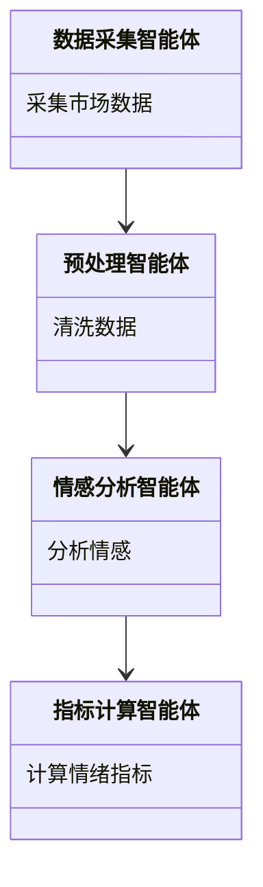
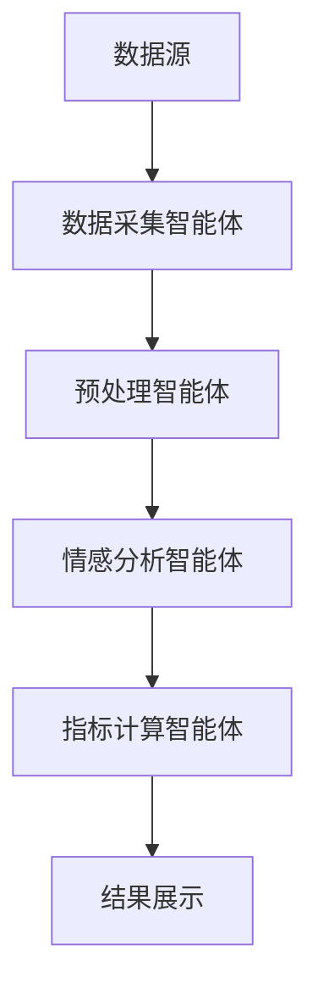
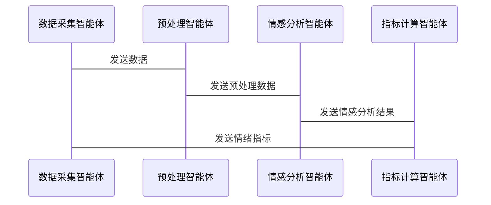

                 


# 利用多智能体AI构建动态市场情绪指标

> 关键词：多智能体AI，市场情绪，动态指标，自然语言处理，实时分析，协同学习

> 摘要：本文探讨了利用多智能体AI技术构建动态市场情绪指标的方法，通过分析市场情绪的核心概念、多智能体系统的协作机制、情感分析算法的实现、系统架构设计以及项目实战，全面阐述了如何利用多智能体技术实现对市场情绪的实时、动态监测与分析。

---

## 第一部分: 多智能体AI与市场情绪指标概述

### 第1章: 问题背景与概念

#### 1.1 市场情绪指标的重要性
市场情绪指标是金融领域中用来反映市场参与者情绪的重要工具，能够帮助投资者做出更明智的决策。传统的市场情绪指标多基于历史数据和统计分析，但难以捕捉实时市场动态和复杂的情绪变化。

#### 1.2 多智能体AI的特点
多智能体AI是一种分布式计算范式，通过多个智能体协作完成复杂任务。每个智能体都有特定的职责和知识，能够独立决策并与其他智能体协同工作。这种架构能够高效地处理实时数据，并适应复杂多变的市场环境。

#### 1.3 动态市场情绪指标的意义
动态市场情绪指标能够实时捕捉市场情绪的变化，帮助投资者快速响应市场波动。利用多智能体AI构建动态指标，可以更准确地反映市场的实时情绪，提高投资决策的及时性和准确性。

---

### 第2章: 多智能体系统与市场情绪分析的核心概念

#### 2.1 多智能体系统的构成
- **智能体角色**：数据采集智能体、预处理智能体、情感分析智能体、指标计算智能体。
- **智能体交互机制**：通过消息传递机制进行协作，每个智能体负责特定任务并向上级智能体汇报结果。

#### 2.2 市场情绪分析的核心要素
- **数据来源**：新闻、社交媒体、论坛、机构报告等。
- **情感极性分析**：分为正面、负面和中性三类，通过自然语言处理技术实现。
- **动态变化**：市场情绪会随着时间推移而变化，需要实时更新和调整。

#### 2.3 多智能体与动态指标的关系
- **实时数据处理**：多智能体系统能够实时采集和处理市场数据。
- **智能体协作优化**：通过协作，多个智能体可以共同优化情绪指标的计算。
- **系统的可扩展性与灵活性**：多智能体系统可以根据需求扩展或调整智能体数量和功能。

---

## 第二部分: 动态市场情绪指标的算法实现

### 第3章: 情感分析算法

#### 3.1 基于规则的情感分析
- **规则定义**：通过预定义的关键词和规则，判断文本的情感倾向。
- **优缺点**：简单易实现，但难以应对复杂语境和情感细微变化。

#### 3.2 基于机器学习的情感分析
- **算法选择**：常用支持向量机（SVM）和随机森林（Random Forest）。
- **特征提取**：使用词袋模型（Bag of Words）或TF-IDF提取特征。
- **训练与预测**：通过训练数据训练模型，对新文本进行情感分类。

#### 3.3 基于深度学习的情感分析
- **模型选择**：使用循环神经网络（RNN）或Transformer模型。
- **优势**：能够捕捉文本的上下文信息，提高情感分类的准确性。

### 第4章: 多智能体协作算法

#### 4.1 智能体协作机制
- **任务分配**：根据智能体的专长和当前负载，动态分配任务。
- **信息共享**：通过共享层进行信息同步，确保各智能体之间的协作。
- **决策协调**：通过协商机制，协调各智能体的决策以实现最优结果。

#### 4.2 协作算法流程
1. 数据采集智能体实时采集市场数据。
2. 预处理智能体对数据进行清洗和转换。
3. 情感分析智能体对数据进行情感分类。
4. 指标计算智能体整合各智能体的分析结果，计算动态市场情绪指标。
5. 结果反馈给各智能体，进行持续优化。

---

## 第三部分: 系统分析与架构设计

### 第5章: 系统功能设计

#### 5.1 项目背景
- **目标**：构建一个实时、动态的市场情绪指标系统。
- **用户需求**：投资者需要快速、准确的市场情绪反馈。

#### 5.2 系统功能模块
- **数据采集模块**：实时采集市场数据。
- **数据预处理模块**：清洗和转换数据。
- **情感分析模块**：对数据进行情感分类。
- **指标计算模块**：整合分析结果，计算动态情绪指标。
- **结果展示模块**：以可视化方式展示情绪指标。

#### 5.3 领域模型设计


#### 5.4 系统架构设计


#### 5.5 接口设计
- **数据接口**：数据采集智能体与数据源的接口。
- **协作接口**：智能体之间的协作接口，用于信息共享和任务分配。

#### 5.6 交互设计


---

## 第四部分: 项目实战

### 第6章: 项目实现

#### 6.1 环境安装
- **Python**：安装Python 3.8及以上版本。
- **库依赖**：安装 `pandas`, `numpy`, `scikit-learn`, `transformers`。

#### 6.2 核心代码实现

##### 数据采集智能体
```python
import requests
import json

def collect_data(api_key):
    headers = {'Authorization': f'Bearer {api_key}'}
    response = requests.get('https://api.marketdata.com/realtimesentiment', headers=headers)
    return response.json()
```

##### 预处理智能体
```python
import pandas as pd

def preprocess_data(data):
    df = pd.DataFrame(data)
    df['timestamp'] = pd.to_datetime(df['timestamp'])
    return df
```

##### 情感分析智能体
```python
from transformers import pipeline

sentiment_pipeline = pipeline("sentiment-analysis")

def analyze_sentiment(text):
    result = sentiment_pipeline(text)
    return result[0]['label']
```

##### 指标计算智能体
```python
import numpy as np

def calculate_sentiment_index(sentiments):
    positive = sum(1 for s in sentiments if s == 'positive')
    negative = sum(1 for s in sentiments if s == 'negative')
    neutral = len(sentiments) - positive - negative
    index = (positive - negative) / len(sentiments)
    return index
```

##### 结果展示
```python
def display_index(index):
    print(f"当前市场情绪指数为：{index}")
```

#### 6.3 代码解读与分析
- **数据采集**：通过API接口获取实时市场数据。
- **预处理**：将数据转换为易于分析的格式。
- **情感分析**：使用预训练的情感分析模型对数据进行分类。
- **指标计算**：根据情感分类结果计算市场情绪指数。
- **结果展示**：以可视化的方式展示情绪指数。

#### 6.4 实际案例分析
假设我们从社交媒体上获取了以下文本：
- "市场表现强劲，预期将继续上涨。"
- "最近的经济数据令人担忧，可能影响市场表现。"

通过情感分析智能体，第一条文本为正面，第二条为负面。计算情绪指数为：
$$
\text{指数} = \frac{(1 - 1)}{2} = 0
$$
结果为0，表示市场情绪中性。

---

## 第五部分: 总结与展望

### 第7章: 最佳实践与注意事项

#### 7.1 最佳实践
- **数据多样性**：确保数据来源多样化，涵盖不同市场和时间段。
- **模型优化**：定期更新情感分析模型，提升分类准确率。
- **系统维护**：及时修复系统漏洞，确保智能体协作顺畅。

#### 7.2 小结
本文详细介绍了利用多智能体AI构建动态市场情绪指标的方法，从理论到实践，全面阐述了系统的构建过程。

#### 7.3 注意事项
- 数据隐私问题：确保数据采集和处理符合相关法律法规。
- 系统稳定性：多智能体系统需要考虑容错和容灾设计。
- 性能优化：根据实际需求优化算法和系统架构，提升运行效率。

#### 7.4 拓展阅读
- 《多智能体系统与分布式计算》
- 《自然语言处理与情感分析》
- 《金融市场动态分析与预测》

---

通过本文的详细讲解，读者可以掌握利用多智能体AI构建动态市场情绪指标的核心方法，并能够实际操作相关技术。希望本文对读者在金融领域的技术实践有所帮助。

