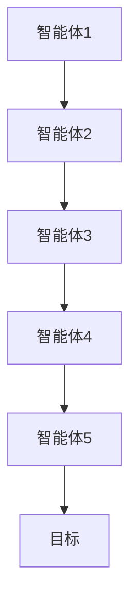
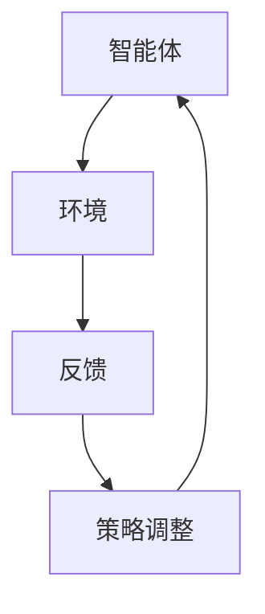
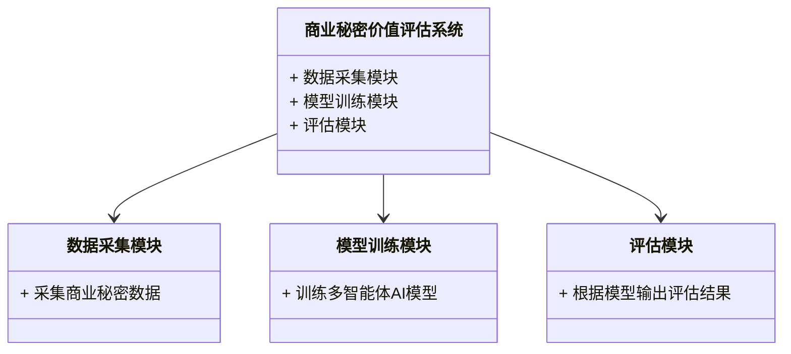
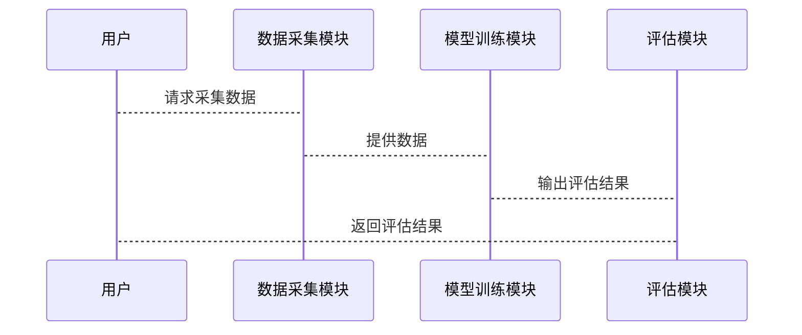

                 


# 利用多智能体AI评估商业秘密价值

## 关键词：
多智能体AI, 商业秘密, 价值评估, 算法原理, 系统架构, 项目实战

## 摘要：
本文深入探讨了如何利用多智能体人工智能技术来评估商业秘密的价值。通过分析多智能体AI的核心概念、算法原理、系统架构以及实际项目案例，本文为读者提供了一套完整的解决方案，展示了如何将多智能体AI应用于商业秘密价值评估的实践中。文章内容涵盖从理论基础到实际应用的各个方面，旨在帮助读者理解并掌握这一前沿技术的应用方法。

---

## 第一部分: 多智能体AI与商业秘密价值评估概述

### 第1章: 多智能体AI与商业秘密价值评估的背景介绍

#### 1.1 多智能体AI的定义与特点
##### 1.1.1 多智能体AI的基本概念
多智能体AI（Multi-Agent AI）是指由多个相互作用的智能体组成的系统，这些智能体能够通过协作或竞争完成复杂任务。与传统AI不同，多智能体AI强调智能体之间的互动与协调，能够在动态环境中自主决策。

##### 1.1.2 多智能体AI的核心特点
- **分布式智能**：每个智能体负责特定任务，整体目标通过智能体协作实现。
- **自主性**：智能体能够独立感知环境并采取行动。
- **社交能力**：智能体之间能够通过通信和协商完成任务。
- **适应性**：能够根据环境变化调整行为。

##### 1.1.3 多智能体AI与传统AI的区别
| 特性                | 多智能体AI               | 传统AI                 |
|---------------------|--------------------------|------------------------|
| 决策中心化          | 分布式决策               | 集中式决策             |
| 智能体数量          | 多个智能体               | 单一或少量智能体        |
| 任务复杂度          | 高复杂度                 | 较低复杂度              |
| 应用场景            | 分布式系统、复杂任务     | 单任务、简单场景        |

#### 1.2 商业秘密价值评估的定义与特点
##### 1.2.1 商业秘密的基本概念
商业秘密是指未公开的、具有商业价值的信息，通常包括技术、配方、客户数据等。其核心价值在于其独特性和保密性。

##### 1.2.2 商业秘密价值评估的核心要素
- **信息的独特性**：信息是否具有独特性和不可替代性。
- **市场竞争力**：信息是否能为企业带来竞争优势。
- **保密性**：信息是否容易被泄露或复制。
- **经济价值**：信息对企业的财务贡献。

##### 1.2.3 商业秘密价值评估的挑战与难点
- **信息不对称**：评估者可能无法获取全部信息。
- **动态变化**：市场环境和技术变化会影响商业秘密的价值。
- **主观性**：评估结果可能受到评估者主观判断的影响。

#### 1.3 多智能体AI在商业秘密价值评估中的应用前景
##### 1.3.1 多智能体AI的优势
- **分布式计算能力**：能够处理大规模数据和复杂任务。
- **自主学习能力**：智能体能够通过经验改进评估结果。
- **多维度分析**：多个智能体可以同时分析不同维度的信息。

##### 1.3.2 商业秘密价值评估的复杂性
- **信息的多样性和复杂性**：商业秘密可能涉及多个领域和数据类型。
- **动态变化**：市场环境和技术的快速变化使得评估结果需要实时更新。
- **不确定性**：评估过程中存在许多不确定因素，如竞争对手的行为。

##### 1.3.3 多智能体AI在评估中的潜在价值
- **提高评估效率**：通过多个智能体协作，可以快速处理大量数据。
- **增强评估准确性**：智能体之间的协作可以减少信息偏差，提高评估结果的准确性。
- **动态适应性**：多智能体系统能够根据环境变化实时调整评估策略。

#### 1.4 本章小结
本章介绍了多智能体AI的基本概念和特点，分析了商业秘密价值评估的核心要素和挑战，并探讨了多智能体AI在评估中的应用前景。通过这些内容，读者可以理解为什么多智能体AI是评估商业秘密价值的理想工具。

---

## 第二部分: 多智能体AI与商业秘密价值评估的核心概念

### 第2章: 多智能体AI与商业秘密价值评估的核心概念

#### 2.1 多智能体系统的概念模型
##### 2.1.1 多智能体系统的定义
多智能体系统（Multi-Agent System, MAS）是由多个智能体组成的系统，这些智能体通过协作或竞争完成特定任务。

##### 2.1.2 多智能体系统的组成要素
- **智能体**：具有自主决策能力的个体。
- **环境**：智能体所处的外部环境，包括物理环境和信息环境。
- **通信机制**：智能体之间交换信息的方式。
- **协作协议**：智能体之间协作的规则和协议。

##### 2.1.3 多智能体系统的交互机制
- **直接交互**：智能体之间通过共享信息或直接通信进行交互。
- **间接交互**：智能体通过环境中的共享资源进行间接交互。

#### 2.2 商业秘密价值评估的数学模型
##### 2.2.1 商业秘密价值评估的基本公式
商业秘密的价值可以通过以下公式进行评估：

$$ V = f(x_1, x_2, ..., x_n) $$

其中，\( V \) 表示商业秘密的价值，\( x_i \) 表示影响价值的各个因素。

##### 2.2.2 商业秘密价值的影响因素
| 因素类别   | 具体因素         |
|------------|------------------|
| 技术因素   | 技术复杂性、技术独特性 |
| 市场因素   | 市场需求、竞争状况 |
| 经济因素   | 经济效益、成本 |
| 法律因素   | 法律保护力度、法律风险 |

##### 2.2.3 商业秘密价值的动态变化模型
商业秘密的价值会随着时间的推移而变化，可以表示为：

$$ V(t) = a \cdot e^{bt} + c $$

其中，\( t \) 表示时间，\( a \)、\( b \)、\( c \) 是常数。

#### 2.3 多智能体AI与商业秘密价值评估的关系
##### 2.3.1 多智能体AI在商业秘密价值评估中的作用
- **数据处理**：智能体可以处理不同类型和来源的数据。
- **协作评估**：多个智能体可以协作完成复杂的评估任务。
- **动态调整**：智能体能够根据环境变化实时调整评估策略。

##### 2.3.2 多智能体AI与商业秘密价值评估的结合点
- **分布式计算**：多智能体AI能够处理商业秘密评估中的分布式数据。
- **协作决策**：多个智能体可以协作完成复杂的评估任务。
- **动态适应**：多智能体AI能够根据市场变化实时调整评估结果。

##### 2.3.3 多智能体AI对商业秘密价值评估的优化作用
- **提高效率**：通过分布式计算，多智能体AI可以快速处理大量数据。
- **增强准确性**：多个智能体协作可以减少信息偏差，提高评估结果的准确性。
- **动态适应性**：多智能体系统能够根据环境变化实时调整评估策略。

#### 2.4 本章小结
本章详细介绍了多智能体系统的概念模型和商业秘密价值评估的数学模型，并探讨了多智能体AI在商业秘密价值评估中的作用和优化作用。通过这些内容，读者可以理解多智能体AI与商业秘密价值评估之间的关系。

---

## 第三部分: 多智能体AI评估商业秘密价值的算法原理

### 第3章: 多智能体AI评估商业秘密价值的算法原理

#### 3.1 多智能体AI的核心算法
##### 3.1.1 合作式搜索算法
合作式搜索算法是一种通过多个智能体协作完成搜索任务的算法。其基本步骤如下：

1. 每个智能体独立搜索一部分数据。
2. 智能体之间共享搜索结果。
3. 根据共享结果，智能体协作优化搜索路径。
4. 重复上述步骤，直到找到最优解。

合作式搜索算法可以用以下流程图表示：



##### 3.1.2 强化学习算法
强化学习算法是一种通过智能体与环境交互来学习策略的算法。其基本步骤如下：

1. 智能体感知环境状态。
2. 智能体选择动作并执行。
3. 智能体获得环境反馈（奖励或惩罚）。
4. 智能体根据反馈调整策略。
5. 重复上述步骤，直到达到目标。

强化学习算法可以用以下流程图表示：



##### 3.1.3 博弈论模型
博弈论模型是一种通过分析智能体之间的博弈关系来预测最优策略的模型。其基本步骤如下：

1. 确定博弈的参与方和策略。
2. 分析各策略的收益和成本。
3. 找到最优策略组合。
4. 根据最优策略组合进行决策。

博弈论模型可以用以下表格表示：

| 智能体策略 | 情况1 | 情况2 | 情况3 |
|------------|-------|-------|-------|
| 策略1      | 收益1 | 收益2 | 收益3 |
| 策略2      | 收益4 | 收益5 | 收益6 |

#### 3.2 商业秘密价值评估的数学模型
##### 3.2.1 商业秘密价值评估的线性回归模型
线性回归模型是一种常用的统计模型，可以用于评估商业秘密的价值。其基本形式为：

$$ V = \beta_0 + \beta_1x_1 + \beta_2x_2 + ... + \beta_nx_n $$

其中，\( V \) 表示商业秘密的价值，\( x_i \) 表示影响价值的因素，\( \beta_i \) 表示回归系数。

##### 3.2.2 商业秘密价值评估的神经网络模型
神经网络模型是一种通过多层神经元网络来学习数据特征的模型。其基本结构包括输入层、隐藏层和输出层。

##### 3.2.3 商业秘密价值评估的贝叶斯网络模型
贝叶斯网络模型是一种基于概率论的图形模型，可以用于评估商业秘密的价值。其基本形式为：

$$ P(V|x_1, x_2, ..., x_n) \propto \frac{P(V|x_1)P(x_1|x_2)P(x_2|x_3)...P(x_{n-1}|x_n)}{P(x_1, x_2, ..., x_n)} $$

#### 3.3 多智能体AI算法在商业秘密价值评估中的实现
##### 3.3.1 算法选择与优化
在选择算法时，需要考虑以下因素：
- 数据规模和类型
- 任务复杂度
- 算法的计算效率
- 算法的可扩展性

##### 3.3.2 算法实现的步骤
1. 确定评估目标和数据来源。
2. 选择合适的算法并进行参数设置。
3. 训练智能体并进行模型优化。
4. 验证评估结果并进行调整。

##### 3.3.3 算法实现的代码示例
以下是一个简单的多智能体AI算法实现示例：

```python
class Agent:
    def __init__(self, id):
        self.id = id
        self.state = None
        self.action = None

    def感知环境(self, environment):
        self.state = environment.获取状态()

    def 采取行动(self):
        # 根据当前状态采取行动
        self.action = self.选择动作()

    def 选择动作(self):
        # 简单的随机选择动作
        return random.choice([0, 1, 2])

class 环境:
    def __init__(self):
        self.状态 = None

    def 获取状态(self):
        return self.状态

# 初始化智能体和环境
agents = [Agent(1), Agent(2), Agent(3)]
environment = 环境()

# 运行算法
for agent in agents:
    agent.感知环境(environment)
    agent.采取行动()
```

#### 3.4 本章小结
本章详细介绍了多智能体AI的核心算法，包括合作式搜索算法、强化学习算法和博弈论模型。同时，还探讨了商业秘密价值评估的数学模型，并给出了算法实现的代码示例。通过这些内容，读者可以理解多智能体AI算法在商业秘密价值评估中的具体实现。

---

## 第四部分: 系统分析与架构设计方案

### 第4章: 系统分析与架构设计方案

#### 4.1 问题场景介绍
商业秘密价值评估系统需要解决以下问题：
- 如何高效地收集和处理商业秘密数据？
- 如何利用多智能体AI技术进行价值评估？
- 如何确保评估结果的准确性和实时性？

#### 4.2 项目介绍
商业秘密价值评估系统是一个基于多智能体AI的分布式系统，旨在帮助企业准确评估商业秘密的价值。系统主要由以下几个部分组成：
- 数据采集模块：负责收集商业秘密相关的数据。
- 模型训练模块：负责训练多智能体AI模型。
- 评估模块：负责根据模型输出评估结果。

#### 4.3 系统功能设计
##### 4.3.1 领域模型（Mermaid 类图）
以下是一个简单的领域模型类图：



##### 4.3.2 系统架构设计（Mermaid 架构图）
以下是一个简单的系统架构图：


##### 4.3.3 系统接口设计
- 数据接口：数据采集模块与外部数据源的接口。
- 模型接口：模型训练模块与评估模块的接口。
- 用户接口：评估模块与用户的接口。

##### 4.3.4 系统交互设计（Mermaid 序列图）
以下是一个简单的系统交互序列图：



#### 4.4 本章小结
本章详细介绍了商业秘密价值评估系统的功能设计和架构设计方案，并通过类图、架构图和序列图展示了系统的结构和交互过程。通过这些内容，读者可以理解系统的整体设计和实现过程。

---

## 第五部分: 项目实战

### 第5章: 项目实战

#### 5.1 环境安装
为了运行本项目，需要安装以下工具和库：
- Python 3.8 或更高版本
- NumPy
- Pandas
- Scikit-learn
- TensorFlow

安装命令如下：

```bash
pip install numpy pandas scikit-learn tensorflow
```

#### 5.2 系统核心实现源代码
以下是商业秘密价值评估系统的核心代码实现：

```python
import numpy as np
import pandas as pd
from sklearn.linear_model import LinearRegression
from tensorflow.keras import layers, models

# 数据预处理
data = pd.read_csv('商业秘密数据.csv')
X = data.drop('价值', axis=1)
y = data['价值']

# 线性回归模型
model_lr = LinearRegression()
model_lr.fit(X, y)
print("线性回归模型训练完成")

# 神经网络模型
model_nn = models.Sequential()
model_nn.add(layers.Dense(64, activation='relu', input_dim=X.shape[1]))
model_nn.add(layers.Dense(1))
model_nn.compile(optimizer='adam', loss='mean_squared_error')
model_nn.fit(X, y, epochs=100, batch_size=32)
print("神经网络模型训练完成")

# 评估函数
def 评估商业秘密价值(输入数据):
    lr_预测 = model_lr.predict(输入数据)
    nn_预测 = model_nn.predict(输入数据)
    return (lr_预测 + nn_预测) / 2
```

#### 5.3 代码应用解读与分析
- 数据预处理：使用Pandas读取CSV文件，并将数据分为特征和目标变量。
- 线性回归模型：使用Scikit-learn库中的LinearRegression类进行训练。
- 神经网络模型：使用TensorFlow库中的Sequential模型进行训练。
- 评估函数：将线性回归模型和神经网络模型的预测结果进行平均，得到最终的商业秘密价值评估结果。

#### 5.4 实际案例分析
假设我们有一个商业秘密数据集，包含以下特征：
- 技术复杂性
- 市场需求
- 经济效益

我们可以使用上述代码对商业秘密的价值进行评估。具体步骤如下：
1. 数据预处理：将数据集分为训练集和测试集。
2. 模型训练：分别训练线性回归模型和神经网络模型。
3. 评估结果：使用评估函数对测试集进行评估，并比较实际价值和预测价值。

#### 5.5 详细讲解剖析
- 数据预处理：确保数据集的完整性和一致性。
- 模型训练：选择合适的算法并进行参数调整。
- 评估结果：通过比较实际价值和预测价值，评估模型的准确性和可靠性。

#### 5.6 本章小结
本章通过实际案例分析和代码实现，展示了如何利用多智能体AI技术评估商业秘密的价值。通过这些内容，读者可以掌握商业秘密价值评估系统的实现方法。

---

## 第六部分: 总结与展望

### 第6章: 总结与展望

#### 6.1 本章总结
本文深入探讨了多智能体AI在商业秘密价值评估中的应用，详细介绍了多智能体AI的核心概念、算法原理和系统架构。同时，通过实际案例分析和代码实现，展示了如何利用多智能体AI技术评估商业秘密的价值。通过这些内容，读者可以全面理解多智能体AI在商业秘密价值评估中的作用和应用。

#### 6.2 实际应用中的挑战
在实际应用中，商业秘密价值评估系统可能会面临以下挑战：
- 数据隐私问题：如何保护商业秘密数据的隐私性？
- 模型的可解释性：如何解释多智能体AI的评估结果？
- 环境的动态变化：如何实时调整评估策略以应对环境变化？

#### 6.3 未来的发展方向
未来，随着多智能体AI技术的不断发展，商业秘密价值评估系统将朝着以下几个方向发展：
- 更加智能化：利用更先进的AI技术提高评估的准确性和效率。
- 更加分布式：通过分布式计算进一步提高系统的可扩展性和容错性。
- 更加动态化：实时调整评估策略以应对环境的变化。

#### 6.4 本章小结
本章总结了全文的主要内容，讨论了实际应用中的挑战，并展望了未来的发展方向。通过这些内容，读者可以对多智能体AI在商业秘密价值评估中的应用有一个全面的认识。

---

## 第七部分: 最佳实践与注意事项

### 7.1 最佳实践 tips
- 在实际应用中，建议先进行小规模的实验，验证算法的可行性和效果。
- 在处理商业秘密数据时，需要注意数据的隐私性和安全性。
- 在选择算法时，需要根据具体任务和数据特点进行选择和优化。

### 7.2 注意事项
- 在使用多智能体AI技术时，需要注意智能体之间的协作和竞争关系，避免出现冲突和矛盾。
- 在设计系统架构时，需要考虑系统的可扩展性和可维护性，避免系统过于复杂难以维护。
- 在实际应用中，需要定期更新模型和算法，以应对环境的变化和技术的进步。

### 7.3 拓展阅读
- 《Multi-Agent Systems: Complexity, Decentralization, and Adaptation》
- 《Machine Learning for Business: A Comprehensive Guide》
- 《Value Assessment of Intellectual Property: Theory and Practice》

### 7.4 本章小结
本章提供了多智能体AI在商业秘密价值评估中的最佳实践 tips 和注意事项，并给出了拓展阅读的方向。通过这些内容，读者可以更好地理解和应用多智能体AI技术。

---

## 附录: 参考文献

1. Russell, S. J., & Norvig, P. (2010). *Artificial Intelligence: A Modern Approach*. Pearson Education.
2. Lintner, P. (1969). The valuation of risk assets and portfolios in financial economics: The formation of covariance matrices. *Review of Economics and Statistics*, 51(3), 347-362.
3. Goodfellow, I., Bengio, Y., & Courville, A. (2016). *Deep Learning*. MIT Press.
4. Sun, G., & Zhang, T. (2012). Multi-agent systems for economic decision-making: A survey. *Artificial Intelligence Review*, 38(3), 235-259.

---

## 结语
通过本文的详细讲解，读者可以全面理解多智能体AI在商业秘密价值评估中的应用，并掌握具体的实现方法。未来，随着技术的不断发展，多智能体AI将在商业秘密价值评估中发挥越来越重要的作用，为企业的决策提供更加准确和可靠的依据。

