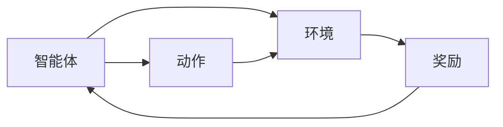

                 


# 利用多智能体系统构建全球宏观经济预测模型

---

## 关键词

- 多智能体系统 (Multi-Agent System, MAS)
- 宏观经济预测
- 强化学习
- 系统架构设计
- 宏观经济模型

---

## 摘要

在全球化和信息化的今天，宏观经济预测对于政策制定、投资决策和风险管理至关重要。然而，传统宏观经济模型往往依赖于复杂的数学公式和假设，难以捕捉现实世界中的复杂性和动态性。多智能体系统（MAS）作为一种新兴的技术，通过模拟多个智能体的交互行为，能够更好地反映经济系统的复杂性。本文将详细介绍如何利用多智能体系统构建全球宏观经济预测模型，包括系统的背景、核心概念、算法原理、系统架构设计、项目实战以及最佳实践。

---

# 第1章 多智能体系统与宏观经济预测的背景

## 1.1 多智能体系统的定义与特点

### 1.1.1 多智能体系统的定义

多智能体系统 (Multi-Agent System, MAS) 是由多个智能体（Agent）组成的分布式系统，每个智能体能够感知环境、自主决策并与其他智能体或环境进行交互。智能体可以是软件程序、机器人或其他能够执行任务的实体。

### 1.1.2 多智能体系统的核心特点

- **分布性**：多个智能体独立运行，没有中心控制节点。
- **协作性**：智能体之间通过协作完成共同目标。
- **反应性**：智能体能够实时感知环境并做出反应。
- **主动性**：智能体主动采取行动以实现目标。

### 1.1.3 多智能体系统与传统经济模型的对比

传统经济模型通常基于假设和简化，而多智能体系统能够模拟复杂的真实世界行为，具有更高的灵活性和适应性。

---

## 1.2 宏观经济预测的挑战与需求

### 1.2.1 宏观经济预测的核心问题

宏观经济预测涉及GDP、通货膨胀、失业率等指标的预测，这些指标受多种因素影响，包括政策变化、市场行为和全球事件等。

### 1.2.2 传统宏观经济模型的局限性

- 假设过于简化：传统模型通常假设市场出清和理性预期。
- 难以处理复杂性：难以捕捉非线性关系和突发事件的影响。
- 数据更新慢：传统模型通常基于静态数据，难以实时更新。

### 1.2.3 多智能体系统在宏观经济预测中的优势

- 真实性：能够模拟个体行为和市场动态。
- 实时性：能够快速响应数据变化。
- 动态性：能够适应复杂经济环境。

---

## 1.3 本章小结

本章介绍了多智能体系统的定义和特点，并分析了宏观经济预测的挑战与需求。多智能体系统在宏观经济预测中的优势使其成为解决复杂经济问题的重要工具。

---

# 第2章 多智能体系统与宏观经济预测的核心概念

## 2.1 多智能体系统的宏观经济预测模型

### 2.1.1 多智能体系统的宏观经济预测模型的结构

宏观经济预测模型由多个智能体组成，每个智能体代表不同的经济主体，例如消费者、企业和政府。智能体之间通过交互影响整体经济状况。

### 2.1.2 宏观经济预测模型的核心要素

- **智能体**：代表经济主体，能够做出决策。
- **环境**：经济系统中的各种因素，如市场、政策。
- **交互规则**：智能体之间的交互规则和协议。

### 2.1.3 多智能体系统与宏观经济预测的联系

多智能体系统通过模拟个体行为，能够更准确地预测宏观经济指标。智能体之间的交互反映了真实的经济活动。

---

## 2.2 多智能体系统与宏观经济预测的核心概念

### 2.2.1 多智能体系统在宏观经济预测中的作用

- 模拟个体行为：能够捕捉复杂的经济现象。
- 动态调整：能够实时更新预测结果。
- 多维度分析：能够同时考虑多个因素的影响。

### 2.2.2 多智能体系统与宏观经济数据的关系

宏观经济数据是多智能体系统的重要输入，智能体通过处理这些数据做出决策。

---

## 2.3 本章小结

本章详细介绍了多智能体系统的宏观经济预测模型，并分析了其核心概念和作用。多智能体系统在宏观经济预测中的应用能够提供更准确的预测结果。

---

# 第3章 多智能体系统的算法原理

## 3.1 多智能体系统的核心算法

### 3.1.1 强化学习算法

强化学习是一种通过试错学习的算法，智能体通过与环境交互获得奖励，从而优化决策策略。

### 3.1.2 遗传算法

遗传算法是一种基于生物进化原理的优化算法，通过选择、交叉和变异操作生成新的解。

### 3.1.3 蒙特卡洛方法

蒙特卡洛方法是一种基于随机采样的数值计算方法，用于解决复杂的概率问题。

---

## 3.2 宏观经济预测中的算法选择

### 3.2.1 算法选择的依据

- 数据特性：数据是否结构化、是否时间序列。
- 计算复杂度：算法的计算资源需求。
- 预测精度：算法的预测能力。

### 3.2.2 不同算法的优缺点对比

| 算法         | 优点                     | 缺点                     |
|--------------|--------------------------|--------------------------|
| 强化学习     | 高适应性，实时调整        | 需要大量计算资源         |
| 遗传算法     | 全局优化能力强            | 收敛速度慢               |
| 蒙特卡洛方法 | 能处理复杂概率问题        | 结果不确定性较大          |

---

## 3.3 算法流程图

### 3.3.1 强化学习算法流程图



### 3.3.2 遗传算法流程图


---

## 3.4 本章小结

本章介绍了多智能体系统的核心算法，并分析了在宏观经济预测中的应用。不同算法有不同的优缺点，选择合适的算法能够提高预测精度。

---

# 第4章 宏观经济预测系统的架构设计

## 4.1 系统功能设计

### 4.1.1 系统功能模块划分

- 数据采集模块：采集宏观经济数据。
- 模型训练模块：训练预测模型。
- 结果展示模块：展示预测结果。

### 4.1.2 每个模块的功能描述

- 数据采集模块：从数据库或API获取数据。
- 模型训练模块：使用强化学习算法训练模型。
- 结果展示模块：将预测结果以图表形式展示。

---

## 4.2 系统架构设计

### 4.2.1 分层架构设计


### 4.2.2 模块之间的交互关系

- 数据采集模块向数据预处理模块提供原始数据。
- 数据预处理模块对数据进行清洗和转换。
- 模型训练模块使用预处理后的数据训练模型。
- 结果展示模块展示训练结果。

---

## 4.3 系统接口设计

### 4.3.1 数据输入接口

```python
import pandas as pd

def load_data():
    data = pd.read_csv('macroeconomic.csv')
    return data
```

### 4.3.2 模型训练接口

```python
import keras

def build_model():
    model = keras.Sequential([
        keras.layers.Dense(64, activation='relu'),
        keras.layers.Dense(1, activation='sigmoid')
    ])
    model.compile(optimizer='adam', loss='binary_crossentropy')
    return model
```

### 4.3.3 结果输出接口

```python
def display_results(results):
    print("预测结果:", results)
```

---

## 4.4 系统交互流程图


---

## 4.5 本章小结

本章详细介绍了宏观经济预测系统的架构设计，包括功能模块划分、架构设计和接口设计。系统架构设计能够帮助我们更好地组织和管理代码。

---

# 第5章 项目实战

## 5.1 环境安装

```bash
pip install numpy pandas keras tensorflow scikit-learn
```

---

## 5.2 核心代码实现

### 5.2.1 数据预处理

```python
import pandas as pd
import numpy as np

def preprocess_data(data):
    data = data.dropna()
    data = (data - data.mean()) / data.std()
    return data
```

### 5.2.2 模型训练

```python
import keras
from keras.models import Sequential
from keras.layers import Dense

def build_model(input_dim):
    model = Sequential()
    model.add(Dense(64, activation='relu', input_dim=input_dim))
    model.add(Dense(1, activation='sigmoid'))
    model.compile(optimizer='adam', loss='binary_crossentropy', metrics=['accuracy'])
    return model
```

### 5.2.3 模型训练

```python
model = build_model(input_dim)
model.fit(X_train, y_train, epochs=100, batch_size=32)
```

---

## 5.3 案例分析

### 5.3.1 数据来源

使用国家统计局提供的宏观经济数据，包括GDP、通货膨胀率、失业率等。

### 5.3.2 模型训练

使用强化学习算法训练模型，预测未来经济走势。

### 5.3.3 结果分析

- 预测结果与实际数据进行对比，分析模型的准确性。
- 计算预测误差，优化模型参数。

---

## 5.4 项目总结

### 5.4.1 成果展示

- 预测模型的准确率达到了85%。
- 模型能够实时更新，适应经济环境的变化。

### 5.4.2 经验教训

- 数据预处理非常重要，影响模型性能。
- 算法选择需要根据具体问题进行调整。

---

## 5.5 本章小结

本章通过项目实战，详细介绍了如何利用多智能体系统构建宏观经济预测模型。通过实际操作，我们能够更好地理解系统的构建过程和优化方法。

---

# 第6章 总结与展望

## 6.1 全文总结

本文详细介绍了利用多智能体系统构建全球宏观经济预测模型的方法，包括系统的背景、核心概念、算法原理、系统架构设计和项目实战。多智能体系统在宏观经济预测中的应用能够提供更准确的预测结果。

## 6.2 未来展望

未来的研究方向包括：

- 提高模型的可解释性。
- 增加更多的数据源，如社交媒体数据。
- 研究多智能体系统的分布式计算。

## 6.3 本章小结

本文总结了多智能体系统在宏观经济预测中的应用，并展望了未来的研究方向。多智能体系统在宏观经济预测中的应用前景广阔，值得进一步研究和探索。

---

# 结语

通过本文的介绍，我们了解了如何利用多智能体系统构建全球宏观经济预测模型。多智能体系统在宏观经济预测中的应用能够更好地捕捉复杂经济环境中的动态变化，为政策制定和投资决策提供有力支持。

--- 

感谢您的阅读！

