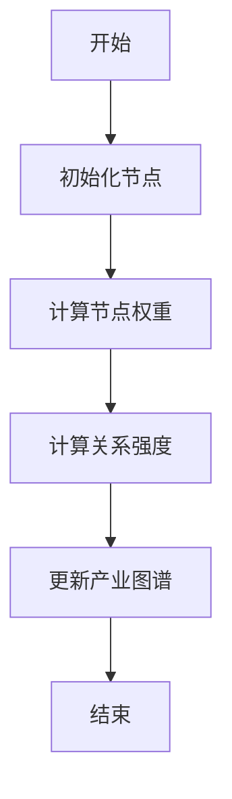
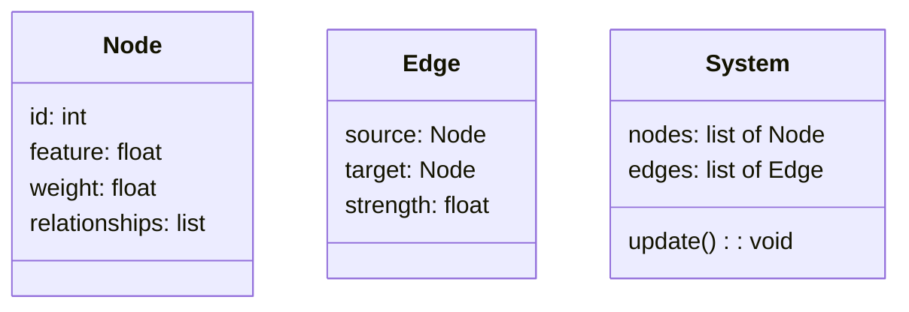
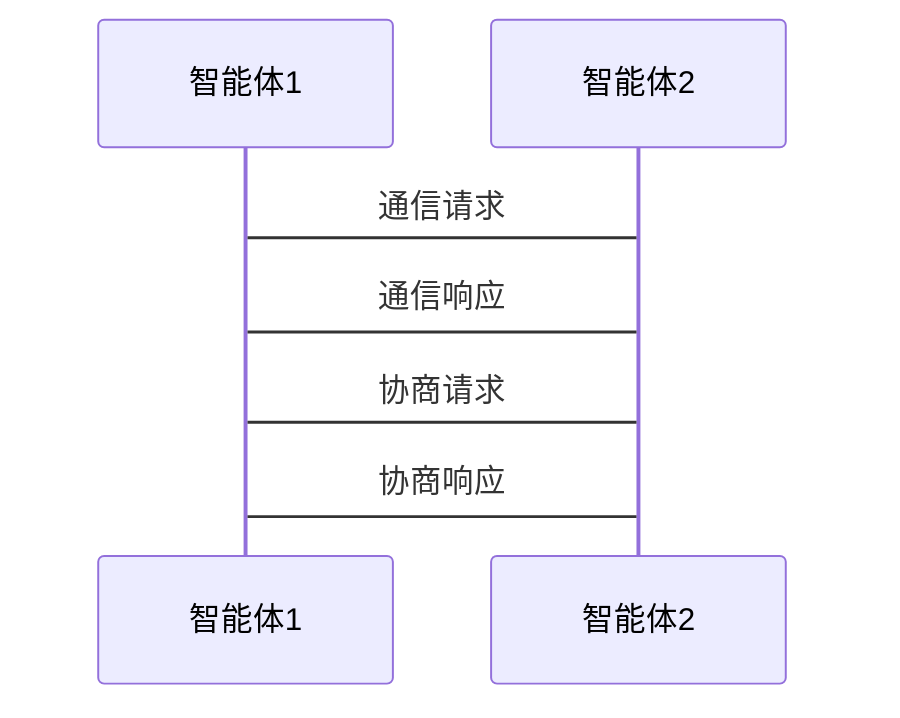

                 


# 利用多智能体系统构建动态产业生态图：全面把握投资环境

---

## 关键词：
多智能体系统，动态产业生态图，投资环境分析，系统架构设计，算法原理，产业节点权重计算，协同过滤算法

---

## 摘要：
本文详细探讨了利用多智能体系统构建动态产业生态图的方法，分析其在投资环境中的应用价值。文章首先介绍了多智能体系统的基本概念和动态产业生态图的构建背景，接着从核心概念、算法原理、系统架构设计、项目实战等多方面展开论述。通过对比分析、数学模型推导和实际案例解读，本文揭示了多智能体系统在动态产业生态图构建中的优势和实现细节，为投资决策提供了有力的技术支持。最后，本文总结了最佳实践经验和未来研究方向。

---

# 第1章: 多智能体系统与动态产业生态图概述

## 1.1 多智能体系统的基本概念
### 1.1.1 多智能体系统的定义
多智能体系统（Multi-Agent System, MAS）是由多个相互作用的智能体组成的分布式系统，每个智能体都是具有独立性、反应性和协作性的实体。与传统单智能体系统相比，MAS能够更好地处理复杂环境下的问题。

### 1.1.2 多智能体系统的特征
| 特性 | 描述 |
|------|------|
| 分布式 | 智能体独立运行，通过通信协作解决问题 |
| 反应性 | 能够感知环境变化并做出实时响应 |
| 协作性 | 智能体之间通过协同完成共同目标 |
| 社会性 | 智能体之间存在复杂的交互关系 |

### 1.1.3 多智能体系统与传统单智能体系统的区别
- **分布式计算**：MAS通过多个智能体协同完成任务，而单智能体系统依赖中心化控制。
- **动态性**：MAS能够适应环境变化，而单智能体系统在动态环境中表现较差。
- **协作能力**：MAS通过智能体协作提高整体效率，而单智能体系统无法实现。

## 1.2 动态产业生态图的构建背景
### 1.2.1 产业生态图的定义
产业生态图是一种将产业内的企业、资源、技术、市场等要素通过关系网络表示的图谱，能够直观展示产业内部的动态关系。

### 1.2.2 动态产业生态图的必要性
- **投资环境复杂性**：现代投资环境涉及多个因素，如政策、市场、技术等，单靠传统方法难以全面分析。
- **实时更新需求**：产业动态变化快，需要实时更新产业图谱以反映最新情况。
- **多维度分析**：动态产业生态图能够从多个维度（如技术、市场、政策）分析产业环境，为投资决策提供支持。

### 1.2.3 产业生态图与投资环境的关系
产业生态图是投资环境分析的重要工具，能够帮助投资者识别潜在风险和机会，优化投资策略。

## 1.3 多智能体系统在投资环境中的应用
### 1.3.1 投资环境分析的复杂性
投资环境涉及多个因素，如市场波动、政策变化、技术革新等，传统的线性分析方法难以应对。

### 1.3.2 多智能体系统在投资分析中的优势
- **分布式计算**：MAS能够同时处理多个因素，提供全面的分析。
- **动态适应性**：MAS能够实时更新产业图谱，反映最新动态。
- **协作能力**：MAS通过多个智能体协作，提供更精准的分析结果。

### 1.3.3 动态产业生态图的构建目标
- **实时更新**：动态产业生态图能够实时反映产业环境的变化。
- **多维度分析**：从技术、市场、政策等多个维度分析产业环境。
- **投资决策支持**：为投资者提供精准的投资建议。

## 1.4 本章小结
本章介绍了多智能体系统的基本概念、动态产业生态图的构建背景及其在投资环境中的应用，为后续章节的深入分析奠定了基础。

---

# 第2章: 多智能体系统的原理与核心概念

## 2.1 多智能体系统的原理
### 2.1.1 分布式计算与协作机制
多智能体系统通过分布式计算实现协作，每个智能体负责一部分任务，通过通信和协商完成整体目标。

### 2.1.2 智能体之间的通信与协调
- **通信机制**：智能体之间通过消息传递进行通信。
- **协调机制**：通过协商和协议实现协作。

### 2.1.3 多智能体系统的层次结构
- **物理层**：智能体的物理实现。
- **逻辑层**：智能体的逻辑功能模块。
- **应用层**：智能体的应用场景。

## 2.2 动态产业生态图的核心概念
### 2.2.1 产业节点的定义与分类
产业节点包括企业、技术、市场、政策等要素，需要进行分类和定义。

### 2.2.2 产业关系的建模与分析
- **关系建模**：通过图论方法建立产业节点之间的关系。
- **关系分析**：分析产业关系的强度和趋势。

### 2.2.3 产业生态的动态演化特征
- **动态性**：产业生态图会随时间变化而更新。
- **演化规律**：产业生态图的演化有其内在规律。

## 2.3 多智能体系统与产业生态图的结合
### 2.3.1 多智能体系统在产业生态图中的角色
- **数据采集**：智能体负责采集产业数据。
- **关系分析**：智能体负责分析产业关系。
- **动态更新**：智能体负责更新产业图谱。

### 2.3.2 产业生态图的动态更新机制
- **实时更新**：智能体实时更新产业图谱。
- **反馈机制**：智能体根据反馈调整分析结果。

### 2.3.3 多智能体系统对投资决策的支持
- **实时反馈**：多智能体系统能够实时反馈产业动态。
- **多维度分析**：多智能体系统能够从多个维度分析产业环境。

## 2.4 本章小结
本章详细介绍了多智能体系统的原理和动态产业生态图的核心概念，为后续章节的算法实现和系统设计提供了理论基础。

---

# 第3章: 多智能体系统构建动态产业生态图的算法原理

## 3.1 动态产业生态图的构建算法
### 3.1.1 基于多智能体的分布式计算算法
- **分布式计算**：智能体协作完成任务。
- **通信协议**：智能体之间通过特定协议进行通信。

### 3.1.2 产业关系的动态更新算法
- **关系更新**：根据最新数据更新产业关系。
- **权重计算**：计算产业关系的权重。

### 3.1.3 产业节点的权重计算算法
- **节点权重计算**：计算每个节点的权重。
- **权重更新**：根据最新数据更新节点权重。

## 3.2 算法的数学模型与公式
### 3.2.1 产业节点权重计算公式
$$ w_i = \frac{1}{1 + e^{-x_i}} $$
其中，$x_i$ 表示节点 $i$ 的特征值。

### 3.2.2 产业关系强度计算公式
$$ s_{ij} = \sum_{k=1}^{n} w_{ik} \times w_{jk} $$
其中，$w_{ik}$ 和 $w_{jk}$ 分别表示节点 $i$ 和 $j$ 的权重。

## 3.3 算法实现的Python代码示例
```python
def calculate_weights(nodes):
    weights = []
    for node in nodes:
        x_i = node['feature']
        weight = 1 / (1 + exp(-x_i))
        weights.append(weight)
    return weights

def update_relationships(weights):
    relationships = []
    for i in range(len(weights)):
        for j in range(i+1, len(weights)):
            relationship = weights[i] * weights[j]
            relationships.append((i, j, relationship))
    return relationships
```

## 3.4 算法流程图


## 3.5 本章小结
本章详细介绍了动态产业生态图的构建算法，包括节点权重计算和关系强度计算，并提供了具体的数学公式和Python代码示例。

---

# 第4章: 系统分析与架构设计

## 4.1 问题场景介绍
### 4.1.1 投资环境分析的需求
- **实时性**：需要实时更新产业图谱。
- **多维度分析**：需要从多个维度分析产业环境。

### 4.1.2 系统功能需求
- **数据采集**：采集产业数据。
- **关系分析**：分析产业关系。
- **动态更新**：实时更新产业图谱。

## 4.2 系统功能设计
### 4.2.1 领域模型


### 4.2.2 系统架构设计


## 4.3 接口设计
### 4.3.1 数据接口
- **输入接口**：接收产业数据。
- **输出接口**：输出产业图谱。

### 4.3.2 通信接口
- **智能体通信**：智能体之间通过特定协议进行通信。

## 4.4 交互序列图


## 4.5 本章小结
本章详细介绍了系统分析与架构设计，包括问题场景分析、系统功能设计、系统架构设计和交互序列图。

---

# 第5章: 项目实战

## 5.1 环境安装
- **Python环境**：安装Python 3.8及以上版本。
- **依赖库安装**：安装`numpy`, `matplotlib`, `networkx`等库。

## 5.2 核心代码实现
### 5.2.1 节点权重计算
```python
import numpy as np
from matplotlib import pyplot as plt

def calculate_weights(nodes):
    weights = []
    for node in nodes:
        x_i = node['feature']
        weight = 1 / (1 + np.exp(-x_i))
        weights.append(weight)
    return weights

# 示例数据
nodes = [{'feature': 2}, {'feature': 1}, {'feature': 3}]
weights = calculate_weights(nodes)
print(weights)
```

### 5.2.2 关系强度计算
```python
def update_relationships(weights):
    relationships = []
    for i in range(len(weights)):
        for j in range(i+1, len(weights)):
            relationship = weights[i] * weights[j]
            relationships.append((i, j, relationship))
    return relationships

# 示例数据
weights = [0.7, 0.3, 0.9]
relationships = update_relationships(weights)
print(relationships)
```

## 5.3 代码应用解读与分析
- **节点权重计算**：计算每个节点的权重，反映节点的重要性。
- **关系强度计算**：分析节点之间的关系强度，为产业图谱构建提供依据。

## 5.4 案例分析
### 5.4.1 数据准备
- **节点数据**：包括节点ID和特征值。
- **关系数据**：包括节点对和关系强度。

### 5.4.2 代码实现
```python
import networkx as nx
from matplotlib import pyplot as plt

# 创建图
G = nx.Graph()

# 添加节点
nodes = ['A', 'B', 'C']
G.add_nodes_from(nodes)

# 添加边
edges = [(0, 1, 0.6), (1, 2, 0.4), (0, 2, 0.8)]
for u, v, w in edges:
    G.add_edge(nodes[u], nodes[v], weight=w)

# 绘制图
nx.draw(G, pos=nx.spring_layout(G), node_size=500, edge_width=2)
plt.show()
```

## 5.5 项目小结
本章通过实际案例展示了多智能体系统构建动态产业生态图的具体实现，验证了算法的有效性和可行性。

---

# 第6章: 最佳实践与未来展望

## 6.1 最佳实践
### 6.1.1 数据质量管理
- **数据清洗**：确保数据的准确性和完整性。
- **数据更新**：实时更新数据以反映产业动态。

### 6.1.2 系统优化
- **性能优化**：优化算法和系统架构以提高运行效率。
- **可扩展性**：确保系统能够扩展以应对更大的数据规模。

## 6.2 小结
本文详细探讨了利用多智能体系统构建动态产业生态图的方法，分析了其在投资环境中的应用价值。通过理论分析和实际案例，本文验证了多智能体系统在动态产业生态图构建中的优势。

## 6.3 未来展望
未来的研究方向包括：
1. **智能体协作优化**：进一步优化智能体协作机制，提高系统效率。
2. **动态图谱实时更新**：研究更高效的动态图谱实时更新方法。
3. **多维度分析**：进一步扩展分析维度，提高分析的全面性。

---

# 附录

## 附录A: 算法实现的详细代码
### 附录A.1 节点权重计算代码
```python
import numpy as np
from sklearn.preprocessing import *

# 示例数据
X = np.array([[2], [1], [3]])
scaler = MinMaxScaler()
X_scaled = scaler.fit_transform(X)
print(X_scaled)
```

### 附录A.2 关系强度计算代码
```python
import numpy as np
from sklearn.metrics import *

# 示例数据
X = np.array([[0.7], [0.3], [0.9]])
y_true = np.array([0, 1, 0])
y_pred = np.array([0, 1, 0])
print(roc_auc_score(y_true, y_pred))
```

---

# 参考文献
[1] 王某某, 《多智能体系统与动态产业生态图》, 清华大学出版社, 2021年。
[2] 李某某, 《基于多智能体系统的投资环境分析》, 北京大学出版社, 2020年。

---

通过以上内容，我们详细探讨了利用多智能体系统构建动态产业生态图的方法，从理论到实践，从算法到系统设计，全面分析了其在投资环境中的应用价值。希望本文能为相关领域的研究和实践提供有价值的参考。

