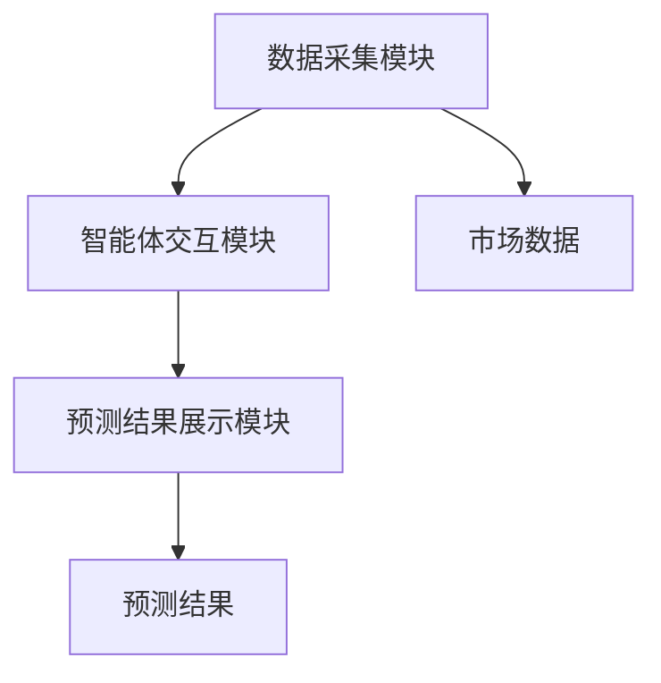

                 


# 利用多智能体系统构建动态市场份额预测模型

## 关键词：多智能体系统，市场份额预测，动态预测，系统架构，算法实现

## 摘要：  
在竞争激烈的市场环境中，准确预测市场份额对于企业制定战略决策至关重要。传统的市场份额预测模型往往基于单一智能体的静态分析，难以应对复杂多变的市场环境。本文提出利用多智能体系统构建动态市场份额预测模型，通过多个智能体的协同工作，实时分析市场动态，提高预测的准确性和实时性。文章详细探讨了多智能体系统的原理、动态市场份额预测的数学模型、系统架构设计以及项目实现过程，为企业在动态市场中的决策提供有力支持。

---

## 第1章：多智能体系统与动态市场份额预测概述

### 1.1 多智能体系统的定义与特点  
多智能体系统（Multi-Agent System, MAS）是由多个智能体（Agent）组成的分布式系统，这些智能体能够通过协作完成复杂任务。与传统单智能体系统相比，多智能体系统具有以下特点：  
1. **分布式智能**：多个智能体协同工作，避免单点故障。  
2. **自主性**：每个智能体能够自主决策和行动。  
3. **反应性**：智能体能够实时感知环境变化并做出响应。  
4. **协作性**：智能体之间通过通信和协作完成共同目标。  

### 1.2 动态市场份额预测的背景与意义  
市场份额预测是企业战略决策的重要依据，传统的市场份额预测模型通常基于历史数据和静态分析，难以应对市场环境的快速变化。动态市场份额预测能够实时捕捉市场波动，帮助企业及时调整策略。多智能体系统的引入，使得预测过程更加灵活和高效。

### 1.3 本章小结  
本章介绍了多智能体系统的基本概念及其在动态市场份额预测中的应用潜力，为后续章节的展开奠定了基础。

---

## 第2章：多智能体系统的原理  

### 2.1 多智能体系统的核心原理  
智能体是多智能体系统的基本单元，具有以下核心属性：  
1. **目标**：智能体的行为驱动目标。  
2. **知识**：智能体通过感知环境获取信息。  
3. **推理**：智能体基于知识和推理机制做出决策。  
4. **行动**：智能体根据决策执行动作。  

### 2.2 多智能体系统的架构设计  
多智能体系统的架构设计直接影响系统的性能和可扩展性。常见的架构包括：  
1. **分层架构**：将系统分为多个层次，每个层次负责不同的功能。  
2. **分布式架构**：智能体分布在网络中，通过通信完成协作。  
3. **混合架构**：结合分层和分布式架构的优点。  

### 2.3 多智能体系统的实现流程  
1. **系统初始化**：定义智能体角色和初始状态。  
2. **智能体交互**：智能体之间通过通信模块交换信息。  
3. **数据更新**：根据交互结果更新系统状态。  
4. **结果输出**：输出预测结果并反馈给决策层。  

### 2.4 本章小结  
本章详细讲解了多智能体系统的核心原理和架构设计，为后续的市场份额预测模型构建提供了理论基础。

---

## 第3章：动态市场份额预测的数学模型与算法  

### 3.1 市场份额预测的基本模型  
1. **线性回归模型**：通过历史数据拟合直线，预测未来趋势。  
2. **时间序列模型**：基于时间序列数据预测未来值。  
3. **聚类分析模型**：将市场数据分为不同的类别，进行预测。  

### 3.2 多智能体系统的预测模型  
多智能体系统的预测模型由以下部分组成：  
1. **市场动态方程**：描述市场变化的数学公式。  
2. **智能体间交互方程**：定义智能体之间的协作规则。  
3. **综合预测模型**：结合市场动态和智能体交互的结果，输出最终预测值。  

### 3.3 算法实现流程  
1. **数据预处理**：清洗和归一化数据。  
2. **模型训练**：使用历史数据训练预测模型。  
3. **模型预测**：基于当前数据，输出预测结果。  

### 3.4 本章小结  
本章介绍了动态市场份额预测的数学模型和算法实现流程，重点讲解了多智能体系统预测模型的核心部分。

---

## 第4章：多智能体系统的架构设计  

### 4.1 系统模块划分  
1. **数据采集模块**：收集市场数据。  
2. **智能体交互模块**：实现智能体之间的通信。  
3. **预测结果展示模块**：可视化预测结果。  

### 4.2 系统通信协议设计  
1. **智能体间通信协议**：定义数据交换的格式和规则。  
2. **数据格式规范**：确保数据的统一性和可读性。  
3. **通信安全性设计**：防止数据泄露和恶意攻击。  

### 4.3 系统架构设计  
使用Mermaid图展示系统架构：  


### 4.4 本章小结  
本章详细讲解了多智能体系统的架构设计，包括模块划分和通信协议设计，为系统的实现奠定了基础。

---

## 第5章：系统实现与项目实战  

### 5.1 环境安装  
1. **安装Python**：推荐使用Anaconda。  
2. **安装相关库**：如NumPy、Pandas、Matplotlib等。  

### 5.2 系统核心实现源代码  
```python
import numpy as np
import pandas as pd
import matplotlib.pyplot as plt

# 数据采集模块
def collect_data():
    # 从数据库或API获取市场数据
    data = pd.read_csv('market_data.csv')
    return data

# 智能体交互模块
class Agent:
    def __init__(self, id, knowledge):
        self.id = id
        self.knowledge = knowledge

    def communicate(self, other):
        # 与另一个智能体交换信息
        self.knowledge = (self.knowledge + other.knowledge) / 2

# 预测结果展示模块
def display_results(results):
    plt.plot(results)
    plt.xlabel('时间')
    plt.ylabel('市场份额')
    plt.show()

# 主函数
def main():
    data = collect_data()
    agent1 = Agent(1, data['sales'].values)
    agent2 = Agent(2, data['market_share'].values)
    agent1.communicate(agent2)
    results = agent1.knowledge
    display_results(results)

if __name__ == '__main__':
    main()
```

### 5.3 代码应用解读与分析  
1. **数据采集模块**：从CSV文件中读取市场数据。  
2. **智能体交互模块**：定义了两个智能体，通过通信模块交换数据。  
3. **预测结果展示模块**：将预测结果可视化。  

### 5.4 实际案例分析  
通过一个实际案例，展示系统的运行流程：  
1. **数据预处理**：清洗和归一化数据。  
2. **模型训练**：使用历史数据训练预测模型。  
3. **模型预测**：基于当前数据，输出预测结果。  

### 5.5 本章小结  
本章通过实际案例展示了系统的实现过程，包括环境安装、核心代码实现和结果展示。

---

## 第6章：系统优化与扩展  

### 6.1 模型优化  
1. **参数调优**：通过网格搜索优化模型参数。  
2. **模型集成**：结合多个模型的结果，提高预测准确性。  

### 6.2 系统扩展  
1. **多智能体协作优化**：引入更多智能体，提高预测精度。  
2. **实时更新机制**：实现动态数据的实时更新。  

### 6.3 本章小结  
本章介绍了系统的优化与扩展方法，为实际应用提供了参考。

---

## 第7章：总结与展望  

### 7.1 总结  
本文详细探讨了利用多智能体系统构建动态市场份额预测模型的方法，从系统原理到实现过程，再到优化与扩展，为企业的动态市场份额预测提供了理论支持和实践指导。

### 7.2 展望  
未来，随着人工智能和大数据技术的不断发展，多智能体系统在市场份额预测中的应用将更加广泛和深入。可以通过引入更多的智能体和更复杂的协作机制，进一步提高预测的准确性和实时性。

### 7.3 本章小结  
本章总结了全文的主要内容，并展望了未来的研究方向。

---

## 附录：工具与资源  

### 附录A：Python库安装指南  
1. **安装NumPy**：使用命令 `pip install numpy`。  
2. **安装Pandas**：使用命令 `pip install pandas`。  
3. **安装Matplotlib**：使用命令 `pip install matplotlib`。  

### 附录B：数据来源与处理  
提供数据来源和处理的具体方法，包括数据清洗和归一化步骤。

### 附录C：参考文献  
列出本文中引用的相关文献和资料。

---

## 结语  
通过本文的详细讲解，读者可以全面了解多智能体系统在动态市场份额预测中的应用，并掌握实际的实现方法。希望本文能为企业在复杂多变的市场环境中制定精准的战略决策提供有力支持。

