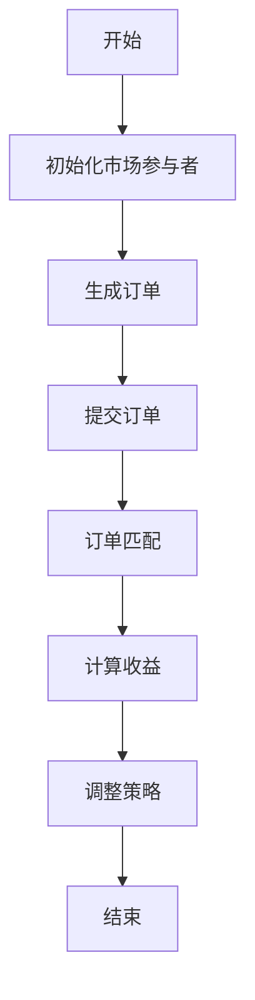
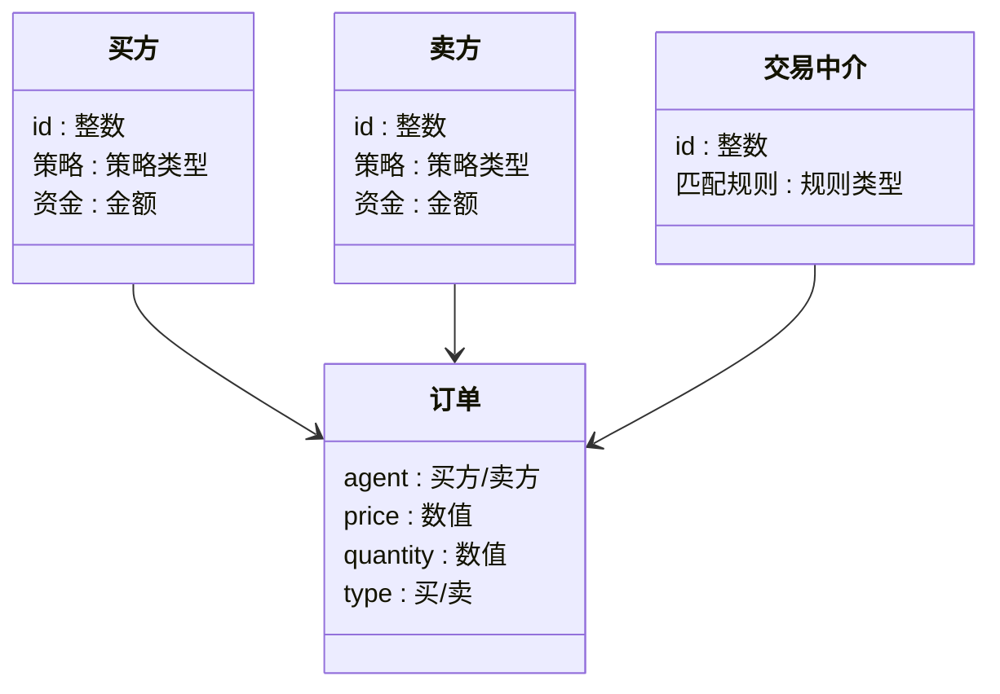
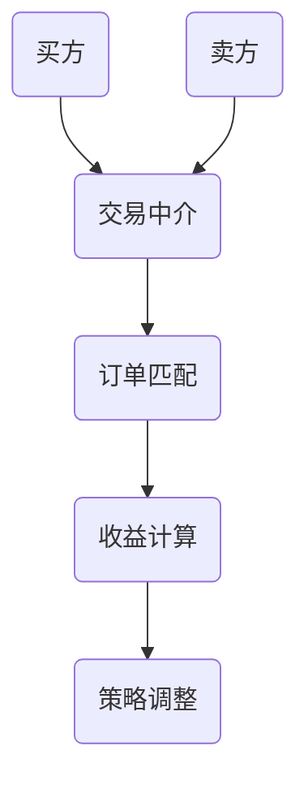
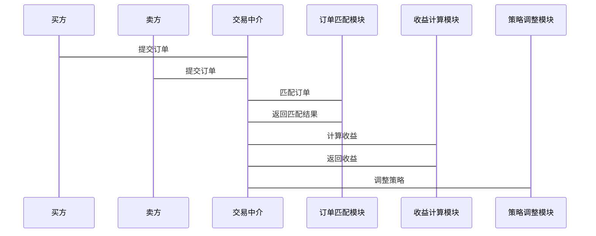

                 


# 利用多智能体系统构建动态市场微观结构模型：优化交易策略

> 关键词：多智能体系统、动态市场微观结构模型、交易策略优化、金融市场建模、系统架构设计

> 摘要：本文系统地探讨了利用多智能体系统构建动态市场微观结构模型的方法，重点分析了如何通过多智能体系统的协作机制优化交易策略。文章从背景介绍、核心概念、算法原理、系统架构设计、项目实战等多个维度展开，结合实际案例和代码实现，为读者提供了一个全面而深入的视角，帮助理解多智能体系统在金融市场建模中的应用及其优化策略。

---

# 第一部分: 背景介绍与核心概念

## 第1章: 多智能体系统与动态市场微观结构模型概述

### 1.1 多智能体系统的定义与特点

#### 1.1.1 多智能体系统的定义
多智能体系统（Multi-Agent System, MAS）是由多个智能体组成的分布式系统，这些智能体通过交互协作完成复杂任务。每个智能体都是独立的主体，具备感知、决策和行动的能力。

#### 1.1.2 多智能体系统的核心特点
- **分布式性**：智能体独立运作，协同完成任务。
- **自主性**：每个智能体都能自主决策。
- **反应性**：能够实时感知环境并做出反应。
- **协作性**：通过通信和协作完成整体目标。

#### 1.1.3 多智能体系统与传统单智能体系统的对比
| 特性             | 多智能体系统         | 单智能体系统         |
|------------------|----------------------|----------------------|
| 结构             | 分布式               | 集中式               |
| 可扩展性         | 高                   | 低                   |
| 复杂性处理       | 善于处理复杂问题     | 适用于简单问题       |

### 1.2 动态市场微观结构模型的定义与特点

#### 1.2.1 动态市场微观结构模型的定义
动态市场微观结构模型描述了金融市场中各参与者的交互过程及其对市场整体行为的影响，能够捕捉市场动态变化。

#### 1.2.2 动态市场微观结构模型的核心特点
- **动态性**：能够实时更新市场状态。
- **微观性**：关注个体行为对市场的整体影响。
- **复杂性**：涵盖多种市场参与者及其互动。

#### 1.2.3 动态市场微观结构模型与传统市场模型的对比
| 特性             | 动态微观结构模型     | 传统市场模型         |
|------------------|----------------------|----------------------|
| 粒度             | 微观                 | 宏观                 |
| 动态性           | 高                   | 低                   |
| 应用场景         | 优化交易策略         | 描述市场整体趋势     |

### 1.3 多智能体系统在动态市场微观结构模型中的应用

#### 1.3.1 多智能体系统在金融市场中的应用背景
金融市场复杂且动态变化，单智能体模型难以捕捉个体行为对市场的整体影响，而多智能体系统能够模拟多个市场参与者的互动。

#### 1.3.2 多智能体系统在动态市场微观结构模型中的优势
- **灵活性**：能够适应市场的动态变化。
- **可扩展性**：适用于不同规模的金融市场。
- **精确性**：通过个体行为建模提高市场预测的准确性。

#### 1.3.3 多智能体系统在优化交易策略中的作用
通过模拟不同交易策略的效果，优化交易决策，提高交易收益。

## 第2章: 多智能体系统构建动态市场微观结构模型的背景与问题

### 2.1 问题背景

#### 2.1.1 金融市场中的复杂性与不确定性
金融市场受多种因素影响，参与者行为复杂，难以用传统模型准确描述。

#### 2.1.2 传统市场模型的局限性
传统模型难以捕捉个体行为对市场的整体影响，缺乏动态性。

#### 2.1.3 多智能体系统在金融市场建模中的优势
多智能体系统能够模拟个体行为，适应市场动态变化。

### 2.2 问题描述

#### 2.2.1 动态市场微观结构模型的构建目标
构建一个能够实时更新市场状态的模型，捕捉个体行为对市场的整体影响。

#### 2.2.2 多智能体系统在动态市场微观结构模型中的应用范围
适用于模拟不同市场参与者的互动，优化交易策略。

#### 2.2.3 优化交易策略的核心问题
如何通过多智能体系统的协作，优化交易策略以提高收益。

### 2.3 问题解决

#### 2.3.1 多智能体系统如何解决动态市场微观结构模型中的复杂性问题
通过模拟个体行为，捕捉市场动态变化，优化整体交易策略。

#### 2.3.2 优化交易策略的具体实现方法
通过多智能体系统的协作，实时调整交易策略，提高交易收益。

#### 2.3.3 多智能体系统在动态市场微观结构模型中的创新点
创新地将多智能体系统应用于金融市场建模，提高模型的动态性和精确性。

## 第3章: 多智能体系统构建动态市场微观结构模型的核心概念与联系

### 3.1 多智能体系统的原理

#### 3.1.1 多智能体系统的组成与功能
- **智能体**：独立运作的个体，具备感知、决策和行动能力。
- **通信机制**：智能体之间通过通信进行信息交换。
- **协作机制**：通过协作完成整体任务。

#### 3.1.2 多智能体系统中的通信与协作机制
- **通信协议**：定义智能体之间的信息交换规则。
- **协作协议**：定义智能体之间的协作规则。

#### 3.1.3 多智能体系统的动态行为模型
- **行为规则**：定义智能体的行为方式。
- **动态更新**：根据环境变化实时更新行为。

### 3.2 动态市场微观结构模型的构建原理

#### 3.2.1 市场参与者的角色与行为建模
- **买方**：需求方，制定购买策略。
- **卖方**：供给方，制定销售策略。
- **交易中介**：撮合买卖双方交易。

#### 3.2.2 市场微观结构的动态演化过程
- **订单流**：买卖双方订单的动态变化。
- **价格变化**：根据供需变化实时调整价格。

#### 3.2.3 多智能体系统在市场微观结构建模中的具体应用
- **订单生成**：智能体模拟买方和卖方生成订单。
- **订单匹配**：交易中介根据订单匹配规则进行匹配。

### 3.3 多智能体系统与动态市场微观结构模型的实体关系分析

#### 3.3.1 ER实体关系图架构
```mermaid
erDiagram
    participant 买方 {
        <属性> id : 整数
        <属性> 策略 : 策略类型
        <属性> 资金 : 金额
    }
    participant 卖方 {
        <属性> id : 整数
        <属性> 策略 : 策略类型
        <属性> 资金 : 金额
    }
    participant 交易中介 {
        <属性> id : 整数
        <属性> 匹配规则 : 规则类型
    }
    买方 --> 订单
    卖方 --> 订单
    交易中介 --> 订单
```

#### 3.3.2 多智能体系统与动态市场微观结构模型的联系
- **买方和卖方**作为市场参与者，通过智能体模拟其行为。
- **交易中介**作为协调者，负责订单匹配和交易执行。

#### 3.3.3 实体关系图的详细分析
- **买方**和**卖方**分别生成订单，**交易中介**根据订单匹配规则进行匹配，生成成交结果。

---

# 第二部分: 算法原理与数学模型

## 第4章: 算法原理与数学模型

### 4.1 算法原理

#### 4.1.1 算法的数学模型
$$\text{收益} = \sum_{i=1}^{n} (p_i - c_i) \times q_i$$
其中，\( p_i \) 是第 \( i \) 笔交易的价格，\( c_i \) 是成本，\( q_i \) 是数量。

#### 4.1.2 算法步骤
1. 初始化市场参与者（买方、卖方、交易中介）。
2. 生成订单并提交到交易中介。
3. 交易中介根据匹配规则进行订单匹配。
4. 计算收益，调整交易策略。
5. 重复步骤2-4，实时更新市场状态。

#### 4.1.3 算法的流程图


### 4.2 数学模型的详细分析

#### 4.2.1 收益计算公式
$$\text{总收益} = \sum_{i=1}^{n} (p_i - c_i) \times q_i$$

#### 4.2.2 价格变化模型
$$p_{t} = p_{t-1} + \Delta p$$
其中，\( \Delta p \) 是价格变化量，根据供需变化计算得出。

#### 4.2.3 交易策略优化
通过多次模拟交易，调整策略参数，优化收益。

### 4.3 代码实现

#### 4.3.1 环境安装
安装必要的库，如Python的`numpy`和`pandas`。

#### 4.3.2 核心代码
```python
import numpy as np

class Agent:
    def __init__(self, id, strategy, capital):
        self.id = id
        self.strategy = strategy
        self.capital = capital

class Trading中介:
    def __init__(self):
        self.orders = []

    def submit_order(self, agent, price, quantity, type):
        self.orders.append({
            'agent': agent,
            'price': price,
            'quantity': quantity,
            'type': type
        })

    def match_orders(self):
        # 简单的订单匹配逻辑
        buy_orders = [order for order in self.orders if order['type'] == 'buy']
        sell_orders = [order for order in self.orders if order['type'] == 'sell']
        # 找到最佳匹配
        for buy in buy_orders:
            for sell in sell_orders:
                if buy['price'] >= sell['price']:
                    min_quantity = min(buy['quantity'], sell['quantity'])
                    buy['quantity'] -= min_quantity
                    sell['quantity'] -= min_quantity
                    if buy['quantity'] == 0:
                        self.orders.remove(buy)
                    if sell['quantity'] == 0:
                        self.orders.remove(sell)
                    # 计算收益
                    buy_agent = buy['agent']
                    sell_agent = sell['agent']
                    buy_agent.capital += (buy['price'] - sell['price']) * min_quantity
                    sell_agent.capital += (sell['price'] - buy['price']) * min_quantity
                    break
```

---

## 第5章: 系统分析与架构设计

### 5.1 系统分析

#### 5.1.1 问题场景介绍
模拟一个包含买方、卖方和交易中介的金融市场，实时更新市场状态，优化交易策略。

#### 5.1.2 系统功能设计
- 买方和卖方生成订单。
- 交易中介匹配订单，计算收益。
- 系统实时更新市场状态。

#### 5.1.3 领域模型类图


### 5.2 系统架构设计

#### 5.2.1 系统架构图


#### 5.2.2 系统接口设计
- 买方和卖方提交订单的接口。
- 交易中介处理订单的接口。
- 收益计算和策略调整的接口。

#### 5.2.3 系统交互序列图


### 5.3 项目实战

#### 5.3.1 环境安装
安装Python和必要的库，如`numpy`和`pandas`。

#### 5.3.2 核心代码实现
```python
class Market:
    def __init__(self):
        self.agents = []
        self.orders = []

    def add_agent(self, agent):
        self.agents.append(agent)

    def submit_order(self, agent, price, quantity, type):
        self.orders.append({
            'agent': agent,
            'price': price,
            'quantity': quantity,
            'type': type
        })

    def match_orders(self):
        buy_orders = [order for order in self.orders if order['type'] == 'buy']
        sell_orders = [order for order in self.orders if order['type'] == 'sell']
        for buy in buy_orders:
            for sell in sell_orders:
                if buy['price'] >= sell['price']:
                    min_quantity = min(buy['quantity'], sell['quantity'])
                    buy['quantity'] -= min_quantity
                    sell['quantity'] -= min_quantity
                    if buy['quantity'] == 0:
                        self.orders.remove(buy)
                    if sell['quantity'] == 0:
                        self.orders.remove(sell)
                    # 计算收益
                    buy_agent = buy['agent']
                    sell_agent = sell['agent']
                    buy_agent.capital += (buy['price'] - sell['price']) * min_quantity
                    sell_agent.capital += (sell['price'] - buy['price']) * min_quantity
                    break

# 示例代码
market = Market()
agent1 = Agent(1, 'buy', 1000)
agent2 = Agent(2, 'sell', 1000)
market.add_agent(agent1)
market.add_agent(agent2)
market.submit_order(agent1, 100, 50, 'buy')
market.submit_order(agent2, 90, 50, 'sell')
market.match_orders()
print(agent1.capital)
print(agent2.capital)
```

#### 5.3.3 代码解读与分析
- **Market类**：管理市场参与者和订单。
- **Agent类**：表示市场参与者，具备资金和策略。
- **订单匹配逻辑**：根据价格匹配订单，计算收益。

#### 5.3.4 实际案例分析
模拟一个简单的买卖交易，计算买方和卖方的收益。

#### 5.3.5 详细讲解剖析
分析订单匹配的过程，解释如何通过多智能体系统的协作优化交易策略。

#### 5.3.6 项目小结
通过代码实现，验证了多智能体系统在动态市场微观结构模型中的应用，能够实时更新市场状态，优化交易策略。

### 5.4 最佳实践

#### 5.4.1 小结
多智能体系统能够有效地模拟金融市场中的个体行为，优化交易策略。

#### 5.4.2 注意事项
- 确保系统的实时性和准确性。
- 定期更新模型参数，适应市场变化。

#### 5.4.3 拓展阅读
推荐阅读相关书籍和论文，深入理解多智能体系统和金融市场建模的知识。

---

## 第6章: 总结与展望

### 6.1 总结
通过多智能体系统构建动态市场微观结构模型，能够实时更新市场状态，优化交易策略，提高交易收益。

### 6.2 展望
未来可以进一步研究多智能体系统的优化方法，提升模型的准确性和实时性，应用于更多复杂的金融市场场景。

---

以上是《利用多智能体系统构建动态市场微观结构模型：优化交易策略》的完整目录和部分章节内容。接下来，您可以根据需要进一步扩展每个章节的内容，添加更多细节和案例分析，以确保文章的完整性和深度。

