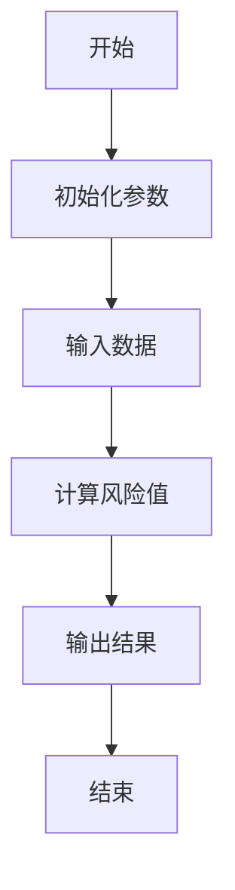
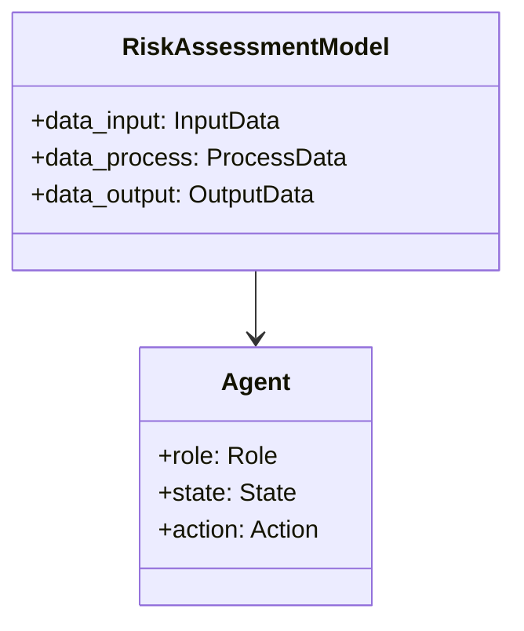
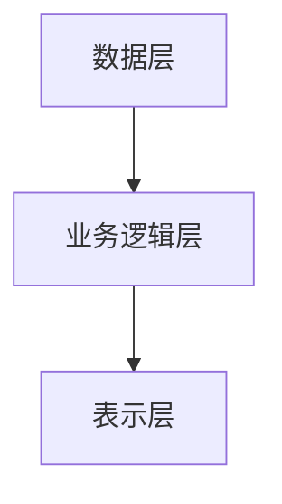
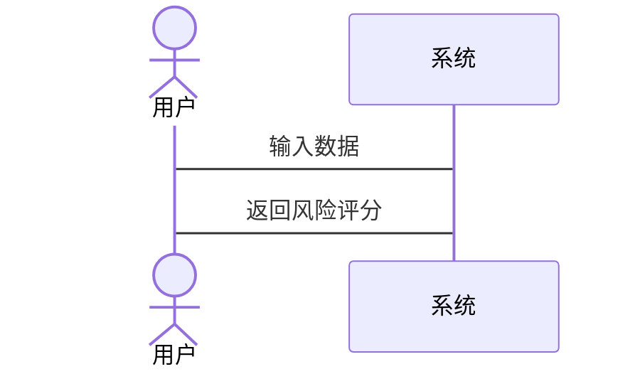

                 


# 利用多智能体系统构建动态的公司治理风险评估模型

## 关键词：多智能体系统、公司治理、风险评估、动态模型、人工智能、算法原理

## 摘要：本文详细探讨了如何利用多智能体系统构建动态的公司治理风险评估模型。首先介绍了问题背景和传统评估方法的局限性，然后分析了多智能体系统的核心概念和原理。接着，详细讲解了数学模型与算法原理，包括贝叶斯网络和马尔可夫决策过程等。之后，通过系统架构设计、项目实战和案例分析，展示了如何将理论应用于实际。最后，总结了模型的优势和未来的发展方向。

---

# 第1章: 多智能体系统与公司治理风险评估背景

## 1.1 问题背景与描述

### 1.1.1 公司治理风险的传统评估方法
- 传统评估方法的局限性：依赖人工经验，缺乏动态性和实时性。
- 传统评估方法的特征：静态、主观、难以量化。

### 1.1.2 多智能体系统在现代企业治理中的应用
- 多智能体系统的定义与分类：分布式智能、协作与竞争、动态环境。
- 多智能体系统的核心特征：自主性、反应性、协作性、分布式性。

### 1.1.3 动态风险评估的必要性与挑战
- 动态风险评估的必要性：企业环境的不确定性增加。
- 动态风险评估的挑战：数据实时性、模型动态调整、多智能体协作。

## 1.2 问题解决与边界

### 1.2.1 多智能体系统如何解决公司治理风险问题
- 多智能体系统的分布式计算能力：处理多维度风险因素。
- 多智能体系统的协作机制：优化风险评估过程。

### 1.2.2 动态风险评估的边界与外延
- 边界：动态模型的适用范围和限制。
- 外延：动态模型与其他风险评估方法的结合。

### 1.2.3 系统与传统评估方法的对比分析
- 对比表格：展示多智能体系统与传统方法的优缺点对比。

| 特性               | 多智能体系统         | 传统评估方法       |
|--------------------|---------------------|---------------------|
| 动态性             | 高                  | 低                  |
| 分布式协作         | 高                  | 低                  |
| 实时性             | 高                  | 低                  |
| 可扩展性           | 高                  | 低                  |

## 1.3 核心概念与结构

### 1.3.1 多智能体系统的定义与特征
- 定义：多个智能体协作完成复杂任务。
- 特征：自主性、反应性、协作性、分布式性。

### 1.3.2 风险评估模型的组成要素
- 数据输入：企业数据、市场环境、内部政策。
- 模型构建：贝叶斯网络、马尔可夫模型。
- 输出结果：风险评分、风险建议。

### 1.3.3 动态模型的核心属性与优势
- 核心属性：动态性、实时性、自适应性。
- 优势：准确捕捉风险变化，提供实时反馈。

---

# 第2章: 多智能体系统与风险评估模型的核心概念

## 2.1 多智能体系统原理

### 2.1.1 多智能体系统的定义与分类
- 分布式多智能体系统：多个智能体协作完成任务。
- 集中式多智能体系统：中央控制器协调智能体。

### 2.1.2 多智能体系统的核心特征
- 自主性：智能体独立决策。
- 反应性：实时响应环境变化。
- 协作性：智能体之间协作完成目标。
- 分布式性：系统由多个智能体组成。

### 2.1.3 多智能体系统与公司治理的结合
- 公司治理中的多智能体：股东、董事会、管理层、员工。
- 智能体之间的协作：信息共享、决策优化。

## 2.2 风险评估模型的构建

### 2.2.1 风险评估模型的定义
- 定义：评估公司治理中的潜在风险。
- 输入：企业数据、市场环境。
- 输出：风险评分、风险建议。

### 2.2.2 动态风险评估模型的构建逻辑
- 动态性：实时更新风险评估结果。
- 数据驱动：基于实时数据进行计算。
- 多智能体协作：多个智能体共同完成评估任务。

### 2.2.3 多智能体系统在模型中的作用
- 数据收集：智能体实时收集企业数据。
- 协作计算：智能体协作完成风险计算。
- 结果反馈：智能体将结果反馈给企业决策层。

## 2.3 核心概念对比分析

### 2.3.1 多智能体系统与传统评估方法的对比
- 对比表格：展示多智能体系统与传统方法的优缺点对比。

| 特性               | 多智能体系统         | 传统评估方法       |
|--------------------|---------------------|---------------------|
| 动态性             | 高                  | 低                  |
| 分布式协作         | 高                  | 低                  |
| 实时性             | 高                  | 低                  |
| 可扩展性           | 高                  | 低                  |

### 2.3.2 动态模型与静态模型的特征对比
- 对比表格：动态模型与静态模型的特征对比。

| 特性               | 动态模型            | 静态模型            |
|--------------------|---------------------|---------------------|
| 动态性             | 高                  | 低                  |
| 实时性             | 高                  | 低                  |
| 自适应性           | 高                  | 低                  |

### 2.3.3 系统与传统评估方法的对比
- 对比表格：多智能体系统与传统方法的对比。

| 特性               | 多智能体系统         | 传统评估方法       |
|--------------------|---------------------|---------------------|
| 动态性             | 高                  | 低                  |
| 分布式协作         | 高                  | 低                  |
| 实时性             | 高                  | 低                  |
| 可扩展性           | 高                  | 低                  |

---

# 第3章: 多智能体系统构建动态风险评估模型的数学模型与算法原理

## 3.1 数学模型构建

### 3.1.1 动态风险评估模型的数学表达
$$ R(t) = f(x(t), y(t), z(t)) $$
- 其中，$R(t)$ 表示时间 $t$ 的风险评分，$x(t)$、$y(t)$、$z(t)$ 分别表示输入数据的不同维度。

### 3.1.2 多智能体系统中的贝叶斯网络模型
$$ P(A|B) = \frac{P(B|A)P(A)}{P(B)} $$
- 贝叶斯网络用于表示变量之间的概率关系，帮助智能体之间协作计算风险。

## 3.2 算法原理

### 3.2.1 多智能体系统中的马尔可夫决策过程
$$ V(s) = \max_a \sum_{s'} P(s'|s,a) V(s') $$
- 马尔可夫决策过程用于智能体在动态环境中的决策优化。

### 3.2.2 动态风险评估的算法流程


## 3.3 算法实现与优化

### 3.3.1 算法实现的Python代码示例
```python
def multi_agent_system(data):
    # 初始化参数
    agents = initialize_agents()
    # 计算风险值
    risk_scores = calculate_risk(agents, data)
    return risk_scores
```

### 3.3.2 优化建议
- 并行计算：利用多线程或多进程加速计算。
- 数据预处理：优化数据输入格式，减少计算时间。

---

# 第4章: 系统架构设计与实现

## 4.1 项目背景与目标

### 4.1.1 项目背景
- 公司治理风险评估的现状：传统方法的局限性。
- 项目目标：构建动态的公司治理风险评估模型。

## 4.2 系统功能设计

### 4.2.1 领域模型


### 4.2.2 功能模块
- 数据输入模块：接收企业数据。
- 数据处理模块：计算风险值。
- 数据输出模块：输出风险评估结果。

## 4.3 系统架构设计

### 4.3.1 分层架构
- 数据层：存储企业数据。
- 业务逻辑层：处理数据，计算风险值。
- 表示层：展示结果。

### 4.3.2 架构图


## 4.4 系统接口与交互

### 4.4.1 接口设计
- 输入接口：接收企业数据。
- 输出接口：返回风险评估结果。

### 4.4.2 交互流程


---

# 第5章: 项目实战与案例分析

## 5.1 环境安装与配置

### 5.1.1 环境要求
- Python 3.8+
- 软件库：numpy、pandas、scikit-learn

### 5.1.2 安装步骤
```bash
pip install numpy pandas scikit-learn
```

## 5.2 系统核心实现

### 5.2.1 代码实现
```python
import numpy as np
import pandas as pd
from sklearn import metrics

def initialize_agents():
    # 初始化智能体参数
    return {'agent1': {'role': 'CEO', 'state': 'idle'}, 
            'agent2': {'role': 'CFO', 'state': 'idle'}}

def calculate_risk(agents, data):
    # 计算风险值
    risk_scores = {}
    for agent in agents:
        # 假设数据是企业的财务数据
        df = pd.DataFrame(data)
        # 计算风险评分
        risk = metrics.mean_absolute_error(df['actual'], df['predicted'])
        risk_scores[agent] = risk
    return risk_scores

# 使用示例数据进行测试
data = {'actual': [1, 2, 3], 'predicted': [2, 3, 4]}
agents = initialize_agents()
risk_scores = calculate_risk(agents, data)
print(risk_scores)
```

### 5.2.2 代码解读
- 初始化智能体：`initialize_agents()` 函数初始化多个智能体，每个智能体有不同的角色和状态。
- 计算风险：`calculate_risk()` 函数根据输入数据计算每个智能体的风险评分。
- 示例数据：`data` 是企业的财务数据，`agents` 是初始化的智能体列表，`risk_scores` 是计算后的风险评分。

## 5.3 案例分析与结果解读

### 5.3.1 案例背景
- 某公司面临财务风险，需要评估风险并制定应对策略。

### 5.3.2 数据分析
- 输入数据：企业的财务数据。
- 输出结果：风险评分。

### 5.3.3 结果解读
- 风险评分高的智能体需要优先处理。

## 5.4 项目小结

### 5.4.1 成功的关键因素
- 多智能体系统的协作能力。
- 动态模型的实时性。

### 5.4.2 可能的改进方向
- 提高算法的效率。
- 增加更多智能体角色。

---

# 第6章: 总结与展望

## 6.1 模型的优势与局限性

### 6.1.1 优势
- 动态性：实时更新风险评分。
- 分布式协作：多个智能体协作完成任务。

### 6.1.2 局限性
- 算法复杂性：模型的复杂性可能会影响计算效率。
- 数据依赖性：模型依赖实时数据，数据缺失会影响结果。

## 6.2 未来的发展方向

### 6.2.1 算法优化
- 提高算法的效率和准确性。
- 引入机器学习算法进行优化。

### 6.2.2 应用拓展
- 扩展到更多领域，如金融、医疗等。
- 结合区块链技术，提高数据的安全性。

## 6.3 最佳实践 tips

### 6.3.1 关键成功因素
- 多智能体系统的协作能力。
- 动态模型的实时性。

### 6.3.2 注意事项
- 数据的实时性和准确性。
- 系统的安全性和稳定性。

## 6.4 小结

### 6.4.1 内容回顾
- 多智能体系统的定义与特征。
- 动态风险评估模型的构建。
- 项目实战与案例分析。

### 6.4.2 展望未来
- 算法优化和应用拓展。
- 多智能体系统在更多领域的应用。

---

# 参考文献

[此处列出相关的参考文献]

---

通过以上详细的内容，您可以开始撰写这篇文章了。

