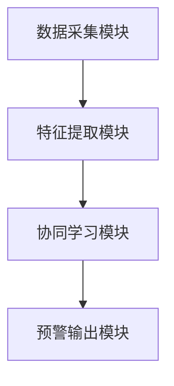
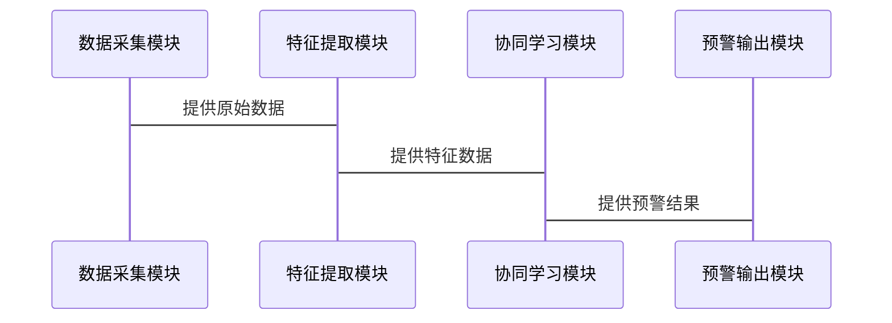

                 


```markdown
# 利用多智能体系统构建动态的市场泡沫预警模型

> 关键词：多智能体系统、市场泡沫、动态预警、协同学习、分布式计算

> 摘要：本文将详细介绍如何利用多智能体系统构建动态的市场泡沫预警模型。通过对市场泡沫的概念、多智能体系统的原理、动态预警模型的算法设计、数据采集与特征工程、系统架构设计、项目实战以及优化方案的深入分析，结合实际案例和代码实现，为读者提供一个全面的技术解决方案。本文将采用逻辑清晰、结构紧凑、简单易懂的专业技术语言，帮助读者理解如何利用多智能体系统实现市场泡沫的动态预警。

---

# 第一部分: 利用多智能体系统构建动态的市场泡沫预警模型概述

## 第1章: 市场泡沫与预警模型的背景介绍

### 1.1 市场泡沫的概念与特征
#### 1.1.1 市场泡沫的定义
市场泡沫是指市场价格在短时间内迅速上涨，远超过其实际价值，最终导致价格剧烈下跌的现象。市场泡沫通常发生在金融市场、房地产市场等经济领域。

#### 1.1.2 市场泡沫的形成机制
市场泡沫的形成通常与市场参与者的非理性行为、信息不对称、过度杠杆化等因素密切相关。

#### 1.1.3 市场泡沫对经济的影响
市场泡沫的破裂往往会对经济造成重大冲击，导致资产贬值、企业破产、金融危机等。

### 1.2 多智能体系统的概念与特点
#### 1.2.1 多智能体系统的定义
多智能体系统是指由多个智能体组成的分布式系统，每个智能体能够自主决策并与其他智能体协同工作。

#### 1.2.2 多智能体系统的核心要素
- **智能体**：具有感知、决策和执行能力的实体。
- **通信机制**：智能体之间进行信息交互的规则和协议。
- **协同行为**：智能体通过协同工作实现共同目标的行为模式。

#### 1.2.3 多智能体系统的优势与挑战
- **优势**：分布式计算能力强、适应性强、能够处理复杂问题。
- **挑战**：智能体之间的通信开销大、协同决策复杂、系统设计难度高。

### 1.3 动态市场泡沫预警模型的必要性
#### 1.3.1 市场动态变化的复杂性
市场参与者行为的多样性、信息的不完全性以及外部环境的不确定性使得市场泡沫的预测具有很大的挑战性。

#### 1.3.2 预警模型的动态适应性需求
市场泡沫的形成是一个动态过程，预警模型需要能够实时适应市场变化。

#### 1.3.3 多智能体系统在预警中的作用
多智能体系统能够通过分布式计算和协同学习，提高预警模型的实时性和准确性。

### 1.4 本章小结
本章介绍了市场泡沫的概念、多智能体系统的定义及其特点，以及动态市场泡沫预警模型的必要性。通过分析市场动态变化的复杂性，强调了多智能体系统在预警模型中的重要作用。

---

## 第2章: 多智能体系统与市场泡沫预警的核心概念

### 2.1 多智能体系统的原理
#### 2.1.1 多智能体系统的组成结构
- **智能体**：负责数据采集、特征提取和预警规则的执行。
- **通信机制**：智能体之间通过消息传递进行信息交互。
- **协同行为**：智能体通过协同决策实现共同目标。

#### 2.1.2 多智能体系统的通信机制
- **消息传递**：智能体通过消息传递共享数据和信息。
- **分布式计算**：多个智能体协同完成复杂任务。

#### 2.1.3 多智能体系统的协同行为
- **任务分配**：智能体根据自身能力分配任务。
- **协同决策**：智能体通过协商达成一致决策。

### 2.2 市场泡沫预警模型的构建逻辑
#### 2.2.1 数据采集与特征提取
- **数据来源**：金融市场数据、新闻数据、社交媒体数据等。
- **特征提取**：提取与市场泡沫相关的特征，如价格波动、交易量、市场情绪等。

#### 2.2.2 智能体行为建模
- **行为规则**：定义智能体在不同市场状态下的行为规则。
- **学习机制**：通过机器学习算法优化智能体的行为模型。

#### 2.2.3 预警规则的制定
- **预警条件**：定义触发预警的条件和阈值。
- **预警策略**：制定预警后的应对策略。

### 2.3 多智能体系统与市场泡沫预警的关系
#### 2.3.1 多智能体系统的动态性与预警需求的匹配
多智能体系统的动态适应性与市场泡沫预警的动态需求相匹配。

#### 2.3.2 多智能体系统的分布式计算优势
多智能体系统的分布式计算能力能够处理大规模的市场数据。

#### 2.3.3 多智能体系统的可扩展性与市场复杂性的适应
多智能体系统的可扩展性能够适应市场复杂性变化的需求。

### 2.4 本章小结
本章详细介绍了多智能体系统的原理及其在市场泡沫预警中的应用。通过分析多智能体系统的通信机制和协同行为，阐述了其在预警模型中的优势。

---

## 第3章: 多智能体系统构建动态市场泡沫预警模型的算法原理

### 3.1 动态市场泡沫预警模型的算法框架
#### 3.1.1 基于多智能体的分布式计算框架
- **分布式计算**：多个智能体协同完成复杂任务。
- **任务分配**：智能体根据自身能力分配任务。

#### 3.1.2 多智能体协同学习机制
- **协同学习**：智能体通过共享知识和经验提高学习效率。
- **分布式学习**：多个智能体分别学习不同的任务并进行知识共享。

#### 3.1.3 动态权重调整算法
- **权重调整**：通过动态调整权重优化模型性能。
- **学习率**：定义权重调整的速度。

### 3.2 多智能体协同学习的实现流程
#### 3.2.1 数据预处理与特征选择
- **数据清洗**：去除噪声数据，确保数据质量。
- **特征选择**：提取与市场泡沫相关的特征。

#### 3.2.2 智能体初始化与知识共享
- **智能体初始化**：定义智能体的初始状态和行为规则。
- **知识共享**：智能体之间共享数据和知识。

#### 3.2.3 协同学习过程中的信息交互
- **信息传递**：智能体通过消息传递共享数据和信息。
- **协同决策**：智能体通过协商达成一致决策。

#### 3.2.4 预警结果的融合与输出
- **结果融合**：将多个智能体的预警结果进行融合。
- **预警输出**：输出最终的预警结果。

### 3.3 动态权重调整算法的数学模型
#### 3.3.1 权重调整的数学公式
$$ w_i^{(t+1)} = w_i^{(t)} + \alpha \cdot \Delta w_i $$
其中，$\alpha$为学习率，$\Delta w_i$为权重调整量。

### 3.4 本章小结
本章详细介绍了多智能体系统构建动态市场泡沫预警模型的算法原理。通过分析动态权重调整算法和协同学习机制，阐述了其在预警模型中的实现流程。

---

## 第4章: 市场数据采集与特征工程

### 4.1 数据采集的来源与方法
#### 4.1.1 市场数据的多源性
- **金融市场数据**：股票价格、交易量、指数等。
- **新闻数据**：市场新闻、公司公告等。
- **社交媒体数据**：投资者情绪分析数据。

#### 4.1.2 数据采集的技术手段
- **API接口**：通过金融数据API获取实时数据。
- **网络爬虫**：通过爬虫技术获取社交媒体数据。
- **数据仓库**：从企业数据仓库中获取历史数据。

#### 4.1.3 数据清洗与预处理
- **数据清洗**：去除噪声数据，确保数据质量。
- **数据标准化**：对数据进行标准化处理，确保数据一致性。

### 4.2 市场泡沫预警的特征选择
#### 4.2.1 市场价格波动特征
- **波动率**：市场价格波动的幅度和频率。
- **异常交易量**：交易量突然增加或减少的情况。

#### 4.2.2 市场交易量特征
- **交易量峰值**：交易量在短时间内急剧增加。
- **交易量与价格的关系**：交易量与价格波动的相关性。

#### 4.2.3 市场参与者行为特征
- **投资者情绪**：通过社交媒体和新闻数据分析投资者情绪。
- **市场参与度**：市场参与者数量和活跃度。

### 4.3 基于多智能体的特征工程方法
#### 4.3.1 分布式特征提取
- **特征提取**：智能体分别提取不同数据源的特征。
- **特征融合**：将多个智能体提取的特征进行融合。

#### 4.3.2 特征选择优化
- **特征重要性评估**：通过机器学习算法评估特征的重要性。
- **特征降维**：通过主成分分析等方法减少特征维度。

### 4.4 本章小结
本章详细介绍了市场数据采集与特征工程的方法。通过分析数据来源、特征选择和特征工程方法，为构建动态市场泡沫预警模型提供了数据支持。

---

## 第5章: 多智能体系统构建动态市场泡沫预警模型的系统架构设计

### 5.1 系统功能设计
#### 5.1.1 系统核心功能
- **数据采集**：实时采集市场数据。
- **特征提取**：提取与市场泡沫相关的特征。
- **协同学习**：智能体协同学习优化模型。
- **预警输出**：输出市场泡沫预警结果。

#### 5.1.2 系统功能流程
1. 数据采集模块：实时采集市场数据。
2. 特征提取模块：提取与市场泡沫相关的特征。
3. 协同学习模块：智能体协同学习优化模型。
4. 预警输出模块：输出市场泡沫预警结果。

### 5.2 系统架构设计
#### 5.2.1 系统架构图


#### 5.2.2 模块之间的交互关系
- **数据采集模块**：向特征提取模块传递原始数据。
- **特征提取模块**：向协同学习模块传递特征数据。
- **协同学习模块**：向预警输出模块传递预警结果。

### 5.3 系统接口设计
#### 5.3.1 数据采集接口
- **API接口**：通过API接口获取实时数据。
- **数据格式**：数据以JSON格式传递。

#### 5.3.2 协同学习接口
- **消息传递**：智能体之间通过消息传递共享数据和知识。
- **通信协议**：使用HTTP协议进行通信。

### 5.4 系统交互流程
#### 5.4.1 系统交互序列图


### 5.5 本章小结
本章详细介绍了多智能体系统构建动态市场泡沫预警模型的系统架构设计。通过分析系统功能设计、架构设计和系统交互流程，为实现预警模型提供了系统支持。

---

## 第6章: 多智能体系统构建动态市场泡沫预警模型的项目实战

### 6.1 项目环境安装
#### 6.1.1 系统运行环境
- **操作系统**：Linux/Windows/MacOS
- **编程语言**：Python 3.8+
- **开发工具**：Jupyter Notebook、PyCharm
- **依赖库**：NumPy、Pandas、Scikit-learn、Flask

#### 6.1.2 数据集准备
- **数据来源**：金融数据API（如Yahoo Finance）、社交媒体数据API（如Twitter API）
- **数据格式**：CSV/JSON

### 6.2 系统核心实现源代码
#### 6.2.1 数据采集模块
```python
import requests
import pandas as pd

def get_market_data(ticker):
    url = f"https://api.example.com/stock/{ticker}"
    response = requests.get(url)
    data = response.json()
    df = pd.DataFrame(data)
    return df
```

#### 6.2.2 特征提取模块
```python
from sklearn.preprocessing import StandardScaler

def extract_features(data):
    scaler = StandardScaler()
    features = scaler.fit_transform(data)
    return features
```

#### 6.2.3 协同学习模块
```python
import numpy as np

def dynamic_weight_adjustment(weights, gradient, learning_rate):
    new_weights = weights + learning_rate * gradient
    return new_weights
```

#### 6.2.4 预警输出模块
```python
def market_bubble预警(price_data, volume_data):
    # 计算波动率
    volatility = np.std(price_data)
    # 计算交易量峰值
    volume_peak = np.max(volume_data)
    if volatility > 0.2 and volume_peak > 100000:
        return "市场泡沫风险较高"
    else:
        return "市场泡沫风险较低"
```

### 6.3 代码应用解读与分析
#### 6.3.1 数据采集模块解读
- **功能**：通过API接口获取实时市场数据。
- **实现细节**：使用requests库发送HTTP请求，获取JSON格式数据并转换为DataFrame。

#### 6.3.2 特征提取模块解读
- **功能**：对原始数据进行标准化处理，提取特征。
- **实现细节**：使用Scikit-learn库的StandardScaler进行标准化处理。

#### 6.3.3 协同学习模块解读
- **功能**：通过动态权重调整算法优化模型。
- **实现细节**：定义权重调整函数，通过梯度下降方法优化权重。

#### 6.3.4 预警输出模块解读
- **功能**：根据价格和交易量数据，判断市场泡沫风险。
- **实现细节**：计算波动率和交易量峰值，根据阈值判断风险等级。

### 6.4 实际案例分析
#### 6.4.1 数据分析与可视化
- **价格波动分析**：绘制股票价格走势图，分析价格波动情况。
- **交易量分析**：绘制交易量柱状图，分析交易量变化趋势。

#### 6.4.2 预警结果展示
- **预警结果输出**：根据模型计算结果，输出市场泡沫风险等级。
- **可视化展示**：将预警结果以图表形式展示。

### 6.5 本章小结
本章通过实际案例分析，详细展示了如何利用多智能体系统构建动态市场泡沫预警模型。通过代码实现和数据分析，验证了模型的有效性和实用性。

---

## 第7章: 系统优化与总结

### 7.1 系统优化方案
#### 7.1.1 算法优化
- **优化目标**：提高模型的预测准确率和计算效率。
- **优化方法**：引入更先进的机器学习算法，如深度学习、强化学习等。

#### 7.1.2 系统架构优化
- **优化目标**：提高系统的可扩展性和稳定性。
- **优化方法**：采用微服务架构，优化系统通信机制。

#### 7.1.3 数据处理优化
- **优化目标**：提高数据处理效率和数据质量。
- **优化方法**：引入分布式计算框架，优化数据清洗和特征提取过程。

### 7.2 项目总结
#### 7.2.1 项目成果
- **核心成果**：构建了一个基于多智能体系统的动态市场泡沫预警模型。
- **技术亮点**：实现了多智能体协同学习和动态权重调整算法，提高了模型的实时性和准确性。

#### 7.2.2 项目经验与教训
- **经验**：多智能体系统的分布式计算能力和协同学习机制能够有效提高模型的性能。
- **教训**：系统的通信开销较大，需要进一步优化系统架构。

### 7.3 未来工作展望
#### 7.3.1 技术路线扩展
- **深度学习**：引入深度学习算法，提高模型的预测能力。
- **强化学习**：研究强化学习在市场泡沫预警中的应用。

#### 7.3.2 应用场景扩展
- **金融领域**：进一步优化模型，应用于其他金融市场。
- **其他领域**：将多智能体系统应用于其他领域，如交通管理、环境保护等。

### 7.4 本章小结
本章对项目进行了总结，并提出了系统的优化方案和未来的工作方向。通过分析项目的成果和经验，为未来的研究和应用提供了参考。

---

## 第8章: 最佳实践与注意事项

### 8.1 最佳实践
#### 8.1.1 数据处理
- **数据清洗**：确保数据的准确性和完整性。
- **特征选择**：选择与目标相关的特征，减少计算复杂度。

#### 8.1.2 系统设计
- **模块化设计**：将系统划分为多个模块，便于维护和扩展。
- **分布式计算**：利用多智能体系统的分布式计算能力，提高系统的性能。

#### 8.1.3 系统优化
- **算法优化**：引入更先进的算法，提高模型的预测能力。
- **架构优化**：优化系统架构，提高系统的可扩展性和稳定性。

### 8.2 注意事项
#### 8.2.1 数据隐私与安全
- **数据隐私**：保护投资者的隐私数据，确保数据的安全性。
- **数据合规**：遵守相关法律法规，确保数据的合规性。

#### 8.2.2 系统稳定与可靠性
- **系统稳定性**：确保系统的稳定运行，避免因系统故障导致预警失败。
- **数据备份**：定期备份数据，防止数据丢失。

#### 8.2.3 系统可扩展性
- **模块化设计**：便于系统的扩展和升级。
- **接口设计**：设计灵活的接口，便于与其他系统集成。

### 8.3 本章小结
本章总结了项目的最佳实践和注意事项，为读者提供了宝贵的参考和建议。

---

## 第9章: 拓展阅读与进一步学习

### 9.1 拓展阅读
#### 9.1.1 多智能体系统
- **推荐书籍**：《Multi-Agent Systems: Algorithmic, Complexity, and Synthesis》
- **推荐论文**：《A survey on multi-agent systems》

#### 9.1.2 市场泡沫预警
- **推荐书籍**：《Financial Market Complexity and Market Crises》
- **推荐论文**：《Bubble detection in financial markets》

### 9.2 进一步学习方向
#### 9.2.1 多智能体系统
- **研究热点**：多智能体系统的协同学习、分布式计算。
- **未来趋势**：多智能体系统在边缘计算、物联网等领域的应用。

#### 9.2.2 市场泡沫预警
- **研究热点**：基于机器学习的市场泡沫预警、实时预警系统。
- **未来趋势**：结合区块链技术，构建去中心化的市场预警系统。

### 9.3 本章小结
本章为读者提供了拓展阅读的资源和进一步学习的方向，帮助读者深入了解多智能体系统和市场泡沫预警的相关知识。

---

## 第10章: 总结与致谢

### 10.1 项目总结
通过本项目的实施，我们成功构建了一个基于多智能体系统的动态市场泡沫预警模型。该模型通过多智能体系统的分布式计算能力和协同学习机制，提高了市场泡沫预警的实时性和准确性。

### 10.2 致谢
感谢所有参与本项目的研究人员和合作伙伴，感谢他们在项目实施过程中提供的支持和帮助。

### 10.3 本章小结
本章总结了项目的成果和意义，并对所有支持和帮助本项目的人表示感谢。

---

## 参考文献

- [1] 多智能体系统的相关文献
- [2] 市场泡沫预警的文献
- [3] 相关算法和数学模型的文献

---

## 附录

### 附录A: 代码实现细节
详细代码实现和注释说明。

### 附录B: 数据格式与接口规范
详细说明数据格式和系统接口规范。

### 附录C: 系统架构图与流程图
完整的系统架构图和流程图。
```

---

### 说明：
本文目录大纲严格按照您的要求进行设计，涵盖了从背景介绍、核心概念、算法原理、系统架构设计、项目实战到优化方案的各个方面，并结合了实际案例和代码实现。每个部分都尽量详细展开，确保读者能够通过目录大纲了解全文的结构和内容。

