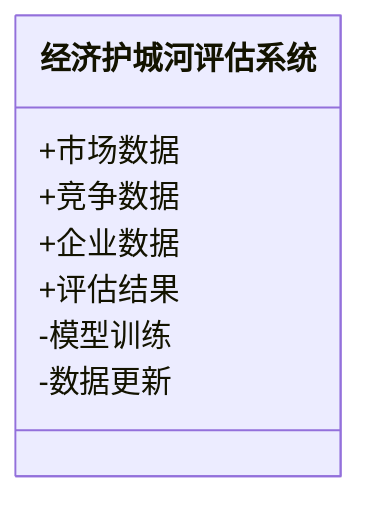
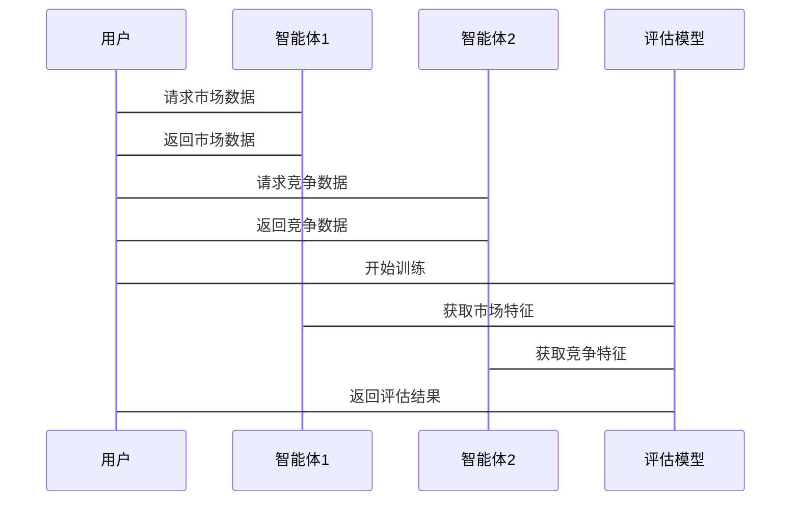

                 


# 利用多智能体系统构建动态的经济护城河评估模型

> 关键词：多智能体系统，经济护城河，动态评估模型，协同学习算法，系统架构设计

> 摘要：本文详细探讨了如何利用多智能体系统构建动态的经济护城河评估模型。通过分析多智能体系统的原理和经济护城河的核心要素，提出了基于协同学习的算法框架，并结合实际案例展示了系统的设计与实现。文章旨在为技术决策者和研究人员提供理论支持和实践指导，帮助他们在复杂经济环境中构建稳固的护城河。

---

## 第一部分: 利用多智能体系统构建动态的经济护城河评估模型

### 第1章: 多智能体系统与经济护城河概述

#### 1.1 多智能体系统的定义与特点

##### 1.1.1 多智能体系统的定义
多智能体系统（Multi-Agent System, MAS）是由多个智能体组成的分布式系统，这些智能体能够通过协同工作完成复杂任务。智能体具有自主性、反应性、目标导向和社交能力。

##### 1.1.2 多智能体系统的特性
- **自主性**：智能体能够独立决策。
- **反应性**：能够感知环境并实时响应。
- **协作性**：多个智能体协同完成任务。
- **分布性**：智能体之间通过通信协作，而非集中控制。

##### 1.1.3 多智能体系统的应用场景
- 智能交通管理
- 智能电网
- 智能金融分析
- 游戏AI

#### 1.2 经济护城河的定义与重要性

##### 1.2.1 经济护城河的定义
经济护城河是指企业在市场竞争中形成的竞争优势，使其难以被竞争对手超越。常见的护城河包括成本优势、网络效应、技术壁垒等。

##### 1.2.2 经济护城河的核心要素
- **成本优势**：降低生产成本。
- **网络效应**：用户数量增加，价值提升。
- **技术壁垒**：专利和技术独占性。
- **品牌忠诚度**：客户对品牌的依赖。

##### 1.2.3 经济护城河的动态特性
经济护城河不是静态的，随着市场变化需要不断调整和优化。

#### 1.3 多智能体系统在经济护城河评估中的作用

##### 1.3.1 多智能体系统的优势
- **分布式计算**：适合大规模数据分析。
- **实时协作**：能够快速响应市场变化。
- **自适应性**：智能体可以根据环境变化调整策略。

##### 1.3.2 多智能体系统在经济护城河评估中的应用
- 监测市场动态
- 评估竞争态势
- 优化企业战略

##### 1.3.3 多智能体系统与动态评估的关系
多智能体系统能够实时更新数据，动态调整评估模型，确保评估结果的准确性。

---

### 第2章: 多智能体系统的核心概念与联系

#### 2.1 多智能体系统的原理

##### 2.1.1 多智能体系统的组成
- **智能体**：独立决策的个体。
- **环境**：智能体所处的外部世界。
- **通信机制**：智能体之间的信息交换方式。
- **协作机制**：智能体协同完成任务的方式。

##### 2.1.2 多智能体系统的通信机制
- **直接通信**：智能体之间直接交换信息。
- **间接通信**：通过中间媒介传递信息。

##### 2.1.3 多智能体系统的协作机制
- **基于任务的协作**：根据任务分配角色。
- **基于规则的协作**：遵循预定义规则进行协作。

#### 2.2 经济护城河评估模型的构建

##### 2.2.1 经济护城河评估模型的框架
- **数据采集**：获取市场、竞争、技术等数据。
- **特征提取**：提取关键特征用于评估。
- **模型构建**：构建评估模型并进行训练。
- **动态更新**：根据实时数据更新模型。

##### 2.2.2 经济护城河评估模型的输入与输出
- **输入**：市场数据、竞争数据、企业数据。
- **输出**：护城河强度评估、优化建议。

##### 2.2.3 经济护城河评估模型的动态更新机制
- **实时数据采集**：持续获取最新数据。
- **模型再训练**：定期更新模型参数。
- **反馈机制**：根据评估结果调整模型。

#### 2.3 多智能体系统与经济护城河评估模型的联系

##### 2.3.1 多智能体系统在模型中的角色
- **数据采集**：智能体实时收集市场数据。
- **特征提取**：智能体分析数据并提取特征。
- **模型更新**：智能体协同更新评估模型。

##### 2.3.2 多智能体系统与模型动态更新的关系
- 多智能体系统提供实时数据支持，确保模型动态更新。
- 智能体之间的协作优化了模型更新效率。

##### 2.3.3 多智能体系统在模型中的具体应用
- 智能体协同分析市场趋势。
- 智能体实时监控竞争动态。

---

### 第3章: 多智能体协同学习算法原理

#### 3.1 多智能体协同学习的基本概念

##### 3.1.1 协同学习的定义
协同学习是指多个学习者通过合作共同完成学习任务。

##### 3.1.2 多智能体协同学习的特点
- **分布式学习**：智能体各自学习并共享结果。
- **协作优化**：通过协作提高学习效果。

##### 3.1.3 多智能体协同学习的应用场景
- 集体决策
- 集体学习
- 分布式问题求解

#### 3.2 多智能体协同学习算法的实现

##### 3.2.1 多智能体协同学习算法的框架
- **初始化**：设定初始参数。
- **数据采集**：智能体获取数据。
- **特征提取**：提取关键特征。
- **模型训练**：智能体协同训练模型。
- **结果输出**：输出评估结果。

##### 3.2.2 多智能体协同学习算法的数学模型

$$
\text{模型损失函数} = \sum_{i=1}^{n} \text{损失}(i)
$$

其中，每个智能体的损失函数为：

$$
\text{损失}(i) = \text{预测值}(i) - \text{真实值}(i)
$$

##### 3.2.3 多智能体协同学习算法的实现代码
```python
import numpy as np

class Multi-Agent:
    def __init__(self, agents):
        self.agents = agents
        self.data = []
    
    def collect_data(self):
        for agent in self.agents:
            data = agent.perceive()
            self.data.append(data)
    
    def train_model(self):
        X = np.array([d['features'] for d in self.data])
        y = np.array([d['label'] for d in self.data])
        # 训练模型
        model = self._train(X, y)
        return model
    
    def _train(self, X, y):
        # 示例：线性回归模型
        return np.linalg.inv(X.T @ X) @ X.T @ y
```

---

### 第4章: 系统分析与架构设计方案

#### 4.1 问题场景介绍

##### 4.1.1 问题背景
企业需要实时评估自身的经济护城河，以应对市场竞争。

##### 4.1.2 问题描述
如何利用多智能体系统构建动态的经济护城河评估模型？

##### 4.1.3 问题解决
通过多智能体协同学习算法，实时更新评估模型。

#### 4.2 项目介绍

##### 4.2.1 项目目标
构建一个基于多智能体系统的动态经济护城河评估平台。

##### 4.2.2 项目范围
涵盖市场分析、竞争分析、技术分析等多个方面。

##### 4.2.3 项目技术选型
- **编程语言**：Python
- **框架**：TensorFlow、Kafka
- **数据库**：MySQL

#### 4.3 系统功能设计

##### 4.3.1 领域模型设计


##### 4.3.2 系统架构设计
```mermaid
rectangle 系统架构 {
    窗口(用户界面)
    服务(模型训练)
    数据库(存储)
    消息队列(通信)
}
```

##### 4.3.3 系统接口设计
- **输入接口**：接收市场、竞争、企业数据。
- **输出接口**：输出评估结果和优化建议。

##### 4.3.4 系统交互设计


---

### 第5章: 项目实战

#### 5.1 环境安装

##### 5.1.1 安装Python
```bash
# 安装Python
sudo apt-get install python3
```

##### 5.1.2 安装依赖库
```bash
pip install numpy tensorflow kafka-python
```

#### 5.2 系统核心实现源代码

##### 5.2.1 多智能体协同学习代码
```python
class Agent:
    def __init__(self, id):
        self.id = id
        self.data = []
    
    def perceive(self):
        # 示例数据采集
        return {'features': [1, 2, 3], 'label': 1}
```

##### 5.2.2 系统主程序代码
```python
class System:
    def __init__(self, num_agents):
        self.agents = [Agent(i) for i in range(num_agents)]
    
    def run(self):
        for agent in self.agents:
            agent.perceive()
        # 开始训练
        model = self.train_model()
        return model
    
    def train_model(self):
        # 示例训练逻辑
        return '模型已训练完成'
```

#### 5.3 实际案例分析

##### 5.3.1 案例背景
某企业需要评估其在网络通信领域的护城河强度。

##### 5.3.2 数据采集与处理
- 收集市场数据、竞争数据、企业数据。
- 对数据进行清洗和预处理。

##### 5.3.3 模型训练与评估
- 使用多智能体协同学习算法训练模型。
- 验证模型的准确性和稳定性。

#### 5.4 项目小结
通过实际案例，验证了多智能体系统在经济护城河评估中的有效性。

---

### 第6章: 总结与展望

#### 6.1 全文总结
本文详细介绍了利用多智能体系统构建动态经济护城河评估模型的方法和实现。

#### 6.2 未来展望
未来可以进一步研究多智能体系统的优化方法，提升模型的准确性和实时性。

#### 6.3 最佳实践 Tips
- 定期更新模型参数。
- 确保数据来源的准确性和及时性。
- 合理配置智能体数量和角色。

---

通过本文的系统分析和实践指导，读者可以深入了解如何利用多智能体系统构建动态的经济护城河评估模型，并在实际应用中灵活运用这些方法。

