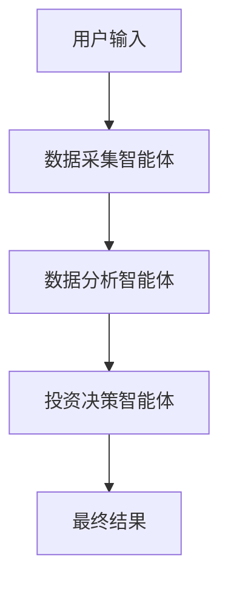
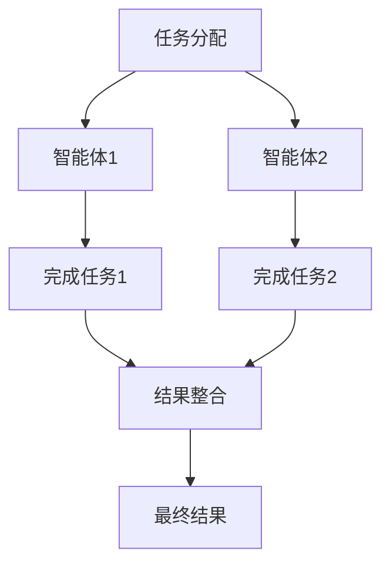
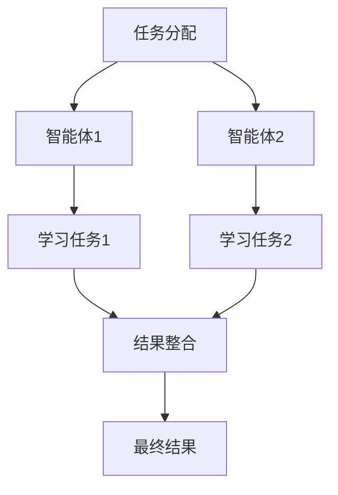
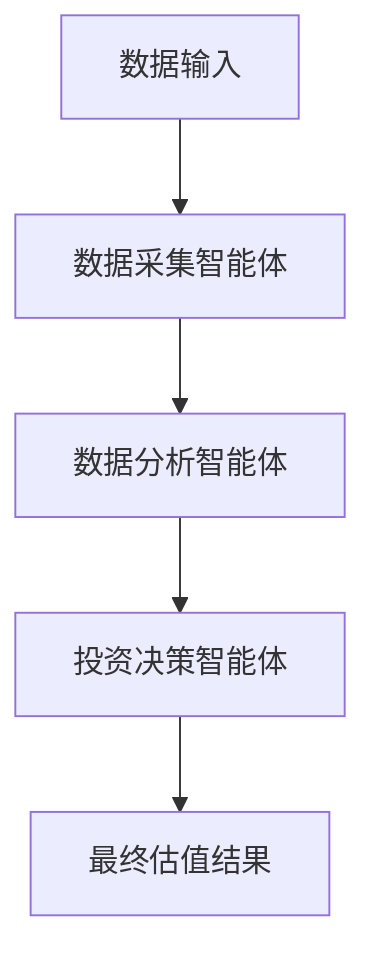
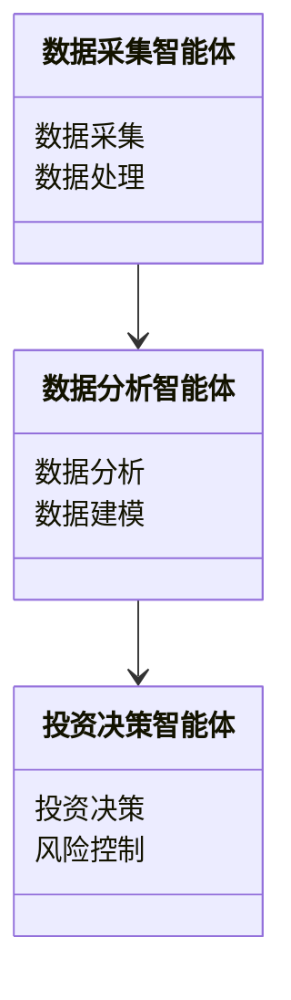
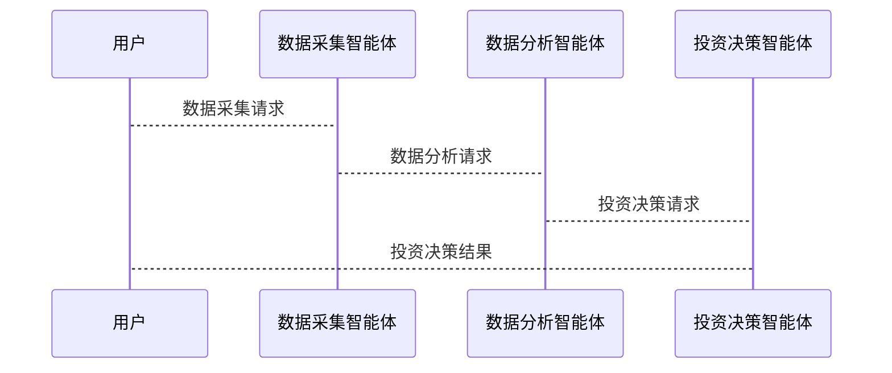

                 


# 利用多智能体系统构建更全面的价值投资研究生态

> **关键词**：多智能体系统，价值投资，分布式计算，协作学习，系统架构设计

> **摘要**：本文旨在探讨如何利用多智能体系统构建更全面的价值投资研究生态。通过分析多智能体系统的原理、算法、系统架构设计以及项目实战，本文为读者提供了一种全新的视角来理解价值投资研究的未来发展方向。文章结合实际案例和代码实现，详细解读了多智能体系统在价值投资研究中的应用，为相关领域的研究者和从业者提供了理论和实践的双重参考。

---

## 第1章: 多智能体系统与价值投资研究生态的背景

### 1.1 问题背景与问题描述

#### 1.1.1 传统价值投资研究的局限性
传统价值投资研究主要依赖于单个研究者的分析能力，这种模式存在以下局限性：
- **信息孤岛**：研究数据分散在各个领域，缺乏有效的整合。
- **效率低下**：单个研究者难以覆盖多维度的数据分析。
- **主观性强**：依赖个人经验，难以实现客观、全面的分析。

#### 1.1.2 多智能体系统的潜力
多智能体系统通过多个智能体的协作，能够实现以下目标：
- **数据整合**：多个智能体协同工作，整合多源数据。
- **高效分析**：通过分布式计算，提升数据分析效率。
- **决策优化**：通过协作学习，优化投资决策。

#### 1.1.3 问题解决的必要性与目标
构建基于多智能体系统的价值投资研究生态，能够有效解决传统研究模式的局限性，目标是实现：
- 数据的高效整合与分析。
- 投资决策的优化与提升。
- 研究生态的动态适应能力。

### 1.2 多智能体系统的概念与边界

#### 1.2.1 多智能体系统的定义与核心要素
多智能体系统（Multi-Agent System，MAS）是由多个智能体（Agent）组成的系统，每个智能体具备以下核心要素：
- **自主性**：智能体能够自主决策。
- **反应性**：智能体能够感知环境并做出反应。
- **协作性**：智能体能够与其他智能体协作完成任务。

#### 1.2.2 价值投资研究生态的构建目标
价值投资研究生态的构建目标是：
- 提供全面、动态、实时的数据分析能力。
- 支持多维度、多层次的投资决策优化。
- 实现研究生态的动态适应能力。

#### 1.2.3 系统边界与外延
系统边界包括：
- 数据输入与输出。
- 智能体之间的协作与通信。
- 系统的外部接口。

系统外延包括：
- 数据来源的扩展。
- 智能体功能的扩展。
- 系统应用场景的扩展。

### 1.3 核心概念的结构与组成

#### 1.3.1 智能体的定义与特征
智能体是一种能够感知环境、自主决策、并与其他智能体协作的实体。其特征包括：
- **自主性**：智能体能够自主决策。
- **反应性**：智能体能够感知环境并做出反应。
- **协作性**：智能体能够与其他智能体协作完成任务。

#### 1.3.2 价值投资研究生态体系
价值投资研究生态体系包括：
- 数据层：包括市场数据、财务数据、新闻数据等。
- 智能体层：包括数据采集智能体、数据分析智能体、投资决策智能体等。
- 应用层：包括投资决策支持、风险控制、投资组合优化等。

#### 1.3.3 多智能体系统与价值投资的结合
多智能体系统与价值投资的结合体现在以下几个方面：
- **数据整合**：多智能体系统能够整合多源数据。
- **高效分析**：通过分布式计算，提升数据分析效率。
- **决策优化**：通过协作学习，优化投资决策。

---

## 第2章: 多智能体系统的原理与机制

### 2.1 多智能体系统的原理

#### 2.1.1 分布式计算与协作机制
分布式计算是多智能体系统的核心机制，其原理如下：
- **任务分配**：系统将任务分配给多个智能体。
- **协作完成**：多个智能体协作完成任务。
- **结果整合**：智能体将结果整合为最终结果。

#### 2.1.2 智能体之间的通信与协调
智能体之间的通信与协调机制包括：
- **消息传递**：智能体之间通过消息传递信息。
- **协调机制**：通过协调机制确保智能体之间的协作。
- **冲突解决**：通过冲突解决机制处理智能体之间的冲突。

#### 2.1.3 系统的动态性与适应性
多智能体系统的动态性与适应性体现在以下几个方面：
- **动态环境**：系统能够适应动态环境的变化。
- **自适应性**：系统能够根据环境变化自适应调整。
- **动态协作**：系统能够动态调整协作方式。

### 2.2 核心概念的对比分析

#### 2.2.1 多智能体系统与传统单智能体系统的对比
| 对比维度 | 多智能体系统 | 传统单智能体系统 |
|----------|--------------|-------------------|
| 资源利用 | 高效利用资源 | 低效利用资源 |
| 系统性能 | 系统性能高 | 系统性能低 |
| 可扩展性 | 系统可扩展性强 | 系统可扩展性弱 |

#### 2.2.2 不同智能体角色的属性特征对比
| 智能体角色 | 数据采集智能体 | 数据分析智能体 | 投资决策智能体 |
|-----------|----------------|-----------------|----------------|
| 功能 | 数据采集与处理 | 数据分析与建模 | 投资决策与优化 |
| 特性 | 高效性、准确性 | 智能性、准确性 | 智能性、决策性 |

### 2.3 实体关系图与流程图

#### 2.3.1 ER实体关系图（使用 Mermaid 语法）
```mermaid
erd
  项目
    章节
      项目实战
        系统架构设计
          价值投资研究生态
            多智能体系统
```

#### 2.3.2 系统协作流程图（使用 Mermaid 语法）


---

## 第3章: 多智能体系统的算法原理

### 3.1 分布式计算算法

#### 3.1.1 分布式计算的基本原理
分布式计算的基本原理是将任务分配给多个智能体，每个智能体完成一部分任务，最终将结果整合为最终结果。

#### 3.1.2 分布式计算的实现流程（使用 Mermaid 语法）


#### 3.1.3 分布式计算的数学模型（使用 LaTeX 公式）
$$
\text{总结果} = \sum_{i=1}^{n} \text{智能体}_i \text{的结果}
$$

### 3.2 协作学习算法

#### 3.2.1 协作学习的基本原理
协作学习的基本原理是通过多个智能体之间的协作，共同完成任务，提升学习效果。

#### 3.2.2 协作学习的实现流程（使用 Mermaid 语法）


#### 3.2.3 协作学习的数学模型（使用 LaTeX 公式）
$$
\text{总结果} = \sum_{i=1}^{n} \text{智能体}_i \text{的学习结果}
$$

---

## 第4章: 价值投资研究的数学模型

### 4.1 价值评估模型

#### 4.1.1 基于多智能体的估值模型
基于多智能体的估值模型通过多个智能体的协作，实现对目标资产的全面估值。

#### 4.1.2 模型的数学表达（使用 LaTeX 公式）
$$
\text{资产价值} = \sum_{i=1}^{n} \text{智能体}_i \text{的估值结果}
$$

#### 4.1.3 模型的实现流程（使用 Mermaid 语法）


---

## 第5章: 系统分析与架构设计

### 5.1 项目背景与目标

#### 5.1.1 项目背景
本项目旨在构建一个基于多智能体系统的价值投资研究生态。

#### 5.1.2 项目目标
- 实现多智能体系统的构建与部署。
- 实现多智能体系统的协作与通信。
- 实现多智能体系统的动态适应能力。

### 5.2 系统功能设计

#### 5.2.1 领域模型（使用 Mermaid 语法）


#### 5.2.2 系统架构设计（使用 Mermaid 语法）


#### 5.2.3 系统交互设计（使用 Mermaid 语法）


---

## 第6章: 项目实战

### 6.1 环境安装与配置

#### 6.1.1 系统环境要求
- 操作系统：Windows/Mac/Linux
- Python版本：3.6+
- 依赖库：numpy, pandas, matplotlib

#### 6.1.2 安装依赖
```bash
pip install numpy pandas matplotlib
```

### 6.2 系统核心实现

#### 6.2.1 数据采集智能体的实现
```python
class DataCollector:
    def __init__(self):
        self.data = []
    
    def collect_data(self):
        # 数据采集逻辑
        pass
```

#### 6.2.2 数据分析智能体的实现
```python
class DataAnalyzer:
    def __init__(self):
        self.models = []
    
    def analyze_data(self, data):
        # 数据分析逻辑
        pass
```

#### 6.2.3 投资决策智能体的实现
```python
class InvestmentDecision:
    def __init__(self):
        self.results = []
    
    def make_decision(self, analysis_results):
        # 投资决策逻辑
        pass
```

### 6.3 代码应用解读与分析

#### 6.3.1 数据采集智能体的实现
数据采集智能体负责采集市场数据、财务数据、新闻数据等。

#### 6.3.2 数据分析智能体的实现
数据分析智能体负责对数据进行分析和建模，生成分析结果。

#### 6.3.3 投资决策智能体的实现
投资决策智能体负责根据分析结果，生成投资决策。

### 6.4 实际案例分析

#### 6.4.1 案例分析
通过实际案例分析，验证多智能体系统的有效性。

#### 6.4.2 案例解读
详细解读案例的实现过程和结果。

### 6.5 项目小结

#### 6.5.1 核心代码解读
解读系统核心代码，总结代码实现的关键点。

#### 6.5.2 项目实现的关键点
总结项目实现的关键点，包括系统架构设计、智能体协作机制、数据处理逻辑等。

---

## 第7章: 最佳实践与小结

### 7.1 最佳实践 tips

#### 7.1.1 系统设计
- 系统设计要清晰，确保各智能体之间的协作。
- 系统架构要合理，确保系统的可扩展性和可维护性。

#### 7.1.2 系统实现
- 系统实现要高效，确保系统的运行效率。
- 系统实现要可靠，确保系统的稳定性。

### 7.2 项目小结

#### 7.2.1 系统实现的总结
总结系统实现的关键点，包括系统架构设计、智能体协作机制、数据处理逻辑等。

#### 7.2.2 项目经验与教训
总结项目实施过程中的经验与教训，包括系统设计、系统实现、系统测试等方面。

### 7.3 注意事项

#### 7.3.1 系统设计
- 系统设计要清晰，确保各智能体之间的协作。
- 系统架构要合理，确保系统的可扩展性和可维护性。

#### 7.3.2 系统实现
- 系统实现要高效，确保系统的运行效率。
- 系统实现要可靠，确保系统的稳定性。

### 7.4 拓展阅读

#### 7.4.1 相关领域的书籍与论文
推荐相关领域的书籍与论文，供读者进一步阅读。

#### 7.4.2 未来研究方向
展望未来的研究方向，包括多智能体系统在其他领域的应用、系统的优化与改进等。

---

**全文小结**
通过本文的详细解读，读者可以全面了解如何利用多智能体系统构建更全面的价值投资研究生态。从系统设计到算法实现，从项目实战到最佳实践，本文为读者提供了理论和实践的双重参考。未来，随着技术的不断发展，多智能体系统在价值投资研究中的应用将更加广泛和深入。

