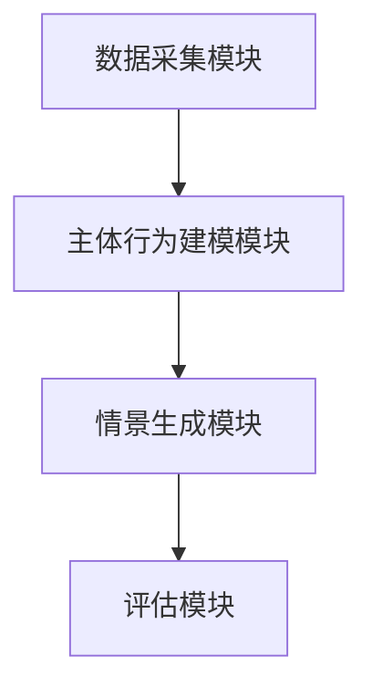
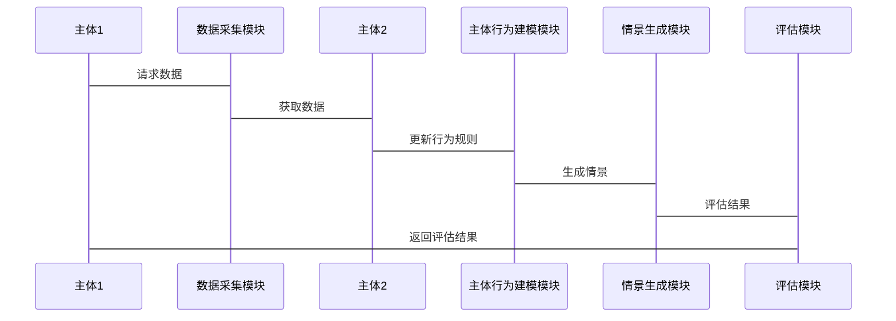

                 


# 利用多智能体系统模拟不同通胀情景：评估公司抗通胀能力

## 关键词：多智能体系统，通胀情景，经济仿真，公司抗通胀，系统模拟

## 摘要：  
本文探讨如何利用多智能体系统（MAS）模拟不同通胀情景，评估公司抗通胀能力。通过构建多智能体模型，分析通胀对企业经营的影响，为企业制定应对策略提供科学依据。本文结合理论分析、算法实现和实际案例，详细阐述多智能体系统在经济仿真中的应用。

---

# 第一部分: 利用多智能体系统模拟通胀情景的背景与基础

## 第1章: 通胀与多智能体系统概述

### 1.1 通胀的基本概念与影响
#### 1.1.1 通胀的定义与分类
通货膨胀（Inflation）是指物价总水平在一段时间内持续上涨，货币购买力下降的经济现象。通胀可以分为温和通胀、严重通胀和恶性通胀，不同类型的通胀对经济和企业的影响也不同。

#### 1.1.2 通胀对企业经营的影响
通胀对企业的影响是多方面的：
- **成本上升**：原材料价格上涨，导致生产成本增加。
- **利润压缩**：如果企业无法将成本转嫁给消费者，利润将被压缩。
- **投资决策**：通胀不确定性可能影响企业的投资决策。
- **员工薪资**：员工可能要求加薪，进一步增加企业负担。

#### 1.1.3 多智能体系统在经济仿真中的作用
多智能体系统（MAS）通过模拟多个主体（如企业、消费者、政府）的交互行为，可以更真实地反映经济系统的动态变化。MAS能够捕捉到传统经济模型难以捕捉的非线性关系和复杂现象，为通胀模拟提供了新的工具。

---

### 1.2 多智能体系统（MAS）的基本概念
#### 1.2.1 多智能体系统的定义
多智能体系统是由多个智能体（Agent）组成的分布式系统，这些智能体能够自主决策、相互交互，并通过协同完成复杂任务。

#### 1.2.2 多智能体系统的特征
| 特征 | 描述 |
|------|------|
| 分布性 | 智能体独立运行，无中心控制 |
| 交互性 | 智能体之间通过通信进行交互 |
| 协作性 | 智能体通过协作完成共同目标 |
| 动态性 | 系统状态随时间动态变化 |

#### 1.2.3 多智能体系统与传统经济模型的区别
| 维度 | 传统经济模型 | 多智能体系统 |
|------|--------------|-------------|
| 描述方式 | 基于方程和假设 | 基于主体行为 |
| 系统复杂性 | 简化假设 | 细化主体行为 |
| 应用场景 | 宏观分析 | 微观与宏观结合 |

### 1.3 多智能体系统在通胀模拟中的应用前景
#### 1.3.1 多智能体系统的优势
- **高灵活性**：能够模拟复杂多变的经济环境。
- **实时性**：可以动态调整模型参数。
- **可扩展性**：适用于不同规模的经济系统。

#### 1.3.2 多智能体系统在经济仿真中的潜在应用
- **政策模拟**：评估货币政策对通胀的影响。
- **市场预测**：预测不同情景下的市场走势。
- **企业决策支持**：帮助企业制定抗通胀策略。

#### 1.3.3 多智能体系统面临的挑战
- **模型复杂性**：需要精确建模主体行为。
- **计算资源**：大规模模拟需要高性能计算。
- **数据获取**：需要大量实时数据支持。

### 1.4 本章小结
本章介绍了通胀的基本概念、对企业的影响，以及多智能体系统的基本特征和在经济仿真中的应用前景。多智能体系统以其分布式、动态化和高灵活性的特点，为通胀模拟提供了新的思路。

---

## 第2章: 多智能体系统的理论基础

### 2.1 多智能体系统的组成与结构
#### 2.1.1 主体（Agent）的概念与分类
主体是多智能体系统的基本单元，可以分为简单主体和复杂主体。简单主体基于固定规则行动，复杂主体具有学习和适应能力。

#### 2.1.2 多智能体系统的层次结构
多智能体系统通常由以下层次组成：
1. **主体层**：定义主体的属性和行为。
2. **交互层**：定义主体之间的通信和交互方式。
3. **系统层**：定义系统的整体目标和运行规则。

#### 2.1.3 多智能体系统的通信机制
主体之间的通信可以通过直接消息传递或间接信息共享实现。通信机制需要设计高效的协议以确保信息传递的准确性和实时性。

### 2.2 多智能体系统的协同与协调
#### 2.2.1 主体间的协同机制
协同机制包括同步行动和分工合作。通过协同，主体可以共同完成复杂任务。

#### 2.2.2 主体间的冲突与解决
主体之间的冲突可能源于资源竞争或利益冲突。解决冲突需要设计合理的仲裁机制。

#### 2.2.3 主体间的通信协议
通信协议定义了主体之间信息传递的格式和规则，确保系统内部的信息一致性。

### 2.3 多智能体系统的建模方法
#### 2.3.1 基于主体的建模方法
基于主体的建模方法通过定义主体的行为规则，模拟系统的动态变化。

#### 2.3.2 基于规则的建模方法
基于规则的建模方法通过预定义规则，指导主体的行动。

#### 2.3.3 基于状态的建模方法
基于状态的建模方法通过定义主体的状态转移规则，模拟主体的行为变化。

### 2.4 本章小结
本章详细介绍了多智能体系统的组成、结构、协同机制和建模方法。这些内容为后续的算法实现和系统设计奠定了理论基础。

---

## 第3章: 多智能体系统在通胀情景模拟中的核心概念与联系

### 3.1 多智能体系统的核心概念
#### 3.1.1 主体的属性与行为
主体在通胀模拟中的属性包括经济地位、市场影响力等，行为包括价格制定、投资决策等。

#### 3.1.2 主体的决策机制
主体的决策机制基于其属性和环境信息，通常采用基于规则的决策方法。

#### 3.1.3 主体的交互方式
主体之间的交互方式包括直接交易和间接影响，交互结果会影响整体系统的经济状况。

### 3.2 多智能体系统的核心原理
#### 3.2.1 基于主体的建模原理
基于主体的建模原理强调主体的自主性和交互性，通过模拟主体行为反映系统的动态变化。

#### 3.2.2 主体间的动态交互
主体间的动态交互会导致系统状态的变化，进而影响整体经济走势。

#### 3.2.3 系统的涌现性特征
涌现性特征是指系统整体表现出个体主体所不具备的特性，例如市场的自我调节能力。

### 3.3 多智能体系统的概念对比与ER实体关系图
#### 3.3.1 多智能体系统与传统经济模型的对比
- **复杂性**：多智能体系统更接近实际经济系统。
- **动态性**：多智能体系统能够模拟实时变化。

#### 3.3.2 多智能体系统的ER实体关系图
```mermaid
er
actor: 主体
relationship: 交互
actor --> relationship
```
ER实体关系图展示了主体与交互的关系，每个主体通过交互影响系统的整体状态。

### 3.4 本章小结
本章从核心概念和原理出发，分析了多智能体系统在通胀模拟中的优势和特点，为后续的算法实现提供了理论支持。

---

## 第4章: 多智能体系统模拟通胀情景的算法原理

### 4.1 多智能体系统模拟的基本算法
#### 4.1.1 基于主体的建模算法
基于主体的建模算法通过定义主体的行为规则，模拟系统的动态变化。

#### 4.1.2 基于规则的决策算法
基于规则的决策算法通过预定义规则，指导主体的行动。

#### 4.1.3 基于状态的转移算法
基于状态的转移算法通过定义主体的状态转移规则，模拟主体的行为变化。

### 4.2 多智能体系统的通信与协作算法
#### 4.2.1 主体间的通信协议
主体之间的通信协议需要确保信息传递的准确性和实时性。

#### 4.2.2 主体间的协作机制
主体间的协作机制包括同步行动和分工合作。

### 4.3 多智能体系统的仿真流程
#### 4.3.1 仿真初始化
初始化系统参数，包括主体数量、初始状态等。

#### 4.3.2 仿真循环
在每个时间步中，主体根据当前状态和环境信息做出决策，并更新系统状态。

#### 4.3.3 仿真结果分析
对仿真结果进行统计分析，提取有用的经济指标。

### 4.4 本章小结
本章详细介绍了多智能体系统模拟通胀情景的基本算法和仿真流程，为后续的系统设计提供了算法支持。

---

## 第5章: 系统分析与架构设计

### 5.1 系统功能设计
#### 5.1.1 领域模型设计
领域模型展示了系统的功能模块和交互关系。

#### 5.1.2 功能模块划分
系统功能模块包括数据采集、主体行为建模、情景生成和评估模块。

### 5.2 系统架构设计
#### 5.2.1 系统架构图

系统架构图展示了各个功能模块之间的依赖关系。

#### 5.2.2 系统交互流程
系统交互流程包括数据采集、主体行为建模、情景生成和评估四个步骤。

### 5.3 系统接口设计
系统接口设计需要定义主体之间的通信接口和外部数据接口。

### 5.4 系统交互流程图

系统交互流程图展示了系统的整体交互流程。

### 5.5 本章小结
本章详细设计了系统的功能模块、架构和交互流程，为后续的项目实现提供了设计依据。

---

## 第6章: 项目实战

### 6.1 环境安装与配置
#### 6.1.1 安装Python与相关库
安装Python 3.8及以上版本，安装库包括numpy、pandas、networkx和matplotlib。

#### 6.1.2 安装多智能体仿真框架
安装 Mesa 和 NetworkX 等多智能体仿真框架。

### 6.2 系统核心实现
#### 6.2.1 数据采集模块实现
数据采集模块通过爬虫或其他接口获取经济数据。

#### 6.2.2 主体行为建模实现
主体行为建模模块定义了主体的属性和行为规则。

#### 6.2.3 情景生成实现
情景生成模块基于主体行为生成不同的通胀情景。

#### 6.2.4 评估模块实现
评估模块对不同情景下的企业抗通胀能力进行评估。

### 6.3 代码实现与解读
#### 6.3.1 数据采集模块代码
```python
import requests
import json

def fetch_economic_data():
    url = "https://api.example.com/economic_data"
    response = requests.get(url)
    return json.loads(response.text)
```

#### 6.3.2 主体行为建模代码
```python
from mesa import Agent, Model
from mesa.time import RandomActivation

class CompanyAgent(Agent):
    def __init__(self, unique_id, model):
        super().__init__(unique_id, model)
        self.profits = 0
        self.costs = 0

    def step(self):
        self.profits = self.model.gdp - self.costs
```

#### 6.3.3 情景生成代码
```python
from mesa.visualization import ModularVisualization

def setup_model():
    model = Model()
    model.add_agents(...)
    return model
```

### 6.4 实际案例分析
通过实际案例分析，展示不同通胀情景下企业的抗通胀能力。

### 6.5 项目小结
总结项目成果和经验，提出改进建议。

---

## 第7章: 最佳实践与总结

### 7.1 小结
总结全文内容，强调多智能体系统在通胀模拟中的优势和应用前景。

### 7.2 注意事项
在实际应用中，需要注意模型的复杂性和数据的准确性。

### 7.3 拓展阅读
推荐相关领域的书籍和论文，供读者进一步学习。

---

# 附录: 参考文献

（此处列出参考文献）

---

通过以上目录结构，文章详细介绍了多智能体系统在通胀模拟中的应用，从理论到实践，为读者提供了全面的知识和指导。

