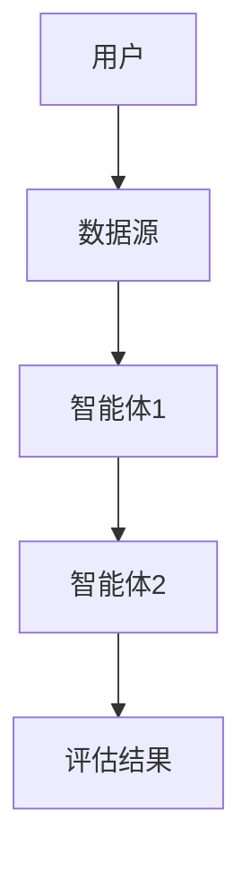
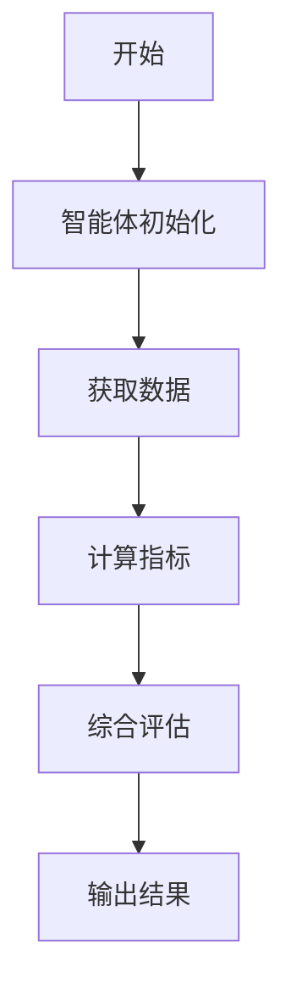
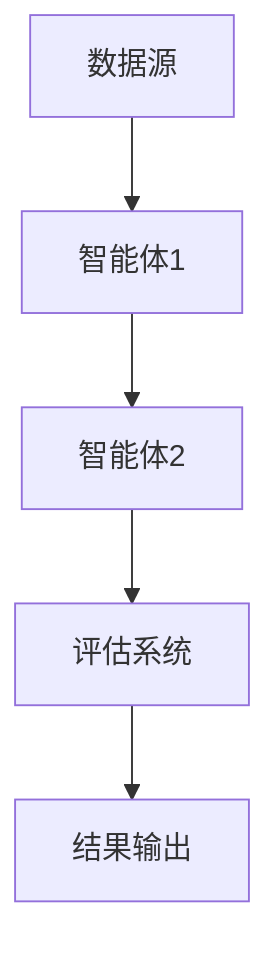
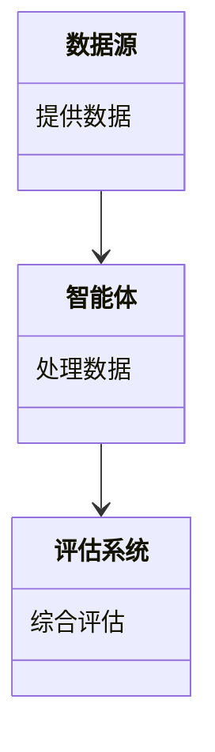

                 


# 利用多智能体系统评估公司的品牌价值

> 关键词：多智能体系统, 品牌价值评估, 系统架构设计, 算法原理, 项目实战

> 摘要：本文深入探讨了利用多智能体系统评估公司品牌价值的方法。通过详细讲解多智能体系统的概念、算法原理、系统架构设计以及实际项目案例，展示了如何通过多智能体协作来实现品牌价值的准确评估。文章内容涵盖从理论到实践的全过程，为读者提供了全面的技术指导。

---

## 第1章: 多智能体系统与品牌价值评估概述

### 1.1 多智能体系统的概念与特点
多智能体系统（Multi-Agent System, MAS）是由多个智能体（Agent）组成的分布式系统，这些智能体能够自主决策、协作和通信。多智能体系统的特性包括：

- **分布性**：智能体独立运行，通过通信协作完成任务。
- **协作性**：智能体之间通过协作实现整体目标。
- **反应性**：智能体能够感知环境并实时响应。

### 1.2 品牌价值的定义与评估方法
品牌价值是衡量企业品牌在市场中的价值和影响力的重要指标。传统评估方法通常依赖于财务数据和市场调研，而多智能体系统通过数据分析和智能协作提供更精准的评估。

---

## 第2章: 多智能体系统的核心概念与联系

### 2.1 多智能体系统的原理
多智能体系统通过智能体之间的通信与协作完成任务。智能体具备以下特征：

- **自主性**：智能体能够自主决策。
- **反应性**：智能体能够感知环境并做出反应。
- **社会性**：智能体之间能够协作和通信。

### 2.2 品牌价值评估中的多智能体系统架构
在品牌价值评估中，多智能体系统通过多个智能体协作，从不同数据源获取信息，进行综合分析。以下是一个简单的实体关系图：



---

## 第3章: 多智能体系统评估品牌价值的算法原理

### 3.1 多智能体协作算法
多智能体协作算法通过智能体之间的通信与协作，实现对品牌价值的评估。以下是一个协作算法的流程图：



以下是一个简单的Python代码实现：

```python
class Agent:
    def __init__(self, id):
        self.id = id
        self.data = None

    def process_data(self, data):
        self.data = data
        return self.data

# 初始化智能体
agent1 = Agent(1)
agent2 = Agent(2)

# 数据传递与处理
data = agent1.process_data("品牌数据")
agent2.process_data(data)
```

### 3.2 品牌价值评估的数学模型
品牌价值评估可以通过以下数学模型进行：

$$
\text{品牌价值} = \sum_{i=1}^{n} w_i \cdot x_i
$$

其中，\( w_i \) 是指标权重，\( x_i \) 是指标值。

---

## 第4章: 系统分析与架构设计方案

### 4.1 问题场景介绍
在品牌价值评估中，多智能体系统需要从多个数据源获取信息，进行综合分析。以下是一个系统架构图：



### 4.2 系统功能设计
系统功能设计包括数据采集、智能体协作和结果输出。以下是一个领域模型图：



---

## 第5章: 项目实战

### 5.1 环境安装与配置
需要安装Python和相关库，如numpy和pandas。

### 5.2 核心代码实现
以下是核心代码实现：

```python
import numpy as np
import pandas as pd

class BrandValueEvaluator:
    def __init__(self):
        self.data = None

    def process_data(self, data):
        self.data = data
        return self.data

# 初始化评估系统
evaluator = BrandValueEvaluator()

# 数据处理
data = evaluator.process_data(pd.DataFrame({
    '指标1': [80],
    '指标2': [70],
    '指标3': [90]
}))
```

### 5.3 案例分析与解读
通过实际案例分析，展示如何使用多智能体系统评估品牌价值。例如，评估一家公司的品牌价值时，可以通过多个智能体协作分析不同的数据源，最终得出综合评估结果。

---

## 总结

通过多智能体系统的应用，品牌价值评估变得更加精准和高效。本文详细讲解了多智能体系统的原理、算法设计和系统架构，并通过实际案例展示了其应用价值。未来，随着技术的不断发展，多智能体系统在品牌价值评估中的应用将更加广泛和深入。

---

**最佳实践 tips**：
- 在实际应用中，建议结合具体业务需求进行系统设计。
- 确保数据质量和多样性，以提高评估结果的准确性。

**小结**：
本文从理论到实践，全面介绍了多智能体系统在品牌价值评估中的应用，为读者提供了系统的指导和参考。

**注意事项**：
- 数据隐私和安全问题需要高度重视。
- 系统设计时要考虑可扩展性和可维护性。

**拓展阅读**：
- 多智能体系统的其他应用领域。
- 其他品牌价值评估方法的对比分析。

