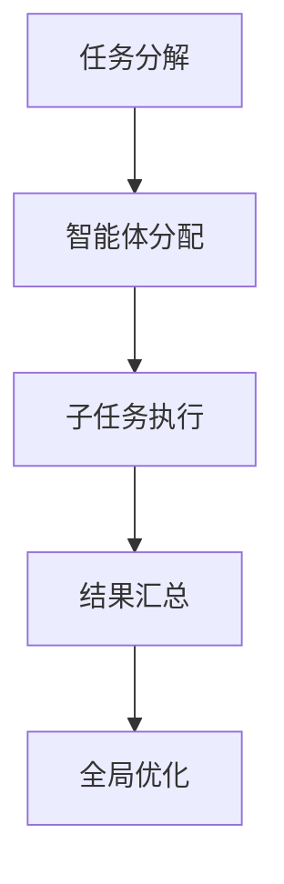
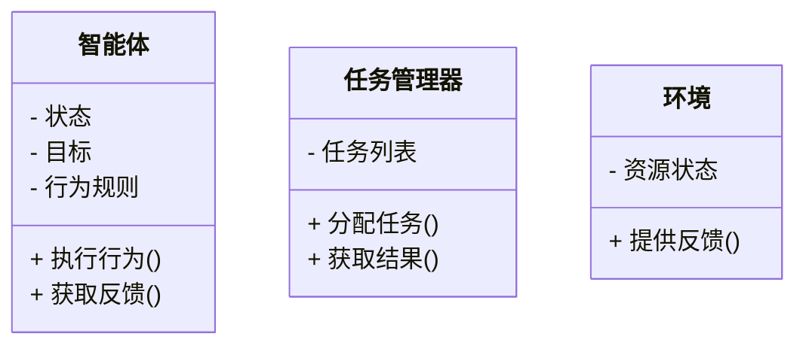
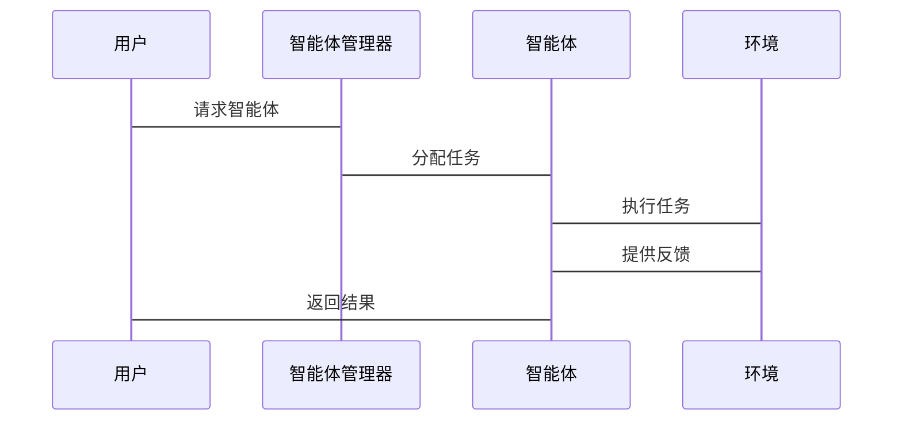

                 


# 利用多智能体系统评估公司的循环经济实践

> 关键词：多智能体系统、循环经济、企业实践、资源优化、系统设计

> 摘要：循环经济是一种以资源高效利用和循环利用为目标的经济模式，而多智能体系统（MAS）是一种由多个智能体组成的分布式人工智能系统，能够通过协作和自主决策来优化资源分配。本文将深入探讨多智能体系统在循环经济评估中的应用，分析其核心原理、算法实现、系统架构，并通过实际案例展示其在企业中的价值。

---

# 第一部分: 循环经济与多智能体系统概述

## 第1章: 循环经济的基本概念与挑战

### 1.1 循环经济的定义与核心理念

循环经济是以资源的高效利用和循环利用为目标的经济模式。其核心理念是通过减少资源消耗、延长产品生命周期、促进废弃物资源化，实现经济的可持续发展。循环经济的实现需要企业在生产、消费和回收环节中采取有效的资源管理策略。

### 1.2 多智能体系统的定义与特点

多智能体系统（Multi-Agent System，MAS）是由多个智能体组成的分布式系统，这些智能体能够通过自主决策和协作完成复杂任务。多智能体系统具有以下特点：

1. **自主性**：每个智能体能够独立决策。
2. **协作性**：智能体之间可以协同工作，共同完成任务。
3. **分布性**：系统由多个智能体分布在网络中，没有集中控制节点。
4. **反应性**：智能体能够根据环境反馈动态调整行为。

### 1.3 循环经济评估中的多智能体系统应用

在循环经济评估中，多智能体系统可以用于监控资源流动、优化供应链、评估资源利用率等。通过多智能体系统的协作，企业能够更高效地实现资源的循环利用，降低浪费，提高经济效益。

---

## 第2章: 多智能体系统的核心概念与联系

### 2.1 多智能体系统的原理

多智能体系统的核心原理是通过智能体之间的协作来完成复杂的任务。每个智能体都有自己的目标和行为规则，能够根据环境反馈动态调整策略。

### 2.2 多智能体系统中的核心概念对比

以下是智能体与其他相关概念的对比：

| 概念          | 描述                                                                 |
|---------------|----------------------------------------------------------------------|
| 智能体        | 具有自主性、反应性和协作性的实体，能够独立完成任务。                   |
| 传统算法      | 集中式算法，依赖中心计算节点，无法应对分布式环境。                     |
| 分布式计算    | 通过多节点协作完成任务，适用于大规模数据处理和分布式系统。             |
| 协作与竞争    | 智能体之间可以协作或竞争，以实现共同目标或个体目标。                   |

### 2.3 多智能体系统的ER实体关系图

以下是循环经济评估中多智能体系统的ER实体关系图：

```mermaid
erdiagram
actor(智能体) -[1..n]-> task(任务)
actor(智能体) -[1..n]-> resource(资源)
task(任务) -[1]-> status(状态)
```

---

## 第3章: 多智能体系统的算法原理与实现

### 3.1 多智能体系统中的分布式计算算法

分布式计算算法是多智能体系统的核心，通过将任务分解为多个子任务，分配给不同的智能体完成。以下是分布式计算的基本流程：



### 3.2 多智能体系统的协作与竞争机制

协作与竞争是多智能体系统中的关键机制。以下是协作与竞争的对比：

| 机制          | 描述                                                                 |
|---------------|----------------------------------------------------------------------|
| 协作          | 智能体之间相互配合，共同完成任务。                                       |
| 竞争          | 智能体之间争夺资源或任务，通过竞争优化系统性能。                         |

### 3.3 多智能体系统的博弈论模型

博弈论模型可以帮助智能体在协作与竞争中找到最优策略。以下是收益最大化模型的公式：

$$ \text{收益} = \sum_{i=1}^{n} v_i $$

其中，$v_i$ 表示第 $i$ 个智能体的收益。

---

## 第4章: 系统分析与架构设计

### 4.1 问题场景介绍

在循环经济评估中，企业需要监控资源流动、优化供应链、评估资源利用率。以下是问题场景的描述：

- **资源流动监控**：需要实时跟踪资源的流动情况，确保资源的高效利用。
- **供应链优化**：通过智能体协作优化供应链，降低资源浪费。
- **资源分配**：根据资源需求动态调整资源分配，最大化资源利用率。

### 4.2 系统功能设计

以下是系统功能模块的Mermaid类图：



### 4.3 系统架构设计

以下是系统的架构设计：


### 4.4 接口设计与交互流程

以下是系统的接口设计：



---

## 第5章: 项目实战

### 5.1 环境安装

以下是项目环境的安装步骤：

1. 安装Python：`python --version`
2. 安装多智能体框架：`pip install mdp`

### 5.2 核心代码实现

以下是多智能体系统的Python代码实现：

```python
class Agent:
    def __init__(self, id):
        self.id = id
        self.target = None
        self.status = "idle"
    
    def execute(self):
        if self.target:
            # 执行任务
            print(f"Agent {self.id} is executing task {self.target}")
            self.status = "busy"
    
    def receive_feedback(self, feedback):
        print(f"Agent {self.id} received feedback: {feedback}")
        self.status = "idle"

class TaskManager:
    def __init__(self):
        self.tasks = []
    
    def assign_task(self, agent, task):
        agent.target = task
        agent.execute()
    
    def get_results(self, agent):
        print(f"Task completed by Agent {agent.id}")

# 示例用法
agent1 = Agent(1)
agent2 = Agent(2)
task_manager = TaskManager()

task_manager.assign_task(agent1, "优化供应链")
task_manager.assign_task(agent2, "监控资源流动")
task_manager.get_results(agent1)
task_manager.get_results(agent2)
```

### 5.3 代码解读与分析

上述代码实现了两个智能体，分别执行不同的任务。智能体通过`execute`方法执行任务，通过`receive_feedback`方法接收反馈。任务管理器负责分配任务和获取结果。

### 5.4 实际案例分析

以下是多智能体系统在循环经济评估中的实际案例：

- **案例1**：某制造企业使用多智能体系统优化供应链，通过智能体协作降低库存浪费，提高资源利用率。
- **案例2**：某物流企业使用多智能体系统监控资源流动，动态调整运输路线，降低碳排放。

### 5.5 项目小结

通过上述项目实战，我们可以看到多智能体系统在循环经济评估中的巨大潜力。智能体的协作和自主性能够显著提高企业的资源管理效率。

---

## 第6章: 最佳实践与未来展望

### 6.1 小结

多智能体系统通过协作和自主性，能够有效优化循环经济中的资源管理。企业可以通过多智能体系统的应用，实现资源的高效利用和循环利用。

### 6.2 注意事项

在实际应用中，需要注意以下几点：

1. **数据隐私**：确保智能体之间的数据传输安全。
2. **系统稳定性**：设计高效的容错机制，确保系统的稳定性。
3. **智能体协作**：合理设计协作机制，避免智能体之间的冲突。

### 6.3 未来展望

随着人工智能技术的不断发展，多智能体系统在循环经济中的应用前景广阔。未来，可以通过强化学习进一步优化智能体的协作策略，提高系统的智能化水平。

---

# 结语

通过本文的详细介绍，我们可以看到多智能体系统在循环经济评估中的巨大潜力。企业可以通过多智能体系统的应用，实现资源的高效利用和循环利用，为可持续发展做出贡献。

--- 

**温馨提示**：如果需要进一步的技术咨询或代码实现，请随时联系我。

