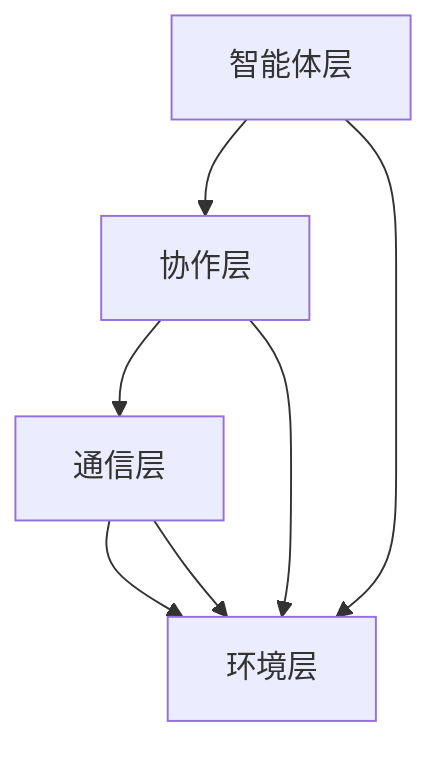
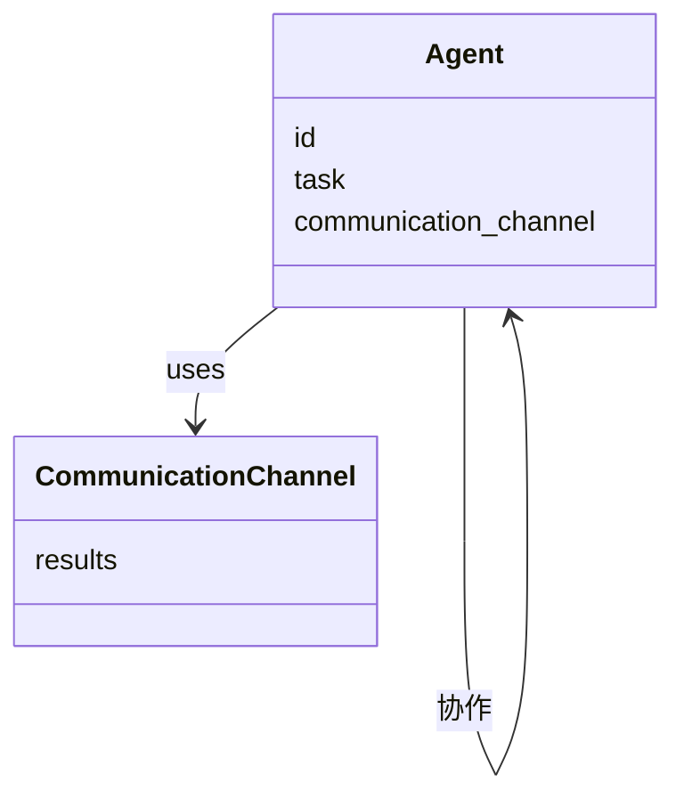
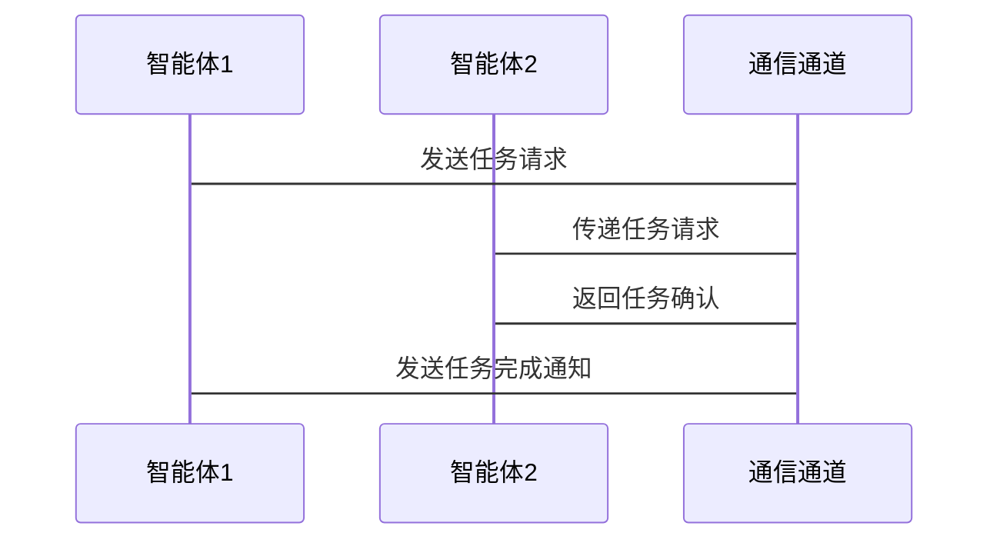

                 


# 利用多智能体系统评估公司的数字化转型进程

> 关键词：多智能体系统（MAS）、数字化转型、企业架构、协作算法、通信协议、系统评估

> 摘要：  
> 在数字化转型的浪潮中，企业面临着前所未有的挑战和机遇。多智能体系统（Multi-Agent System，MAS）作为一种分布式人工智能系统，为企业提供了全新的解决方案。本文将详细探讨如何利用多智能体系统评估公司的数字化转型进程，从背景介绍、核心概念、算法原理到系统架构、项目实战，再到最佳实践，全面解析MAS在数字化转型中的应用。通过本文，读者将深入了解多智能体系统如何助力企业实现高效、智能的数字化转型。

---

## 第1章: 数字化转型的背景与挑战

### 1.1 数字化转型的背景

#### 1.1.1 数字化转型的定义
数字化转型是指企业利用数字技术（如人工智能、大数据、云计算等）重新设计业务模型、流程、文化、工具和技能，以实现创新和价值提升的过程。它不仅仅是技术的升级，更是对商业模式、组织架构和文化的重大变革。

#### 1.1.2 数字化转型的驱动因素
- **技术进步**：人工智能、大数据、物联网等技术的快速发展为企业提供了新的工具和方法。
- **市场竞争**：数字化转型已成为企业竞争力的重要组成部分，不转型的企业将面临被淘汰的风险。
- **客户需求**：客户对个性化、高效、智能服务的需求日益增长，推动企业加速数字化进程。

#### 1.1.3 数字化转型的核心目标
- 提升企业效率和生产力。
- 改善客户体验，增强客户忠诚度。
- 开创新业务模式，拓展市场。
- 增强企业的数据驱动决策能力。

### 1.2 数字化转型的关键挑战

#### 1.2.1 企业内部的组织变革
- 数字化转型需要跨部门协作，传统 siloed（孤岛式）组织结构可能成为阻碍。
- 员工对新技术的接受度和适应能力参差不齐，可能导致内部阻力。

#### 1.2.2 技术实现的复杂性
- 数字化转型涉及多种技术的集成，如AI、大数据、云计算等，技术实现的复杂性较高。
- 数据孤岛问题：企业内部数据分散在不同系统中，难以实现数据的统一和共享。

#### 1.2.3 数据安全与隐私问题
- 数字化转型过程中，企业需要处理大量敏感数据，数据安全和隐私保护成为重要挑战。
- 各国数据法规（如GDPR）对企业数据管理提出更高要求。

---

## 第2章: 多智能体系统（MAS）的基本概念

### 2.1 多智能体系统的定义与特点

#### 2.1.1 多智能体系统的定义
多智能体系统是由多个智能体（Agent）组成的分布式系统，智能体是能够感知环境、自主决策、执行任务的实体。MAS的特点是智能体之间的协作与竞争，共同完成复杂任务。

#### 2.1.2 多智能体系统的五大核心特征
| 特征                | 描述                                                                 |
|---------------------|----------------------------------------------------------------------|
| 分布性              | 智能体分布在不同的物理或逻辑位置，独立运行。                           |
| 协作性              | 智能体之间通过通信和协作完成共同目标。                                 |
| 反应性              | 智能体能够感知环境变化并做出实时响应。                                 |
| 自主性              | 智能体在没有外部干预的情况下自主决策和行动。                           |
| 多智能体交互         | 智能体之间通过某种形式的通信和协议进行交互。                           |

#### 2.1.3 多智能体系统与单智能体系统的对比
| 对比维度            | 单智能体系统                       | 多智能体系统                       |
|---------------------|-----------------------------------|-----------------------------------|
| 系统复杂性          | 较低                             | 较高                             |
| 可扩展性            | 有限                             | 较高                             |
| 任务处理能力        | 单一任务为主                     | 多任务协作                        |
| 系统维护难度        | 较低                             | 较高                             |

### 2.2 多智能体系统的组成与结构

#### 2.2.1 智能体的分类
| 类型                | 描述                                                                 |
|---------------------|----------------------------------------------------------------------|
| 简单反射型智能体     | 基于当前感知做出简单反应，无内部状态。                                     |
| 基于模型的反射型智能体 | 基于内部模型和知识做出决策，具有记忆和推理能力。                         |
| 目标驱动型智能体     | 通过实现目标来驱动行为，具有明确的目标导向。                             |
| 计划驱动型智能体     | 基于规划和推理，制定详细计划后再执行。                                   |

#### 2.2.2 智能体之间的交互方式
| 交互方式            | 描述                                                                 |
|---------------------|----------------------------------------------------------------------|
| 直接通信            | 智能体之间通过直接通信进行信息交换。                                       |
| 间接通信            | 智能体通过共享数据库或消息队列进行间接通信。                               |
| 中介协调            | 通过协调器或中间件来管理智能体之间的交互。                                 |

#### 2.2.3 多智能体系统的层次结构


---

## 第3章: 数字化转型与多智能体系统的结合

### 3.1 数字化转型中的多智能体系统应用

#### 3.1.1 多智能体系统在企业数字化转型中的角色
| 角色                | 描述                                                                 |
|---------------------|----------------------------------------------------------------------|
| 数据采集与处理       | 智能体负责从企业系统中采集数据并进行初步处理。                               |
| 业务逻辑执行         | 智能体根据业务规则和逻辑，执行相应的业务流程。                             |
| 决策支持            | 智能体通过分析数据，提供决策支持和优化建议。                               |
| 人机协作            | 智能体与人类员工协作，共同完成复杂任务。                                   |

#### 3.1.2 多智能体系统如何提升企业效率
- **自动化处理**：智能体可以自动执行重复性任务，减少人工干预。
- **实时协作**：通过智能体之间的协作，实现任务的快速响应和处理。
- **数据共享与分析**：智能体之间共享数据，提高数据利用率和分析能力。

#### 3.1.3 多智能体系统在数字化转型中的优势
| 优势                | 描述                                                                 |
|---------------------|----------------------------------------------------------------------|
| 高度可扩展性         | MAS支持大规模扩展，适用于不同规模的企业。                                   |
| 高度灵活性          | 智能体可以根据业务需求动态调整行为和策略。                                 |
| 高效协作            | 智能体之间的协作机制可以提高任务处理效率。                                 |

### 3.2 多智能体系统与数字化转型的关系

#### 3.2.1 多智能体系统如何支持数字化转型
- **数据驱动决策**：通过智能体采集和分析数据，支持企业做出数据驱动的决策。
- **智能流程优化**：智能体可以优化业务流程，提高效率和质量。
- **智能化服务**：通过智能体提供个性化的客户服务，提升客户体验。

#### 3.2.2 数字化转型如何推动多智能体系统的发展
- **技术进步**：数字化转型推动了AI、大数据等技术的发展，为MAS提供了更好的技术基础。
- **应用场景拓展**：数字化转型为企业提供了更多MAS的应用场景，推动了MAS的创新和应用。

#### 3.2.3 两者的相互作用与协同效应
- 数字化转型为MAS提供了更广阔的舞台。
- MAS通过其协作和智能优势，加速了数字化转型的进程。

---

## 第4章: 多智能体系统的核心算法与实现

### 4.1 多智能体系统的协作算法

#### 4.1.1 协作算法的原理
协作算法通过智能体之间的通信和协作，实现任务的分配与执行。以下是协作算法的基本步骤：
1. 智能体感知环境，获取任务需求。
2. 智能体之间通过通信协议进行信息交换。
3. 根据任务需求，智能体协商任务分配。
4. 执行任务并反馈结果。

#### 4.1.2 协作算法的实现
以下是协作算法的Python实现示例：
```python
class Agent:
    def __init__(self, id):
        self.id = id
        self.task = None
        self.communication_channel = None

    def receive_task(self, task):
        self.task = task

    def execute_task(self):
        if self.task:
            print(f"Agent {self.id} executing task: {self.task}")
            # 模拟任务执行
            import time
            time.sleep(1)
            print(f"Agent {self.id} completed task: {self.task}")

    def send_result(self, result):
        if self.communication_channel:
            self.communication_channel.receive_result(result)

class CommunicationChannel:
    def __init__(self):
        self.results = []

    def receive_result(self, result):
        self.results.append(result)
        print(f"Result received: {result}")

def协作算法():
    channel = CommunicationChannel()
    agent1 = Agent(1)
    agent2 = Agent(2)
    agent1.communication_channel = channel
    agent2.communication_channel = channel

    agent1.receive_task("Task A")
    agent2.receive_task("Task B")
    agent1.execute_task()
    agent2.execute_task()

协作算法()
```

#### 4.1.3 协作算法的数学模型
以下是协作算法的简单数学模型：
$$
\text{Task Assignment} = \argmax_{agent} \text{(agent's capability)} 
$$

### 4.2 多智能体系统的通信协议

#### 4.2.1 通信协议的基本原理
通信协议定义了智能体之间如何进行信息交换。以下是通信协议的实现步骤：
1. 智能体初始化通信通道。
2. 智能体通过通信通道发送消息。
3. 接收方处理消息并反馈结果。

#### 4.2.2 通信协议的实现
以下是通信协议的Python实现示例：
```python
class CommunicationProtocol:
    def __init__(self):
        self.channels = {}

    def create_channel(self, id):
        self.channels[id] = CommunicationChannel()

    def send_message(self, sender, receiver, message):
        if receiver in self.channels:
            self.channels[receiver].receive_message(sender, message)

    def receive_message(self, sender, receiver, message):
        pass
```

#### 4.2.3 通信协议的优化与测试
- **优化**：通过引入排队机制，避免消息拥堵。
- **测试**：在不同网络环境下测试通信协议的可靠性和响应速度。

---

## 第5章: 数字化转型的系统分析与架构设计

### 5.1 数字化转型的系统分析

#### 5.1.1 问题场景介绍
假设某企业希望利用MAS优化其供应链管理流程，提升效率和响应速度。

#### 5.1.2 系统功能设计
以下是系统功能设计的领域模型图：


#### 5.1.3 系统架构设计
以下是系统架构设计的架构图：


#### 5.1.4 系统接口设计
以下是系统接口设计的交互流程图：


### 5.2 系统实现与测试

#### 5.2.1 核心代码实现
以下是核心代码实现：
```python
class Agent:
    def __init__(self, id):
        self.id = id
        self.task = None
        self.communication_channel = None

    def receive_task(self, task):
        self.task = task

    def execute_task(self):
        if self.task:
            print(f"Agent {self.id} executing task: {self.task}")
            import time
            time.sleep(1)
            print(f"Agent {self.id} completed task: {self.task}")

    def send_result(self, result):
        if self.communication_channel:
            self.communication_channel.receive_result(result)

class CommunicationChannel:
    def __init__(self):
        self.results = []

    def receive_result(self, result):
        self.results.append(result)
        print(f"Result received: {result}")

def协作算法():
    channel = CommunicationChannel()
    agent1 = Agent(1)
    agent2 = Agent(2)
    agent1.communication_channel = channel
    agent2.communication_channel = channel

    agent1.receive_task("Task A")
    agent2.receive_task("Task B")
    agent1.execute_task()
    agent2.execute_task()

协作算法()
```

#### 5.2.2 系统测试与优化
- **测试**：在不同负载下测试系统性能，确保智能体之间的协作效率。
- **优化**：根据测试结果，优化通信协议和协作算法，提升系统性能。

---

## 第6章: 数字化转型的项目实战

### 6.1 项目背景与目标

#### 6.1.1 项目背景
某制造企业希望通过MAS优化其生产流程，提升效率和产品质量。

#### 6.1.2 项目目标
- 实现生产流程的智能化管理。
- 提高生产效率和产品质量。
- 减少资源浪费，降低成本。

### 6.2 项目实施与分析

#### 6.2.1 环境安装
- 安装Python和相关库（如numpy、pandas）。
- 配置开发环境（如Jupyter Notebook）。

#### 6.2.2 核心代码实现
以下是核心代码实现：
```python
class Agent:
    def __init__(self, id):
        self.id = id
        self.task = None
        self.communication_channel = None

    def receive_task(self, task):
        self.task = task

    def execute_task(self):
        if self.task:
            print(f"Agent {self.id} executing task: {self.task}")
            import time
            time.sleep(1)
            print(f"Agent {self.id} completed task: {self.task}")

    def send_result(self, result):
        if self.communication_channel:
            self.communication_channel.receive_result(result)

class CommunicationChannel:
    def __init__(self):
        self.results = []

    def receive_result(self, result):
        self.results.append(result)
        print(f"Result received: {result}")

def协作算法():
    channel = CommunicationChannel()
    agent1 = Agent(1)
    agent2 = Agent(2)
    agent1.communication_channel = channel
    agent2.communication_channel = channel

    agent1.receive_task("Task A")
    agent2.receive_task("Task B")
    agent1.execute_task()
    agent2.execute_task()

协作算法()
```

#### 6.2.3 项目小结
通过MAS实现生产流程的智能化管理，显著提升了企业的效率和产品质量，为企业带来了可观的经济效益。

---

## 第7章: 数字化转型的最佳实践与注意事项

### 7.1 最佳实践

#### 7.1.1 技术选型
- 根据企业需求选择合适的MAS框架和工具。
- 确保技术的可扩展性和可维护性。

#### 7.1.2 人员培训
- 提供充分的培训，确保员工能够适应新技术和新流程。
- 鼓励跨部门协作，培养复合型人才。

#### 7.1.3 数据安全
- 建立完善的数据安全策略，确保数据的机密性和完整性。
- 定期进行安全演练和漏洞扫描。

### 7.2 小结

### 7.3 注意事项

#### 7.3.1 系统设计
- 避免过度复杂化系统设计，确保系统的可维护性。
- 定期进行系统评估和优化。

#### 7.3.2 人员管理
- 建立有效的激励机制，激发员工的积极性。
- 建立清晰的职责分工，避免职责模糊。

#### 7.3.3 技术风险
- 重视技术风险评估，制定应对策略。
- 建立应急预案，确保系统的稳定运行。

### 7.4 拓展阅读

#### 7.4.1 推荐书籍
- 《Multi-Agent Systems: Algorithmic, Complexity, and Synthesis》
- 《Digital Transformation: A Guide to Sabotage, Strategy, and Success》

#### 7.4.2 推荐博客与资源
- 多智能体系统相关的技术博客和论坛。
- 数字化转型相关的行业报告和白皮书。

---

## 第8章: 总结与展望

### 8.1 总结
通过本文的详细讲解，读者可以深入了解如何利用多智能体系统评估公司的数字化转型进程。从背景介绍、核心概念、算法原理到系统架构、项目实战，再到最佳实践，全面解析了MAS在数字化转型中的应用。

### 8.2 展望
随着人工智能和大数据技术的不断进步，多智能体系统在数字化转型中的应用将更加广泛和深入。未来，MAS将与更多新兴技术结合，为企业提供更智能化、更高效的解决方案。

---

# 结语
数字化转型是企业生存和发展的必经之路，而多智能体系统为企业提供了强大的技术支持。通过本文的指导，企业可以更好地利用MAS实现数字化转型，提升竞争力，抓住数字时代的机遇。

