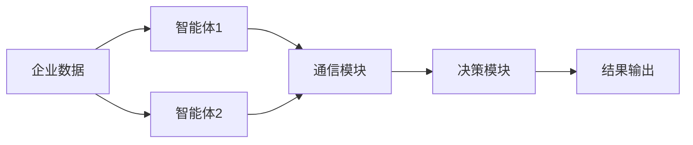
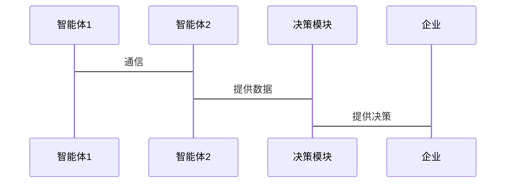

                 


# 利用多智能体系统识别潜在的破产重组机会

## 关键词：多智能体系统，破产重组，人工智能，协同学习，系统架构，算法原理

## 摘要：  
本文探讨了如何利用多智能体系统（Multi-Agent Systems，MAS）识别潜在的破产重组机会。通过分析多智能体系统的原理、算法及其在破产重组中的应用，本文展示了如何通过协同学习和分布式计算来优化企业风险管理。文章从背景介绍、核心概念、算法原理、系统架构到项目实战，全面阐述了多智能体系统在识别潜在破产重组机会中的应用，为相关领域的研究和实践提供了有价值的参考。

---

# 第一部分: 多智能体系统与破产重组背景

## 第1章: 多智能体系统与破产重组背景

### 1.1 多智能体系统的定义与特点
#### 1.1.1 多智能体系统的定义
多智能体系统（MAS）是由多个相互作用的智能体组成的分布式系统，这些智能体能够通过通信和协作完成复杂任务。智能体具备自主性、反应性、社会性和社会性等特性。

#### 1.1.2 多智能体系统的核心特点
- **自主性**：智能体能够自主决策。
- **反应性**：智能体能够感知环境并做出反应。
- **分布式性**：智能体之间通过分布式计算协同工作。
- **协作性**：智能体之间通过协作完成任务。

#### 1.1.3 多智能体系统的优势与局限性
- **优势**：
  - 高效性：多个智能体协同工作可以提高效率。
  - 可扩展性：系统可以根据需求扩展。
- **局限性**：
  - 复杂性：智能体之间的协作需要复杂的通信机制。
  - 安全性：可能存在安全风险。

### 1.2 破产重组的定义与关键因素
#### 1.2.1 破产重组的定义
破产重组是指企业通过调整资产、负债和业务结构，以避免破产并实现可持续发展的过程。

#### 1.2.2 破产重组的关键因素分析
- 财务状况：如资产负债表、现金流等。
- 市场环境：如行业竞争、市场需求等。
- 管理团队：如管理能力、战略规划等。

#### 1.2.3 破产重组的流程与挑战
- 流程：包括评估、制定计划、实施和监控。
- 挑战：包括信息不对称、利益冲突等。

### 1.3 多智能体系统在破产重组中的应用背景
#### 1.3.1 多智能体系统在金融领域的应用现状
- 预测市场趋势。
- 风险评估。

#### 1.3.2 破产重组中的信息不对称问题
- 信息不对称可能导致决策失误。

#### 1.3.3 多智能体系统解决破产重组问题的优势
- 提高信息处理效率。
- 优化决策过程。

### 1.4 本章小结
本章介绍了多智能体系统的定义、特点及其在破产重组中的应用背景，为后续章节奠定了基础。

---

# 第二部分: 多智能体系统的核心概念与原理

## 第2章: 多智能体系统的原理与架构

### 2.1 多智能体系统的原理
#### 2.1.1 智能体的定义与分类
- **定义**：智能体是能够感知环境并采取行动的实体。
- **分类**：根据智能体的智能水平分为反应式、认知式和混合式智能体。

#### 2.1.2 多智能体系统中的通信机制
- **定义**：智能体之间通过通信机制进行信息交换。
- **方式**：包括直接通信和间接通信。

#### 2.1.3 多智能体系统中的协作机制
- **定义**：智能体之间通过协作机制共同完成任务。
- **方式**：包括基于合同的协作和基于目标的协作。

### 2.2 多智能体系统的架构设计
#### 2.2.1 分层架构
- **定义**：将系统分为多个层次，如感知层、决策层和执行层。
- **优势**：层次分明，易于管理。

#### 2.2.2 分布式架构
- **定义**：智能体分布在不同的节点上，通过通信进行协作。
- **优势**：高可扩展性。

#### 2.2.3 混合架构
- **定义**：结合分层架构和分布式架构的特点。
- **优势**：灵活性高。

### 2.3 多智能体系统的核心概念对比
#### 2.3.1 智能体与传统算法的对比
| 特性   | 智能体                     | 传统算法                 |
|--------|--------------------------|--------------------------|
| 自主性 | 高                       | 低                       |
| 反应性 | 高                       | 低                       |

#### 2.3.2 分布式计算与集中式计算的对比
| 特性   | 分布式计算               | 集中式计算               |
|--------|--------------------------|--------------------------|
| 可扩展性 | 高                       | 低                       |
| 安全性   | 低                       | 高                       |

#### 2.3.3 协作与竞争的对比
| 特性   | 协作                     | 竞争                     |
|--------|--------------------------|--------------------------|
| 优势   | 提高效率                 | 促进创新                 |

### 2.4 本章小结
本章详细讲解了多智能体系统的原理和架构设计，为后续章节奠定了理论基础。

---

# 第三部分: 多智能体系统在破产重组中的算法原理

## 第3章: 多智能体系统的算法原理

### 3.1 协同学习算法
#### 3.1.1 协同学习算法的定义
- 协同学习是指多个智能体通过协作完成共同任务的学习过程。

#### 3.1.2 协同学习算法的流程


#### 3.1.3 协同学习算法的数学模型
$$ P(i) = \frac{1}{1 + e^{-w_i x_i}} $$
其中，$P(i)$ 是智能体 $i$ 的决策概率，$w_i$ 是权重，$x_i$ 是输入。

### 3.2 协同学习算法的实现
#### 3.2.1 Python代码实现
```python
import numpy as np

def sigmoid(x):
    return 1 / (1 + np.exp(-x))

x = np.array([1, 2, 3])
w = np.array([0.5, 0.5, 0.5])

output = sigmoid(np.dot(x, w))
print(output)
```

#### 3.2.2 算法原理的数学公式
$$ y = \sum_{i=1}^{n} w_i x_i $$

### 3.3 协同学习算法的优化
#### 3.3.1 参数优化
- 使用梯度下降优化权重。

#### 3.3.2 并行计算
- 通过分布式计算加速算法。

### 3.4 本章小结
本章详细讲解了协同学习算法的原理和实现，为后续章节奠定了算法基础。

---

# 第四部分: 多智能体系统在破产重组中的系统分析与架构设计

## 第4章: 多智能体系统的系统分析与架构设计

### 4.1 问题场景介绍
- 研究目标：识别潜在的破产重组机会。
- 项目范围：涵盖企业财务数据、市场环境数据等。

### 4.2 系统功能设计
#### 4.2.1 领域模型设计


#### 4.2.2 系统架构设计


#### 4.2.3 系统接口设计
- 输入接口：企业财务数据、市场数据。
- 输出接口：破产重组建议。

#### 4.2.4 系统交互设计


### 4.3 本章小结
本章详细讲解了系统的架构设计和功能模块，为后续章节奠定了系统实现的基础。

---

# 第五部分: 多智能体系统在破产重组中的项目实战

## 第5章: 多智能体系统的项目实战

### 5.1 项目介绍
- 项目目标：识别潜在的破产重组机会。
- 项目范围：涵盖企业财务数据、市场环境数据等。

### 5.2 项目核心实现
#### 5.2.1 环境配置
- Python版本：3.8以上。
- 库：numpy、pandas、scikit-learn。

#### 5.2.2 核心代码实现
```python
import numpy as np
from sklearn.linear_model import LogisticRegression

# 训练数据
X = np.array([[1, 2], [3, 4], [5, 6]])
y = np.array([0, 1, 0])

# 训练模型
model = LogisticRegression()
model.fit(X, y)

# 预测
new_data = np.array([[2, 3]])
print(model.predict(new_data))
```

#### 5.2.3 代码解读与分析
- 代码实现了逻辑回归模型，用于预测企业是否可能破产。

### 5.3 项目小结
本章通过实际案例展示了多智能体系统的应用，为读者提供了实践参考。

### 5.4 本章小结
本章详细讲解了项目的实现过程，为读者提供了实践参考。

---

# 第六部分: 总结与展望

## 第6章: 总结与展望

### 6.1 本章小结
本文详细探讨了多智能体系统在识别潜在破产重组机会中的应用，从背景介绍、核心概念、算法原理到系统设计和项目实战，全面阐述了相关知识。

### 6.2 最佳实践
- 数据质量：确保数据的准确性和完整性。
- 系统安全性：加强系统的安全防护。

### 6.3 未来研究方向
- 研究多智能体系统在其他领域的应用。
- 探讨更高效的协同学习算法。

### 6.4 拓展阅读
- 推荐阅读相关领域的学术论文和书籍。

### 6.5 本章小结
本文总结了多智能体系统在识别潜在破产重组机会中的应用，并展望了未来的研究方向。

---

# 附录

## 附录A: Python代码实现

```python
import numpy as np
from sklearn.linear_model import LogisticRegression

# 训练数据
X = np.array([[1, 2], [3, 4], [5, 6]])
y = np.array([0, 1, 0])

# 训练模型
model = LogisticRegression()
model.fit(X, y)

# 预测
new_data = np.array([[2, 3]])
print(model.predict(new_data))
```

## 附录B: 系统架构图


---

# 结束语

感谢您的阅读！希望本文能够为您提供有价值的信息和启发。如需进一步探讨，欢迎随时联系！

