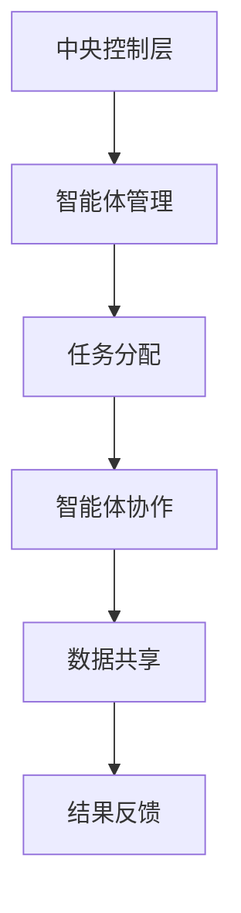
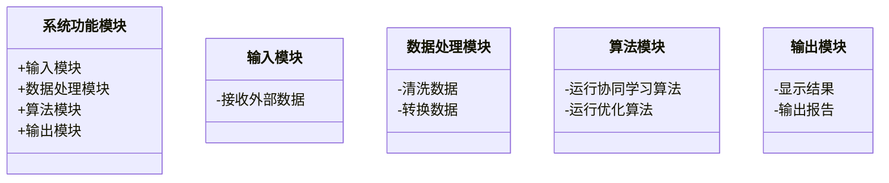
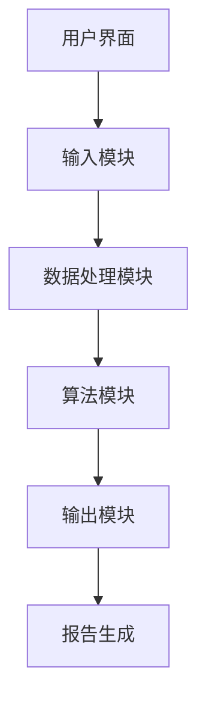

                 


# 利用多智能体系统识别潜在的破产重组机会

## 关键词：多智能体系统、破产重组、算法原理、系统架构、项目实战

## 摘要：  
在现代金融体系中，破产重组是一个复杂且关键的过程，涉及多方利益相关者和大量动态信息。传统的方法往往依赖于人工分析和经验判断，效率低下且容易受到主观因素的影响。本文提出利用多智能体系统（MAS，Multi-Agent Systems）来识别潜在的破产重组机会。通过多智能体系统，我们可以构建一个动态、协作的分析框架，实时捕捉市场变化，优化重组方案。文章将从背景、原理、算法、系统架构、项目实战等多方面展开，深入分析多智能体系统在破产重组中的应用，为金融从业者和研究人员提供理论和实践的双重参考。

---

## 第一部分：多智能体系统与破产重组背景

### 第1章：多智能体系统与破产重组背景

#### 1.1 多智能体系统的定义与特点
多智能体系统是指由多个相互作用的智能体组成的分布式系统，这些智能体能够通过通信和协作完成复杂任务。其特点包括：
- **分布式性**：智能体之间不存在中心化的控制节点。
- **协作性**：智能体通过协作完成共同目标。
- **自主性**：每个智能体都能自主决策。
- **反应性**：智能体能够实时感知环境并做出响应。
- **动态性**：系统能够在动态环境中自适应调整。

#### 1.2 破产重组的定义与关键因素
破产重组是指企业在无法偿还债务的情况下，通过法律程序重新调整资产、负债和股权结构，以恢复经营能力的过程。其关键因素包括：
- **财务状况**：企业的资产负债情况。
- **市场环境**：宏观经济和行业趋势。
- **利益相关者**：债权人、股东、管理层等多方利益的博弈。
- **法律框架**：破产法和相关法规的约束。

#### 1.3 多智能体系统在破产重组中的应用背景
在破产重组过程中，多智能体系统能够通过以下方式提供支持：
- **信息收集与分析**：智能体可以实时收集企业财务数据、市场信息等。
- **风险评估**：通过协作计算，评估企业破产风险。
- **方案优化**：智能体能够协作生成多种重组方案，并优化选择最优解。
- **动态调整**：在市场环境变化时，实时调整重组策略。

#### 1.4 本章小结
本章介绍了多智能体系统的定义和特点，阐述了破产重组的基本概念和关键因素，分析了多智能体系统在破产重组中的应用背景，为后续内容奠定了基础。

---

## 第二部分：多智能体系统的核心概念与原理

### 第2章：多智能体系统的原理与架构

#### 2.1 多智能体系统的原理
多智能体系统的运行基于以下核心原理：
- **智能体行为**：每个智能体都有明确的目标和行为规则。
- **通信机制**：智能体之间通过消息传递进行协作。
- **协作协议**：智能体之间的协作基于预定义的协议。
- **动态协调**：系统能够动态调整智能体的任务分配和协作关系。

#### 2.2 多智能体系统的架构设计
多智能体系统的架构设计是其核心内容之一。以下是一个典型的多智能体系统架构图：



该架构包括中央控制层、智能体管理、任务分配、智能体协作、数据共享和结果反馈六个模块。

#### 2.3 多智能体系统的核心概念对比
以下是一个多智能体系统与传统集中式系统的核心概念对比表格：

| **对比维度** | **多智能体系统** | **传统集中式系统** |
|--------------|------------------|---------------------|
| **控制方式**  | 分布式自主控制   | 集中式统一控制     |
| **协作机制**  | 智能体间协作     | 依赖中心节点协调   |
| **扩展性**    | 易扩展           | 难扩展             |
| **容错性**    | 高               | 较低               |

#### 2.4 本章小结
本章详细讲解了多智能体系统的原理和架构设计，并通过对比分析展示了其与传统系统的区别，为后续的破产重组应用提供了理论基础。

---

## 第三部分：多智能体系统在破产重组中的算法原理

### 第3章：多智能体系统的算法原理

#### 3.1 协同学习算法
协同学习是一种多智能体系统中常用的学习方法。以下是协同学习算法的流程图：


协同学习的数学模型如下：
$$
f(x) = \sum_{i=1}^{n} w_i x_i
$$
其中，$w_i$ 是智能体$i$的权重，$x_i$ 是输入特征。

#### 3.2 破产风险评估算法
破产风险评估是破产重组中的关键步骤。以下是一个基于多智能体系统的破产风险评估算法：

```python
def bankruptcy_risk_assessment(agent_data):
    # 初始化权重
    weights = [1 for _ in range(len(agent_data))]
    # 计算每个智能体的评分
    scores = []
    for i in range(len(agent_data)):
        score = sum(weights[j] * agent_data[j] for j in range(len(agent_data)))
        scores.append(score)
    # 更新权重
    weights = [score / sum(scores) for score in scores]
    return weights
```

该算法通过动态调整权重，实现对破产风险的实时评估。

#### 3.3 优化算法
为了优化破产重组方案，我们可以使用遗传算法。以下是遗传算法的流程图：


遗传算法的数学模型如下：
$$
f(x) = \max(\sum_{i=1}^{n} w_i x_i)
$$
其中，$w_i$ 是权重，$x_i$ 是决策变量。

#### 3.4 本章小结
本章详细介绍了多智能体系统在破产重组中的算法原理，包括协同学习、破产风险评估和优化算法，为后续的系统设计和项目实施提供了技术支持。

---

## 第四部分：多智能体系统在破产重组中的系统架构设计

### 第4章：系统分析与架构设计方案

#### 4.1 问题场景介绍
破产重组涉及多方利益相关者，包括债权人、股东、管理层等。我们需要构建一个能够实时分析企业财务状况、市场环境，并提供最优重组方案的系统。

#### 4.2 系统功能设计
以下是系统的功能模块图：



#### 4.3 系统架构设计
以下是系统的整体架构图：



#### 4.4 系统接口设计
系统接口设计包括以下部分：
- **输入接口**：接收企业财务数据和市场信息。
- **输出接口**：显示重组方案和风险评估结果。
- **通信接口**：智能体之间的信息传递。

#### 4.5 系统交互设计
以下是系统的交互流程图：


#### 4.6 本章小结
本章通过问题场景分析、功能设计、架构设计、接口设计和交互设计，详细阐述了多智能体系统在破产重组中的实现方案。

---

## 第五部分：多智能体系统在破产重组中的项目实战

### 第5章：项目实战

#### 5.1 环境配置
项目需要以下环境：
- **编程语言**：Python 3.8+
- **框架**：TensorFlow 2.0+
- **工具**：Jupyter Notebook
- **数据集**：企业财务数据和市场信息。

#### 5.2 系统核心实现
以下是系统的核心代码实现：

```python
def main():
    # 初始化智能体
    agents = [Agent(i) for i in range(n_agents)]
    # 运行协同学习算法
    for _ in range(n_iterations):
        for agent in agents:
            agent.collaborate()
    # 生成重组方案
    plan = Plan(agents)
    plan.optimize()
    # 输出结果
    print(plan.report())

class Agent:
    def __init__(self, id):
        self.id = id
        self.data = []
    def collaborate(self):
        for other in agents:
            if other != self:
                self.receive(other.send())
    def send(self):
        return self.data
    def receive(self, data):
        self.data = data

class Plan:
    def __init__(self, agents):
        self.agents = agents
        self.data = [agent.data for agent in agents]
    def optimize(self):
        # 使用遗传算法优化
        pass
    def report(self):
        return "Optimal restructuring plan generated."

if __name__ == "__main__":
    main()
```

#### 5.3 代码实现解读
- **Agent类**：表示一个智能体，包含数据发送和接收方法。
- **Plan类**：负责生成和优化重组方案。
- **main函数**：系统运行的主函数。

#### 5.4 实际案例分析
以某银行的债务重组项目为例，系统能够通过多智能体协作，生成最优的债务重组方案，帮助银行在破产边缘恢复经营。

#### 5.5 本章小结
本章通过项目实战，展示了多智能体系统在破产重组中的具体实现和实际应用效果。

---

## 第六部分：总结与展望

### 第6章：总结与展望

#### 6.1 最佳实践
- 在实施多智能体系统时，应充分考虑系统的可扩展性和容错性。
- 数据的实时性和准确性是系统运行的关键。

#### 6.2 本章小结
本章总结了全文的主要内容，并展望了多智能体系统在破产重组中的未来发展方向。

#### 6.3 注意事项
- 数据隐私和安全问题需要特别注意。
- 系统的实时性和稳定性需要充分测试。

#### 6.4 拓展阅读
建议读者进一步阅读以下内容：
- 多智能体系统的最新研究进展。
- 破产重组领域的相关法规和案例分析。

---

## 结语
通过本文的详细讲解，我们展示了多智能体系统在识别潜在破产重组机会中的巨大潜力。未来，随着人工智能和分布式计算技术的不断发展，多智能体系统在金融领域的应用将更加广泛和深入。希望本文能够为读者提供有价值的参考和启发。

