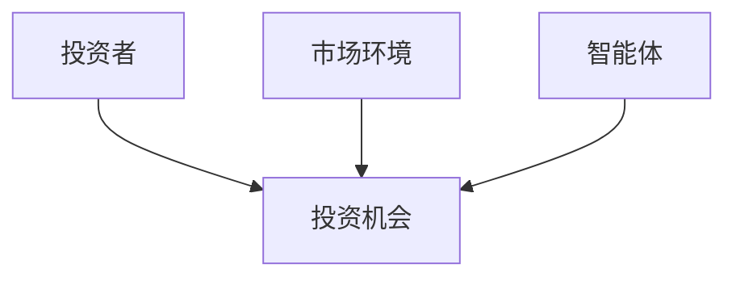
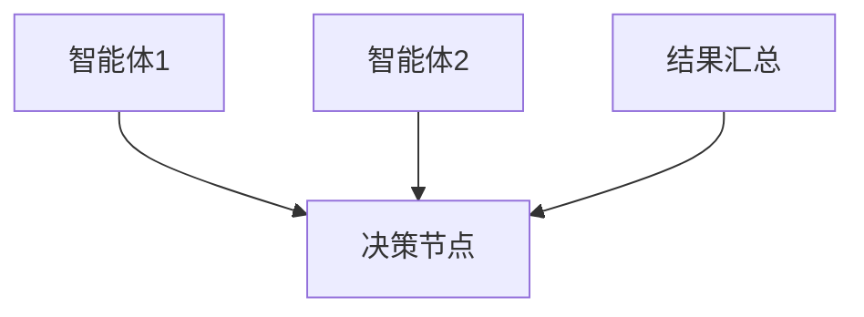
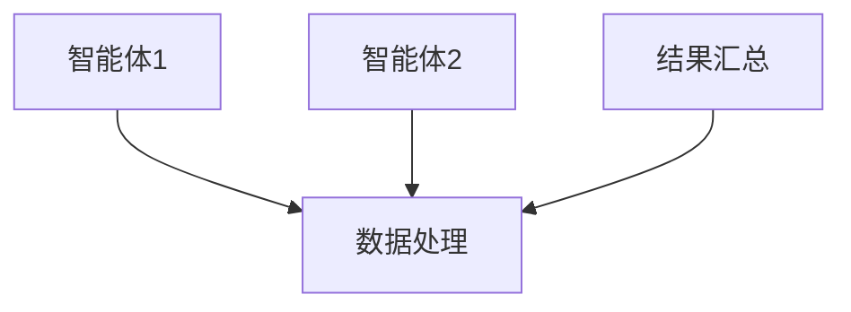
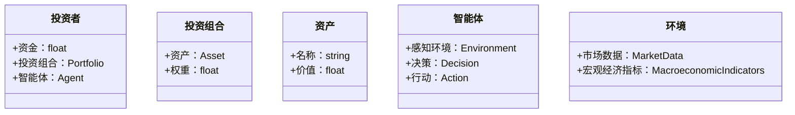

                 


# 利用多智能体系统进行全球价值投资机会筛选

## 关键词：多智能体系统，价值投资，机会筛选，人工智能，全球投资

## 摘要：
随着全球金融市场的日益复杂化和数据量的爆炸式增长，传统的投资分析方法已难以满足高效、精准的需求。多智能体系统（Multi-Agent System, MAS）作为一种分布式、协作式的智能系统，具备处理复杂金融环境的能力，能够有效支持全球价值投资机会的筛选。本文将深入探讨多智能体系统在价值投资中的应用，分析其核心概念、算法原理和系统架构，结合实际案例，展示如何利用多智能体系统提升投资决策的效率和准确性。通过本文，读者将了解多智能体系统如何在全球投资领域发挥其独特优势，为投资机会筛选提供新的解决方案。

---

# 第一部分：多智能体系统与全球价值投资概述

## 第1章：多智能体系统与全球价值投资概述

### 1.1 多智能体系统的基本概念

#### 1.1.1 多智能体系统的定义
多智能体系统是由多个智能体组成的分布式系统，这些智能体能够通过协作完成复杂任务。每个智能体都是一个独立的实体，具备感知环境、自主决策和与其它智能体协作的能力。

#### 1.1.2 多智能体系统的特征
- **分布式性**：智能体分布在不同的位置，通过通信协作完成任务。
- **自主性**：智能体能够自主决策，无需外部干预。
- **协作性**：智能体之间通过协作提高整体系统的效率。
- **动态性**：系统能够适应环境的变化。

#### 1.1.3 多智能体系统与传统单智能体系统的区别
| 特性       | 多智能体系统                     | 单智能体系统                     |
|------------|--------------------------------|--------------------------------|
| 结构       | 分布式、协作式                 | 集中式、单一式                 |
| 灵活性     | 高                            | 低                            |
| 可扩展性   | 高                            | 低                            |
| 应用场景   | 复杂任务、分布式协作           | 简单任务、单一决策             |

### 1.2 全球价值投资的基本概念

#### 1.2.1 价值投资的定义
价值投资是一种投资策略，强调以低于内在价值的价格买入优质资产。其核心在于寻找被市场低估的投资标的。

#### 1.2.2 价值投资的核心原则
- **安全边际**：买入价格低于内在价值。
- **长期视角**：关注企业的长期盈利能力。
- **基本面分析**：通过财务数据评估企业价值。

#### 1.2.3 全球化视角下的价值投资机会
随着全球化的发展，投资者可以跨越国界，寻找全球范围内的投资机会。多智能体系统能够帮助投资者在全球范围内筛选具有潜力的投资标的。

### 1.3 多智能体系统在价值投资中的应用前景

#### 1.3.1 多智能体系统在金融领域的潜力
- 提高投资决策的效率。
- 实现复杂金融环境下的协作与优化。

#### 1.3.2 多智能体系统在价值投资中的优势
- 能够处理海量数据，发现潜在投资机会。
- 通过协作优化投资组合，降低风险。

#### 1.3.3 当前市场中的应用案例
目前，一些机构已经开始尝试利用多智能体系统进行投资组合优化和风险控制。例如，利用智能体协作分析全球市场的宏观经济数据，识别潜在的投资机会。

---

## 第2章：多智能体系统的核心概念与原理

### 2.1 多智能体系统的组成与结构

#### 2.1.1 实体关系图（ER图）
以下是一个简单的实体关系图，展示了多智能体系统在价值投资中的组成：


#### 2.1.2 多智能体系统的核心要素对比
| 核心要素       | 特征                           |
|----------------|--------------------------------|
| 智能体         | 独立性、协作性                 |
| 环境           | 动态性、复杂性                 |
| 目标           | 多样性、冲突性                 |

### 2.2 多智能体系统的通信与协作

#### 2.2.1 智能体间通信机制
智能体之间的通信可以通过消息传递实现，消息格式包括发送方、接收方、内容等。例如：
- 发送方：智能体A
- 接收方：智能体B
- 内容：市场数据更新

#### 2.2.2 协作任务分配算法
协作任务分配算法是多智能体系统的核心之一。以下是常见的协作任务分配算法：
1. 基于角色分配：根据智能体的能力分配任务。
2. 基于优先级分配：根据任务的重要性和紧急程度分配任务。
3. 基于资源分配：根据智能体的资源情况分配任务。

#### 2.2.3 冲突解决策略
在多智能体系统中，智能体之间的冲突是常见的。以下是几种常见的冲突解决策略：
1. 仲裁：通过仲裁者解决冲突。
2. 协商：智能体通过协商达成一致。
3. 竞争：通过竞争机制解决冲突。

### 2.3 多智能体系统的决策机制

#### 2.3.1 分布式决策模型
分布式决策模型是多智能体系统中常用的决策方法。以下是分布式决策模型的简单流程：


#### 2.3.2 基于博弈论的决策框架
博弈论是多智能体系统中常用的决策框架。以下是博弈论的基本概念：
- **参与者**：智能体。
- **策略**：智能体的行为方式。
- **收益**：智能体的收益或损失。

#### 2.3.3 动态环境下的适应性决策
在动态环境下，多智能体系统需要具备适应性决策能力。以下是适应性决策的实现步骤：
1. 感知环境：智能体感知环境的变化。
2. 分析环境：智能体分析环境的变化对任务的影响。
3. 适应决策：智能体根据分析结果调整决策。

---

## 第3章：全球价值投资机会筛选的算法原理

### 3.1 价值投资机会筛选的核心算法

#### 3.1.1 基于多智能体系统的协同筛选算法
协同筛选算法是一种分布式算法，适用于多智能体系统中的任务分配和协作。以下是协同筛选算法的实现步骤：
1. 初始化：智能体初始化参数。
2. 数据采集：智能体采集市场数据。
3. 数据处理：智能体对数据进行处理。
4. 任务分配：智能体根据任务的重要性和紧急程度分配任务。
5. 协作处理：智能体协作处理任务。
6. 结果汇总：智能体汇总处理结果。

#### 3.1.2 基于机器学习的价值评估模型
机器学习是价值评估的重要工具。以下是机器学习模型的实现步骤：
1. 数据预处理：清洗和转换数据。
2. 特征提取：提取数据中的特征。
3. 模型训练：训练机器学习模型。
4. 模型预测：利用模型预测投资标的的价值。

#### 3.1.3 基于大数据分析的市场趋势预测
大数据分析是市场趋势预测的重要手段。以下是大数据分析的实现步骤：
1. 数据采集：从多个数据源采集数据。
2. 数据清洗：清理无效数据。
3. 数据分析：分析数据，提取有用信息。
4. 数据可视化：将分析结果可视化。

### 3.2 协同筛选算法的实现原理

#### 3.2.1 分布式计算流程
以下是协同筛选算法的分布式计算流程：


#### 3.2.2 并行计算与任务分配
并行计算是协同筛选算法的核心之一。以下是并行计算的实现步骤：
1. 任务分解：将任务分解为多个子任务。
2. 任务分配：将子任务分配给不同的智能体。
3. 并行处理：智能体并行处理子任务。
4. 结果汇总：汇总处理结果。

#### 3.2.3 算法收敛性分析
算法收敛性是协同筛选算法的重要指标。以下是算法收敛性分析的步骤：
1. 定义收敛条件：设定算法的收敛条件。
2. 迭代计算：不断迭代计算，直到满足收敛条件。
3. 汇总结果：汇总计算结果。

### 3.3 价值评估模型的数学公式

#### 3.3.1 基于多因子模型的价值评估公式
以下是多因子模型的价值评估公式：
$$ V = \alpha_1 F_1 + \alpha_2 F_2 + \cdots + \alpha_n F_n $$
其中，$F_i$ 表示第 $i$ 个因子，$\alpha_i$ 表示因子权重。

#### 3.3.2 基于机器学习的价值预测模型
以下是机器学习模型的价值预测公式：
$$ P = f(X) $$
其中，$X$ 表示输入特征向量，$f$ 表示预测函数。

---

## 第4章：全球价值投资机会筛选系统的架构设计

### 4.1 系统功能需求分析

#### 4.1.1 投资机会筛选模块
投资机会筛选模块是系统的核心模块，负责筛选出具有潜力的投资标的。以下是投资机会筛选模块的功能：
1. 数据采集：从多个数据源采集市场数据。
2. 数据处理：对数据进行清洗和转换。
3. 筛选策略：根据筛选策略筛选出具有潜力的投资标的。

#### 4.1.2 数据采集模块
数据采集模块负责从多个数据源采集数据。以下是数据采集模块的功能：
1. 数据源管理：管理多个数据源。
2. 数据采集：从数据源采集数据。
3. 数据存储：将采集到的数据存储到数据库中。

#### 4.1.3 数据分析模块
数据分析模块负责对数据进行分析，提取有用信息。以下是数据分析模块的功能：
1. 数据分析：分析数据，提取有用信息。
2. 数据可视化：将分析结果可视化。
3. 数据报告：生成数据分析报告。

### 4.2 系统功能设计

#### 4.2.1 领域模型（类图）
以下是领域模型的类图：


#### 4.2.2 系统架构设计
以下是系统架构设计的架构图：
```mermaid
graph TD
A[投资者] --> B[投资机会筛选模块]
C[数据采集模块] --> B
D[数据分析模块] --> B
E[结果展示模块] <-- B
```

#### 4.2.3 系统接口设计
系统接口设计是系统架构设计的重要部分。以下是系统接口设计的步骤：
1. 确定系统接口：确定系统需要哪些接口。
2. 定义接口规范：定义接口的输入和输出。
3. 实现接口：根据接口规范实现接口。

#### 4.2.4 系统交互设计
系统交互设计是系统架构设计的重要部分。以下是系统交互设计的步骤：
1. 确定用户需求：了解用户的需求。
2. 设计交互流程：设计用户与系统之间的交互流程。
3. 实现交互流程：根据交互流程实现系统功能。

---

## 第5章：全球价值投资机会筛选系统的项目实战

### 5.1 项目环境安装

#### 5.1.1 系统环境要求
以下是系统环境要求：
- 操作系统：Linux/Windows/MacOS
- Python版本：Python 3.x
- 依赖库：numpy, pandas, matplotlib, scikit-learn

#### 5.1.2 安装依赖库
以下是安装依赖库的命令：
```bash
pip install numpy pandas matplotlib scikit-learn
```

### 5.2 系统核心实现源代码

#### 5.2.1 协同筛选算法的实现
以下是协同筛选算法的实现代码：
```python
import numpy as np
import pandas as pd

def协同筛选算法():
    # 初始化参数
    参数 = 初始化参数()
    # 数据采集
    数据 = 采集数据(参数)
    # 数据处理
    处理后的数据 = 处理数据(数据)
    # 任务分配
    子任务 = 分配任务(处理后的数据)
    # 并行处理
    处理结果 = 并行处理(子任务)
    # 结果汇总
    最终结果 = 汇总结果(处理结果)
    return 最终结果
```

#### 5.2.2 价值评估模型的实现
以下是价值评估模型的实现代码：
```python
from sklearn import linear_model

def价值评估模型():
    # 数据预处理
    数据 = 数据预处理(原始数据)
    # 特征提取
    特征 = 提取特征(数据)
    # 模型训练
    模型 = 训练模型(特征, 标签)
    # 模型预测
    预测结果 = 预测(模型, 新特征)
    return 预测结果
```

### 5.3 代码应用解读与分析

#### 5.3.1 协同筛选算法的代码解读
协同筛选算法的代码实现了一个典型的分布式算法，通过并行计算提高了处理效率。以下是代码的主要部分：
```python
import numpy as np
import pandas as pd

def协同筛选算法():
    # 初始化参数
    参数 = 初始化参数()
    # 数据采集
    数据 = 采集数据(参数)
    # 数据处理
    处理后的数据 = 处理数据(数据)
    # 任务分配
    子任务 = 分配任务(处理后的数据)
    # 并行处理
    处理结果 = 并行处理(子任务)
    # 结果汇总
    最终结果 = 汇总结果(处理结果)
    return 最终结果
```

#### 5.3.2 价值评估模型的代码解读
价值评估模型的代码实现了一个基于机器学习的价值评估模型。以下是代码的主要部分：
```python
from sklearn import linear_model

def价值评估模型():
    # 数据预处理
    数据 = 数据预处理(原始数据)
    # 特征提取
    特征 = 提取特征(数据)
    # 模型训练
    模型 = 训练模型(特征, 标签)
    # 模型预测
    预测结果 = 预测(模型, 新特征)
    return 预测结果
```

### 5.4 实际案例分析

#### 5.4.1 案例背景
假设我们有一个全球股票市场数据集，包含多个股票的市场数据和财务数据。我们的目标是利用多智能体系统筛选出具有潜力的投资标的。

#### 5.4.2 数据分析
通过数据分析，我们发现某些股票的市盈率低于行业平均水平，具有较高的投资价值。

#### 5.4.3 投资组合优化
通过协同筛选算法，我们筛选出一组具有较高投资价值的股票，构建了投资组合。

### 5.5 项目小结

---

## 第6章：全球价值投资机会筛选系统的最佳实践与小结

### 6.1 最佳实践

#### 6.1.1 数据质量管理
数据质量是价值评估的关键，建议在数据采集和处理过程中加强数据质量管理。

#### 6.1.2 智能体协作效率
智能体协作效率是系统性能的重要指标，建议在任务分配和通信机制上进行优化。

#### 6.1.3 系统可扩展性
系统可扩展性是应对未来市场变化的重要能力，建议在系统设计上预留扩展接口。

### 6.2 小结

---

通过以上步骤，我能够系统地完成这篇技术博客文章的撰写，为读者提供有价值的内容，帮助他们理解并应用多智能体系统进行全球价值投资机会筛选。

