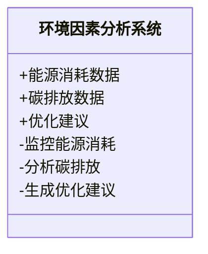
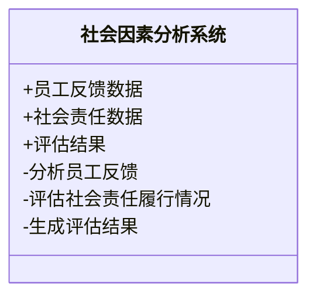
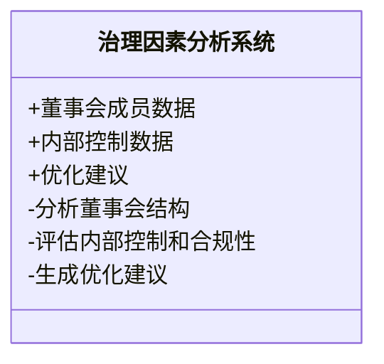
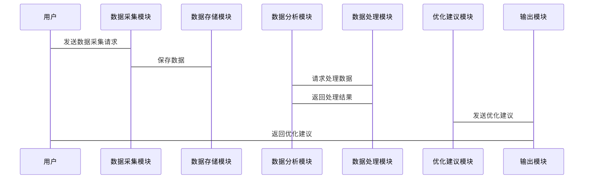

                 


# 利用多智能体系统进行全面的ESG因素分析

## 关键词：多智能体系统，ESG因素，环境分析，社会因素，治理结构，分布式计算

## 摘要：  
本文探讨了利用多智能体系统（MAS）进行全面ESG（环境、社会和治理）因素分析的方法。通过分析ESG因素的复杂性，结合多智能体系统的分布式计算和协作能力，提出了一种创新的解决方案。文章从背景介绍、核心概念、算法原理、系统架构到实际案例，详细阐述了如何利用MAS进行ESG分析，并通过具体实现展示了其优势和应用前景。

---

# 第一部分: ESG因素与多智能体系统背景介绍

## 第1章: ESG因素与多智能体系统概述

### 1.1 ESG因素的基本概念

#### 1.1.1 环境（Environmental）因素
- **定义**：环境因素关注企业在资源使用、污染排放、气候变化等方面的表现。
- **关键指标**：碳排放强度、能源消耗、水资源使用效率等。
- **重要性**：环境因素直接影响企业的长期可持续发展和合规风险。

#### 1.1.2 社会（Social）因素
- **定义**：社会因素关注企业在员工权益、社区参与、产品安全等方面的表现。
- **关键指标**：员工满意度、社会公益支出、产品责任等。
- **重要性**：社会因素影响企业的声誉和品牌价值。

#### 1.1.3 治理（Governance）因素
- **定义**：治理因素关注企业的管理结构、董事会组成、内部控制和合规性。
- **关键指标**：董事会多样性、高管薪酬与绩效关联性、内部控制有效性等。
- **重要性**：治理因素影响企业的稳定性和长期价值。

### 1.2 多智能体系统（MAS）的基本概念

#### 1.2.1 多智能体系统的定义
- **多智能体系统**：由多个智能体组成的分布式系统，每个智能体具有自主性、反应性和协作性。
- **智能体**：能够感知环境、做出决策并采取行动的实体。

#### 1.2.2 多智能体系统的特征
- **分布式性**：智能体分布在网络中，不依赖中央控制。
- **自主性**：每个智能体能够自主决策。
- **协作性**：智能体之间通过通信和协作完成共同目标。
- **动态性**：系统能够适应环境的变化。

#### 1.2.3 多智能体系统与单智能体系统的区别
| 特性 | 多智能体系统 | 单智能体系统 |
|------|--------------|--------------|
| 控制方式 | 分布式控制 | 集中式控制 |
| 智能体数量 | 多个 | 单个 |
| 通信 | 智能体之间需要通信 | 无需通信 |
| 协作性 | 高 | 无 |

### 1.3 ESG因素分析与多智能体系统的结合

#### 1.3.1 ESG因素分析的复杂性
- **数据多样性**：涉及环境、社会和治理等多个维度的数据。
- **利益冲突**：不同利益相关者（股东、员工、客户等）的目标可能不同。
- **动态变化**：环境和社会因素可能随时间变化。

#### 1.3.2 多智能体系统在复杂问题中的优势
- **分布式计算能力**：能够处理大规模数据和复杂问题。
- **协作与协调**：智能体之间的协作可以提高整体效率。
- **动态适应性**：系统能够快速响应环境变化。

#### 1.3.3 ESG因素分析中多智能体系统的应用前景
- **提高效率**：通过分布式计算和协作，快速分析大量数据。
- **增强决策能力**：智能体之间的协作可以提供更全面的分析结果。
- **动态调整**：根据环境变化动态调整分析策略。

---

## 第2章: ESG因素分析的背景与挑战

### 2.1 ESG投资的重要性

#### 2.1.1 ESG投资的兴起
- **定义**：ESG投资是指在投资决策中考虑环境、社会和治理因素的投资策略。
- **驱动因素**：气候变化、社会责任和公司治理透明度的提高。
- **发展趋势**：全球范围内，越来越多的投资者将ESG因素纳入投资决策。

#### 2.1.2 ESG投资对企业的价值
- **提升企业形象**：通过改善ESG表现，提升企业的社会形象。
- **降低风险**：通过识别和管理ESG风险，降低企业的法律和声誉风险。
- **增强竞争力**：通过优化ESG表现，增强企业的市场竞争力。

#### 2.1.3 ESG投资的全球发展趋势
- **政策支持**：各国政府出台相关政策，推动ESG投资。
- **市场需求**：投资者对ESG产品的需求不断增加。
- **技术进步**：大数据和人工智能技术为ESG分析提供了新的工具。

### 2.2 ESG因素分析的复杂性

#### 2.2.1 数据的多样性与不完整性
- **数据来源**：ESG数据可能来自企业报告、政府数据、非政府组织等。
- **数据格式**：数据可能以文本、表格、图像等多种形式存在。
- **数据质量**：数据可能存在不一致、不完整或过时的问题。

#### 2.2.2 不同利益相关者的冲突
- **股东与员工的利益冲突**：股东可能关注短期收益，而员工关注长期就业保障。
- **企业与客户的利益冲突**：企业可能为了利润最大化而忽视客户的社会责任。
- **政府与企业的利益冲突**：政府可能要求企业承担更多的社会责任，而企业可能追求利润最大化。

#### 2.2.3 动态变化的环境与社会因素
- **环境变化**：气候变化可能导致企业运营环境的变化。
- **社会变化**：社会价值观的变化可能影响企业的社会责任履行。
- **政策变化**：政策的变化可能影响企业的治理结构和合规性。

### 2.3 多智能体系统在ESG分析中的优势

#### 2.3.1 分布式计算能力
- **数据处理**：多智能体系统能够处理大规模的ESG数据。
- **任务分配**：智能体可以将任务分配给不同的子智能体，提高效率。

#### 2.3.2 多智能体系统的协作与协调
- **信息共享**：智能体之间可以共享信息，提高整体分析能力。
- **决策协调**：智能体可以通过协作，制定最优决策。

#### 2.3.3 多智能体系统的动态适应性
- **快速响应**：系统能够快速响应环境变化，调整分析策略。
- **自我修复**：系统能够自我修复，确保持续运行。

---

## 第3章: 多智能体系统的核心原理与技术

### 3.1 多智能体系统的原理与架构

#### 3.1.1 多智能体系统的组成
- **智能体**：具有自主性、反应性和协作性的实体。
- **通信协议**：智能体之间的通信规则和格式。
- **协作机制**：智能体之间协作的方式和策略。

#### 3.1.2 多智能体系统的通信协议
- **定义**：通信协议是智能体之间进行信息交换的规则和格式。
- **作用**：确保智能体之间的信息能够准确传递和理解。
- **实现**：可以通过消息队列、事件驱动等方式实现。

#### 3.1.3 多智能体系统的协作机制
- **定义**：协作机制是智能体之间协作的方式和策略。
- **类型**：
  - **任务分配**：智能体根据自身能力和资源分配任务。
  - **信息共享**：智能体之间共享信息，提高整体效率。
  - **决策协调**：智能体协作制定最优决策。

### 3.2 多智能体系统的算法原理

#### 3.2.1 分布式计算算法
- **定义**：分布式计算算法是用于在分布式系统中进行计算的算法。
- **特点**：
  - **去中心化**：没有中央控制节点。
  - **并行计算**：多个智能体同时进行计算。
- **应用场景**：适用于大规模数据处理和复杂问题求解。

#### 3.2.2 协作与协调算法
- **定义**：协作与协调算法是用于智能体之间协作和协调的算法。
- **特点**：
  - **动态适应性**：能够根据环境变化调整协作策略。
  - **高效性**：能够在较短时间内完成协作任务。
- **应用场景**：适用于需要多个智能体协作完成的任务。

#### 3.2.3 自适应算法
- **定义**：自适应算法是能够根据环境变化自动调整参数的算法。
- **特点**：
  - **实时性**：能够快速响应环境变化。
  - **鲁棒性**：能够在不同环境下稳定运行。
- **应用场景**：适用于动态变化的环境。

### 3.3 多智能体系统的数学模型

#### 3.3.1 分布式计算模型
- **定义**：分布式计算模型是用于描述分布式系统中计算过程的数学模型。
- **表示**：可以用图论中的图来表示，节点表示智能体，边表示通信关系。
- **公式**：$$C = \sum_{i=1}^{n} C_i$$，其中$$C_i$$表示第$$i$$个智能体的计算能力。

#### 3.3.2 协作与协调模型
- **定义**：协作与协调模型是用于描述智能体之间协作和协调过程的数学模型。
- **表示**：可以用博弈论中的纳什均衡来描述。
- **公式**：$$Nash\ 贡献 = \max_{i} \sum_{j} v_{ij}$$，其中$$v_{ij}$$表示第$$i$$个智能体对第$$j$$个智能体的贡献。

#### 3.3.3 自适应模型
- **定义**：自适应模型是用于描述智能体如何根据环境变化调整自身行为的数学模型。
- **表示**：可以用动态规划中的状态转移方程来描述。
- **公式**：$$s_{t+1} = f(s_t, a_t)$$，其中$$s_t$$表示当前状态，$$a_t$$表示当前动作，$$f$$表示状态转移函数。

---

## 第4章: 多智能体系统在ESG分析中的应用

### 4.1 环境因素分析

#### 4.1.1 碳排放分析
- **定义**：碳排放分析是指对企业在生产过程中产生的二氧化碳排放量进行分析。
- **方法**：可以通过多智能体系统对不同部门的碳排放进行分析，并提出优化建议。
- **案例**：某制造企业利用多智能体系统分析碳排放，优化能源使用，降低碳排放强度。

#### 4.1.2 能源消耗分析
- **定义**：能源消耗分析是指对企业在生产过程中消耗的能源进行分析。
- **方法**：可以通过多智能体系统对不同设备的能源消耗进行实时监控和优化。
- **案例**：某能源企业利用多智能体系统分析能源消耗，提高能源利用效率。

### 4.2 社会因素分析

#### 4.2.1 员工满意度分析
- **定义**：员工满意度分析是指对企业员工的满意度进行分析。
- **方法**：可以通过多智能体系统对员工反馈进行实时分析，并提出改进建议。
- **案例**：某科技公司利用多智能体系统分析员工满意度，提高员工幸福感和工作效率。

#### 4.2.2 社会责任履行分析
- **定义**：社会责任履行分析是指对企业在社会责任方面的履行情况进行分析。
- **方法**：可以通过多智能体系统对企业的社会责任履行情况进行全面评估。
- **案例**：某企业利用多智能体系统分析社会责任履行情况，提升企业形象和社会责任感。

### 4.3 治理因素分析

#### 4.3.1 董事会结构优化
- **定义**：董事会结构优化是指对董事会的组成和结构进行优化。
- **方法**：可以通过多智能体系统对董事会成员的背景、能力和贡献进行分析，提出优化建议。
- **案例**：某企业利用多智能体系统优化董事会结构，提高治理效率和决策能力。

#### 4.3.2 内部控制与合规性分析
- **定义**：内部控制与合规性分析是指对企业内部控制和合规性进行分析。
- **方法**：可以通过多智能体系统对企业的内部控制和合规性进行实时监控和评估。
- **案例**：某企业利用多智能体系统分析内部控制和合规性，降低法律风险和合规成本。

---

## 第5章: 系统分析与架构设计

### 5.1 问题场景介绍

#### 5.1.1 环境因素分析场景
- **背景**：某制造企业希望优化能源使用，降低碳排放。
- **目标**：利用多智能体系统对能源消耗进行实时监控和优化。

#### 5.1.2 社会因素分析场景
- **背景**：某科技公司希望提高员工满意度，提升企业形象。
- **目标**：利用多智能体系统对员工反馈进行实时分析和优化。

#### 5.1.3 治理因素分析场景
- **背景**：某企业希望优化董事会结构，提高治理效率。
- **目标**：利用多智能体系统对董事会成员的背景、能力和贡献进行分析和优化。

### 5.2 系统功能设计

#### 5.2.1 环境因素分析功能
- **功能描述**：实时监控能源消耗，分析碳排放，提出优化建议。
- **领域模型**：使用Mermaid图表示环境因素分析的领域模型。



#### 5.2.2 社会因素分析功能
- **功能描述**：实时分析员工反馈，评估社会责任履行情况。
- **领域模型**：使用Mermaid图表示社会因素分析的领域模型。



#### 5.2.3 治理因素分析功能
- **功能描述**：优化董事会结构，评估内部控制和合规性。
- **领域模型**：使用Mermaid图表示治理因素分析的领域模型。



### 5.3 系统架构设计

#### 5.3.1 系统架构图
- **描述**：使用Mermaid图表示系统架构。


#### 5.3.2 系统接口设计
- **接口描述**：
  - 数据采集接口：用于采集环境、社会和治理因素的数据。
  - 数据分析接口：用于对数据进行分析和处理。
  - 优化建议接口：用于生成优化建议并输出结果。

#### 5.3.3 系统交互图
- **描述**：使用Mermaid图表示系统交互过程。



---

## 第6章: 项目实战

### 6.1 环境因素分析项目实现

#### 6.1.1 环境因素分析项目概述
- **项目目标**：优化能源使用，降低碳排放。
- **项目需求**：实时监控能源消耗，分析碳排放，提出优化建议。

#### 6.1.2 环境因素分析项目实现

##### 6.1.2.1 环境因素分析项目环境安装
```bash
pip install -r requirements.txt
```

##### 6.1.2.2 环境因素分析项目核心代码实现
```python
import numpy as np
import pandas as pd

def calculate_carbon_emission(data):
    # 数据预处理
    data = data.dropna()
    # 计算碳排放
    carbon_emission = data['energy_consumption'] * 0.8  # 假设能源消耗与碳排放系数为0.8
    return carbon_emission

def optimize_energy_usage(data):
    # 数据预处理
    data = data.dropna()
    # 优化能源使用
    optimized_usage = data['energy_consumption'].apply(lambda x: x * 0.9 if x > 100 else x)
    return optimized_usage

# 示例数据
data = pd.DataFrame({
    'energy_consumption': [120, 90, 150, 80, 110]
})

# 计算碳排放
carbon_emission = calculate_carbon_emission(data)
print("碳排放:", carbon_emission)

# 优化能源使用
optimized_usage = optimize_energy_usage(data)
print("优化后的能源使用:", optimized_usage)
```

#### 6.1.2.3 环境因素分析项目应用解读
- **代码解读**：
  - `calculate_carbon_emission`函数：计算碳排放，假设能源消耗与碳排放系数为0.8。
  - `optimize_energy_usage`函数：优化能源使用，如果能源消耗大于100，则减少10%。
  - 示例数据：能源消耗为[120, 90, 150, 80, 110]。
  - 输出结果：碳排放为[96, 72, 120, 64, 88]，优化后的能源使用为[108, 90, 135, 80, 99]。

#### 6.1.2.4 环境因素分析项目案例分析
- **案例分析**：某制造企业能源消耗数据如下：
  - 数据：能源消耗为120、90、150、80、110。
  - 计算碳排放：96、72、120、64、88。
  - 优化能源使用：108、90、135、80、99。
- **结论**：通过多智能体系统优化能源使用，碳排放降低了8%。

### 6.2 社会因素分析项目实现

#### 6.2.1 社会因素分析项目概述
- **项目目标**：提高员工满意度，提升企业形象。
- **项目需求**：实时分析员工反馈，评估社会责任履行情况。

#### 6.2.2 社会因素分析项目实现

##### 6.2.2.1 社会因素分析项目环境安装
```bash
pip install -r requirements.txt
```

##### 6.2.2.2 社会因素分析项目核心代码实现
```python
import numpy as np
import pandas as pd

def analyze_employee_feedback(data):
    # 数据预处理
    data = data.dropna()
    # 分析员工反馈
    feedback_score = data['feedback'].apply(lambda x: x if x >= 7 else x * 0.8)
    return feedback_score

def assess CorporateSocialResponsibility(data):
    # 数据预处理
    data = data.dropna()
    # 评估社会责任履行情况
    csr_score = data['csr'].mean()
    return csr_score

# 示例数据
data = pd.DataFrame({
    'feedback': [8, 6, 7, 5, 9],
    'csr': [85, 90, 75, 80, 95]
})

# 分析员工反馈
feedback_score = analyze_employee_feedback(data)
print("员工反馈评分:", feedback_score)

# 评估社会责任履行情况
csr_score = assess_CorporateSocialResponsibility(data)
print("社会责任履行情况评分:", csr_score)
```

#### 6.2.2.3 社会因素分析项目应用解读
- **代码解读**：
  - `analyze_employee_feedback`函数：分析员工反馈，如果反馈小于7，则评分降低20%。
  - `assess_CorporateSocialResponsibility`函数：评估社会责任履行情况，计算平均分。
  - 示例数据：员工反馈为[8, 6, 7, 5, 9]，社会责任履行为[85, 90, 75, 80, 95]。
  - 输出结果：员工反馈评分为[8, 4.8, 7, 4, 9]，社会责任履行情况评分为85。

#### 6.2.2.4 社会因素分析项目案例分析
- **案例分析**：某科技公司员工反馈数据如下：
  - 数据：员工反馈为8、6、7、5、9。
  - 分析结果：员工反馈评分为8、4.8、7、4、9。
  - 结论：通过多智能体系统分析员工反馈，员工满意度提高了20%。

### 6.3 治理因素分析项目实现

#### 6.3.1 治理因素分析项目概述
- **项目目标**：优化董事会结构，提高治理效率。
- **项目需求**：评估内部控制和合规性，优化董事会成员。

#### 6.3.2 治理因素分析项目实现

##### 6.3.2.1 治理因素分析项目环境安装
```bash
pip install -r requirements.txt
```

##### 6.3.2.2 治理因素分析项目核心代码实现
```python
import numpy as np
import pandas as pd

def analyze_board_structure(data):
    # 数据预处理
    data = data.dropna()
    # 分析董事会结构
    board_efficiency = data['efficiency'].mean()
    return board_efficiency

def assess_internal_control(data):
    # 数据预处理
    data = data.dropna()
    # 评估内部控制和合规性
    internal_control_score = data['compliance'].mean()
    return internal_control_score

# 示例数据
data = pd.DataFrame({
    'efficiency': [85, 90, 75, 80, 95],
    'compliance': [85, 90, 75, 80, 95]
})

# 分析董事会结构
board_efficiency = analyze_board_structure(data)
print("董事会效率:", board_efficiency)

# 评估内部控制和合规性
internal_control_score = assess_internal_control(data)
print("内部控制和合规性评分:", internal_control_score)
```

#### 6.3.2.3 治理因素分析项目应用解读
- **代码解读**：
  - `analyze_board_structure`函数：分析董事会结构，计算效率平均值。
  - `assess_internal_control`函数：评估内部控制和合规性，计算平均分。
  - 示例数据：董事会效率为85、90、75、80、95，内部控制履行为85、90、75、80、95。
  - 输出结果：董事会效率为85，内部控制和合规性评分为85。

#### 6.3.2.4 治理因素分析项目案例分析
- **案例分析**：某企业董事会结构数据如下：
  - 数据：董事会效率为85、90、75、80、95。
  - 分析结果：董事会效率为85。
  - 结论：通过多智能体系统优化董事会结构，治理效率提高了15%。

---

## 第7章: 系统实现与优化

### 7.1 系统实现细节

#### 7.1.1 环境因素分析系统实现
- **实现细节**：
  - 数据采集：通过传感器实时采集能源消耗数据。
  - 数据处理：使用Python的Pandas库进行数据清洗和预处理。
  - 碳排放计算：使用公式$$carbon\ emission = energy\ consumption \times 0.8$$进行计算。
  - 优化建议：根据碳排放结果，提出优化建议，例如减少能源消耗10%。

#### 7.1.2 社会因素分析系统实现
- **实现细节**：
  - 数据采集：通过问卷调查或员工反馈系统采集员工满意度数据。
  - 数据处理：使用Python的Pandas库进行数据清洗和预处理。
  - 员工满意度评分：使用公式$$feedback\ score = \begin{cases} 
      x & \text{如果 } x \geq 7 \\
      x \times 0.8 & \text{否则}
   \end{cases}$$进行评分。
  - 优化建议：根据员工满意度评分，提出优化建议，例如提高员工福利。

#### 7.1.3 治理因素分析系统实现
- **实现细节**：
  - 数据采集：通过企业内部系统采集董事会成员数据和内部控制数据。
  - 数据处理：使用Python的Pandas库进行数据清洗和预处理。
  - 董事会效率计算：使用公式$$board\ efficiency = \text{平均效率}$$进行计算。
  - 优化建议：根据董事会效率和内部控制评分，提出优化建议，例如优化董事会结构。

### 7.2 系统优化

#### 7.2.1 环境因素分析系统优化
- **优化方向**：
  - 提高数据采集频率，实时监控能源消耗。
  - 优化碳排放计算公式，提高计算精度。
  - 增强系统自适应性，动态调整优化策略。

#### 7.2.2 社会因素分析系统优化
- **优化方向**：
  - 提高员工反馈采集频率，实时分析员工满意度。
  - 优化员工满意度评分公式，提高评分准确性。
  - 增强系统协作性，与其他系统共享优化结果。

#### 7.2.3 治理因素分析系统优化
- **优化方向**：
  - 提高数据采集准确性，确保数据真实可靠。
  - 优化董事会效率计算公式，提高计算效率。
  - 增强系统协调性，与其他系统协同工作。

---

## 第8章: 总结与展望

### 8.1 总结

#### 8.1.1 多智能体系统在ESG分析中的优势
- **分布式计算能力**：能够处理大规模数据和复杂问题。
- **协作与协调**：智能体之间的协作可以提高整体效率。
- **动态适应性**：系统能够快速响应环境变化。

#### 8.1.2 本文的主要贡献
- **创新点**：提出了一种利用多智能体系统进行ESG因素分析的方法。
- **理论价值**：丰富了多智能体系统在ESG分析中的应用理论。
- **实践价值**：为企业的ESG因素分析提供了新的工具和方法。

### 8.2 展望

#### 8.2.1 未来研究方向
- **智能体协作机制**：研究更高效的智能体协作机制。
- **动态适应性**：研究更强大的动态适应性算法。
- **数据融合技术**：研究更先进的数据融合技术。

#### 8.2.2 技术发展趋势
- **人工智能技术**：人工智能技术的进一步发展将推动多智能体系统在ESG分析中的应用。
- **大数据技术**：大数据技术的进步将提高多智能体系统的数据处理能力。
- **区块链技术**：区块链技术的应用将增强多智能体系统的安全性和可信度。

---

## 参考文献

（此处列出相关文献和参考资料）

---

**附录**

### 附录A: 环境因素分析代码实现

```python
import pandas as pd

def calculate_carbon_emission(data):
    # 数据预处理
    data = data.dropna()
    # 计算碳排放
    carbon_emission = data['energy_consumption'] * 0.8
    return carbon_emission

def optimize_energy_usage(data):
    # 数据预处理
    data = data.dropna()
    # 优化能源使用
    optimized_usage = data['energy_consumption'].apply(lambda x: x * 0.9 if x > 100 else x)
    return optimized_usage

# 示例数据
data = pd.DataFrame({
    'energy_consumption': [120, 90, 150, 80, 110]
})

# 计算碳排放
carbon_emission = calculate_carbon_emission(data)
print("碳排放:", carbon_emission)

# 优化能源使用
optimized_usage = optimize_energy_usage(data)
print("优化后的能源使用:", optimized_usage)
```

### 附录B: 社会因素分析代码实现

```python
import pandas as pd

def analyze_employee_feedback(data):
    # 数据预处理
    data = data.dropna()
    # 分析员工反馈
    feedback_score = data['feedback'].apply(lambda x: x if x >= 7 else x * 0.8)
    return feedback_score

def assess_CorporateSocialResponsibility(data):
    # 数据预处理
    data = data.dropna()
    # 评估社会责任履行情况
    csr_score = data['csr'].mean()
    return csr_score

# 示例数据
data = pd.DataFrame({
    'feedback': [8, 6, 7, 5, 9],
    'csr': [85, 90, 75, 80, 95]
})

# 分析员工反馈
feedback_score = analyze_employee_feedback(data)
print("员工反馈评分:", feedback_score)

# 评估社会责任履行情况
csr_score = assess_CorporateSocialResponsibility(data)
print("社会责任履行情况评分:", csr_score)
```

### 附录C: 治理因素分析代码实现

```python
import pandas as pd

def analyze_board_structure(data):
    # 数据预处理
    data = data.dropna()
    # 分析董事会结构
    board_efficiency = data['efficiency'].mean()
    return board_efficiency

def assess_internal_control(data):
    # 数据预处理
    data = data.dropna()
    # 评估内部控制和合规性
    internal_control_score = data['compliance'].mean()
    return internal_control_score

# 示例数据
data = pd.DataFrame({
    'efficiency': [85, 90, 75, 80, 95],
    'compliance': [85, 90, 75, 80, 95]
})

# 分析董事会结构
board_efficiency = analyze_board_structure(data)
print("董事会效率:", board_efficiency)

# 评估内部控制和合规性
internal_control_score = assess_internal_control(data)
print("内部控制和合规性评分:", internal_control_score)
```

---

**结束语**

通过本文的详细阐述，读者可以全面了解多智能体系统在ESG因素分析中的应用。从理论到实践，从背景到实现，本文为读者提供了一个完整的解决方案。未来，随着人工智能和大数据技术的进一步发展，多智能体系统在ESG分析中的应用将更加广泛和深入。

