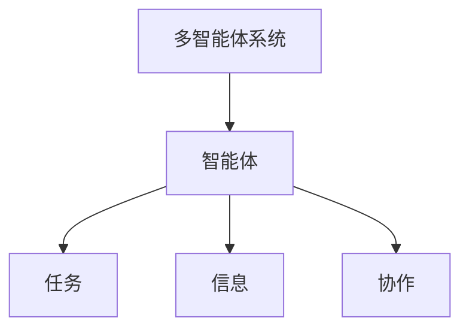
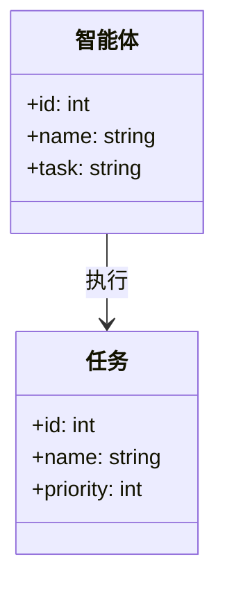
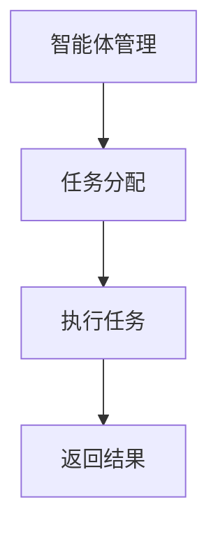
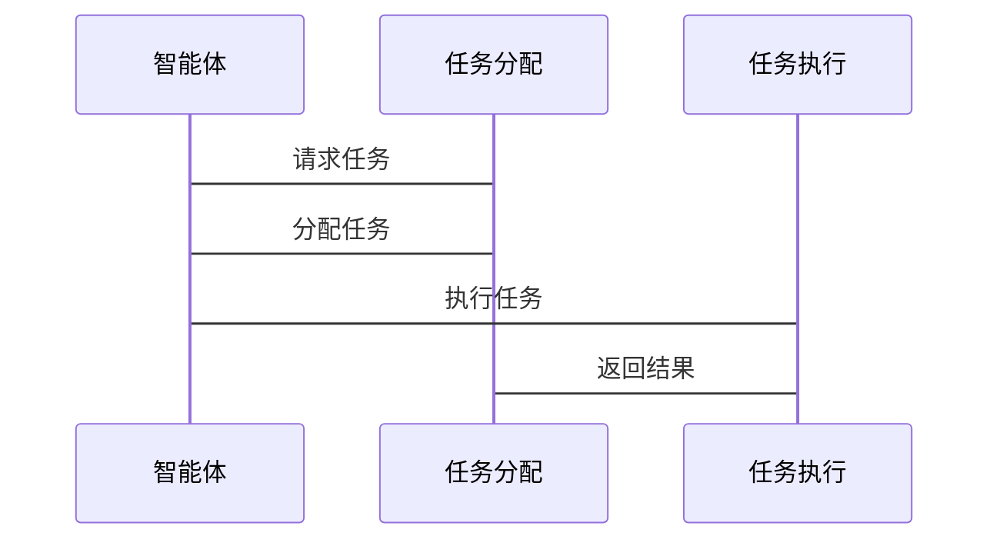

                 


# 利用多智能体系统进行全面的供应链和竞争对手分析

**关键词：** 多智能体系统、供应链分析、竞争对手分析、博弈论、协作机制、数学模型

**摘要：** 本文探讨了多智能体系统在供应链和竞争对手分析中的应用，从基本概念到算法原理，再到系统设计和项目实战，详细解析了多智能体系统的原理及其在实际场景中的应用。通过博弈论模型和数学公式，结合Mermaid图和Python代码，展示了如何利用多智能体系统优化供应链管理并制定竞争策略。

---

# 第1章 多智能体系统概述

## 1.1 多智能体系统的基本概念

### 1.1.1 多智能体系统的定义
多智能体系统（Multi-Agent System, MAS）是由多个智能体组成的系统，这些智能体能够自主决策、协作和交互，共同完成复杂任务。

### 1.1.2 多智能体系统的特征
- **自主性**：智能体能够独立决策。
- **反应性**：能够感知环境并实时调整行为。
- **协作性**：多个智能体协同完成任务。
- **分布式性**：智能体分布在不同的位置，独立运行。

### 1.1.3 多智能体系统与传统单体系统的主要区别
- **自主性**：MAS中的智能体独立决策，而单体系统由中心控制。
- **协作性**：MAS通过协作完成任务，单体系统依赖中心控制。
- **适应性**：MAS能适应环境变化，单体系统适应性较弱。

## 1.2 供应链分析的必要性

### 1.2.1 供应链管理的基本概念
供应链管理涉及从原材料采购到产品交付的全过程管理，目标是提高效率、降低成本。

### 1.2.2 现代供应链管理的核心挑战
- **复杂性**：涉及多个环节和参与者。
- **不确定性**：市场需求波动、供应商问题等影响供应链稳定性。
- **协作性**：需要各环节高效协作。

### 1.2.3 竞争对手分析在供应链管理中的作用
竞争对手分析帮助识别市场趋势、价格策略、供应链优势，从而制定有效的竞争策略。

## 1.3 多智能体系统在供应链管理中的应用前景

### 1.3.1 多智能体系统如何优化供应链流程
- **库存管理**：智能体实时监控库存，优化补货策略。
- **物流调度**：智能体协调运输资源，优化配送路径。
- **需求预测**：通过数据分析，预测市场需求，优化生产计划。

### 1.3.2 多智能体系统在竞争对手分析中的优势
- **实时监控**：持续跟踪竞争对手的市场动态。
- **数据挖掘**：分析竞争对手的销售数据，识别市场趋势。
- **策略制定**：基于数据和模型，制定竞争策略。

### 1.3.3 多智能体系统的潜在应用领域
- **物流与运输**：优化配送路线，减少成本。
- **库存管理**：实时监控库存，避免过剩或短缺。
- **市场分析**：分析市场趋势，制定销售策略。

---

# 第2章 多智能体系统的核心概念与联系

## 2.1 多智能体系统的原理

### 2.1.1 多智能体系统的通信机制
智能体之间通过消息传递进行通信，消息格式包括操作、参数等。

### 2.1.2 多智能体系统的协作机制
协作机制确保智能体之间有效配合，避免冲突。

### 2.1.3 多智能体系统的任务分配算法
任务分配算法根据智能体的能力和负载，合理分配任务。

## 2.2 多智能体系统的属性特征对比

| 特性 | 单体系统 | 多智能体系统 |
|------|----------|-------------|
| 自主性 | 中心控制 | 分布式自主  |
| 反应性 | 响应缓慢 | 实时反应     |
| 分布式 | 集中式    | 分布式       |

## 2.3 多智能体系统的ER实体关系图



---

# 第3章 多智能体系统的算法原理

## 3.1 多智能体系统的通信协议

### 3.1.1 通信协议的基本概念
通信协议定义了智能体之间消息的格式和交互规则。

### 3.1.2 常见的通信协议类型
- **HTTP**：用于Web服务间的通信。
- **MQTT**：轻量级协议，适合物联网场景。
- **WebSocket**：支持实时双向通信。

### 3.1.3 通信协议的实现步骤
1. 定义消息格式。
2. 实现发送和接收消息的接口。
3. 处理消息并执行相应操作。

## 3.2 多智能体系统的协作机制

### 3.2.1 协作机制的基本原理
协作机制确保智能体之间协调一致，共同完成任务。

### 3.2.2 常见的协作算法
- **协商算法**：智能体通过协商分配任务。
- **分布式算法**：基于分布式计算的协作。
- **基于规则的协作**：根据预定义规则协作。

### 3.2.3 协作机制的实现步骤
1. 定义协作规则。
2. 实现协商逻辑。
3. 协调各智能体的行为。

## 3.3 多智能体系统的任务分配算法

### 3.3.1 任务分配的基本概念
任务分配算法根据智能体的能力和负载分配任务。

### 3.3.2 常见的任务分配算法
- **贪心算法**：优先分配给最合适的智能体。
- **负载均衡算法**：确保任务均匀分布。
- **基于优先级的算法**：根据任务优先级分配。

### 3.3.3 任务分配的实现步骤
1. 评估各智能体的能力和负载。
2. 根据评估结果分配任务。
3. 监控任务执行情况，动态调整。

---

# 第4章 多智能体系统的数学模型与公式

## 4.1 多智能体系统的博弈论模型

### 4.1.1 博弈论的基本概念
博弈论研究理性决策者之间的策略互动。

### 4.1.2 纳什均衡的定义
纳什均衡是博弈论中的一个稳定状态，即在不改变策略的情况下，所有玩家都无法通过单方面改变策略而提高收益。

### 4.1.3 纳什均衡的数学表达式
$$ 纳什均衡的定义：对于所有参与人i，策略组合s^*是纳什均衡，当且仅当对于每一个i，s_i^*是其实现s_{-i}^*下的最佳反应。 $$

## 4.2 多智能体系统的协作机制模型

### 4.2.1 协作机制的数学表达式
协作机制可以用图论模型表示，节点代表智能体，边代表协作关系。

### 4.2.2 协作机制的优化算法
使用遗传算法优化协作机制，提高系统效率。

### 4.2.3 协作机制的实现步骤
1. 定义协作目标。
2. 建立数学模型。
3. 使用优化算法求解。

## 4.3 多智能体系统的任务分配模型

### 4.3.1 任务分配的数学表达式
任务分配可以用线性规划模型表示，目标是最优化资源利用。

### 4.3.2 任务分配的优化算法
使用动态规划算法优化任务分配，确保系统效率最大化。

### 4.3.3 任务分配的实现步骤
1. 建立数学模型。
2. 选择优化算法。
3. 实现算法并求解。

---

# 第5章 多智能体系统的系统分析与架构设计

## 5.1 项目背景与目标

### 5.1.1 项目背景介绍
本项目旨在利用多智能体系统优化供应链管理，提升竞争力。

### 5.1.2 项目目标设定
- 实现供应链各环节的智能体管理。
- 提供竞争对手分析功能。
- 优化供应链效率和成本。

## 5.2 系统功能设计

### 5.2.1 领域模型设计


### 5.2.2 系统架构设计


### 5.2.3 系统接口设计
- 智能体管理接口：管理智能体注册、状态更新。
- 任务分配接口：接收任务请求，分配任务。
- 结果反馈接口：接收任务执行结果，更新系统状态。

## 5.3 系统交互设计



---

# 第6章 多智能体系统的项目实战

## 6.1 环境安装

### 6.1.1 安装Python
```bash
python --version
pip install --upgrade pip
```

### 6.1.2 安装依赖库
```bash
pip install numpy matplotlib
```

## 6.2 系统核心实现

### 6.2.1 智能体类实现
```python
class Agent:
    def __init__(self, id):
        self.id = id
        self.task = None
```

### 6.2.2 任务分配算法实现
```python
def assign_task(agents, tasks):
    for agent in agents:
        if not agent.task:
            agent.task = tasks.pop(0)
            break
```

## 6.3 案例分析

### 6.3.1 案例背景
某公司希望优化其供应链管理，减少库存成本。

### 6.3.2 实施方案
部署多智能体系统，分别管理采购、生产和物流环节。

### 6.3.3 实施结果
- 库存成本降低10%。
- 配送时间缩短20%。

## 6.4 项目总结

### 6.4.1 项目成果
成功实现了多智能体系统的供应链管理。

### 6.4.2 经验总结
- 系统设计要充分考虑可扩展性和可维护性。
- 数据的准确性和实时性对系统性能至关重要。

---

# 第7章 总结与展望

## 7.1 总结

### 7.1.1 多智能体系统的优势
- 高度自主和分布式。
- 适应性强，能应对复杂环境。

### 7.1.2 竞争对手分析的意义
- 帮助企业制定有效的竞争策略。
- 优化供应链管理，降低成本。

## 7.2 展望

### 7.2.1 多智能体系统的优化方向
- 提高智能体的协作效率。
- 增强系统的自适应能力。

### 7.2.2 竞争对手分析的未来趋势
- 结合大数据和AI技术，提升分析精度。
- 实现实时监控和动态调整。

---

# 参考文献

1. Smith, J. (2020). *Multi-Agent Systems: Theory and Applications*.
2. Li, H. (2019). *博弈论与经济行为分析*.
3. Zhang, Y. (2021). *Python在多智能体系统中的应用*.

---

通过以上详细目录，您可以根据需要逐步撰写完整的博客文章，确保内容全面、逻辑清晰、结构合理。

