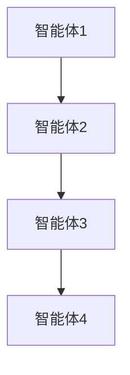
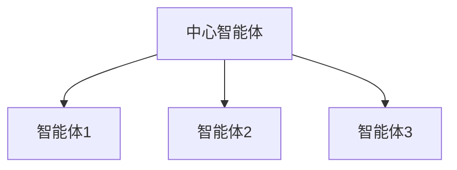
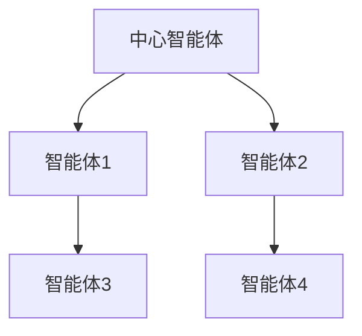
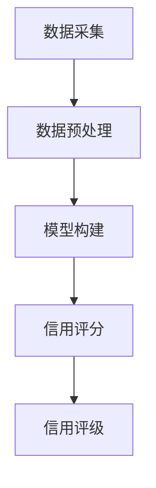
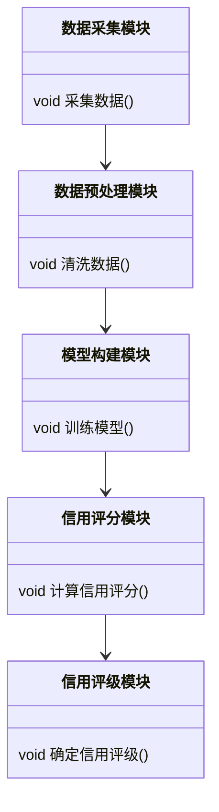
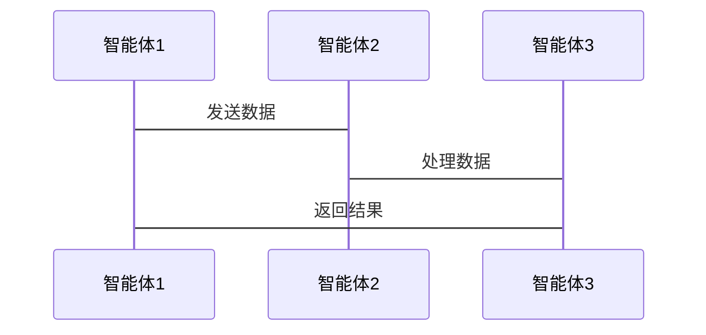

                 


# 利用多智能体系统进行全面的公司信用风险分析

---

## 关键词

- 多智能体系统 (Multi-Agent System)
- 信用风险分析 (Credit Risk Analysis)
- 分布式计算 (Distributed Computing)
- 人工智能 (Artificial Intelligence)
- 信用评分模型 (Credit Scoring Model)
- 供应链风险管理 (Supply Chain Risk Management)

---

## 摘要

随着全球经济的快速发展，信用风险分析在企业经营和金融市场中的重要性日益凸显。传统的信用风险分析方法往往依赖于单一的评分模型或集中式计算，难以应对复杂多变的市场环境。本文通过引入多智能体系统（Multi-Agent System，MAS），提出了一种全新的信用风险分析框架。该框架结合了多个智能体的分布式计算能力、协同学习机制以及实时数据处理的优势，能够更全面、更精准地评估企业的信用风险。文章详细探讨了多智能体系统的原理、信用风险分析的核心要素、多智能体系统在信用风险分析中的应用场景，以及基于多智能体系统的信用风险分析算法实现。通过实际案例分析，本文展示了如何利用多智能体系统提升信用风险分析的效率和准确性，为企业和金融机构提供了新的风险管理思路。

---

## 第1章: 多智能体系统与信用风险分析的背景

### 1.1 多智能体系统的定义与特点

#### 1.1.1 多智能体系统的定义

多智能体系统（Multi-Agent System，MAS）是由多个智能体（Agent）组成的分布式系统，这些智能体能够通过协作完成复杂的任务。智能体是指具有感知环境、自主决策和行动能力的实体，可以是软件程序、机器人或其他智能设备。

#### 1.1.2 多智能体系统的特征

| 特征 | 描述 |
|------|------|
| 分布式 | 智能体独立运行，通过通信协作完成任务 |
| 协作性 | 智能体之间通过信息共享和协同决策提高整体效率 |
| 自主性 | 每个智能体具有独立的决策能力和行动能力 |
| 反应性 | 智能体能够实时感知环境变化并做出响应 |

#### 1.1.3 多智能体系统的优势

1. **分布式计算能力**：能够处理大规模、复杂的数据和任务。
2. **协同学习**：多个智能体可以通过协作学习提高整体性能。
3. **容错性**：单个智能体的故障不会导致整个系统崩溃。

### 1.2 信用风险分析的定义与方法

#### 1.2.1 信用风险的定义

信用风险是指债务人在偿还债务过程中出现违约的可能性，通常与借款人的信用状况、市场环境和经济周期等因素密切相关。

#### 1.2.2 传统信用风险分析方法

1. **信用评分模型**：基于历史数据和统计方法对借款人进行信用评分。
2. **信用评级系统**：通过专业机构对企业的信用状况进行评级。

#### 1.2.3 多智能体系统在信用风险分析中的应用潜力

1. **分布式数据处理**：多智能体系统可以实时处理来自不同来源的数据。
2. **协同分析**：多个智能体可以通过协作提高信用风险分析的准确性和全面性。
3. **动态适应性**：多智能体系统能够快速响应市场环境的变化。

### 1.3 本章小结

本章介绍了多智能体系统的定义、特点及其在信用风险分析中的应用潜力。多智能体系统的分布式计算能力和协同学习机制为信用风险分析提供了新的思路，尤其是在处理复杂、动态的信用风险问题时，具有显著优势。

---

## 第2章: 多智能体系统的核心原理

### 2.1 多智能体系统的体系结构

#### 2.1.1 分布式智能体结构

在分布式智能体结构中，每个智能体都是独立的，具有自主决策能力。智能体之间通过通信协议进行信息共享和协作。



#### 2.1.2 集中式智能体结构

集中式智能体结构中，有一个中心智能体负责协调和管理其他智能体的活动。



#### 2.1.3 混合式智能体结构

混合式智能体结构结合了分布式和集中式结构的优点，适用于复杂任务的处理。



### 2.2 智能体之间的通信与协作

#### 2.2.1 智能体通信协议

智能体之间的通信需要遵循一定的协议，例如使用消息队列（Message Queue）或发布-订阅模式（Publish-Subscribe）。

#### 2.2.2 智能体协作机制

协作机制包括任务分配、信息共享和结果汇总。例如，任务分配可以通过中心智能体将任务分配给不同的智能体。

#### 2.2.3 智能体间的冲突解决

冲突解决可以通过协商机制或仲裁机制实现，例如使用协商算法（Negotiation Algorithm）。

### 2.3 多智能体系统的算法基础

#### 2.3.1 分布式计算算法

分布式计算算法包括分布式搜索算法（如分布式广度优先搜索）、分布式排序算法等。

#### 2.3.2 协作学习算法

协作学习算法包括分布式机器学习算法（如分布式随机梯度下降）和分布式聚类算法。

#### 2.3.3 跨组织协同算法

跨组织协同算法包括分布式事务管理算法和分布式共识算法（如拜占庭容错算法）。

---

## 第3章: 信用风险分析的核心要素

### 3.1 信用风险分析的关键指标

#### 3.1.1 财务指标分析

财务指标包括资产负债率、净利润率、流动比率等。

#### 3.1.2 非财务指标分析

非财务指标包括管理团队稳定性、市场竞争力、行业风险等。

#### 3.1.3 市场风险因素

市场风险因素包括宏观经济波动、行业周期性变化等。

### 3.2 信用评分模型

#### 3.2.1 传统信用评分模型

传统信用评分模型包括线性回归模型、逻辑回归模型等。

#### 3.2.2 基于机器学习的信用评分模型

基于机器学习的信用评分模型包括支持向量机（SVM）、随机森林（Random Forest）和深度学习模型（如神经网络）。

#### 3.2.3 多智能体系统在信用评分中的应用

多智能体系统可以通过分布式计算和协同学习提高信用评分模型的准确性和效率。

### 3.3 信用评级系统

#### 3.3.1 信用评级的定义与分类

信用评级是根据企业的信用状况进行的等级划分，通常分为AAA、AA、A、BBB、BB、B、CCC、CC、C和D级。

#### 3.3.2 信用评级的影响因素

影响信用评级的主要因素包括企业的财务状况、管理水平、行业风险和外部环境。

#### 3.3.3 多智能体系统在信用评级中的优势

多智能体系统可以通过协同分析和实时数据处理提高信用评级的准确性和全面性。

---

## 第4章: 多智能体系统在信用风险分析中的应用场景

### 4.1 企业信用风险分析

#### 4.1.1 企业信用风险的多维度分析

企业信用风险分析需要考虑财务指标、非财务指标和市场风险因素。

#### 4.1.2 多智能体系统在企业信用评估中的应用

多智能体系统可以通过分布式计算和协同学习提高企业信用评估的效率和准确性。

### 4.2 供应链信用风险分析

#### 4.2.1 供应链中的信用风险

供应链中的信用风险主要来自供应商和客户的信用问题。

#### 4.2.2 多智能体系统在供应链信用管理中的应用

多智能体系统可以通过实时监控和协同分析提高供应链信用管理的效率。

### 4.3 金融市场的信用风险分析

#### 4.3.1 金融市场信用风险的复杂性

金融市场信用风险涉及多个参与者和多种风险因素。

#### 4.3.2 多智能体系统在金融信用风险分析中的应用

多智能体系统可以通过分布式计算和协同学习提高金融信用风险分析的效率和准确性。

---

## 第5章: 多智能体系统与信用风险分析的算法实现

### 5.1 信用风险分析的数学模型

#### 5.1.1 信用评分的数学模型

信用评分的数学模型可以表示为：

$$
\text{Score} = \beta_0 + \beta_1x_1 + \beta_2x_2 + \cdots + \beta_nx_n
$$

其中，$\beta_i$ 是回归系数，$x_i$ 是自变量。

#### 5.1.2 信用评级的数学模型

信用评级的数学模型可以表示为：

$$
\text{Rating} = f(x_1, x_2, \ldots, x_n)
$$

其中，$f$ 是一个分类函数。

### 5.2 多智能体系统的协同学习算法

#### 5.2.1 分布式机器学习算法

分布式机器学习算法包括分布式随机梯度下降（Distributed Stochastic Gradient Descent，DSGD）。

#### 5.2.2 跨智能体协同学习算法

跨智能体协同学习算法包括分布式聚类算法和分布式分类算法。

### 5.3 多智能体系统在信用风险分析中的流程



---

## 第6章: 系统架构设计与实现

### 6.1 系统功能设计

#### 6.1.1 功能模块划分

功能模块包括数据采集模块、数据预处理模块、模型构建模块、信用评分模块和信用评级模块。

#### 6.1.2 领域模型

领域模型是一个企业信用风险分析的类图，如下所示：



#### 6.1.3 系统架构设计

系统架构设计是一个基于多智能体系统的分布式架构，如下所示：


### 6.2 系统接口设计

系统接口设计包括数据接口、模型接口和结果接口。

### 6.3 系统交互设计

系统交互设计是一个基于多智能体系统的交互流程，如下所示：



---

## 第7章: 项目实战

### 7.1 环境安装

需要安装以下环境：

1. Python 3.8+
2. numpy
3. pandas
4. scikit-learn
5. multiprocessing库

### 7.2 核心实现

#### 7.2.1 数据采集与预处理

```python
import multiprocessing

def collect_data():
    # 数据采集逻辑
    pass

def preprocess_data():
    # 数据预处理逻辑
    pass

if __name__ == '__main__':
    import multiprocessing
    p = multiprocessing.Process(target=collect_data)
    p.start()
    p.join()
    preprocess_data()
```

#### 7.2.2 模型构建与评分

```python
import multiprocessing

def train_model():
    # 模型训练逻辑
    pass

def calculate_credit_score():
    # 信用评分计算逻辑
    pass

if __name__ == '__main__':
    p = multiprocessing.Process(target=train_model)
    p.start()
    p.join()
    calculate_credit_score()
```

#### 7.2.3 信用评级

```python
import multiprocessing

def determine_credit_rating():
    # 信用评级逻辑
    pass

if __name__ == '__main__':
    p = multiprocessing.Process(target=determine_credit_rating)
    p.start()
    p.join()
```

### 7.3 实际案例分析

通过实际案例分析，验证多智能体系统在信用风险分析中的有效性。

---

## 第8章: 总结与展望

### 8.1 本章总结

本文通过引入多智能体系统，提出了一种全新的信用风险分析框架。该框架结合了多智能体系统的分布式计算能力和协同学习机制，能够更全面、更精准地评估企业的信用风险。

### 8.2 展望

未来的研究方向包括：

1. **多智能体系统的优化**：进一步优化多智能体系统的通信和协作机制。
2. **信用风险分析的深度学习**：将深度学习技术引入信用风险分析，提高模型的准确性和鲁棒性。
3. **多智能体系统的应用拓展**：将多智能体系统应用于更多的金融领域，如股票交易、风险管理等。

---

## 参考文献

（此处列出参考文献）

---

## 附录

（此处列出附录内容）

---

以上是《利用多智能体系统进行全面的公司信用风险分析》的技术博客文章的完整目录大纲和详细内容。

