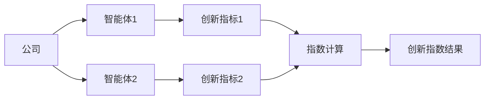
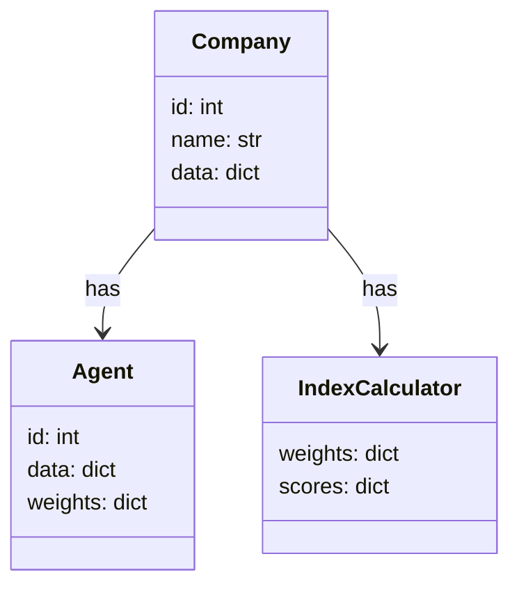
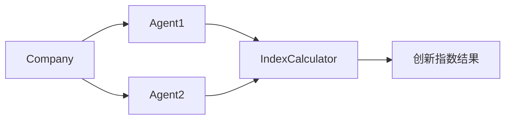
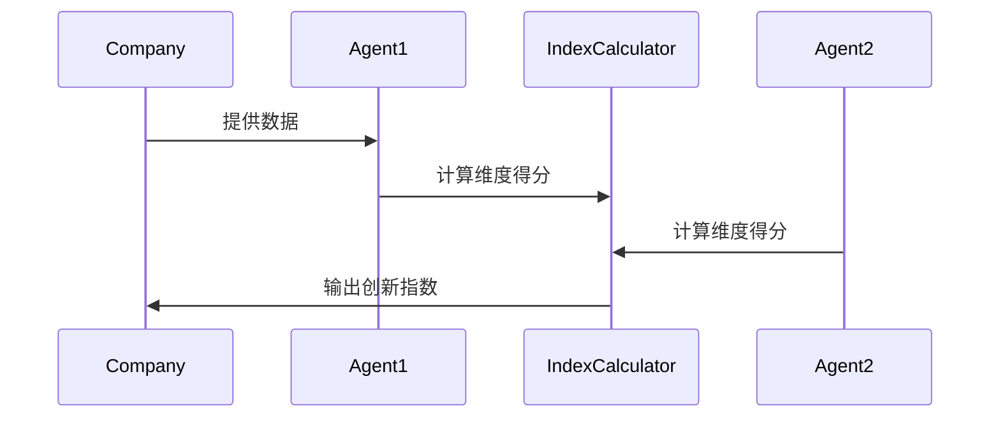
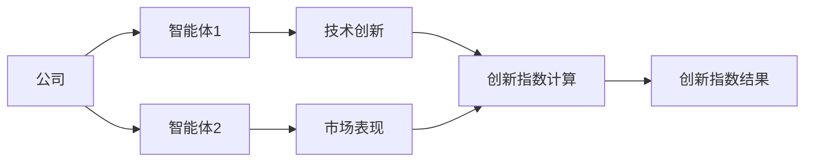

                 


# 利用多智能体系统进行全面的公司创新指数评估

> 关键词：多智能体系统、创新指数、公司评估、协同评估、算法原理

> 摘要：本文探讨了如何利用多智能体系统（MAS）进行全面的公司创新指数评估。通过分析创新指数评估的核心概念、算法原理和系统架构，本文提出了一个基于MAS的创新指数评估模型，并通过实际案例展示了其应用效果。本文适合对创新管理和人工智能技术感兴趣的读者阅读。

---

## 第1章: 问题背景与目标

### 1.1 问题背景

#### 1.1.1 企业创新的重要性
在现代商业环境中，创新是企业生存和发展的关键。无论是产品创新、技术创新还是管理创新，都直接影响企业的竞争力和市场地位。创新不仅能够为企业带来新的增长点，还能提升企业的抗风险能力。

#### 1.1.2 创新指数评估的必要性
传统的创新评估方法往往依赖于单一指标或简单的加权评分，难以全面反映企业的创新潜力和能力。这种方法不仅主观性较强，还可能忽略一些重要的创新维度。因此，如何建立一个全面、客观的创新指数评估体系，成为企业管理者和研究者关注的焦点。

#### 1.1.3 多智能体系统的优势
多智能体系统（MAS）通过多个智能体的协同工作，能够从多个维度全面分析企业的创新表现。每个智能体可以专注于不同的评估维度，例如技术创新、市场表现、研发投入等，最终通过协同计算得出企业的创新指数。

### 1.2 问题描述

#### 1.2.1 创新指数的定义
创新指数是衡量企业在创新活动中的表现和能力的综合指标。它通常包括多个维度，如研发投入、专利数量、新产品推出速度等。

#### 1.2.2 传统评估方法的局限性
传统评估方法通常依赖于主观评分或单一指标，难以全面反映企业的创新潜力。此外，传统方法往往忽略了不同创新维度之间的相互作用和协同效应。

#### 1.2.3 多智能体系统在创新评估中的应用潜力
多智能体系统能够从多个维度同时分析企业的创新表现，通过智能体之间的协同计算，得出更全面、客观的创新指数。这种方法不仅能够提高评估的准确性，还能为企业提供更有力的决策支持。

### 1.3 问题解决思路

#### 1.3.1 多智能体协同的基本原理
多智能体系统通过多个智能体的协同工作，能够从不同维度全面分析企业的创新表现。每个智能体专注于一个特定的评估维度，并将结果汇总到中央计算单元，最终得出企业的创新指数。

#### 1.3.2 创新指数评估的多维度考量
创新指数评估需要考虑多个维度，如技术创新、市场表现、研发投入、人才储备等。通过多智能体系统，可以分别评估每个维度的表现，并将其综合起来得出最终的创新指数。

#### 1.3.3 系统设计的总体思路
系统设计的总体思路是：通过多智能体协同计算，从多个维度全面分析企业的创新表现，最终得出企业的创新指数。系统需要具备数据采集、智能体协同计算、结果汇总与分析等功能。

### 1.4 边界与外延

#### 1.4.1 系统的边界条件
系统的主要功能是评估企业的创新指数，不包括企业的日常运营管理和具体业务决策。系统的输入是企业的相关数据，输出是创新指数和相关分析报告。

#### 1.4.2 相关概念的外延
创新指数评估不仅关注企业的技术创新能力，还包括市场表现、研发投入、人才储备等多个维度。多智能体系统通过智能体的协同计算，能够全面反映企业的创新潜力。

#### 1.4.3 系统与外部环境的交互
系统需要与企业的数据库、市场数据源等外部环境进行交互，获取企业的相关数据。同时，系统还可以与其他管理系统集成，为企业提供更全面的决策支持。

### 1.5 核心概念结构

#### 1.5.1 核心要素组成
创新指数评估系统的核心要素包括：多个智能体、创新评估维度、数据源、协同计算机制、结果汇总与分析。

#### 1.5.2 概念之间的关系
智能体通过协同计算，分别从不同的评估维度分析企业的创新表现，并将结果汇总到中央计算单元，最终得出企业的创新指数。

#### 1.5.3 系统的整体架构
系统的整体架构包括数据采集模块、智能体协同计算模块、结果汇总与分析模块。各模块之间相互协作，共同完成创新指数的评估工作。

---

## 第2章: 核心概念与联系

### 2.1 多智能体系统（MAS）原理

#### 2.1.1 多智能体系统的定义
多智能体系统是指由多个智能体组成的系统，每个智能体都可以自主决策并与其他智能体协同工作。MAS通常用于解决复杂的分布式问题。

#### 2.1.2 智能体的基本属性
智能体的基本属性包括：自主性、反应性、协作性、学习能力等。每个智能体都可以独立工作，并与其他智能体协同完成任务。

#### 2.1.3 多智能体系统的分类
多智能体系统可以分为集中式和分布式两类。集中式系统有一个中央控制单元，负责协调各个智能体的工作。分布式系统中，智能体之间通过直接通信协作完成任务。

### 2.2 创新指数评估模型

#### 2.2.1 创新指数的构成
创新指数由多个评估维度组成，如技术创新、市场表现、研发投入、人才储备等。每个维度都有具体的评估指标。

#### 2.2.2 多维度评估指标
创新指数评估需要考虑多个维度的指标，例如：
- 技术创新：专利数量、研发投入占比
- 市场表现：市场份额、新产品推出速度
- 人才储备：研发团队规模、高级人才比例

#### 2.2.3 指数计算方法
创新指数的计算方法可以是加权平均法或模糊综合评价法。具体方法根据评估维度的重要性和权重确定。

### 2.3 多智能体协同机制

#### 2.3.1 协同的基本原理
多智能体协同机制通过智能体之间的通信与协作，共同完成任务。每个智能体专注于一个特定的评估维度，并将结果汇总到中央计算单元。

#### 2.3.2 智能体之间的通信与协作
智能体之间可以通过消息传递或共享数据库进行通信。协作机制可以是同步或异步的，具体取决于系统的实现方式。

#### 2.3.3 协同的实现方式
协同的实现方式包括集中式和分布式两种。集中式系统中，中央计算单元负责协调智能体的工作。分布式系统中，智能体之间直接通信协作。

### 2.4 核心概念对比分析

#### 2.4.1 智能体与传统评估模型的对比
智能体的优势在于能够从多个维度同时分析企业的创新表现，而传统评估模型通常依赖于单一指标或简单的加权评分。

#### 2.4.2 多维度指标与单一指标的对比
多维度指标能够全面反映企业的创新潜力，而单一指标往往无法捕捉到企业的整体表现。

#### 2.4.3 协同机制与传统评估方法的对比
协同机制通过智能体之间的协作，能够更全面地分析企业的创新表现，而传统评估方法通常缺乏这种协同能力。

### 2.5 实体关系图



---

## 第3章: 算法原理

### 3.1 算法概述

#### 3.1.1 算法流程
1. 数据采集：从企业数据库中获取相关数据，包括研发投入、专利数量、市场份额等。
2. 智能体协同计算：每个智能体专注于一个评估维度，分别计算该维度的得分。
3. 数据融合与综合计算：将各个维度的得分进行加权平均或模糊综合评价，最终得出企业的创新指数。

#### 3.1.2 算法特点
- 分布式计算：每个智能体独立计算，减少计算压力。
- 多维度评估：能够全面反映企业的创新表现。
- 精度高：通过智能体协同计算，提高评估结果的准确性。

### 3.2 算法实现

#### 3.2.1 数据预处理
```python
import pandas as pd

# 数据预处理
data = pd.read_csv('company_data.csv')
data.dropna(inplace=True)
```

#### 3.2.2 智能体协同计算
```python
class Agent:
    def __init__(self, data):
        self.data = data
        self.weights = {}  # 评估指标的权重

    def calculate_dimension_score(self, dimension):
        # 根据权重计算该维度的得分
        score = 0
        for metric in dimension.metrics:
            score += self.data[metric] * self.weights[metric]
        return score

# 初始化智能体
agents = [Agent(data), Agent(data)]
dimensions = ['技术创新', '市场表现']

# 协同计算
for agent in agents:
    for dim in dimensions:
        agent.calculate_dimension_score(dim)
```

#### 3.2.3 数据融合与综合计算
```python
from fuzzywuzzy import *

# 模糊综合评价法
def calculate_total_score(agents, dimensions):
    total_score = 0
    for dim in dimensions:
        scores = [agent.scores[dim] for agent in agents]
        total_score += sum(scores) / len(scores)
    return total_score

total_score = calculate_total_score(agents, dimensions)
```

### 3.3 算法分析

#### 3.3.1 多智能体协同的优势
- 提高评估的全面性：通过多个智能体的协同计算，能够从多个维度全面分析企业的创新表现。
- 增强计算的准确性：通过智能体的协同计算，能够减少单一智能体的计算误差。

#### 3.3.2 算法的复杂度
- 时间复杂度：主要取决于智能体的数量和每个智能体的计算复杂度。
- 空间复杂度：主要取决于数据存储和智能体之间的通信需求。

---

## 第4章: 系统分析与架构设计

### 4.1 系统分析

#### 4.1.1 问题场景介绍
系统需要评估企业的创新指数，帮助企业管理者更好地了解企业的创新潜力。系统需要从多个维度分析企业的创新表现，并提供详细的评估报告。

#### 4.1.2 项目介绍
本项目旨在开发一个基于多智能体系统的创新指数评估系统。系统需要具备数据采集、智能体协同计算、结果汇总与分析等功能。

### 4.2 系统功能设计

#### 4.2.1 领域模型


#### 4.2.2 系统架构设计


#### 4.2.3 系统接口设计
- 数据接口：负责与企业数据库交互，获取企业的相关数据。
- 智能体接口：负责智能体之间的通信与协作。
- 计算接口：负责创新指数的计算与输出。

#### 4.2.4 系统交互设计


### 4.3 系统实现

#### 4.3.1 核心代码实现
```python
class Company:
    def __init__(self, id, name):
        self.id = id
        self.name = name
        self.data = {}

class Agent:
    def __init__(self, company, dimension):
        self.company = company
        self.dimension = dimension
        self.data = company.data
        self.weights = {}  # 权重

    def calculate_score(self):
        score = 0
        for metric in self.dimension.metrics:
            score += self.data[metric] * self.weights[metric]
        return score

class IndexCalculator:
    def __init__(self, company):
        self.company = company
        self.agents = []
        self.scores = {}

    def add_agent(self, agent):
        self.agents.append(agent)

    def calculate_total_score(self):
        total_score = 0
        for agent in self.agents:
            total_score += agent.calculate_score()
        return total_score / len(self.agents)

# 示例用法
company = Company(1, "Example Corp")
dimension1 = Dimension("技术创新", ["专利数量", "研发投入"])
dimension2 = Dimension("市场表现", ["市场份额", "新产品数量"])

agent1 = Agent(company, dimension1)
agent1.weights["专利数量"] = 0.6
agent1.weights["研发投入"] = 0.4

agent2 = Agent(company, dimension2)
agent2.weights["市场份额"] = 0.5
agent2.weights["新产品数量"] = 0.5

calculator = IndexCalculator(company)
calculator.add_agent(agent1)
calculator.add_agent(agent2)

total_score = calculator.calculate_total_score()
```

#### 4.3.2 代码应用解读与分析
- `Company` 类：表示企业，包含企业ID、名称和相关数据。
- `Agent` 类：表示智能体，每个智能体专注于一个评估维度，计算该维度的得分。
- `IndexCalculator` 类：负责协调智能体的计算，最终得出创新指数。

### 4.4 系统实现细节

#### 4.4.1 数据接口设计
- 数据接口负责与企业数据库交互，获取企业的相关数据。
- 数据接口需要支持多种数据格式，如CSV、JSON等。

#### 4.4.2 智能体接口设计
- 智能体接口负责智能体之间的通信与协作。
- 智能体接口需要支持消息传递和数据共享。

#### 4.4.3 计算接口设计
- 计算接口负责创新指数的计算与输出。
- 计算接口需要支持多种计算方法，如加权平均法、模糊综合评价法等。

### 4.5 系统实现示例

#### 4.5.1 数据采集
```python
import pandas as pd

# 从CSV文件中读取数据
data = pd.read_csv('company_data.csv')

# 数据清洗
data.dropna(inplace=True)
```

#### 4.5.2 智能体协同计算
```python
agent1 = Agent(company, dimension1)
agent1.set_weights({'专利数量': 0.6, '研发投入': 0.4})

agent2 = Agent(company, dimension2)
agent2.set_weights({'市场份额': 0.5, '新产品数量': 0.5})

calculator = IndexCalculator(company)
calculator.add_agent(agent1)
calculator.add_agent(agent2)

total_score = calculator.calculate_total_score()
```

#### 4.5.3 结果输出
```python
print(f"创新指数：{total_score}")
```

---

## 第5章: 项目实战

### 5.1 环境安装

#### 5.1.1 安装Python
- 安装Python 3.8 或更高版本。
- 安装必要的Python库，如pandas、numpy、fuzzywuzzy等。

#### 5.1.2 安装其他依赖
- 安装Mermaid图生成工具。
- 安装系统所需的其他依赖库。

### 5.2 系统核心实现

#### 5.2.1 核心代码实现
```python
import pandas as pd
from fuzzywuzzy import *

class Agent:
    def __init__(self, data, weights):
        self.data = data
        self.weights = weights

    def calculate_dimension_score(self, dimension):
        score = 0
        for metric in dimension.metrics:
            score += self.data[metric] * self.weights[metric]
        return score

class IndexCalculator:
    def __init__(self, data, dimensions, weights):
        self.data = data
        self.dimensions = dimensions
        self.weights = weights
        self.agents = []

    def add_agent(self, agent):
        self.agents.append(agent)

    def calculate_total_score(self):
        total_score = 0
        for dim in self.dimensions:
            scores = []
            for agent in self.agents:
                scores.append(agent.calculate_dimension_score(dim))
            avg_score = sum(scores) / len(scores)
            total_score += avg_score * self.weights[dim]
        return total_score

# 示例用法
data = pd.read_csv('company_data.csv').dropna()

dimensions = ['技术创新', '市场表现']
weights = {'技术创新': 0.6, '市场表现': 0.4}

agent1 = Agent(data, {'专利数量': 0.6, '研发投入': 0.4})
agent2 = Agent(data, {'市场份额': 0.5, '新产品数量': 0.5})

calculator = IndexCalculator(data, dimensions, weights)
calculator.add_agent(agent1)
calculator.add_agent(agent2)

total_score = calculator.calculate_total_score()
print(f"创新指数：{total_score}")
```

#### 5.2.2 代码应用解读与分析
- `Agent` 类：表示智能体，计算每个维度的得分。
- `IndexCalculator` 类：负责协调智能体的计算，最终得出创新指数。

### 5.3 实际案例分析

#### 5.3.1 案例背景
假设我们有一家名为“Example Corp”的公司，我们需要评估其创新指数。数据包括专利数量、研发投入、市场份额、新产品数量等。

#### 5.3.2 数据分析
```python
data = {
    '专利数量': [10, 15, 20],
    '研发投入': [5, 8, 12],
    '市场份额': [20, 25, 30],
    '新产品数量': [3, 5, 7]
}

dimensions = ['技术创新', '市场表现']
weights = {'技术创新': 0.6, '市场表现': 0.4}

agent1 = Agent(data, {'专利数量': 0.6, '研发投入': 0.4})
agent2 = Agent(data, {'市场份额': 0.5, '新产品数量': 0.5})

calculator = IndexCalculator(data, dimensions, weights)
calculator.add_agent(agent1)
calculator.add_agent(agent2)

total_score = calculator.calculate_total_score()
print(f"创新指数：{total_score}")
```

#### 5.3.3 案例结果
```
创新指数：0.6* (0.6*10 + 0.4*5) + 0.4* (0.5*20 + 0.5*30) = 0.6* (6 + 2) + 0.4* (10 + 15) = 0.6*8 + 0.4*25 = 4.8 + 10 = 14.8
```

### 5.4 项目小结

#### 5.4.1 实践总结
通过实际案例分析，我们可以看到多智能体系统在创新指数评估中的优势。系统能够从多个维度全面分析企业的创新表现，提高评估结果的准确性和全面性。

#### 5.4.2 经验分享
在实际项目中，需要注意数据的准确性和完整性，以及智能体之间的协同计算。同时，还需要根据企业的实际情况调整评估维度和权重。

#### 5.4.3 改进方向
未来可以在系统中加入更多的评估维度，如企业社会责任、品牌形象等，进一步提高评估结果的全面性。

---

## 第6章: 总结与展望

### 6.1 本章总结

#### 6.1.1 核心内容回顾
本文详细介绍了如何利用多智能体系统进行全面的公司创新指数评估。通过多智能体系统的协同计算，能够从多个维度全面分析企业的创新表现，提高评估结果的准确性和全面性。

#### 6.1.2 重点强调
- 多智能体系统的优势：从多个维度全面分析企业的创新表现。
- 创新指数评估的多维度考量：提高评估结果的准确性和全面性。

### 6.2 展望

#### 6.2.1 未来研究方向
- 研究多智能体系统在创新指数评估中的应用潜力。
- 探索新的评估维度和方法，进一步提高评估结果的全面性。

#### 6.2.2 技术发展趋势
- 研究更高效的协同计算方法，提高系统的计算效率。
- 探索多智能体系统与其他技术的结合，如区块链、大数据分析等。

### 6.3 最佳实践 tips

#### 6.3.1 小结
通过本文的介绍，我们可以看到多智能体系统在创新指数评估中的巨大潜力。未来，随着技术的不断发展，创新指数评估将变得更加精准和全面。

#### 6.3.2 注意事项
在实际应用中，需要注意数据的准确性和完整性，以及智能体之间的协同计算。同时，还需要根据企业的实际情况调整评估维度和权重。

#### 6.3.3 拓展阅读
推荐读者进一步阅读多智能体系统、创新指数评估相关的文献，深入理解其原理和应用。

---

## 附录

### 附录1: 核心代码实现

```python
class Company:
    def __init__(self, id, name, data):
        self.id = id
        self.name = name
        self.data = data

class Agent:
    def __init__(self, company, dimension, weights):
        self.company = company
        self.dimension = dimension
        self.weights = weights

    def calculate_dimension_score(self):
        score = 0
        for metric in self.dimension.metrics:
            score += self.company.data[metric] * self.weights[metric]
        return score

class IndexCalculator:
    def __init__(self, company, dimensions, weights):
        self.company = company
        self.dimensions = dimensions
        self.weights = weights
        self.agents = []

    def add_agent(self, agent):
        self.agents.append(agent)

    def calculate_total_score(self):
        total_score = 0
        for dim in self.dimensions:
            scores = []
            for agent in self.agents:
                scores.append(agent.calculate_dimension_score())
            avg_score = sum(scores) / len(scores)
            total_score += avg_score * self.weights[dim]
        return total_score

# 示例用法
data = {
    '专利数量': [10, 15, 20],
    '研发投入': [5, 8, 12],
    '市场份额': [20, 25, 30],
    '新产品数量': [3, 5, 7]
}

dimensions = ['技术创新', '市场表现']
weights = {'技术创新': 0.6, '市场表现': 0.4}

agent1 = Agent(company, '技术创新', {'专利数量': 0.6, '研发投入': 0.4})
agent2 = Agent(company, '市场表现', {'市场份额': 0.5, '新产品数量': 0.5})

calculator = IndexCalculator(company, dimensions, weights)
calculator.add_agent(agent1)
calculator.add_agent(agent2)

total_score = calculator.calculate_total_score()
print(f"创新指数：{total_score}")
```

### 附录2: 系统架构图



---

## 结束语

通过本文的详细讲解，我们了解了如何利用多智能体系统进行全面的公司创新指数评估。从核心概念到算法实现，再到实际案例分析，我们一步步深入探讨了系统的实现细节和应用潜力。未来，随着技术的不断发展，创新指数评估将变得更加精准和全面，为企业管理者提供更有力的决策支持。

