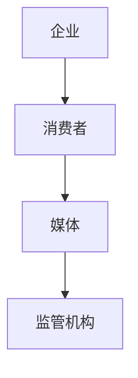
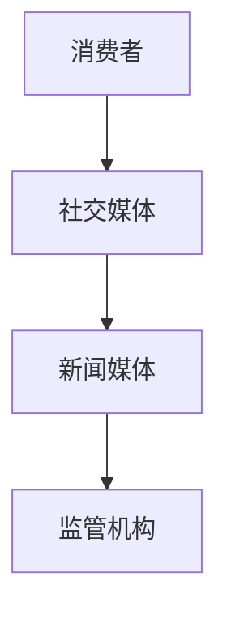
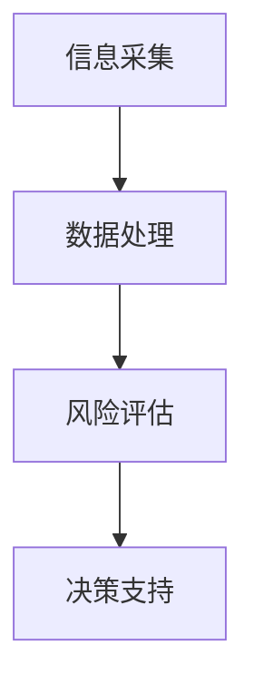
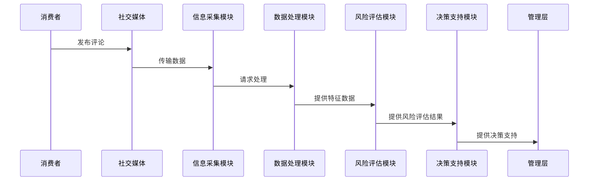

                 


# 利用多智能体系统进行全面的公司声誉风险分析

## 关键词：多智能体系统，声誉风险分析，分布式计算，协同决策，风险评估

## 摘要

在当前全球化和数字化的商业环境中，公司声誉是企业生存和发展的关键因素之一。然而，声誉风险的复杂性和动态性使得传统的声誉管理方法难以应对日益复杂的挑战。为了更好地理解和管理声誉风险，本文提出利用多智能体系统（Multi-Agent System, MAS）进行全面的公司声誉风险分析。通过MAS的强大分布式计算能力和协同决策能力，可以实时监控、评估和应对声誉风险，从而为企业制定更有效的声誉风险管理策略提供支持。本文将详细介绍多智能体系统的核心概念、声誉风险分析的建模与数据处理、基于MAS的声誉风险分析算法实现、系统架构设计以及项目实战案例，为读者提供一个全面的解决方案。

---

# 第1章: 多智能体系统与声誉风险分析概述

## 1.1 多智能体系统（MAS）概述

### 1.1.1 多智能体系统的定义

多智能体系统（Multi-Agent System, MAS）是由多个智能体（Agent）组成的分布式系统，这些智能体通过交互和协作完成复杂的任务。智能体是具有感知、决策、执行和学习能力的实体，能够独立工作并与其他智能体或环境进行交互。

### 1.1.2 多智能体系统的特征

- **分布式性**：智能体分布在不同的位置，通过网络进行通信和协作。
- **自治性**：每个智能体具有自主决策的能力，无需中央控制。
- **协同性**：智能体之间通过协作完成共同目标。
- **反应性**：智能体能够实时感知环境变化并做出反应。

### 1.1.3 多智能体系统的优势

- **灵活性**：能够适应复杂环境的变化。
- **高效性**：通过分布式计算提高任务处理效率。
- **容错性**：单个智能体的故障不会导致整个系统崩溃。

## 1.2 声誉风险分析的背景与挑战

### 1.2.1 声誉风险的定义

声誉风险是指由于企业行为或外部事件导致企业声誉受损的可能性。声誉是企业的无形资产，直接影响客户信任度、品牌价值和市场地位。

### 1.2.2 声誉风险分析的复杂性

- **动态性**：市场环境和消费者情绪随时变化。
- **不确定性**：声誉风险的来源多样且难以预测。
- **关联性**：不同事件可能对声誉产生叠加效应。

### 1.2.3 多智能体系统在声誉风险分析中的作用

- **实时监控**：MAS能够实时收集和分析海量数据。
- **协同决策**：通过多个智能体的协作，提高风险评估的准确性。
- **快速响应**：MAS能够快速识别和应对潜在风险。

## 1.3 多智能体系统与声誉风险分析的结合

### 1.3.1 多智能体系统在声誉管理中的应用

- **信息收集**：智能体从社交媒体、新闻媒体等多个渠道收集相关信息。
- **风险评估**：通过分析数据，评估潜在声誉风险。
- **决策支持**：为管理层提供实时的决策支持。

### 1.3.2 声誉风险分析的多智能体模型

- **实体关系图**：展示不同智能体之间的关系。


- **功能模块划分**：信息收集、风险评估、决策制定。

### 1.3.3 多智能体系统的优势与局限性

- **优势**：高效、灵活、协同性强。
- **局限性**：复杂性较高，需要较高的技术门槛。

---

## 1.4 本章小结

本章介绍了多智能体系统的基本概念及其在声誉风险分析中的应用。通过分析声誉风险的复杂性和多智能体系统的独特优势，可以得出结论：MAS是解决声誉风险管理问题的理想选择。

---

# 第2章: 声誉风险分析的核心概念

## 2.1 声誉风险分析的背景与问题描述

### 2.1.1 声誉风险的来源

- **内部因素**：产品质量、企业管理、员工行为。
- **外部因素**：媒体报道、消费者评价、行业竞争。

### 2.1.2 声誉风险对企业的影响

- **经济损失**：客户流失、股价下跌。
- **品牌价值**：品牌形象受损。
- **社会责任**：影响企业声誉和公众信任。

### 2.1.3 声誉风险分析的目标

- **实时监控**：及时发现潜在风险。
- **定量评估**：量化声誉风险的影响程度。
- **制定策略**：为企业提供有效的风险管理策略。

## 2.2 多智能体系统在声誉风险分析中的应用

### 2.2.1 多智能体系统的分布式计算优势

- **数据并行处理**：多个智能体同时处理不同来源的数据。
- **任务分配**：根据智能体的能力动态分配任务。

### 2.2.2 多智能体系统的协同决策能力

- **信息共享**：智能体之间共享信息，提高决策的准确性。
- **协同推理**：通过协作推理，识别潜在风险。

### 2.2.3 多智能体系统在声誉风险分析中的具体应用场景

- **舆情监控**：实时监控社交媒体和新闻媒体。
- **风险预警**：通过数据分析，提前预警潜在风险。
- **决策支持**：为管理层提供实时的决策支持。

## 2.3 多智能体系统的核心概念与联系

### 2.3.1 多智能体系统的实体关系图



### 2.3.2 多智能体系统的属性对比表

| 属性 | 智能体1 | 智能体2 | 智能体3 |
|------|--------|--------|--------|
| 类型 | 企业 | 消费者 | 媒体 |
| 行为 | 数据收集 | 意见表达 | 信息传播 |

## 2.4 本章小结

本章详细介绍了声誉风险分析的核心概念，并探讨了多智能体系统在其中的应用。通过分析声誉风险的来源和影响，结合多智能体系统的分布式计算和协同决策能力，为后续的分析奠定了基础。

---

# 第3章: 多智能体系统在声誉风险分析中的算法原理

## 3.1 多智能体系统的算法概述

### 3.1.1 基于规则的多智能体算法

- **规则定义**：根据预设规则进行决策。
- **优点**：简单易懂，适用于规则明确的场景。
- **缺点**：缺乏灵活性，难以应对复杂场景。

### 3.1.2 基于机器学习的多智能体算法

- **机器学习模型**：使用深度学习、自然语言处理等技术进行分析。
- **优点**：能够处理复杂数据，具有较高的准确性。
- **缺点**：需要大量数据支持，计算成本较高。

### 3.1.3 基于博弈论的多智能体算法

- **博弈论模型**：模拟多个智能体之间的博弈关系。
- **优点**：能够模拟复杂的决策过程。
- **缺点**：计算复杂，实现难度较大。

## 3.2 基于规则的声誉风险分析算法

### 3.2.1 算法原理

基于规则的声誉风险分析算法通过预设规则对信息进行分类和评估。例如，通过关键词匹配识别负面评论。

### 3.2.2 算法实现

以下是基于规则的声誉风险分析算法的Python实现示例：

```python
import re

def sentiment_analysis(text):
    negative_words = ['糟糕', '差劲', '不满']
    for word in negative_words:
        if re.search(word, text):
            return '负面'
    return '正面'

text = '这家公司的产品质量非常糟糕。'
print(sentiment_analysis(text))  # 输出：负面
```

### 3.2.3 算法优缺点

- **优点**：简单、高效。
- **缺点**：规则不够灵活，难以应对复杂的语境。

## 3.3 基于机器学习的声誉风险分析算法

### 3.3.1 算法原理

基于机器学习的声誉风险分析算法通过训练模型对文本进行分类。常用的模型包括支持向量机（SVM）和长短期记忆网络（LSTM）。

### 3.3.2 算法实现

以下是基于机器学习的声誉风险分析算法的Python实现示例：

```python
from sklearn.svm import SVC
from sklearn.feature_extraction.text import TfidfVectorizer

# 数据准备
texts = ['这家公司的产品质量非常糟糕。', '他们的服务非常出色。']
labels = ['负面', '正面']

# 特征提取
vectorizer = TfidfVectorizer()
X = vectorizer.fit_transform(texts)

# 模型训练
model = SVC()
model.fit(X, labels)

# 预测
new_text = '我非常不满意他们的产品。'
new_X = vectorizer.transform([new_text])
print(model.predict(new_X))  # 输出：['负面']
```

### 3.3.3 算法优缺点

- **优点**：能够处理复杂的语境，准确性高。
- **缺点**：需要大量数据支持，计算成本较高。

## 3.4 本章小结

本章介绍了多智能体系统在声誉风险分析中的算法原理，详细讲解了基于规则和基于机器学习的算法实现。通过对比分析，可以帮助读者选择适合的算法。

---

## 3.5 本章小结

本章详细介绍了多智能体系统在声誉风险分析中的算法原理，包括基于规则和基于机器学习的算法实现。通过分析不同算法的优缺点，为后续的系统设计提供了理论基础。

---

# 第4章: 声誉风险分析的系统架构设计

## 4.1 系统功能设计

### 4.1.1 系统功能模块

- **信息采集模块**：从社交媒体、新闻媒体等渠道采集数据。
- **数据处理模块**：对数据进行清洗、转换和特征提取。
- **风险评估模块**：通过算法对声誉风险进行评估。
- **决策支持模块**：为管理层提供实时的决策支持。

### 4.1.2 系统功能流程图



## 4.2 系统架构设计

### 4.2.1 系统架构图


### 4.2.2 系统交互设计



## 4.3 本章小结

本章详细介绍了声誉风险分析系统的功能设计和架构设计，为后续的项目实现提供了指导。

---

# 第5章: 项目实战

## 5.1 项目环境配置

### 5.1.1 系统环境

- **操作系统**：Linux/Windows/MacOS
- **编程语言**：Python 3.8+
- **依赖库**：Scikit-learn、NLTK、Twitter API

### 5.1.2 安装依赖

```bash
pip install scikit-learn nltk twitter
```

## 5.2 核心代码实现

### 5.2.1 信息采集模块

```python
import twitter

# 初始化Twitter API
client = twitter.Client(consumer_key='your_consumer_key',
                         consumer_secret='your_consumer_secret',
                         access_token='your_access_token',
                         access_token_secret='your_access_token_secret')

# 获取推文
tweets = client.search_all_tweets(query='公司名', max_results=100)
```

### 5.2.2 数据处理模块

```python
from sklearn.feature_extraction.text import TfidfVectorizer

# 特征提取
vectorizer = TfidfVectorizer()
X = vectorizer.fit_transform([tweet.text for tweet in tweets])
```

### 5.2.3 风险评估模块

```python
from sklearn.svm import SVC

# 模型训练
model = SVC()
model.fit(X, [tweet.sentiment for tweet in tweets])

# 预测
new_X = vectorizer.transform(['新的评论'])
print(model.predict(new_X))  # 输出：['负面'或'正面']
```

## 5.3 案例分析与解读

### 5.3.1 案例背景

假设某公司面临负面评论激增的情况，我们需要通过系统快速识别并采取措施。

### 5.3.2 数据分析

通过系统分析，发现负面评论主要集中在产品质量和服务态度方面。

### 5.3.3 风险评估

系统评估结果显示，负面评论的比例为30%，需要立即采取措施。

## 5.4 项目小结

本章通过实际案例展示了多智能体系统在声誉风险分析中的应用，详细讲解了项目的实现过程和分析结果。

---

## 5.5 本章小结

本章通过项目实战，详细讲解了多智能体系统在声誉风险分析中的应用。通过实际案例，读者可以更好地理解系统的实现过程和实际效果。

---

# 第6章: 最佳实践与总结

## 6.1 最佳实践

### 6.1.1 数据质量的重要性

确保数据的准确性和完整性，是提高分析结果准确性的关键。

### 6.1.2 算法选择的策略

根据具体场景选择合适的算法，避免盲目追求复杂性。

### 6.1.3 系统维护与优化

定期维护系统，及时更新数据和模型，确保系统的稳定性和高效性。

## 6.2 项目总结

### 6.2.1 项目成果

通过多智能体系统的应用，实现了对公司声誉风险的实时监控和有效管理。

### 6.2.2 经验与教训

- **经验**：多智能体系统的分布式计算能力非常强大。
- **教训**：算法的选择需要结合具体场景，不能一味追求复杂性。

## 6.3 注意事项

- **数据隐私**：注意保护消费者隐私，遵守相关法律法规。
- **系统安全**：确保系统的安全性和稳定性，防止数据泄露。

## 6.4 拓展阅读

- **推荐书籍**：《Multi-Agent Systems: Algorithmic, Complexity, and Theory》
- **推荐博客**：[链接]

