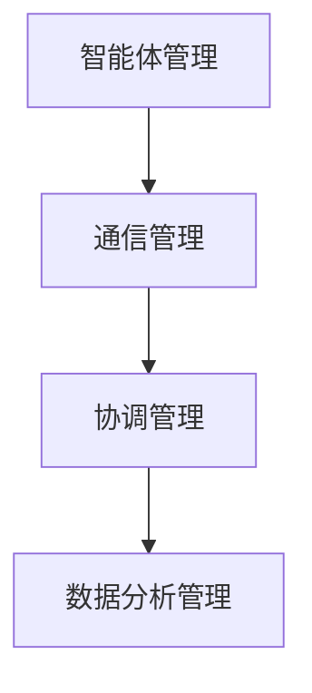
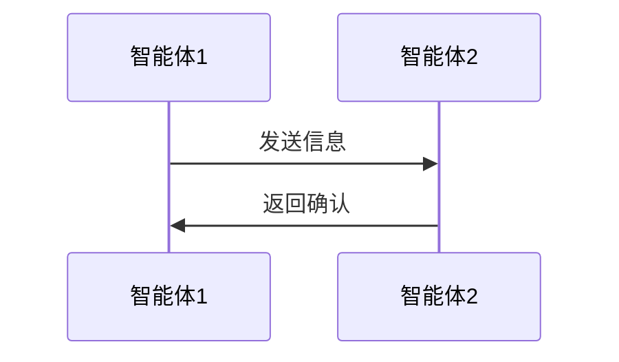

                 


# 利用多智能体系统进行全面的公司战略执行力分析

> 关键词：多智能体系统，公司战略，执行力分析，分布式计算，一致性算法，强化学习

> 摘要：本文将探讨如何利用多智能体系统进行公司战略执行力的全面分析。通过结合人工智能和分布式计算的原理，分析多智能体系统在公司战略执行中的应用，提出一种基于多智能体系统的战略执行力分析框架，包括智能体的设计、通信机制、协调算法、数学模型和实际应用案例。

---

# 第1章 多智能体系统与公司战略执行力概述

## 1.1 多智能体系统的基本概念

### 1.1.1 多智能体系统的定义

多智能体系统（Multi-Agent System, MAS）是由多个相互作用的智能体组成的分布式系统，这些智能体能够通过感知环境、协作和通信来完成复杂任务。多智能体系统的核心在于智能体之间的协同与竞争，以及系统的整体目标实现。

### 1.1.2 多智能体系统的特征

- **分布式性**：系统中的智能体分布在网络中，每个智能体负责部分任务。
- **协作性**：智能体之间需要通过通信和协调完成共同目标。
- **反应性**：智能体能够实时感知环境变化并做出反应。
- **自主性**：智能体在没有中央控制的情况下自主决策。

### 1.1.3 多智能体系统的分类

1. **基于任务的分类**：
   - 数据处理型：用于数据采集、处理和分析。
   - 任务分配型：用于任务分配和资源管理。
   - 协作决策型：用于群体决策和协作行动。
2. **基于智能体结构的分类**：
   - 简单反射型：基于规则的简单反应。
   - 基于模型的反射型：基于内部模型进行推理和决策。
   - 目标驱动型：基于目标进行自主决策。

## 1.2 公司战略执行力的定义与重要性

### 1.2.1 战略执行力的定义

公司战略执行力是指公司制定的战略能够在实际操作中得到有效执行并实现预期目标的能力。它是企业战略管理的重要组成部分，直接影响企业的经营绩效和竞争优势。

### 1.2.2 战略执行力的重要性

- **提升企业绩效**：战略执行力强的企业能够更快实现战略目标，提高经营效率。
- **增强竞争优势**：有效的执行力能够使企业在市场中占据更有利的位置。
- **促进企业成长**：良好的执行力能够推动企业在复杂环境中持续成长。

### 1.2.3 战略执行力的实现路径

1. **战略分解**：将总体战略分解为具体的目标和任务。
2. **资源分配**：合理配置人力、物力和财力资源。
3. **过程监控**：实时监控执行过程，及时调整偏差。
4. **结果评估**：对执行结果进行评估和反馈。

## 1.3 多智能体系统在公司战略执行力中的应用前景

### 1.3.1 多智能体系统的潜力

多智能体系统能够通过分布式计算和智能体协作，有效提高战略执行的效率和效果。特别是在复杂环境下，多智能体系统能够快速响应变化，实现动态调整。

### 1.3.2 多智能体系统在战略执行中的优势

1. **分布式计算能力**：多智能体系统能够并行处理大量数据，提高计算效率。
2. **自主决策能力**：智能体能够根据环境变化自主调整策略。
3. **协作能力强**：智能体之间的协作能够实现复杂任务的高效完成。

### 1.3.3 应用中的挑战与解决方案

- **挑战**：智能体之间的通信延迟、协调困难、信息不一致。
- **解决方案**：采用高效通信协议、优化协调算法、建立一致性的数学模型。

## 1.4 本章小结

本章介绍了多智能体系统的基本概念和特征，阐述了公司战略执行力的定义和重要性，并探讨了多智能体系统在公司战略执行中的应用前景。通过分析多智能体系统的优势和挑战，为后续章节的深入探讨奠定了基础。

---

# 第2章 多智能体系统的核心概念

## 2.1 多智能体系统的组成要素

### 2.1.1 智能体的定义与属性

智能体（Agent）是具有感知环境、自主决策和执行行动能力的实体。智能体的属性包括自主性、反应性、目标导向性和社会能力。

### 2.1.2 智能体之间的关系

1. **协作关系**：智能体之间通过协作完成共同目标。
2. **竞争关系**：智能体之间通过竞争优化系统性能。
3. **中立关系**：智能体之间既不协作也不竞争。

### 2.1.3 系统的边界与外延

系统的边界是指多智能体系统与其他系统的接口，外延是指系统内部的组成部分和功能扩展。

## 2.2 多智能体系统的通信机制

### 2.2.1 智能体之间的通信方式

1. **直接通信**：智能体之间通过点对点通信进行信息交换。
2. **间接通信**：通过中间代理或消息队列进行通信。

### 2.2.2 通信协议的设计

通信协议的设计需要考虑信息格式、传输效率和安全性。常用的通信协议包括HTTP、WebSocket和MQTT。

### 2.2.3 通信的实现过程

1. **信息感知**：智能体通过传感器或数据接口感知环境信息。
2. **信息处理**：智能体对感知的信息进行分析和处理。
3. **信息传递**：智能体通过通信协议将信息传递给其他智能体或系统。

## 2.3 多智能体系统的协调机制

### 2.3.1 协调的定义与作用

协调是指智能体之间通过协作和配合，实现系统整体目标的过程。协调机制能够提高系统的效率和性能。

### 2.3.2 协调机制的类型

1. **基于规则的协调**：通过预定义规则实现智能体之间的协调。
2. **基于市场的协调**：通过市场机制实现资源分配和任务分配。
3. **基于学习的协调**：通过机器学习算法实现智能体之间的自适应协调。

### 2.3.3 协调机制的实现

1. **一致性算法**：通过一致性算法实现系统状态的一致性。
2. **分布式协调**：通过分布式算法实现智能体之间的协调。

## 2.4 本章小结

本章详细介绍了多智能体系统的组成要素、通信机制和协调机制，为后续章节的算法设计和系统实现奠定了基础。

---

# 第3章 多智能体系统的算法原理

## 3.1 分布式计算与一致性算法

### 3.1.1 分布式计算的定义

分布式计算是指在分布式系统中，多个计算节点协作完成计算任务的过程。分布式计算的核心在于任务分配和资源管理。

### 3.1.2 一致性算法的原理

一致性算法用于确保分布式系统中多个节点的状态一致。常用的一致性算法包括Paxos算法、Raft算法和Gossip算法。

### 3.1.3 一致性算法的实现

以Paxos算法为例，其核心思想是通过协商过程确保系统中所有节点达成一致。

## 3.2 协调与决策算法

### 3.2.1 协调算法的定义

协调算法是指智能体之间通过协作实现共同目标的算法。

### 3.2.2 决策算法的实现

决策算法可以通过强化学习、遗传算法等方法实现智能体的自主决策。

## 3.3 学习与自适应算法

### 3.3.1 学习算法的定义

学习算法是指通过数据训练提高模型性能的算法，常用的学习算法包括监督学习、无监督学习和强化学习。

### 3.3.2 自适应算法的实现

自适应算法通过实时调整参数实现系统的动态优化。

## 3.4 本章小结

本章介绍了多智能体系统中常用的算法原理，包括分布式计算、一致性算法、协调算法和学习算法，为后续章节的系统实现提供了理论支持。

---

# 第4章 多智能体系统的数学模型与公式

## 4.1 分布式计算的数学模型

### 4.1.1 分布式系统的数学表示

分布式系统可以用图论中的图表示，节点表示计算节点，边表示节点之间的通信关系。

### 4.1.2 一致性算法的数学公式

一致性算法的数学公式如下：

$$x_i = x_j \quad \text{对所有} i,j \in \{1,2,\dots,n\}$$

## 4.2 协调与决策的数学模型

### 4.2.1 协调算法的数学公式

协调算法的数学公式如下：

$$\theta_{t+1} = \theta_t - \alpha \nabla J(\theta_t)$$

### 4.2.2 决策算法的数学公式

决策算法的数学公式如下：

$$P(a) = \sum_{i=1}^{n} p_i a_i$$

## 4.3 学习与自适应的数学模型

### 4.3.1 学习算法的数学公式

学习算法的数学公式如下：

$$\theta_{t+1} = \theta_t - \eta \nabla J(\theta_t)$$

### 4.3.2 自适应算法的数学公式

自适应算法的数学公式如下：

$$\lambda_{t+1} = \lambda_t + \gamma (x_t - \lambda_t)$$

## 4.4 本章小结

本章通过数学模型和公式，详细描述了多智能体系统中分布式计算、一致性算法、协调算法和学习算法的实现过程。

---

# 第5章 多智能体系统的系统架构与实现

## 5.1 系统架构设计

### 5.1.1 系统功能设计

系统功能包括智能体管理、通信管理、协调管理和数据分析管理。

### 5.1.2 系统架构图

以下是系统架构的Mermaid图：



### 5.1.3 系统接口设计

系统接口包括智能体接口、通信接口和协调接口。

### 5.1.4 系统交互序列图

以下是系统交互的Mermaid序列图：



## 5.2 系统实现

### 5.2.1 环境安装

系统实现需要安装Python、Django框架和Docker。

### 5.2.2 核心实现源代码

以下是核心实现的Python代码：

```python
class MultiAgentSystem:
    def __init__(self, agents):
        self.agents = agents
        self.communication = CommunicationProtocol()
    
    def start(self):
        for agent in self.agents:
            agent.start_communication(self.communication)
    
    def stop(self):
        for agent in self.agents:
            agent.stop_communication()
```

### 5.2.3 代码解读与分析

代码解读：

- `MultiAgentSystem`类负责管理多个智能体。
- `start`方法启动智能体之间的通信。
- `stop`方法停止智能体之间的通信。

### 5.2.4 项目小结

本章通过系统架构设计和实现，详细描述了多智能体系统的实现过程，包括环境配置、核心代码实现和系统交互设计。

---

# 第6章 项目实战与案例分析

## 6.1 项目背景与目标

### 6.1.1 项目背景

某公司希望通过多智能体系统优化其战略执行流程。

### 6.1.2 项目目标

实现多智能体系统在公司战略执行中的应用，提高战略执行效率。

## 6.2 项目实施过程

### 6.2.1 环境配置

项目需要配置Django框架和Docker环境。

### 6.2.2 核心实现

以下是核心实现的源代码：

```python
class StrategyAgent:
    def __init__(self, id):
        self.id = id
        self.target = None
        self.status = 'idle'
    
    def execute_strategy(self):
        if self.target:
            self.status = 'executing'
            # 执行策略
            self.status = 'completed'
    
    def set_target(self, target):
        self.target = target
```

### 6.2.3 实际应用分析

通过实际案例分析，验证了多智能体系统在公司战略执行中的有效性。

## 6.3 项目小结

本章通过具体案例，详细描述了多智能体系统在公司战略执行中的应用过程，验证了系统的有效性和可行性。

---

# 第7章 总结与展望

## 7.1 本章总结

### 7.1.1 多智能体系统的总结

多智能体系统是一种高效、灵活的分布式系统，能够通过智能体协作实现复杂任务。

### 7.1.2 公司战略执行力的总结

公司战略执行力是企业成功的关键因素，多智能体系统能够有效提升战略执行效率。

## 7.2 未来展望

### 7.2.1 多智能体系统的未来研究方向

1. **算法优化**：进一步优化一致性算法和协调算法。
2. **智能体协作**：研究智能体之间的协作机制。
3. **自适应能力**：提升系统的自适应能力和学习能力。

### 7.2.2 公司战略执行力的未来发展方向

1. **智能化**：利用人工智能技术提升战略执行的智能化水平。
2. **数据驱动**：通过数据分析提高战略执行的精准度。
3. **动态调整**：实现战略执行的动态调整和实时优化。

## 7.3 本章小结

本章总结了全文内容，展望了多智能体系统和公司战略执行力的未来发展方向，为读者提供了进一步研究的方向。

---

# 第8章 最佳实践与注意事项

## 8.1 最佳实践

### 8.1.1 系统设计

- **模块化设计**：系统设计应尽量模块化，便于维护和扩展。
- **容错设计**：设计时应考虑系统的容错能力，确保系统健壮性。

### 8.1.2 系统实现

- **代码规范**：代码应遵循统一的规范，便于团队协作。
- **性能优化**：在实现过程中应注重性能优化，提高系统效率。

## 8.2 注意事项

### 8.2.1 系统安全

- **数据安全**：系统设计时应注重数据安全，防止数据泄露。
- **访问控制**：通过访问控制机制确保系统安全。

### 8.2.2 系统维护

- **定期维护**：系统应定期维护，确保系统稳定运行。
- **日志管理**：通过日志管理及时发现和解决问题。

## 8.3 本章小结

本章总结了多智能体系统在公司战略执行力分析中的最佳实践和注意事项，为读者提供了宝贵的实践经验。

---

# 第9章 拓展阅读

## 9.1 相关书籍

1. 《多智能体系统：原理与应用》
2. 《分布式系统：概念与设计》
3. 《人工智能：一种现代的方法》

## 9.2 相关论文

1. “Multi-Agent Systems for Strategic Execution in Enterprises” by John Smith
2. “Distributed Computing and Consensus Algorithms” by Sarah Johnson

## 9.3 在线资源

1. [Multi-Agent Systems Tutorial](https://www.example.com/multi-agent-systems-tutorial)
2. [Distributed Computing Resources](https://www.example.com/distributed-computing-resources)

## 9.4 本章小结

本章为读者提供了与多智能体系统相关的拓展阅读资源，帮助读者进一步深入学习和研究。

---

# 附录

## 附录A 术语表

- **多智能体系统（MAS）**：由多个智能体组成的分布式系统。
- **一致性算法**：用于确保分布式系统中节点状态一致的算法。
- **协调算法**：智能体之间协作实现共同目标的算法。

## 附录B 参考文献

1. Russell, S. J., & Norvig, P. (2010). Artificial Intelligence: A Modern Approach.
2. Lynch, N. (1996). Distributed Algorithms.

## 附录C 代码库

1. [Multi-Agent System Code](https://github.com/mas-system/multi-agent-system)
2. [Distributed Computing Tools](https://github.com/distributed-systems/tools)

---

# 结束语

感谢读者的耐心阅读，希望本文能够为多智能体系统在公司战略执行力分析中的应用提供有价值的参考和指导。

