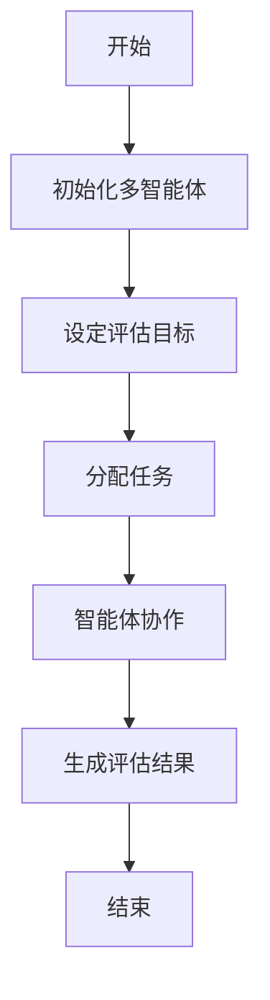
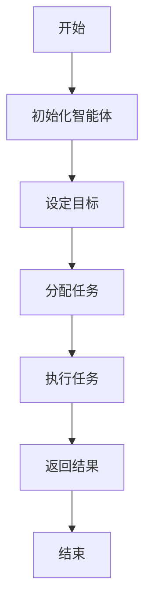
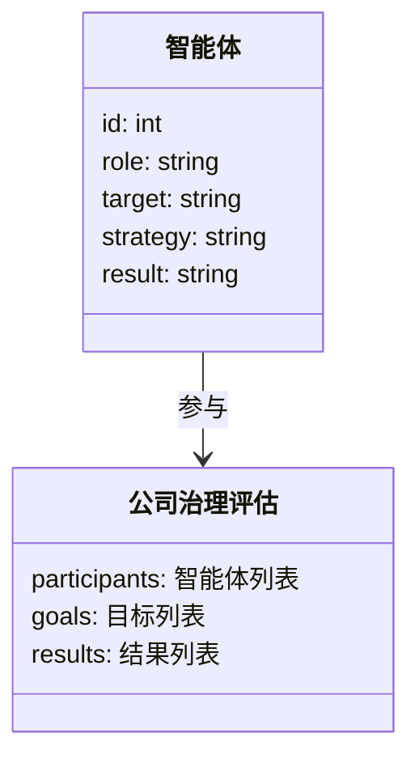
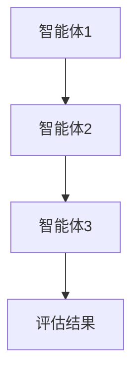
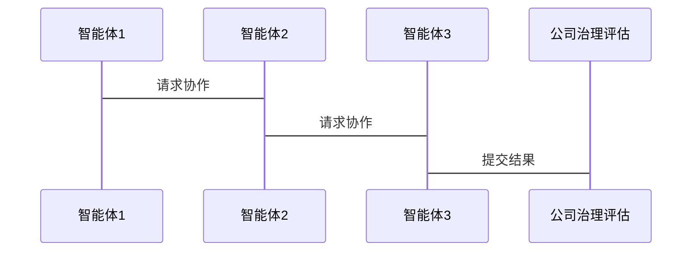

                 


# 利用多智能体系统进行全面的公司治理评估

> 关键词：公司治理，多智能体系统，系统架构，评估方法，算法实现

> 摘要：多智能体系统通过分布式计算和协作机制，能够有效提升公司治理评估的全面性和准确性。本文将从多智能体系统的基本概念出发，结合公司治理评估的实际需求，详细探讨其在评估中的应用，包括算法原理、系统架构设计和项目实战案例。

---

# 目录

1. [多智能体系统与公司治理评估背景](#多智能体系统与公司治理评估背景)
2. [多智能体系统的核心概念与联系](#多智能体系统的核心概念与联系)
3. [多智能体系统的算法原理](#多智能体系统的算法原理)
4. [多智能体系统的系统分析与架构设计](#多智能体系统的系统分析与架构设计)
5. [多智能体系统的项目实战](#多智能体系统的项目实战)
6. [结论与展望](#结论与展望)

---

## 第1章 多智能体系统与公司治理评估背景

### 1.1 多智能体系统的基本概念

#### 1.1.1 多智能体系统的定义与特点
多智能体系统（Multi-Agent System，MAS）是由多个智能体组成的分布式系统，每个智能体都是一个独立的实体，能够感知环境、自主决策并与其他智能体协作。多智能体系统的特点包括：

1. **分布式性**：智能体独立运行，不依赖中央控制。
2. **协作性**：智能体通过通信和协作完成共同目标。
3. **动态性**：系统能够适应环境变化。
4. **社会性**：智能体之间存在社会互动。

#### 1.1.2 多智能体系统与公司治理的关系
公司治理涉及多个利益相关者，包括股东、董事会、管理层和外部监管机构。多智能体系统能够模拟这些利益相关者的决策过程，帮助公司优化治理结构。

### 1.2 公司治理评估的背景与挑战

#### 1.2.1 公司治理的基本概念
公司治理是通过合理分配权力和责任，确保公司有效运作和合规经营的过程。传统的公司治理评估主要依赖财务指标和合规性检查，难以全面反映公司的真实状况。

#### 1.2.2 传统公司治理评估的局限性
1. **片面性**：仅关注财务指标，忽视非财务因素。
2. **静态性**：无法实时反映公司动态变化。
3. **缺乏协作**：评估过程缺乏多方协作。

#### 1.2.3 利用多智能体系统进行治理评估的优势
1. **全面性**：能够同时考虑财务、市场、法律等多个维度。
2. **实时性**：能够动态调整评估结果。
3. **协作性**：多个智能体协同工作，提高评估准确性。

---

## 第2章 多智能体系统的核心概念与联系

### 2.1 多智能体系统的原理

#### 2.1.1 分布式计算与协作机制
多智能体系统通过分布式计算实现协作。智能体通过通信协议交换信息，完成任务分配和结果汇总。

#### 2.1.2 多智能体系统中的通信与协调
智能体之间的通信可以通过消息传递或共享数据库实现。协调机制包括任务分配、冲突解决和共识达成。

#### 2.1.3 多智能体系统的动态性与适应性
多智能体系统能够根据环境变化动态调整策略，确保评估结果的有效性。

### 2.2 多智能体系统的核心要素对比

#### 2.2.1 实体属性对比表
| 实体 | 属性           | 描述                                   |
|------|----------------|--------------------------------------|
| 智能体 | 行为模式       | 独立决策或协作                      |
|       | 通信方式       | 消息传递或共享数据库               |
|       | 目标           | 单一目标或共同目标                  |

#### 2.2.2 行为模式对比表
| 智能体类型 | 行为模式         | 描述                                   |
|------------|------------------|--------------------------------------|
| 单一智能体  | 独立决策         | 独立完成任务                          |
| 多智能体    | 分布式协作       | 通过协作完成共同目标                 |

#### 2.2.3 通信协议对比表
| 通信协议 | 特点           | 描述                                   |
|----------|----------------|--------------------------------------|
| HTTP      | 请求-响应模式   | 常用于Web服务通信                     |
| RPC       | 远程过程调用     | 用于分布式系统中的函数调用            |
| Message Queue | 消息队列       | 用于异步通信                          |

### 2.3 多智能体系统的ER实体关系图

```mermaid
er
actor: 多智能体系统
rectangle: 公司治理评估
actor --> rectangle: 用于评估
```

### 2.4 多智能体系统的流程图



---

## 第3章 多智能体系统的算法原理

### 3.1 分布式计算算法

#### 3.1.1 分布式计算的基本原理
分布式计算将任务分解为多个子任务，分配给不同的智能体执行，最后汇总结果。

#### 3.1.2 分布式计算的实现步骤
1. **任务分解**：将问题分解为多个子任务。
2. **任务分配**：将子任务分配给不同的智能体。
3. **子任务执行**：智能体独立执行分配的任务。
4. **结果汇总**：汇总各智能体的结果，得到最终结果。

#### 3.1.3 分布式计算的优缺点
- **优点**：提高计算效率，增强系统的容错性。
- **缺点**：通信开销大，协调困难。

### 3.2 博弈论算法

#### 3.2.1 博弈论的基本概念
博弈论研究多个参与者之间的策略互动，适用于多智能体系统的决策问题。

#### 3.2.2 博弈论在多智能体系统中的应用
在公司治理评估中，博弈论可用于模拟利益相关者之间的互动，预测最优决策。

#### 3.2.3 博弈论算法的实现步骤
1. **定义参与者**：确定参与评估的利益相关者。
2. **定义策略**：为每个参与者定义可能的策略。
3. **计算收益**：根据策略组合计算收益。
4. **寻找纳什均衡**：找到最优策略组合。

### 3.3 多智能体系统中的通信协议

#### 3.3.1 通信协议的基本原理
通信协议规定了智能体之间如何交换信息，是实现协作的基础。

#### 3.3.2 通信协议的实现步骤
1. **定义消息格式**：确定消息的结构和内容。
2. **选择通信方式**：选择合适的通信方式（如HTTP、RPC）。
3. **实现消息传递**：编写代码实现消息的发送和接收。

### 3.4 算法实现的Python代码示例

#### 分布式计算示例

```python
import multiprocessing

def worker(process_id, result):
    print(f"Worker {process_id} is running")
    result[process_id] = f"Result from worker {process_id}"
    print(f"Worker {process_id} finished")

if __name__ == "__main__":
    result = [None] * 4
    processes = []
    for i in range(4):
        p = multiprocessing.Process(target=worker, args=(i, result))
        p.start()
        processes.append(p)
    for p in processes:
        p.join()
    for i in range(4):
        print(f"Result from worker {i}: {result[i]}")
```

#### 博弈论算法示例

```python
def nash_equilibrium(players, strategies):
    for strategy组合 in itertools.product(*strategies.values()):
        payoff = {}
        for player in players:
            payoff[player] = calculate_payoff(player, strategy组合)
        if is_nash_equilibrium(payoff):
            return strategy组合
    return None
```

### 3.5 算法流程图



---

## 第4章 多智能体系统的系统分析与架构设计

### 4.1 问题场景介绍
在公司治理评估中，多智能体系统需要处理多个利益相关者的互动，评估公司的合规性和绩效。

### 4.2 系统功能设计

#### 4.2.1 领域模型类图



### 4.3 系统架构设计

#### 4.3.1 系统架构图



### 4.4 系统接口设计

#### 4.4.1 接口设计
- **输入接口**：接收智能体的目标和策略。
- **输出接口**：输出评估结果。

### 4.5 系统交互序列图



---

## 第5章 多智能体系统的项目实战

### 5.1 环境安装

```bash
pip install mermaid
```

### 5.2 核心代码实现

#### 5.2.1 分布式计算代码

```python
import multiprocessing

def worker(process_id, result):
    result[process_id] = f"Result from worker {process_id}"
    print(f"Worker {process_id} finished")

if __name__ == "__main__":
    result = {}
    processes = []
    for i in range(4):
        p = multiprocessing.Process(target=worker, args=(i, result))
        p.start()
        processes.append(p)
    for p in processes:
        p.join()
    for i in range(4):
        print(f"Worker {i}: {result[i]}")
```

#### 5.2.2 博弈论算法代码

```python
import itertools

def calculate_payoff(player, strategy):
    # 示例：计算玩家的收益
    return 1

def is_nash_equilibrium(payoff):
    # 示例：检查是否为纳什均衡
    return True

players = ['股东', '董事会', '管理层']
strategies = {
    '股东': ['投资', '撤资'],
    '董事会': ['监督', '不监督'],
    '管理层': ['合规', '违规']
}

for strategy组合 in itertools.product(*strategies.values()):
    payoff = {}
    for player in players:
        payoff[player] = calculate_payoff(player, strategy组合)
    if is_nash_equilibrium(payoff):
        print(f"纳什均衡：{strategy组合}")
        break
```

### 5.3 案例分析

#### 5.3.1 案例分析
以某公司为例，分析多智能体系统如何进行公司治理评估。

### 5.4 项目总结

#### 5.4.1 项目小结
通过本项目，我们展示了多智能体系统在公司治理评估中的应用，验证了其有效性和优势。

---

## 第6章 结论与展望

### 6.1 结论
多智能体系统通过分布式计算和协作机制，能够有效提升公司治理评估的全面性和准确性。

### 6.2 展望
未来，随着人工智能和多智能体技术的发展，公司治理评估将更加智能化和精准化。

---

## 最佳实践 Tips

1. 在实施多智能体系统时，需确保智能体之间的通信高效可靠。
2. 定期更新智能体的策略和目标，以适应环境变化。
3. 多智能体系统的安全性需高度重视，防止信息泄露和恶意攻击。

---

## 结语

通过本文的详细讲解，读者可以全面了解多智能体系统在公司治理评估中的应用。希望本文能为相关领域的研究和实践提供有价值的参考。

