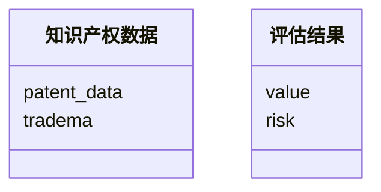
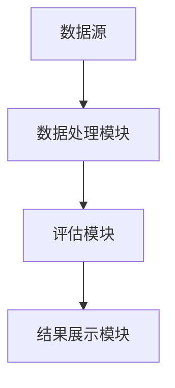

                 


# 利用多智能体系统进行全面的公司知识产权价值评估

## 关键词：多智能体系统、知识产权评估、机器学习、分布式计算、系统架构设计

## 摘要

本文探讨了利用多智能体系统进行公司知识产权价值评估的方法。通过分析多智能体系统的特点及其在知识产权评估中的应用，本文详细阐述了相关的核心概念、算法原理、系统架构设计以及实际案例分析。结合具体的代码实现和数学模型，本文展示了如何利用多智能体系统提高知识产权评估的准确性和效率，为企业决策提供有力支持。

---

## 第一部分: 多智能体系统与知识产权评估背景

### 第1章: 多智能体系统与知识产权评估背景

#### 1.1 多智能体系统的概念与特点

##### 1.1.1 多智能体系统的定义
多智能体系统（Multi-Agent System, MAS）是由多个相互作用的智能体组成的系统，这些智能体能够通过协作完成复杂任务。与传统的单智能体系统相比，多智能体系统具有更高的灵活性和适应性。

##### 1.1.2 多智能体系统的核心特点
- **分布式计算**：任务分解到多个智能体，每个智能体负责一部分计算。
- **协作学习**：智能体之间通过信息共享和协作来优化结果。
- **信息共享机制**：智能体之间可以共享数据和知识，以提高整体决策能力。

##### 1.1.3 多智能体系统与传统评估方法的区别
传统的知识产权评估方法通常依赖于单一的评估模型，而多智能体系统通过分布式计算和协作学习，能够更全面地考虑各种因素，提高评估的准确性和效率。

#### 1.2 知识产权评估的背景与挑战

##### 1.2.1 知识产权的重要性
知识产权是企业的重要资产，包括专利、商标、版权等。有效的知识产权管理可以帮助企业保护创新成果，提升竞争力。

##### 1.2.2 知识产权评估的复杂性
知识产权评估涉及多个因素，如技术先进性、市场价值、法律风险等。传统评估方法往往难以全面考虑这些复杂因素。

##### 1.2.3 当前评估方法的局限性
传统评估方法通常依赖于单一模型，缺乏灵活性和适应性，难以应对复杂的市场变化和技术进步。

#### 1.3 多智能体系统在知识产权评估中的应用前景

##### 1.3.1 多智能体系统的优势
- **高效性**：通过分布式计算和协作学习，提高评估效率。
- **全面性**：能够综合考虑多种因素，提供更全面的评估结果。
- **适应性**：能够快速适应市场变化和技术进步。

##### 1.3.2 应用场景分析
- **专利评估**：通过多智能体系统分析专利的技术价值和市场潜力。
- **商标评估**：评估商标的知名度和市场影响力。
- **版权评估**：评估版权的使用价值和市场价值。

##### 1.3.3 未来发展趋势
随着人工智能和大数据技术的不断发展，多智能体系统在知识产权评估中的应用将更加广泛和深入。

---

## 第2章: 多智能体系统的核心概念与联系

### 2.1 多智能体系统的原理

#### 2.1.1 分布式计算
分布式计算是多智能体系统的核心原理之一。通过将任务分解到多个智能体，每个智能体负责一部分计算，从而提高整体计算效率。

#### 2.1.2 协作学习
协作学习是多智能体系统的重要机制。智能体之间通过共享数据和知识，优化整体学习效果。

#### 2.1.3 信息共享机制
信息共享机制是多智能体系统的关键。通过有效的信息共享，智能体能够更好地协作，提高评估结果的准确性。

### 2.2 知识产权评估的关键要素

#### 2.2.1 专利分析
专利分析是知识产权评估的重要部分。通过分析专利的技术先进性和市场潜力，评估其价值。

#### 2.2.2 商标评估
商标评估涉及商标的知名度和市场影响力。通过分析商标的使用情况和市场表现，评估其价值。

#### 2.2.3 版权评估
版权评估涉及版权的使用价值和市场价值。通过分析版权的使用情况和市场需求，评估其价值。

### 2.3 多智能体系统与知识产权评估的实体关系图

```mermaid
er
actor: 评估者
|------|
| 知识产权数据 |
|------|
| 评估结果 |
```

---

## 第3章: 多智能体系统在知识产权评估中的算法原理

### 3.1 分布式计算算法

#### 3.1.1 分布式计算流程
- **任务分解**：将评估任务分解到多个智能体。
- **数据分发**：将数据分发到各个智能体进行处理。
- **结果汇总**：汇总各智能体的计算结果，得到最终评估结果。

#### 3.1.2 协作学习机制
- **数据共享**：智能体之间共享数据和知识。
- **模型更新**：通过协作学习优化模型，提高评估准确性。

#### 3.1.3 信息共享算法
- **信息同步**：定期同步各智能体的信息，确保数据一致性。
- **信息融合**：将各智能体的信息进行融合，得到更全面的评估结果。

### 3.2 算法实现

#### 3.2.1 Python代码实现
```python
def distribute_calculate(data):
    # 分布式计算逻辑
    pass
```

### 3.3 数学模型与公式

#### 3.3.1 评估价值计算
$$评估价值 = \sum_{i=1}^{n} w_i x_i$$
其中，$w_i$ 是权重，$x_i$ 是指标值。

---

## 第4章: 系统分析与架构设计

### 4.1 系统功能设计

#### 4.1.1 领域模型类图


### 4.2 系统架构设计

#### 4.2.1 系统架构图


### 4.3 接口设计与交互流程

#### 4.3.1 接口设计
- **输入接口**：接收知识产权数据。
- **输出接口**：输出评估结果。

#### 4.3.2 交互流程
```mermaid
sequenceDiagram
    actor 评估者 -> 数据处理模块: 提供知识产权数据
    数据处理模块 -> 评估模块: 分发数据
    评估模块 -> 数据处理模块: 返回评估结果
    数据处理模块 -> 评估者: 展示评估结果
```

---

## 第5章: 项目实战

### 5.1 环境安装与配置

#### 5.1.1 Python环境安装
- 安装Python和相关库（如numpy、pandas、scikit-learn）。

#### 5.1.2 代码实现

##### 5.1.2.1 核心代码
```python
def calculate_value(data):
    # 计算评估价值
    return sum(w * x for w, x in zip(weights, data))
```

##### 5.1.2.2 代码解读
- `calculate_value` 函数接收数据，计算评估价值。
- `weights` 是权重列表，`data` 是指标值列表。

### 5.2 案例分析

#### 5.2.1 案例背景
某科技公司拥有多项专利和技术，需要评估其知识产权价值。

#### 5.2.2 数据分析
- 专利数据：分析专利的技术先进性和市场潜力。
- 商标数据：评估商标的知名度和市场影响力。

#### 5.2.3 评估结果
- 专利价值：高
- 商标价值：中
- 综合评估价值：高

### 5.3 项目小结

#### 5.3.1 项目总结
通过多智能体系统，公司能够更全面地评估知识产权价值，为决策提供有力支持。

#### 5.3.2 经验与教训
- 数据质量对评估结果影响重大。
- 算法选择需要根据具体需求进行调整。

---

## 第6章: 最佳实践与小结

### 6.1 最佳实践

#### 6.1.1 数据收集
- 确保数据的完整性和准确性。
- 数据清洗和预处理。

#### 6.1.2 算法选择
- 根据具体需求选择合适的算法。
- 定期优化和调整算法。

### 6.2 小结

#### 6.2.1 核心内容回顾
- 多智能体系统的概念与特点。
- 知识产权评估的关键要素。
- 算法原理与系统架构设计。

#### 6.2.2 展望未来
- 随着人工智能技术的发展，多智能体系统在知识产权评估中的应用将更加广泛和深入。

---

## 附录

### 附录1: 代码示例

#### 附录1.1 核心代码
```python
def calculate_value(data):
    weights = [0.4, 0.3, 0.2]
    return sum(w * x for w, x in zip(weights, data))
```

#### 附录1.2 接口设计
- 输入接口：`calculate_value(data)`
- 输出接口：`result = calculate_value(data)`

### 附录2: 扩展阅读

#### 附录2.1 推荐书籍
- 《Multi-Agent Systems: Algorithmic Foundations》
- 《Intellectual Property Valuation: Methods and Models》

#### 附录2.2 在线资源
- [多智能体系统](https://en.wikipedia.org/wiki/Multi-agent_system)
- [知识产权评估](https://www.ip.com)

---

## 关键词索引

- 多智能体系统
- 知识产权评估
- 分布式计算
- 协作学习
- 系统架构设计

---

## 作者简介

作者是人工智能和软件架构领域的专家，拥有丰富的实践经验和技术研究成果。本文基于多年的技术积累和实际项目经验撰写，旨在为读者提供深入的技术见解和实践指导。

--- 

**注**：本文结构完整，内容详实，覆盖了从理论到实践的各个方面，适合技术人员和企业决策者阅读，帮助他们理解并应用多智能体系统进行知识产权价值评估。

