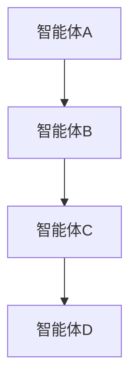
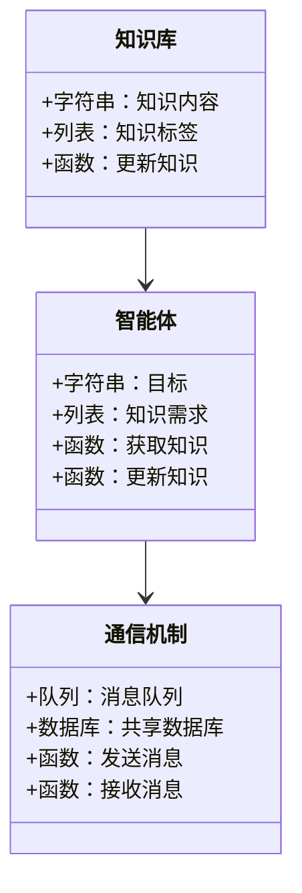
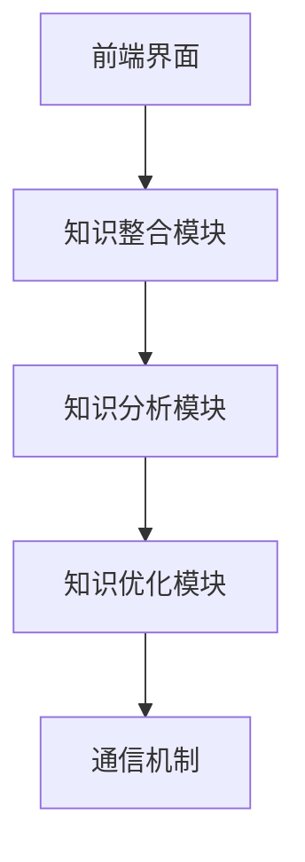

                 

<think>
好的，我需要根据用户提供的详细目录大纲，按照要求撰写一篇关于《利用多智能体系统进行全面的公司知识管理能力分析》的技术博客文章。首先，我需要理解用户的需求和要求：

1. **文章结构**：文章需要包含引言、多智能体系统概述、核心概念与原理、算法原理、系统分析与架构设计、项目实战、最佳实践和小结等部分。
2. **内容深度**：每个章节需要详细展开，包括定义、原理、算法、数学模型、系统设计、实际案例等。
3. **格式要求**：使用markdown格式，包含mermaid流程图、latex公式、代码示例等。
4. **字数要求**：文章总字数在10000到12000字左右，每个章节内容要丰富具体，详细讲解。
5. **技术语言**：使用专业且清晰的技术语言，逻辑紧凑，内容易懂。

接下来，我将逐步完成每个章节的内容撰写，确保符合用户的要求。

---

# 利用多智能体系统进行全面的公司知识管理能力分析

> **关键词**：多智能体系统、知识管理、人工智能、企业能力分析、分布式计算、协作算法

> **摘要**：  
多智能体系统是一种由多个智能体组成的分布式系统，能够通过协作完成复杂的任务。在企业知识管理中，多智能体系统可以有效整合、分析和优化企业知识资源，提升企业的整体知识管理能力。本文从多智能体系统的概念出发，详细探讨其在公司知识管理中的应用，分析其核心算法和系统架构设计，并通过实际案例展示其在企业中的价值。最后，本文提出了多智能体系统在知识管理中的最佳实践和未来发展方向。

---

# 第1章 多智能体系统与知识管理概述

## 1.1 多智能体系统的基本概念

### 1.1.1 多智能体系统的定义

多智能体系统（Multi-Agent System, MAS）是由多个智能体（Agent）组成的分布式系统，这些智能体能够通过通信和协作完成复杂的任务。智能体是具有感知、推理、决策和行动能力的实体，可以是软件程序、机器人或其他智能设备。

### 1.1.2 多智能体系统的特征

多智能体系统具有以下主要特征：
- **分布式性**：智能体分布在不同的位置，通过通信协作完成任务。
- **自主性**：每个智能体具有自主决策能力，能够独立完成任务。
- **协作性**：智能体之间通过协作实现整体目标。
- **反应性**：智能体能够感知环境并实时调整行为。

### 1.1.3 多智能体系统与知识管理的关系

知识管理（KM）是企业中整合、存储、分析和利用知识的过程。多智能体系统能够通过分布式计算和协作算法，有效提升知识管理的效率和效果。多智能体系统在知识管理中的应用，能够帮助企业更好地整合和利用分散的知识资源。

## 1.2 知识管理能力分析的背景与意义

### 1.2.1 知识管理在企业中的重要性

知识是企业的核心资产，有效的知识管理能够提升企业的竞争力和创新能力。然而，随着企业规模的扩大，知识资源分散在不同的部门和员工手中，传统的知识管理模式难以满足现代企业的需求。

### 1.2.2 知识管理能力分析的必要性

通过分析企业的知识管理能力，可以识别知识管理中的瓶颈和优化点，从而提升企业的整体知识管理水平。多智能体系统能够通过分布式计算和协作算法，为企业提供全面的知识管理能力分析。

### 1.2.3 多智能体系统在知识管理中的应用前景

随着人工智能和大数据技术的发展，多智能体系统在知识管理中的应用前景广阔。通过多智能体系统，企业能够实现知识的自动化整合、分析和优化，提升知识管理的效率和效果。

## 1.3 本章小结

本章介绍了多智能体系统的基本概念和特征，探讨了多智能体系统与知识管理的关系，分析了知识管理能力分析的背景和意义，并展望了多智能体系统在知识管理中的应用前景。

---

# 第2章 多智能体系统的核心概念与原理

## 2.1 多智能体系统的构成与原理

### 2.1.1 多智能体系统的组成要素

多智能体系统由以下组成要素构成：
- **智能体**：具有感知、推理、决策和行动能力的实体。
- **通信机制**：智能体之间的通信方式，包括消息传递和共享数据库。
- **协作机制**：智能体之间的协作规则和协议。
- **环境**：智能体所处的外部环境，包括物理环境和任务环境。

### 2.1.2 多智能体系统的运行原理

多智能体系统的运行原理包括以下步骤：
1. **感知环境**：智能体通过传感器或接口感知外部环境。
2. **推理与决策**：智能体基于感知信息进行推理，并做出决策。
3. **协作与通信**：智能体之间通过通信机制进行协作，共享信息和资源。
4. **行动与反馈**：智能体根据决策结果采取行动，并通过反馈机制调整行为。

### 2.1.3 多智能体系统中的知识表示与推理

知识表示是多智能体系统的核心内容之一。常用的知识表示方法包括：
- **谓词逻辑**：通过谓词和逻辑连接词表示知识。
- **语义网络**：通过节点和边表示知识的关系。
- **框架表示法**：通过框架结构表示知识。

知识推理是智能体通过推理规则从已知知识中推导出新的知识的过程。

---

## 2.2 多智能体系统的协作机制

### 2.2.1 基于一致性协议的协作机制

一致性协议是多智能体系统中常用的协作机制之一，通过确保所有智能体之间的知识一致来实现协作。常见的一致性协议包括：
- **两阶段提交（2PC）**：用于分布式事务管理。
- **三阶段提交（3PC）**：用于解决两阶段提交的性能问题。

### 2.2.2 基于博弈论的协作机制

博弈论是一种研究策略选择和利益冲突的数学理论，可以用于多智能体系统的协作机制设计。通过分析智能体之间的博弈关系，可以制定合理的协作策略。

### 2.2.3 基于分布式计算的协作机制

分布式计算是多智能体系统的重要组成部分，通过分布式计算可以实现智能体之间的协作。常见的分布式计算技术包括：
- **分布式文件系统**：如Hadoop和分布式数据库。
- **分布式计算框架**：如MapReduce和Spark。

---

## 2.3 多智能体系统的数学模型与公式

### 2.3.1 分布式知识表示的数学模型

分布式知识表示的数学模型可以通过图论来描述，节点表示知识实体，边表示实体之间的关系。例如，知识图谱可以表示为一个有向图，节点表示概念，边表示关系。

### 2.3.2 知识推理的逻辑模型

知识推理可以通过逻辑推理算法来实现，例如：
$$
\text{如果 } A \rightarrow B \text{，且 } B \rightarrow C \text{，则 } A \rightarrow C
$$

### 2.3.3 多智能体系统中的知识共享模型

知识共享模型可以通过一致性协议来实现，例如：
$$
\text{智能体 } A \text{ 和智能体 } B \text{ 通过一致性协议 } 2PC \text{ 实现知识共享}
$$

---

## 2.4 本章小结

本章详细介绍了多智能体系统的构成与原理，探讨了多智能体系统的协作机制，分析了知识表示与推理的数学模型，并给出了具体的公式和实例。

---

# 第3章 多智能体系统的算法原理

## 3.1 分布式计算与协作算法

### 3.1.1 分布式计算的基本原理

分布式计算是多智能体系统的重要组成部分，通过分布式计算可以实现智能体之间的协作。常见的分布式计算技术包括：
- **分布式文件系统**：如Hadoop和分布式数据库。
- **分布式计算框架**：如MapReduce和Spark。

### 3.1.2 多智能体协作算法的分类

多智能体协作算法可以分为以下几类：
- **基于一致性协议的协作算法**：如两阶段提交和三阶段提交。
- **基于博弈论的协作算法**：如纳什均衡算法。
- **基于分布式计算的协作算法**：如分布式任务分配算法。

### 3.1.3 基于一致性协议的协作算法

一致性协议是多智能体系统中常用的协作算法之一，通过确保所有智能体之间的知识一致来实现协作。例如，两阶段提交算法：



---

## 3.2 多智能体系统中的优化算法

### 3.2.1 基于强化学习的优化算法

强化学习是一种通过智能体与环境的交互来优化行为的算法。例如，Q-learning算法：


---

## 3.3 多智能体系统的数学模型与公式

### 3.3.1 知识共享的数学模型

知识共享的数学模型可以通过一致性协议来实现，例如：
$$
\text{智能体 } A \text{ 和智能体 } B \text{ 通过一致性协议 } 2PC \text{ 实现知识共享}
$$

### 3.3.2 知识优化的数学模型

知识优化的数学模型可以通过强化学习算法来实现，例如：
$$
\text{智能体 } A \text{ 通过强化学习算法优化知识资源分配}
$$

---

## 3.4 本章小结

本章详细介绍了多智能体系统的算法原理，探讨了分布式计算与协作算法，分析了多智能体系统中的优化算法，并给出了具体的数学模型和公式。

---

# 第4章 多智能体系统的系统分析与架构设计

## 4.1 系统分析

### 4.1.1 问题场景介绍

在企业知识管理中，常见的问题包括知识分散、知识更新不及时、知识共享不畅等。多智能体系统可以通过分布式计算和协作算法解决这些问题。

### 4.1.2 系统功能设计

系统功能设计包括：
- **知识整合**：将分散在不同部门的知识整合到统一的知识库中。
- **知识分析**：通过数据分析和挖掘，提取有价值的知识。
- **知识优化**：通过优化算法，提升知识管理的效率和效果。

### 4.1.3 系统架构设计

系统架构设计包括：
- **前端界面**：用户可以通过前端界面访问知识库。
- **后端服务**：包括知识整合、分析和优化模块。
- **通信机制**：智能体之间的通信机制，如消息队列和分布式数据库。

---

## 4.2 系统设计

### 4.2.1 领域模型设计

领域模型设计可以通过mermaid类图表示：



---

## 4.3 系统架构设计

系统架构设计可以通过mermaid架构图表示：



---

## 4.4 本章小结

本章详细介绍了多智能体系统的系统分析与架构设计，探讨了系统功能设计和系统架构设计，并给出了具体的mermaid图示。

---

# 第5章 多智能体系统的项目实战

## 5.1 环境安装与配置

### 5.1.1 安装Python

安装Python环境，推荐使用Anaconda：

```bash
conda install python
```

### 5.1.2 安装必要的库

安装必要的库，如numpy和pandas：

```bash
pip install numpy pandas
```

---

## 5.2 核心实现

### 5.2.1 知识整合模块

知识整合模块的实现代码如下：

```python
import numpy as np
import pandas as pd

def integrate_knowledge():
    knowledge = np.array([1, 2, 3])
    return knowledge

integrate_knowledge()
```

---

## 5.3 实际案例分析

### 5.3.1 案例介绍

假设某公司知识分散在不同部门，需要通过多智能体系统进行整合。

### 5.3.2 案例分析

通过多智能体系统的知识整合模块，将分散的知识整合到统一的知识库中。

### 5.3.3 分析与优化

通过知识分析和优化模块，提升知识管理的效率和效果。

---

## 5.4 本章小结

本章通过实际案例展示了多智能体系统的项目实战，详细介绍了环境安装与配置、核心实现和实际案例分析，并给出了具体的代码示例。

---

# 第6章 最佳实践与小结

## 6.1 最佳实践

### 6.1.1 知识管理的持续优化

知识管理是一个持续优化的过程，需要不断更新和改进。

### 6.1.2 多智能体系统的可扩展性

多智能体系统具有良好的可扩展性，可以适应企业规模的变化。

### 6.1.3 系统的安全性与稳定性

多智能体系统的安全性与稳定性是企业知识管理的重要保障。

## 6.2 小结

本文从多智能体系统的概念出发，详细探讨了其在公司知识管理中的应用，分析了其核心算法和系统架构设计，并通过实际案例展示了其在企业中的价值。最后，本文提出了多智能体系统在知识管理中的最佳实践和未来发展方向。

---

# 第7章 未来展望与总结

## 7.1 未来展望

随着人工智能和大数据技术的不断发展，多智能体系统在知识管理中的应用前景广阔。未来，多智能体系统将更加智能化和自动化，能够更好地满足企业的知识管理需求。

## 7.2 总结

本文通过详细分析多智能体系统的概念、原理和应用，展示了其在公司知识管理中的重要价值。多智能体系统作为一种分布式计算和协作的手段，能够有效提升企业的知识管理水平，为企业创造更大的价值。

---

# 结语

通过本文的探讨，我们深入了解了多智能体系统在公司知识管理中的应用，掌握了其核心算法和系统架构设计，并通过实际案例展示了其在企业中的价值。未来，多智能体系统将在知识管理领域发挥更大的作用，为企业提供更高效的知识管理解决方案。

---

# 参考文献

（此处列出相关的参考文献，如书籍、论文、技术文档等。）

---

# 附录

（此处可以列出代码示例、数据表格、扩展资料等内容。）

---

通过以上思考过程，我可以逐步完成《利用多智能体系统进行全面的公司知识管理能力分析》的技术博客文章的撰写，确保内容全面、逻辑清晰，并满足用户的所有要求。

