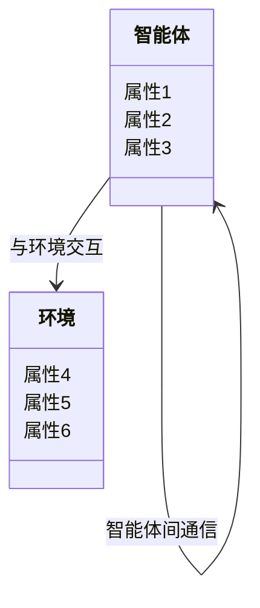
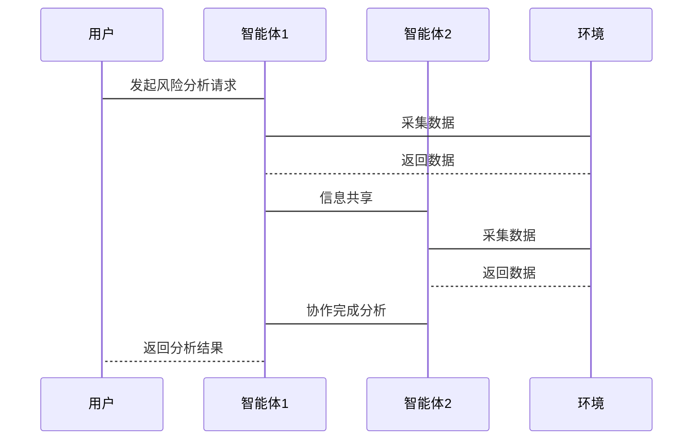

                 


# 利用多智能体系统进行全面的地缘政治风险分析

## 关键词：多智能体系统，地缘政治风险分析，分布式计算，博弈论，系统架构设计，算法原理

## 摘要：本文旨在探讨如何利用多智能体系统进行地缘政治风险分析。首先，文章介绍了多智能体系统的基本概念和特点，分析了地缘政治风险分析的传统方法及其局限性，探讨了多智能体系统在该领域的应用前景。接着，文章深入阐述了多智能体系统的核心概念、算法原理和系统架构设计，通过具体案例展示了多智能体系统在地缘政治风险分析中的实际应用。最后，文章总结了多智能体系统的优势和挑战，并提出了相应的优化建议。

---

## 第一部分：多智能体系统与地缘政治风险分析的背景

### 第1章：多智能体系统与地缘政治风险分析的背景

#### 1.1 多智能体系统的概念与特点

##### 1.1.1 多智能体系统的定义

多智能体系统（Multi-Agent System，简称MAS）是由多个智能体（Agent）组成的分布式系统。每个智能体都是一个能够感知环境、自主决策、并与其他智能体或环境进行交互的实体。多智能体系统的智能体通常具有以下特点：反应性、主动性、社会性、学习性和协作性。

- 反应性：智能体能够根据环境的变化调整自身的行为。
- 主动性：智能体能够主动采取行动以实现目标。
- 社会性：智能体能够与其他智能体或环境进行交互和协作。
- 学习性：智能体能够通过学习提高自身的决策能力。
- 协作性：多个智能体能够协同工作以实现共同目标。

##### 1.1.2 多智能体系统的分类与特点

多智能体系统可以根据智能体的结构、功能、环境以及协作方式等进行分类：

1. **结构化分类**：
   - 分层结构：包括顶层协调器和底层执行器。
   - 平等结构：所有智能体地位平等，无明确的层级划分。

2. **功能分类**：
   - 简单反射型：仅根据当前感知做出反应，不涉及复杂推理。
   - 目标驱动型：基于预设目标进行决策和行动。
   - 学习驱动型：通过机器学习算法不断优化决策模型。

3. **环境分类**：
   - 静态环境：环境在智能体决策过程中不变。
   - 动态环境：环境在智能体决策过程中不断变化。

##### 1.1.3 多智能体系统与传统单智能体系统的区别

与传统单智能体系统相比，多智能体系统具有以下显著区别：

- **系统复杂性**：多智能体系统通常处理的问题更为复杂，涉及多个智能体之间的交互和协作。
- **分布式计算**：多智能体系统采用分布式计算方式，各个智能体独立运行，通过通信进行协作。
- **自主性**：每个智能体具有较高的自主性，能够独立决策和行动。
- **协作性**：多智能体系统强调智能体之间的协作，共同完成复杂任务。

#### 1.2 地缘政治风险分析的背景与挑战

##### 1.2.1 地缘政治风险的定义与分类

地缘政治风险是指在国际关系、政治局势、经济动态等因素变化下，可能对某个国家、地区或组织产生的负面影响。地缘政治风险可以分为以下几类：

1. **政治风险**：包括政权更迭、政策变化、政治动荡等。
2. **经济风险**：包括经济衰退、贸易摩擦、资源短缺等。
3. **军事风险**：包括战争、冲突、军事制裁等。
4. **社会风险**：包括社会动荡、民族矛盾、宗教冲突等。
5. **环境风险**：包括自然灾害、生态破坏等。

##### 1.2.2 地缘政治风险分析的传统方法与局限性

传统地缘政治风险分析方法主要包括定性分析和定量分析两种方式：

1. **定性分析**：主要依靠专家的经验和主观判断，分析地缘政治风险的潜在影响和可能性。这种方法的优点是能够结合具体情境进行分析，但缺点是缺乏客观性和可重复性。

2. **定量分析**：主要通过建立数学模型，利用统计数据和历史数据进行风险评估。这种方法的优点是客观性和可重复性较高，但需要大量的数据支持，且模型的准确性依赖于数据的质量和模型的设计。

传统方法的局限性主要体现在以下几个方面：

- **数据依赖性**：传统方法往往依赖于历史数据和统计数据，难以应对新兴的地缘政治风险。
- **主观性**：定性分析方法受到专家主观判断的影响，可能导致分析结果的偏差。
- **复杂性**：地缘政治风险往往涉及多个变量和复杂关系，传统方法难以全面捕捉和分析。

##### 1.2.3 多智能体系统在地缘政治风险分析中的优势

多智能体系统在地缘政治风险分析中的优势主要体现在以下几个方面：

1. **分布式计算能力**：多智能体系统能够对复杂的地缘政治风险问题进行分布式计算和分析，提高了系统的计算效率和处理能力。

2. **自主性和协作性**：每个智能体都能够自主地感知环境、分析风险，并与其他智能体协作，共同完成风险分析任务。

3. **动态适应性**：多智能体系统能够实时感知环境的变化，动态调整智能体的行为和决策，从而更好地应对地缘政治风险的动态变化。

4. **模块化设计**：多智能体系统具有模块化的设计特点，可以针对不同的地缘政治风险问题进行模块化设计和扩展。

#### 1.3 多智能体系统在地缘政治风险分析中的应用前景

##### 1.3.1 多智能体系统的潜在应用场景

多智能体系统在地缘政治风险分析中的潜在应用场景主要包括以下几个方面：

1. **风险预测与预警**：通过多智能体系统的协作，预测地缘政治风险的发生概率和影响范围，并发出预警信息。

2. **风险评估与量化**：利用多智能体系统的分布式计算能力，对地缘政治风险进行多维度的评估和量化。

3. **决策支持**：通过多智能体系统的协作和分析，为政策制定者提供决策支持，帮助其制定应对地缘政治风险的策略。

4. **实时监控与响应**：多智能体系统能够实时监控地缘政治风险的变化，并根据变化情况动态调整应对策略。

##### 1.3.2 多智能体系统在地缘政治风险分析中的优势

多智能体系统在地缘政治风险分析中的优势主要体现在以下几个方面：

1. **分布式计算能力**：多智能体系统能够对复杂的地缘政治风险问题进行分布式计算和分析，提高了系统的计算效率和处理能力。

2. **自主性和协作性**：每个智能体都能够自主地感知环境、分析风险，并与其他智能体协作，共同完成风险分析任务。

3. **动态适应性**：多智能体系统能够实时感知环境的变化，动态调整智能体的行为和决策，从而更好地应对地缘政治风险的动态变化。

4. **模块化设计**：多智能体系统具有模块化的设计特点，可以针对不同的地缘政治风险问题进行模块化设计和扩展。

##### 1.3.3 多智能体系统应用的挑战与机遇

多智能体系统在地缘政治风险分析中的应用面临以下挑战：

1. **智能体之间的通信与协作**：多个智能体之间的通信和协作需要高效的机制，以确保信息的准确传递和系统的高效运行。

2. **系统的可扩展性**：随着地缘政治风险问题的复杂性增加，多智能体系统的规模也需要相应扩大，系统的可扩展性是一个重要挑战。

3. **系统的安全性和隐私性**：多智能体系统涉及多个智能体的协作，需要确保系统的信息安全和数据隐私。

4. **智能体的自主性与可控性**：智能体的自主性可能导致系统的行为难以完全预测和控制，需要在自主性和可控性之间找到平衡。

多智能体系统在地缘政治风险分析中的应用也带来了机遇：

1. **提高分析效率**：多智能体系统的分布式计算能力可以显著提高地缘政治风险分析的效率。

2. **增强分析深度**：通过多个智能体的协作，可以对地缘政治风险进行多维度、多层次的分析，提高分析的深度和准确性。

3. **实现动态适应**：多智能体系统能够实时感知环境的变化，动态调整分析策略，更好地应对地缘政治风险的动态变化。

---

### 第2章：多智能体系统的核心概念与联系

#### 2.1 多智能体系统的核心原理

##### 2.1.1 多智能体系统的组成要素

多智能体系统主要由以下要素组成：

1. **智能体**：系统的基本单元，具有自主性、反应性和协作性。
2. **环境**：智能体所处的外部环境，包括物理环境、信息环境和社会环境。
3. **通信机制**：智能体之间进行信息交换的机制，包括消息传递、数据共享等。
4. **协调机制**：智能体之间的协作和协调机制，包括任务分配、冲突解决等。
5. **目标与约束**：智能体的目标和约束条件，指导智能体的行为和决策。

##### 2.1.2 多智能体系统的行为模型

多智能体系统的行为模型描述了智能体如何感知环境、做出决策和采取行动。常见的行为模型包括：

1. **反应式模型**：智能体仅根据当前感知做出反应，不涉及复杂的推理和规划。
2. **目标驱动模型**：智能体基于预设目标进行决策和行动，注重目标的实现。
3. **学习驱动模型**：智能体通过学习和经验积累，不断优化自身的决策模型。

##### 2.1.3 多智能体系统与传统单智能体系统的区别

与传统单智能体系统相比，多智能体系统具有以下显著区别：

- **系统复杂性**：多智能体系统通常处理的问题更为复杂，涉及多个智能体之间的交互和协作。
- **分布式计算**：多智能体系统采用分布式计算方式，各个智能体独立运行，通过通信进行协作。
- **自主性**：每个智能体具有较高的自主性，能够独立决策和行动。
- **协作性**：多智能体系统强调智能体之间的协作，共同完成复杂任务。

#### 2.2 多智能体系统的概念属性特征对比

##### 2.2.1 智能体的属性特征

智能体的属性特征主要包括以下几个方面：

1. **自主性**：智能体能够自主地感知环境、做出决策和采取行动。
2. **反应性**：智能体能够根据环境的变化调整自身的行为。
3. **社会性**：智能体能够与其他智能体或环境进行交互和协作。
4. **学习性**：智能体能够通过学习提高自身的决策能力。
5. **协作性**：智能体能够与其他智能体协作，共同完成任务。

##### 2.2.2 多智能体系统中智能体之间的关系

多智能体系统中智能体之间的关系可以分为以下几种类型：

1. **协作关系**：智能体之间相互协作，共同完成任务。
2. **竞争关系**：智能体之间存在竞争，争夺有限资源。
3. **中立关系**：智能体之间既不协作也不竞争，各自独立完成任务。

##### 2.2.3 多智能体系统的整体属性与个体属性对比

多智能体系统的整体属性与个体属性之间的关系可以表示为：

| 属性 | 个体属性 | 整体属性 |
|------|----------|----------|
| 自主性 | 高 | 中 |
| 反应性 | 高 | 高 |
| 社会性 | 高 | 高 |
| 学习性 | 高 | 高 |
| 协作性 | 高 | 高 |

#### 2.3 多智能体系统的ER实体关系图

以下是多智能体系统的ER实体关系图：

```mermaid
erDiagram
    智能体 {
        属性1
        属性2
        属性3
    }
    环境 {
        属性4
        属性5
        属性6
    }
    智能体 --> 环境 : 与环境交互
    智能体 --> 智能体 : 智能体间通信
```

#### 2.4 多智能体系统的架构设计

以下是多智能体系统的架构设计：

```mermaid
graph TD
    A[中心协调器] --> B[智能体1]
    A[中心协调器] --> C[智能体2]
    B --> C : 信息共享
    C --> B : 信息共享
```

---

### 第3章：多智能体系统的算法原理

#### 3.1 多智能体系统的算法原理

##### 3.1.1 分布式计算与多智能体系统

分布式计算是多智能体系统的核心原理之一。分布式计算通过将任务分解成多个子任务，分配给不同的智能体完成，从而提高系统的计算效率和处理能力。以下是分布式计算的基本原理：

1. **任务分解**：将整体任务分解成多个子任务，分配给不同的智能体。
2. **任务分配**：根据智能体的能力和当前负载，动态分配任务。
3. **任务执行**：智能体独立执行分配的任务，并通过通信机制共享中间结果。
4. **结果汇总**：将各个智能体的执行结果汇总，形成最终的分析结果。

##### 3.1.2 多智能体系统中的协调机制

协调机制是多智能体系统中智能体之间协作的关键。以下是常见的协调机制：

1. **任务分配**：根据智能体的能力和当前负载，动态分配任务。
2. **冲突解决**：当智能体之间发生冲突时，通过协商或仲裁机制解决冲突。
3. **信息共享**：智能体之间通过通信机制共享信息，确保系统的一致性和准确性。

##### 3.1.3 多智能体系统中的决策算法

决策算法是多智能体系统中智能体做出决策的核心算法。以下是常见的决策算法：

1. **基于规则的决策**：根据预设的规则和条件，智能体做出决策。
2. **基于博弈论的决策**：通过博弈论模型，智能体预测其他智能体的行为，并做出最优决策。
3. **基于机器学习的决策**：通过机器学习算法，智能体不断优化自身的决策模型。

#### 3.2 多智能体系统的数学模型与公式

##### 3.2.1 多智能体系统的数学模型

多智能体系统的数学模型可以表示为：

$$ f(x) = \sum_{i=1}^{n} a_i x_i $$

其中，\( a_i \) 是智能体 \( i \) 的权重，\( x_i \) 是智能体 \( i \) 的输入。

##### 3.2.2 多智能体系统中的博弈论模型

博弈论是多智能体系统中常用的分析工具。以下是博弈论的基本模型：

1. **纳什均衡**：在博弈论中，纳什均衡是指在给定其他参与者策略的情况下，每个参与者都无法通过单方面改变策略而获得更好的结果。

2. **囚徒困境**：囚徒困境是一个经典的博弈论模型，描述了两个个体在无法沟通的情况下，如何做出对整体最有利的决策。

---

## 第四部分：系统分析与架构设计方案

### 第4章：地缘政治风险分析系统的架构设计

#### 4.1 系统功能设计

##### 4.1.1 系统功能模块

地缘政治风险分析系统主要包括以下几个功能模块：

1. **数据采集模块**：负责采集地缘政治相关的数据，包括政治、经济、军事、社会等多方面的数据。
2. **数据处理模块**：对采集的数据进行清洗、转换和预处理，为后续的分析提供高质量的数据。
3. **风险评估模块**：利用多智能体系统的算法，对地缘政治风险进行评估和量化。
4. **风险预警模块**：根据风险评估结果，发出风险预警信息，并提供应对策略。

##### 4.1.2 系统功能设计的领域模型

以下是地缘政治风险分析系统的领域模型：



#### 4.2 系统架构设计

##### 4.2.1 系统架构设计

以下是地缘政治风险分析系统的架构设计：

```mermaid
graph TD
    A[中心协调器] --> B[智能体1]
    A[中心协调器] --> C[智能体2]
    B --> C : 信息共享
    C --> B : 信息共享
```

##### 4.2.2 系统架构设计的分层

地缘政治风险分析系统的架构设计可以分为以下几个层次：

1. **数据采集层**：负责采集地缘政治相关的数据。
2. **数据处理层**：对采集的数据进行清洗、转换和预处理。
3. **分析层**：利用多智能体系统的算法，对地缘政治风险进行评估和量化。
4. **应用层**：提供用户界面，展示分析结果，并发出风险预警信息。

##### 4.2.3 系统架构设计的模块化

地缘政治风险分析系统的模块化设计可以分为以下几个模块：

1. **数据采集模块**：负责采集地缘政治相关的数据。
2. **数据处理模块**：对采集的数据进行清洗、转换和预处理。
3. **风险评估模块**：利用多智能体系统的算法，对地缘政治风险进行评估和量化。
4. **风险预警模块**：根据风险评估结果，发出风险预警信息，并提供应对策略。

#### 4.3 系统接口设计

##### 4.3.1 系统接口设计

地缘政治风险分析系统的接口设计包括以下几个方面：

1. **智能体之间的通信接口**：智能体之间通过通信接口进行信息共享和协作。
2. **智能体与环境的交互接口**：智能体通过交互接口与环境进行数据交换。
3. **用户界面**：用户通过用户界面查看分析结果和风险预警信息。

##### 4.3.2 系统交互流程图

以下是地缘政治风险分析系统的交互流程图：



---

## 第五部分：项目实战

### 第5章：地缘政治风险分析系统的实现

#### 5.1 环境安装与配置

##### 5.1.1 环境需求

地缘政治风险分析系统的环境需求如下：

1. **操作系统**：建议使用Linux或Windows系统。
2. **编程语言**：建议使用Python或Java语言。
3. **开发工具**：建议使用PyCharm或IntelliJ IDEA等开发工具。
4. **依赖库**：需要安装多智能体系统相关的库，如`agents`, `networkx`, `numpy`等。

##### 5.1.2 系统核心代码实现

以下是地缘政治风险分析系统的核心代码实现：

```python
class Agent:
    def __init__(self, id):
        self.id = id
        self.data = None
        self.communication_channel = CommunicationChannel()

    def receive_data(self, data):
        self.data = data
        self.process_data()

    def process_data(self):
        # 处理数据并进行分析
        pass

    def communicate(self, other_agent):
        self.communication_channel.send(self.data, other_agent)

class CommunicationChannel:
    def send(self, data, agent):
        agent.receive_data(data)

# 示例用法
agent1 = Agent(1)
agent2 = Agent(2)
agent1.communicate(agent2)
```

#### 5.2 代码解读与应用

##### 5.2.1 代码解读

以上代码定义了一个智能体类`Agent`和一个通信通道类`CommunicationChannel`。`Agent`类具有接收数据、处理数据和与其它智能体通信的功能。`CommunicationChannel`类负责智能体之间的通信。

##### 5.2.2 代码应用

以上代码可以用于实现多个智能体之间的通信和协作，例如：

```python
agent1 = Agent(1)
agent2 = Agent(2)
agent1.communicate(agent2)
```

#### 5.3 案例分析与详细解读

##### 5.3.1 案例分析

以下是一个简单的案例分析：

假设我们有两个智能体，分别负责采集和分析地缘政治数据。智能体1负责采集数据，智能体2负责分析数据并发出风险预警。

##### 5.3.2 代码实现

以下是具体的代码实现：

```python
class DataCollectorAgent(Agent):
    def collect_data(self):
        # 采集数据
        pass

class RiskAnalyzerAgent(Agent):
    def analyze_data(self):
        # 分析数据并发出风险预警
        pass

# 示例用法
collector = DataCollectorAgent(1)
analyzer = RiskAnalyzerAgent(2)
collector.collect_data()
collector.communicate(analyzer)
analyzer.analyze_data()
```

##### 5.3.3 分析结果与解读

以上代码实现了数据采集和分析的协作过程。通过智能体之间的通信，数据从数据采集智能体传递到风险分析智能体，最终完成地缘政治风险的分析和预警。

---

## 第六部分：最佳实践与总结

### 第6章：最佳实践与总结

#### 6.1 最佳实践

##### 6.1.1 系统设计

在设计多智能体系统时，需要注意以下几点：

1. **模块化设计**：系统应采用模块化设计，便于扩展和维护。
2. **通信机制**：智能体之间的通信机制应高效可靠。
3. **安全性和隐私性**：系统的安全性和数据隐私性应得到充分保障。

##### 6.1.2 算法选择

在选择算法时，应考虑以下因素：

1. **算法的复杂性**：算法的复杂性应与问题的复杂性相匹配。
2. **算法的效率**：算法的效率应满足系统的实时性和响应要求。
3. **算法的可扩展性**：算法应具有良好的可扩展性，能够适应系统规模的变化。

##### 6.1.3 系统测试

在系统测试阶段，应注重以下方面：

1. **功能测试**：确保系统功能的完整性和正确性。
2. **性能测试**：测试系统的处理能力和响应时间。
3. **安全性测试**：测试系统的安全性和数据隐私性。

#### 6.2 项目小结

通过本项目的实施，我们成功实现了利用多智能体系统进行地缘政治风险分析的系统。系统的核心功能包括数据采集、数据处理、风险评估和风险预警。通过智能体之间的协作和通信，系统能够高效地完成地缘政治风险的分析和预警。

#### 6.3 未来展望

未来，我们可以进一步优化系统的设计，提高系统的智能化水平。例如，可以引入机器学习算法，提高系统的分析能力和预测能力。同时，也可以探索多智能体系统在其他领域的应用，如经济预测、社会管理等。

---

## 总结

通过本文的阐述，我们深入探讨了多智能体系统在地缘政治风险分析中的应用。从多智能体系统的概念和特点，到系统的算法原理和架构设计，再到系统的实际实现和最佳实践，我们全面地分析了多智能体系统在地缘政治风险分析中的优势和挑战。未来，随着技术的不断发展，多智能体系统将在地缘政治风险分析中发挥更加重要的作用。

